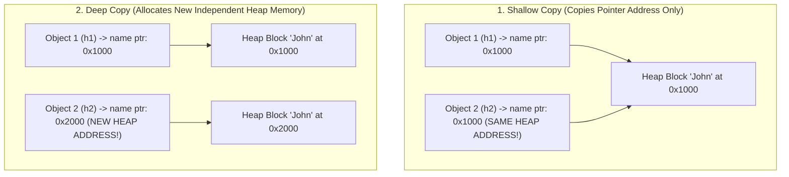

# 02 — Constructors, Destructors & Shallow vs Deep Copy

> **Course Reference:** Lecture 71 — Constructor and Destructor in C++

---

## 1. What is a Constructor?
A **Constructor** is a special member function invoked **automatically** at the time of object creation. Its primary purpose is to **initialize the object's data members**.

### Key Characteristics of Constructors:
1. Has the **exact same name** as the class.
2. Has **NO return type** (not even `void`).
3. Must be declared in the **`public`** section (unless implementing Singleton pattern).
4. Cannot be `virtual` or `static`.
5. If no constructor is written, the C++ compiler automatically provides an implicit **Default Constructor**.

---

## 2. Types of Constructors

```cpp
#include <iostream>
#include <cstring>
using namespace std;

class Hero {
public:
    int health;
    char level;

    // 1. Default Constructor (No parameters)
    Hero() {
        cout << "Default Constructor Called!" << endl;
        health = 100;
        level = 'A';
    }

    // 2. Parameterized Constructor
    Hero(int health, char level) {
        cout << "Parameterized Constructor Called!" << endl;
        // 'this' pointer resolves naming collision between parameter and member
        this->health = health;
        this->level = level;
    }

    // 3. User-Defined Copy Constructor
    Hero(const Hero& other) {
        cout << "Copy Constructor Called!" << endl;
        this->health = other.health;
        this->level = other.level;
    }
};

int main() {
    Hero h1;                  // Default constructor
    Hero h2(80, 'B');         // Parameterized constructor
    Hero h3(h2);              // Copy constructor (or: Hero h3 = h2;)
    
    return 0;
}
```

---

## 3. The `this` Pointer

### What is `this`?
- `this` is a **constant pointer** implicitly passed to all non-static member functions.
- It holds the **memory address of the current calling object** (`this == &h1`).

### When is `this` used?
1. **Disambiguate name collisions** between parameter names and class member variables:
   ```cpp
   void setHealth(int health) {
       this->health = health; // this->health is member; health is parameter
   }
   ```
2. **Method Chaining** (returning reference to current object `*this`):
   ```cpp
   Hero& setHealth(int h) { this->health = h; return *this; }
   Hero& setLevel(char l) { this->level = l; return *this; }
   // Usage: h.setHealth(90).setLevel('S');
   ```

---

## 4. Why Must the Copy Constructor Take a Reference (`const ClassName&`)?

```cpp
// ❌ WRONG: Passing by Value (Compile Error!)
Hero(Hero other) { ... } 

// ✅ CORRECT: Passing by Reference
Hero(const Hero& other) { ... }
```

### 💡 Interview Trap Question:
*"What happens if you pass by value in the Copy Constructor?"*
- Passing an object by value requires making a copy of that object.
- To make a copy, C++ must invoke the Copy Constructor.
- But that Copy Constructor itself takes an object by value, which triggers another Copy Constructor call...
- This causes an **Infinite Recursive Loop** of copy constructor calls, resulting in a **Compiler Error / Stack Overflow**!
- Therefore, **passing by reference (`&`) is mandatory**. The `const` keyword ensures the source object cannot be accidentally modified.

---

## 5. Shallow Copy vs Deep Copy (CRITICAL L3 INTERVIEW CONCEPT)

### The Default Copy Constructor does a Shallow Copy!



### Complete Code Demonstration:

```cpp
#include <iostream>
#include <cstring>
using namespace std;

class Student {
public:
    int age;
    char* name; // Pointer pointing to dynamically allocated Heap memory

    Student(int age, const char* name) {
        this->age = age;
        this->name = new char[strlen(name) + 1];
        strcpy(this->name, name);
    }

    // ❌ SHALLOW COPY CONSTRUCTOR (Default behavior):
    // Student(const Student& s) {
    //     this->age = s.age;
    //     this->name = s.name; // Only copies the pointer address!
    // }

    // ✅ DEEP COPY CONSTRUCTOR (User Defined):
    Student(const Student& s) {
        cout << "Deep Copy Constructor Executed!" << endl;
        this->age = s.age;
        // Allocate separate new memory on the Heap:
        this->name = new char[strlen(s.name) + 1];
        // Copy actual string content:
        strcpy(this->name, s.name);
    }

    // Destructor to free heap memory
    ~Student() {
        delete[] name;
    }
};

int main() {
    Student s1(20, "Alice");
    Student s2(s1); // Deep copy invoked

    // Modifying s2's name will NOT affect s1!
    s2.name[0] = 'E'; // "Elice"

    cout << "s1 Name: " << s1.name << endl; // Alice (Untouched!)
    cout << "s2 Name: " << s2.name << endl; // Elice

    return 0;
}
```

### ⚠️ Dangers of Shallow Copy with Dynamic Memory:
1. **Unintended Side Effects**: Modifying data through `s2` unintentionally mutates `s1`'s data because both share the same heap memory address.
2. **Double Free Crash (`SIGABRT`)**: When `s1` and `s2` go out of scope, both destructors call `delete[] name` on the **exact same memory address**, crashing the program with a **Double Free Error**.

---

## 6. Copy Assignment Operator (`operator=`)

```cpp
Student s1(20, "Alice");
Student s2(22, "Bob");

s2 = s1; // Copy Assignment Operator (operator=) is invoked!
```

- **Copy Constructor**: Initializes a **brand new object** from an existing one (`Student s2 = s1;`).
- **Copy Assignment Operator**: Replaces the values of an **already initialized existing object** with another (`s2 = s1;`).

```cpp
Student& operator=(const Student& other) {
    if (this == &other) return *this; // Self-assignment check

    delete[] this->name; // Free existing memory

    this->age = other.age;
    this->name = new char[strlen(other.name) + 1];
    strcpy(this->name, other.name);

    return *this;
}
```

---

## 7. Constructor Initializer List

```cpp
class Example {
private:
    int a;
    const int b; // Const member
    int& ref;    // Reference member

public:
    // Initializer list initializes members directly before constructor body executes
    Example(int x, int y, int& z) : a(x), b(y), ref(z) {
        // Body
    }
};
```

> [!IMPORTANT]
> **Why use Initializer Lists?**
> 1. **Mandatory for `const` members** (cannot be assigned inside body).
> 2. **Mandatory for Reference (`&`) members** (must be bound at initialization).
> 3. **Higher Performance**: Avoids creating a default-constructed object first and then assigning to it.

---

## 8. Destructors

### What is a Destructor?
A **Destructor** is a special member function invoked **automatically** when an object goes out of scope or is explicitly deleted via `delete`. It deallocates resources (heap memory, open files, database handles) acquired by the object.

### Key Characteristics:
1. Same name as class preceded by a tilde (`~Hero()`).
2. **No parameters and No return type**.
3. Cannot be overloaded (there is only 1 destructor per class).
4. Automatically called for Stack objects; explicitly triggered via `delete ptr;` for Heap objects.

```cpp
class Hero {
public:
    Hero() { cout << "Constructor called" << endl; }
    ~Hero() { cout << "Destructor called" << endl; }
};

int main() {
    // Static Allocation:
    Hero h1; // Destructor called automatically when main() exits

    // Dynamic Allocation:
    Hero* h2 = new Hero();
    delete h2; // Destructor called explicitly on delete

    return 0;
}
```

---

## 9. Order of Constructor and Destructor Calls

In C++, destructors are called in the **exact reverse order** of constructors (Stack LIFO order).

```cpp
#include <iostream>
using namespace std;

class Test {
    int id;
public:
    Test(int id) : id(id) { cout << "Constructing: " << id << endl; }
    ~Test() { cout << "Destructing: " << id << endl; }
};

int main() {
    Test t1(1);
    Test t2(2);
    Test t3(3);
    return 0;
}
```

### Output:
```text
Constructing: 1
Constructing: 2
Constructing: 3
Destructing: 3
Destructing: 2
Destructing: 1
```

---

## 10. Summary Checklist for Interview
- [x] Default vs Parameterized vs Copy Constructor.
- [x] Copy constructor takes `const ClassName&` to prevent infinite recursion.
- [x] Shallow copy copies pointer addresses; Deep copy allocates new heap blocks.
- [x] Shallow copy causes **Double Free error** on destructor execution.
- [x] Initializer list is required for `const` and reference data members.
- [x] Destructors execute in **reverse order (LIFO)** of constructors.
