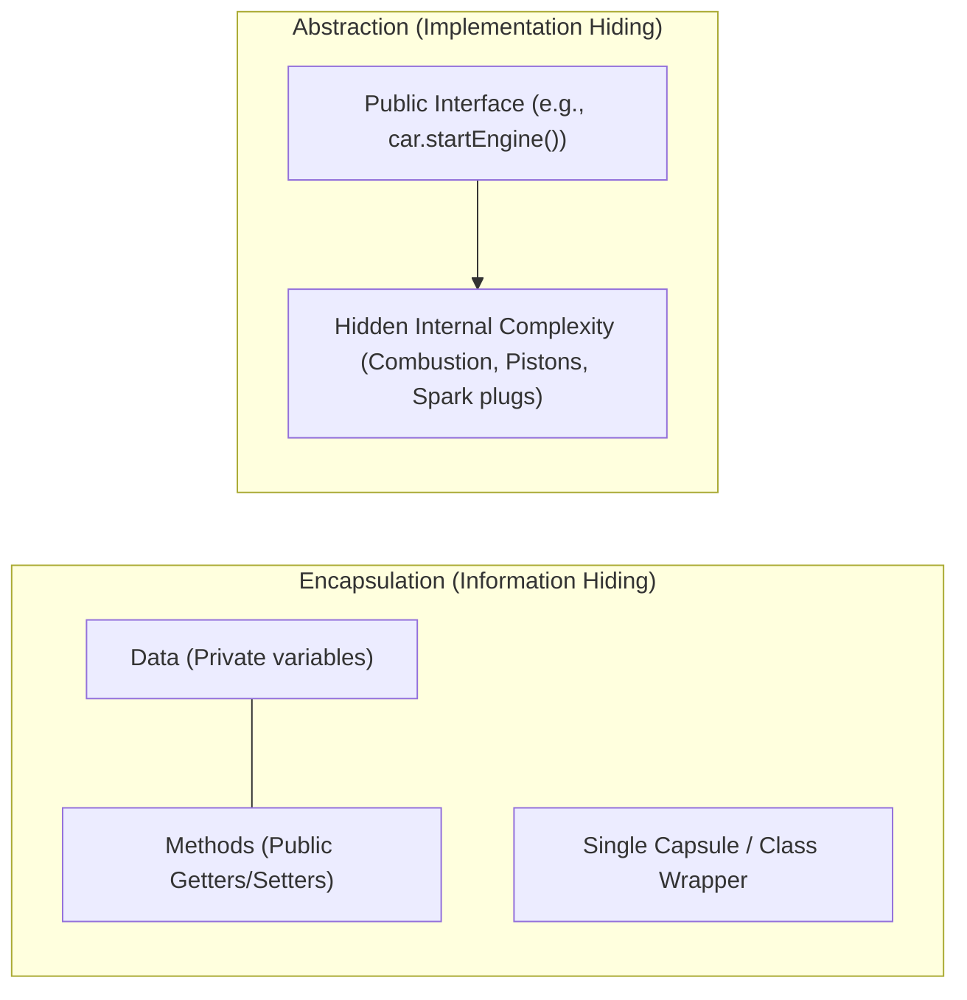

# 03 — Static Members, Encapsulation & Abstraction

> **Course Reference:** Lecture 72 — Static Data Member and Function | Encapsulation & Abstraction

---

## 1. What are Static Data Members?
A **Static Data Member** is a class variable that belongs to the **Class itself**, rather than any individual object instance.

### Key Characteristics:
1. **Single Shared Memory Copy**: Only **one single copy** is created in the global/static data segment, shared by all instances of the class.
2. **Initialized Outside Class**: Must be explicitly defined and initialized outside the class using the **Scope Resolution Operator (`::`)**.
3. **Accessible Without Objects**: Can be accessed directly using `ClassName::variable` without instantiating any object.
4. **Lifetime**: Persists for the entire duration of program execution.

```cpp
#include <iostream>
using namespace std;

class Hero {
public:
    int health; // Non-static (Each object gets its own separate copy)
    static int timeToComplete; // Static (Shared across all Hero objects)

    Hero(int h) : health(h) {}
};

// Definition and Initialization of Static Data Member outside class:
int Hero::timeToComplete = 5;

int main() {
    // 1. Accessing directly without creating any object (RECOMMENDED):
    cout << "Time to complete: " << Hero::timeToComplete << endl; // Output: 5

    Hero a(100);
    Hero b(80);

    // 2. Modifying via one object affects ALL objects:
    a.timeToComplete = 10;

    cout << "Hero::timeToComplete: " << Hero::timeToComplete << endl; // 10
    cout << "b.timeToComplete: " << b.timeToComplete << endl;           // 10

    return 0;
}
```

---

## 2. Static Member Functions

A **Static Member Function** is a member function that belongs to the class rather than an object.

### Key Rules for Static Member Functions:
1. **No `this` Pointer**: Because it is not bound to any specific object instance.
2. **Can ONLY access Static Members**: Cannot access non-static data members or non-static member functions.
3. **Can be invoked without objects**: `ClassName::staticFunctionName();`.

```cpp
#include <iostream>
using namespace std;

class Hero {
private:
    int health;
    static int timeToComplete;

public:
    Hero(int h) : health(h) {}

    // Static Member Function
    static int getRandomTime() {
        // cout << health; // ❌ COMPILE ERROR: Cannot access non-static member!
        return timeToComplete; // ✅ Allowed
    }

    static void setTime(int t) {
        timeToComplete = t;
    }
};

int Hero::timeToComplete = 15;

int main() {
    // Invoking static function using Class Scope Resolution:
    Hero::setTime(25);
    cout << "Random Time: " << Hero::getRandomTime() << endl; // Output: 25

    return 0;
}
```

---

## 3. `const` Member Functions

A member function declared with `const` guarantees that it **will NOT modify any data members of the calling object**.

```cpp
class Hero {
private:
    int health;
    mutable int accessCount; // 'mutable' allows modification even in const functions

public:
    Hero(int h) : health(h), accessCount(0) {}

    // Const Member Function
    int getHealth() const {
        // health += 10; // ❌ COMPILE ERROR: Cannot modify member in const function!
        accessCount++; // ✅ Allowed because accessCount is 'mutable'
        return health;
    }
};

int main() {
    const Hero h1(100); // Const object
    cout << h1.getHealth() << endl; // ✅ Const objects can ONLY call const member functions!
}
```

---

## 4. `friend` Functions and `friend` Classes

A `friend` function or class is granted access to the **`private` and `protected`** members of the class declaring it as a friend.

```cpp
#include <iostream>
using namespace std;

class Box {
private:
    double width;

public:
    Box(double w) : width(w) {}

    // Declare external function as a friend:
    friend void printWidth(const Box& b);

    // Declare an entire external class as a friend:
    friend class BoxInspector;
};

// Friend function definition (Not a member function of Box!)
void printWidth(const Box& b) {
    // Directly accesses private member 'width':
    cout << "Box Width: " << b.width << endl;
}

class BoxInspector {
public:
    void inspect(const Box& b) {
        cout << "Inspector reading private width: " << b.width << endl;
    }
};

int main() {
    Box box(14.5);
    printWidth(box); // Output: Box Width: 14.5

    BoxInspector inspector;
    inspector.inspect(box); // Output: Inspector reading private width: 14.5

    return 0;
}
```

> [!WARNING]
> **Friendship Rules in C++:**
> 1. Friendship is **NOT symmetric**: If Class A is a friend of Class B, Class B is NOT automatically a friend of Class A.
> 2. Friendship is **NOT transitive**: If A is a friend of B, and B is a friend of C, A is NOT automatically a friend of C.
> 3. Friendship is **NOT inherited**.

---

## 5. Encapsulation vs Abstraction (The 2 Core Pillars)



| Dimension | Encapsulation | Abstraction |
|---|---|---|
| **Definition** | **Wrapping data and methods into a single unit (class)** and restricting direct access to inner components. | **Hiding complex internal implementation details** and showing only essential features to the user. |
| **Focus** | Focuses on **"HOW to hide data"** (Data Protection & Security). | Focuses on **"WHAT the object does"** rather than how it does it. |
| **Mechanism** | Implemented using **Access Modifiers (`private`, `protected`)** and Getters/Setters. | Implemented using **Abstract Classes, Pure Virtual Functions, and Interfaces**. |
| **Real-World Analogy** | A medical capsule enclosing ingredients safely inside. | A car accelerator pedal: you press it to accelerate, without knowing the internal fuel injection physics. |

---

## 6. How to Achieve 100% (Full) Encapsulation?
A class is said to be **Fully Encapsulated** when **ALL data members are declared `private`**. Access is granted strictly through public getters and setters with validation logic.

```cpp
// Fully Encapsulated Class
class BankAccount {
private:
    string accountNumber;
    double balance;

public:
    BankAccount(string acc, double bal) : accountNumber(acc), balance(bal) {}

    double getBalance() const { return balance; }
    
    void deposit(double amount) {
        if (amount > 0) balance += amount;
    }
};
```

---

## 7. Common Interview Questions & Answers

### Q1: Why do static member functions not have a `this` pointer?
- **Answer**: The `this` pointer always points to the specific object instance calling the function (`&object`). Because static member functions are invoked at the class level (`ClassName::func()`) without any object context, there is no object instance to point to.

### Q2: Can a static member function be declared `virtual` or `const`?
- **Answer**: **No.** 
  - Cannot be `virtual` because `virtual` functions require dynamic runtime dispatch via an object's `vptr`, but static functions have no object context.
  - Cannot be `const` because `const` member functions promise not to modify the calling object's state (`*this`), but static functions have no `this` pointer.

### Q3: What is the purpose of the `mutable` keyword?
- **Answer**: The `mutable` keyword allows a specific data member to be modified even inside a `const` member function (useful for caching, mutex locks, or access counters).
