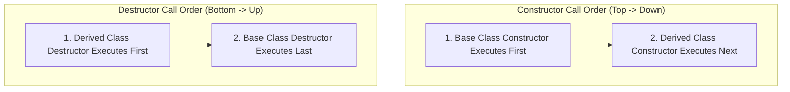

# 04 — Inheritance & Access Modifiers in C++

> **Course Reference:** Lecture 73 — Inheritance | Access Modifier | Real Life Example

---

## 1. What is Inheritance?
**Inheritance** is the capability of a class to derive properties and characteristics from another class.

- **Base Class (Parent / Superclass)**: The class whose properties are inherited.
- **Derived Class (Child / Subclass)**: The class that inherits properties from the base class.

### Why do we use Inheritance?
1. **Code Reusability**: Common code written once in the Base class is inherited by all derived classes.
2. **Transitive Nature**: Changes in the base class automatically propagate to all child classes.
3. **Establishes IS-A Relationship**: (e.g., `Dog IS-A Animal`, `Male IS-A Human`).

```cpp
#include <iostream>
using namespace std;

// Base Class
class Human {
public:
    int height;
    int weight;
    int age;

    int getAge() const { return age; }
    void setWeight(int w) { weight = w; }
};

// Derived Class (Public Inheritance)
class Male : public Human {
public:
    string color;

    void sleep() {
        cout << "Male is sleeping" << endl;
    }
};

int main() {
    Male m1;
    m1.age = 25;       // Inherited from Human
    m1.setWeight(70);  // Inherited from Human
    m1.color = "Brown";
    m1.sleep();

    cout << "Male age: " << m1.getAge() << ", Weight: " << m1.weight << endl;
    return 0;
}
```

---

## 2. The Master Inheritance Access Specifier Matrix

How members of a Base class become accessible in a Derived class depends on:
1. The **Access Specifier of the member in the Base Class** (`public`, `protected`, `private`).
2. The **Mode of Inheritance** (`public`, `protected`, `private`).

| Base Class Member Access | Mode of Inheritance: `public` | Mode of Inheritance: `protected` | Mode of Inheritance: `private` |
|---|---|---|---|
| **`public`** | **`public`** in derived | **`protected`** in derived | **`private`** in derived |
| **`protected`** | **`protected`** in derived | **`protected`** in derived | **`private`** in derived |
| **`private`** | ❌ **Inaccessible / Not Inherited** | ❌ **Inaccessible / Not Inherited** | ❌ **Inaccessible / Not Inherited** |

> [!CRITICAL]
> **Golden Rule of Inheritance**:
> - **`private` members of a base class are NEVER directly accessible in any derived class**, regardless of the inheritance mode! (They can only be accessed indirectly via inherited public/protected getter/setter methods).
> - **`protected` members** are accessible within the base class AND any derived classes, but strictly hidden from outside the class hierarchy.

---

## 3. Code Demonstration of Inheritance Modes

### 1. Public Inheritance Mode (Most Common)
```cpp
class Base {
public:
    int a;
protected:
    int b;
private:
    int c;
};

class DerivedPublic : public Base {
    // 'a' remains public (Accessible everywhere)
    // 'b' remains protected (Accessible inside DerivedPublic and its subclasses)
    // 'c' is NOT accessible
    void test() {
        a = 10; // ✅ OK
        b = 20; // ✅ OK
        // c = 30; // ❌ Compile Error!
    }
};
```

### 2. Protected Inheritance Mode
```cpp
class DerivedProtected : protected Base {
    // 'a' becomes protected
    // 'b' becomes protected
    // 'c' is NOT accessible
};

int main() {
    DerivedProtected obj;
    // obj.a = 10; // ❌ COMPILE ERROR: 'a' is now protected in DerivedProtected!
}
```

### 3. Private Inheritance Mode
```cpp
class DerivedPrivate : private Base {
    // 'a' becomes private in DerivedPrivate
    // 'b' becomes private in DerivedPrivate
    // 'c' is NOT accessible
};

class GrandChild : public DerivedPrivate {
    void test() {
        // a = 10; // ❌ COMPILE ERROR: 'a' became private in DerivedPrivate!
    }
};
```

---

## 4. Order of Constructor & Destructor Execution in Inheritance



### Code Example:
```cpp
#include <iostream>
using namespace std;

class Base {
public:
    Base() { cout << "Base Constructor" << endl; }
    ~Base() { cout << "Base Destructor" << endl; }
};

class Derived : public Base {
public:
    Derived() { cout << "Derived Constructor" << endl; }
    ~Derived() { cout << "Derived Destructor" << endl; }
};

int main() {
    Derived d;
    return 0;
}
```

### Output:
```text
Base Constructor
Derived Constructor
Derived Destructor
Base Destructor
```

---

## 5. Passing Arguments to Base Class Constructors

If the Base class has only parameterized constructors, the Derived class constructor **MUST explicitly call the Base class constructor** via the Initializer List.

```cpp
#include <iostream>
using namespace std;

class Parent {
protected:
    int x;
public:
    Parent(int val) : x(val) {
        cout << "Parent Parameterized Constructor: " << x << endl;
    }
};

class Child : public Parent {
    int y;
public:
    // Explicitly invoke Parent constructor:
    Child(int val1, int val2) : Parent(val1), y(val2) {
        cout << "Child Constructor: " << y << endl;
    }
};

int main() {
    Child c(10, 20);
    return 0;
}
```

---

## 6. Common Interview Questions & Answers

### Q1: Can private members of a base class be inherited?
- **Answer**: Private members are technically present in the derived object's memory layout, but they are **inaccessible directly** by the derived class code. They can only be read or modified if the base class provides `public` or `protected` getter/setter methods.

### Q2: What is the primary difference between `private` and `protected` access specifiers?
- **Answer**: `private` members can only be accessed within the class in which they are declared. `protected` members can be accessed within the declaring class **AND any of its derived subclasses**, while remaining hidden from external functions/objects.

### Q3: Why do Base constructors execute before Derived constructors?
- **Answer**: A derived class often depends on fields and states initialized in the base class. Executing the base constructor first guarantees that the parent foundation is valid and fully initialized before the child class initializes its own specific members.
