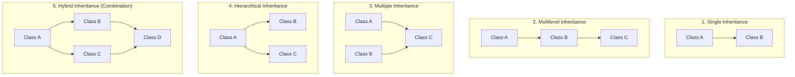
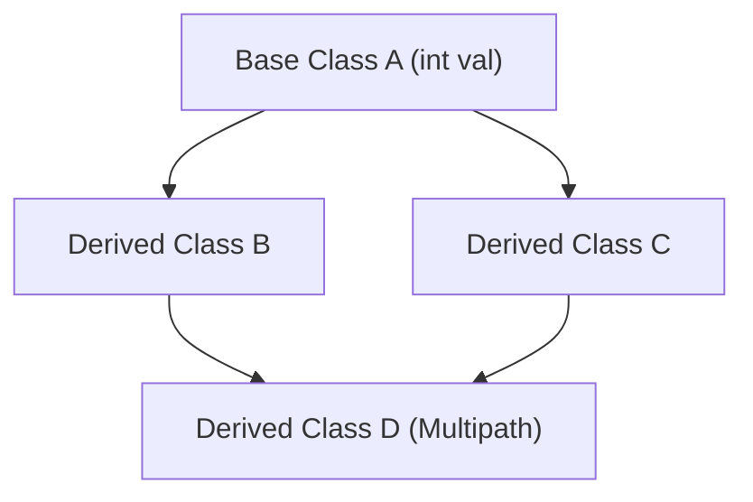

# 05 — Types of Inheritance & The Diamond Problem in C++

> **Course Reference:** Lecture 74 — Types of Inheritance in C++ | Single, Multiple, Hybrid, Multipath & Diamond Problem

---

## 1. Overview: The 5 Types of Inheritance



---

## 2. Detailed Code Implementation of Each Type

### 1. Single Inheritance
A single derived class inherits from a single base class (`A -> B`).
```cpp
class Animal {
public:
    int age;
    void speak() { cout << "Animal speaking" << endl; }
};

class Dog : public Animal {
    // Inherits 'age' and 'speak()'
};
```

---

### 2. Multilevel Inheritance
A class is derived from a class which is already derived from another base class (`A -> B -> C`).
```cpp
class Animal {
public:
    void eat() { cout << "Eating" << endl; }
};

class Dog : public Animal {
public:
    void bark() { cout << "Barking" << endl; }
};

class GermanShepherd : public Dog {
    // Inherits both 'eat()' from Animal and 'bark()' from Dog
};
```

---

### 3. Multiple Inheritance
A single derived class inherits from **two or more independent base classes** (`A, B -> C`).
```cpp
class LivingBeing {
public:
    void breathe() { cout << "Breathing" << endl; }
};

class Swimmer {
public:
    void swim() { cout << "Swimming" << endl; }
};

// Derived from both LivingBeing and Swimmer:
class Fish : public LivingBeing, public Swimmer {
    // Has both breathe() and swim()
};
```

---

### 4. Hierarchical Inheritance
Multiple derived classes inherit from a **single common base class** (`A -> B`, `A -> C`).
```cpp
class Shape {
public:
    void draw() { cout << "Drawing shape" << endl; }
};

class Circle : public Shape {};
class Rectangle : public Shape {};
```

---

### 5. Hybrid Inheritance
A combination of two or more types of inheritance (e.g., Hierarchical + Multiple).

---

## 3. Ambiguity in Multiple Inheritance & Scope Resolution (`::`)

When two parent classes define a function with the **exact same name and signature**, the child class encounters a **Compilation Ambiguity Error** if called directly.

```cpp
#include <iostream>
using namespace std;

class A {
public:
    void func() { cout << "Function in Class A" << endl; }
};

class B {
public:
    void func() { cout << "Function in Class B" << endl; }
};

class C : public A, public B {
    // Inherits func() from BOTH A and B
};

int main() {
    C obj;
    // obj.func(); // ❌ COMPILE ERROR: Request for member 'func' is ambiguous!

    // ✅ SOLUTION: Disambiguate using the Scope Resolution Operator (::)
    obj.A::func(); // Output: Function in Class A
    obj.B::func(); // Output: Function in Class B

    return 0;
}
```

---

## 4. The Diamond Problem (Multipath Inheritance)

### What is the Diamond Problem?
The Diamond Problem occurs in **Multipath Inheritance** when a derived class (`D`) inherits from two classes (`B` and `C`), which both inherit from a common base class (`A`).



### Why does it fail?
- Class `B` receives a copy of Class `A`'s data members.
- Class `C` receives another copy of Class `A`'s data members.
- Class `D` inherits from both `B` and `C`.
- **Result**: Class `D` ends up with **TWO duplicate copies** of Class `A`'s data members!
- When accessing `d.val`, the compiler doesn't know whether to use `B::val` or `C::val` $\to$ **Ambiguity Error & Memory Waste**.

```cpp
// ❌ DEMONSTRATING THE DIAMOND PROBLEM:
class A {
public:
    int a;
};

class B : public A {};
class C : public A {};

class D : public B, public C {};

int main() {
    D obj;
    // obj.a = 10; // ❌ COMPILE ERROR: 'A::a' is ambiguous!
    // obj.B::a = 10; // Works, but duplicates memory!
}
```

---

## 5. Solving the Diamond Problem: Virtual Base Class (`virtual` Inheritance)

In C++, we solve the Diamond Problem by using the **`virtual` keyword** during base class inheritance.

```cpp
#include <iostream>
using namespace std;

class A {
public:
    int a;
    A() { cout << "Class A Constructor" << endl; }
};

// Virtual Inheritance guarantees only ONE single shared instance of A exists:
class B : virtual public A {};
class C : virtual public A {};

class D : public B, public C {};

int main() {
    D obj;
    // ✅ No ambiguity! Exactly one copy of 'a' exists in D:
    obj.a = 100;
    cout << "Value of a: " << obj.a << endl; // Output: 100

    return 0;
}
```

### Output:
```text
Class A Constructor  <-- Called only ONCE!
```

---

## 6. How Virtual Inheritance Works Internally (L3 Deep Dive)

When `virtual public A` is used:
1. The compiler does **not** duplicate the members of `A` inside `B` and `C`.
2. Instead, classes `B` and `C` are injected with an internal hidden pointer called a **Virtual Base Pointer (`vbptr`)**.
3. The `vbptr` points to a **Virtual Base Table (`vbtable`)** that stores the offset distance to the single shared `A` instance in the object's memory layout.
4. Class `D` constructs **only one shared instance of `A`**, and both `B` and `C` access that single shared copy via their offset pointers.

---

## 7. Common Interview Questions & Answers

### Q1: Does Java support Multiple Inheritance? Why does C++ support it?
- **Answer**: Java does **not** support multiple inheritance with classes to avoid the complexity and ambiguity of the Diamond Problem (it only supports multiple interfaces). C++ supports multiple class inheritance directly because it gives developers complete control over memory and provides **Virtual Inheritance (`virtual public`)** to resolve the Diamond Problem.

### Q2: How many times is the base class constructor called in a Diamond hierarchy with virtual inheritance?
- **Answer**: Exactly **once**. In normal multiple inheritance, it would be called twice (once via `B`, once via `C`). With `virtual` inheritance, the most-derived class (`D`) directly calls the virtual base constructor (`A`) once.

### Q3: What is the Scope Resolution Operator `::` used for in Multiple Inheritance?
- **Answer**: It is used to explicitly specify which parent class's member or function should be called when both parents share identical member names (`obj.ClassA::func()`).
