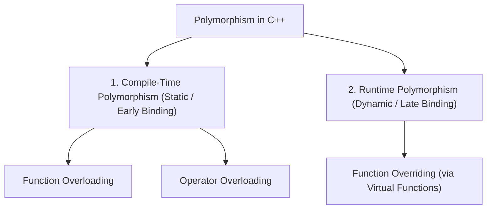
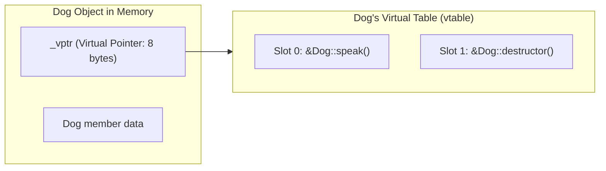

# 06 — Polymorphism, Virtual Functions & `vptr`/`vtable` in C++

> **Course Reference:** Lecture 75 — Polymorphism and Virtual Function in C++

---

## 1. What is Polymorphism?
**Polymorphism** (Greek: *Poly* = many, *Morph* = forms) is the ability of a message, function, or object to be displayed or executed in **multiple different forms**.



---

## 2. Compile-Time vs Runtime Polymorphism

| Dimension | Compile-Time Polymorphism | Runtime Polymorphism |
|---|---|---|
| **Binding Type** | **Early Binding / Static Binding** (Resolved at compile time). | **Late Binding / Dynamic Binding** (Resolved at runtime). |
| **Execution Speed** | Faster execution (No runtime lookup overhead). | Slight runtime overhead due to `vtable` pointer dereference. |
| **Flexibility** | Less flexible; fixed at build time. | Highly flexible; supports dynamic plugin-style architectures. |
| **Implementation** | **Function Overloading, Operator Overloading, Templates**. | **Virtual Functions, Function Overriding, Abstract Classes**. |

---

## 3. Compile-Time Polymorphism

### 1. Function Overloading
Multiple functions in the same scope having the **exact same name** but **different parameter signatures** (number of parameters, data types, or sequence of types).

```cpp
#include <iostream>
using namespace std;

class Calculator {
public:
    // 1. Same name, 2 integer parameters
    int add(int a, int b) { return a + b; }

    // 2. Same name, 3 integer parameters
    int add(int a, int b, int c) { return a + b + c; }

    // 3. Same name, 2 double parameters
    double add(double a, double b) { return a + b; }
};
```

> [!WARNING]
> **Can we overload functions based ONLY on Return Type?**
> - **NO!** `int foo()` and `double foo()` causes a **Compile Error** because the compiler cannot determine which function to call if the return value is ignored (e.g., calling `foo();`).

---

### 2. Operator Overloading
Allows standard C++ operators (`+`, `-`, `*`, `==`, `<<`, `++`) to have user-defined meanings when applied to custom class objects.

```cpp
#include <iostream>
using namespace std;

class Complex {
public:
    int real, imag;

    Complex(int r = 0, int i = 0) : real(r), imag(i) {}

    // Overloading '+' operator: obj1 + obj2
    Complex operator+(const Complex& obj) {
        Complex res;
        res.real = this->real + obj.real;
        res.imag = this->imag + obj.imag;
        return res;
    }

    void print() const {
        cout << real << " + " << imag << "i" << endl;
    }
};

int main() {
    Complex c1(3, 4), c2(1, 2);
    Complex c3 = c1 + c2; // Calls c1.operator+(c2)
    c3.print();           // Output: 4 + 6i

    return 0;
}
```

### 🚫 Operators that CANNOT be overloaded in C++:
1. `.` (Dot / Member access operator)
2. `.*` (Pointer-to-member operator)
3. `::` (Scope resolution operator)
4. `?:` (Ternary conditional operator)
5. `sizeof` (Size-of operator)
6. `typeid` (RTTI operator)

---

## 4. Runtime Polymorphism & Virtual Functions

### The Problem without `virtual`:
When calling a function through a **Base Class Pointer** pointing to a **Derived Class Object**, C++ performs early binding by default (calling the Base function, ignoring the Derived override!).

```cpp
#include <iostream>
using namespace std;

class Animal {
public:
    void speak() { cout << "Animal speaking" << endl; }
};

class Dog : public Animal {
public:
    void speak() { cout << "Dog barking" << endl; } // Overriding function
};

int main() {
    Animal* ptr = new Dog(); // Base pointer -> Derived object
    ptr->speak();            // Output: "Animal speaking" (Early binding - WRONG!)
    delete ptr;
}
```

---

### The Solution: The `virtual` Keyword (Late Binding)

Declaring the base function as `virtual` tells the compiler: *"Do not bind this call at compile time. Look up the actual runtime object type and invoke the derived implementation!"*

```cpp
#include <iostream>
using namespace std;

class Animal {
public:
    // Virtual Function enables Dynamic Runtime Binding:
    virtual void speak() {
        cout << "Animal speaking" << endl;
    }
};

class Dog : public Animal {
public:
    void speak() override { // 'override' keyword ensures valid signature
        cout << "Dog barking" << endl;
    }
};

int main() {
    Animal* ptr = new Dog();
    ptr->speak(); // Output: "Dog barking" (Dynamic Dispatch - SUCCESS!)
    delete ptr;

    return 0;
}
```

---

## 5. How Virtual Functions Work Internally: `vptr` and `vtable` (L3 CORE)



### The 2 Internal Components:
1. **`vtable` (Virtual Table)**:
   - A static array of function pointers created by the compiler for **every class that contains at least one virtual function**.
   - Contains addresses of the virtual functions belonging to that specific class.
2. **`vptr` (Virtual Table Pointer)**:
   - A hidden pointer member injected automatically by the compiler into **every object instance** of a class with virtual functions.
   - Points directly to the class's `vtable`.
   - Adds **8 bytes** (on a 64-bit architecture) to `sizeof(Object)`.

### Step-by-Step Execution of `ptr->speak()`:
1. Program accesses `ptr`'s hidden `_vptr`.
2. Follows `_vptr` to the **Dog `vtable`**.
3. Looks up the function pointer at the fixed index for `speak()`.
4. Jumps to and executes `Dog::speak()`.

---

## 6. Pure Virtual Functions & Abstract Classes

### Pure Virtual Function
A virtual function with **no body / implementation** in the base class, assigned to `= 0`:
```cpp
virtual void draw() = 0; // Pure Virtual Function
```

### Abstract Class
A class containing **at least one pure virtual function**.
- **Cannot be instantiated** (`Shape s;` is a compile error).
- Used as a strict interface contract that all derived classes **MUST implement**.

```cpp
#include <iostream>
using namespace std;

// Abstract Base Class (Interface Contract)
class Shape {
public:
    virtual void draw() = 0;         // Pure virtual function
    virtual double area() const = 0; // Pure virtual function
};

class Circle : public Shape {
    double radius;
public:
    Circle(double r) : radius(r) {}

    // MUST override pure virtual functions to become instantiable:
    void draw() override { cout << "Drawing Circle" << endl; }
    double area() const override { return 3.14159 * radius * radius; }
};

int main() {
    // Shape s; // ❌ COMPILE ERROR: Cannot instantiate abstract class!
    Shape* s = new Circle(5.0);
    s->draw();
    cout << "Area: " << s->area() << endl;
    delete s;
}
```

---

## 7. Virtual Destructors (Why They Are Mandatory in Base Classes)

```cpp
#include <iostream>
using namespace std;

class Base {
public:
    Base() { cout << "Base Constructor" << endl; }
    // ❌ NON-VIRTUAL DESTRUCTOR (Causes Memory Leak!):
    // ~Base() { cout << "Base Destructor" << endl; }

    // ✅ VIRTUAL DESTRUCTOR (Guarantees full cleanup):
    virtual ~Base() { cout << "Base Virtual Destructor" << endl; }
};

class Derived : public Base {
    int* data;
public:
    Derived() {
        data = new int[100]; // Allocate heap memory
        cout << "Derived Constructor" << endl;
    }
    ~Derived() override {
        delete[] data;       // Free heap memory
        cout << "Derived Destructor" << endl;
    }
};

int main() {
    Base* ptr = new Derived();
    delete ptr; // Calls Derived destructor first, then Base destructor!
    return 0;
}
```

> [!CRITICAL]
> **Why must Base class destructors be `virtual`?**
> - If `~Base()` is non-virtual, calling `delete ptr` (where `Base* ptr = new Derived()`) will perform early binding and **ONLY call `~Base()`**, completely skipping `~Derived()`!
> - The heap memory allocated in `Derived` (`new int[100]`) will **never be freed**, causing a **Severe Memory Leak**.
> - Declaring `virtual ~Base()` ensures the destructor call is dispatched dynamically, executing `~Derived()` first, followed by `~Base()`.

---

## 8. Common Interview Questions & Answers

### Q1: Can a constructor be `virtual` in C++?
- **Answer**: **No.** A constructor cannot be `virtual`. When a constructor executes, the object is not yet fully constructed and its `vptr` has not yet been initialized in memory. You cannot perform virtual dispatch on an object that doesn't yet exist.

### Q2: What is the size of an object of a class containing only 1 virtual function?
- **Answer**: On a 64-bit machine, its size will be **8 bytes** (the size of the compiler-injected `vptr` pointer).

### Q3: What is the difference between Function Overloading and Function Overriding?
- **Answer**: 
  - **Overloading**: Same function name with different parameter signatures in the **same class** (Compile-time).
  - **Overriding**: Same function name with identical signatures in a **Derived class** overriding a Base `virtual` function (Runtime).
