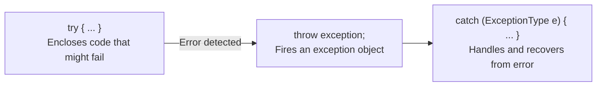
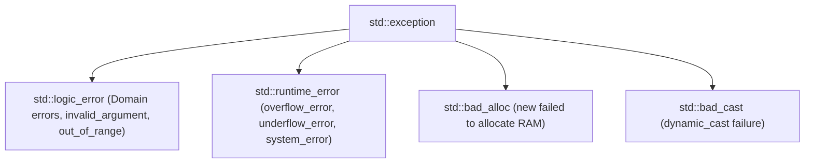

# 07 — Exception Handling in C++

> **Course Reference:** Lecture 76 — Exception Handling in C++

---

## 1. What is an Exception?
An **Exception** is an abnormal runtime condition or unexpected error encountered by a program during its execution (e.g., division by zero, out-of-bounds array access, file not found, memory allocation failure `bad_alloc`).

### Why use Exception Handling?
1. **Separates Error-Handling Code from Business Logic**: Eliminates messy nested `if-else` error codes.
2. **Guarantees Resource Cleanup (Stack Unwinding)**: Automatically invokes destructors for all local stack objects when jumping out of an error frame.
3. **Propagates Errors Up the Call Stack**: Unhandled exceptions bubble up to higher-level caller functions until caught.

---

## 2. The 3 Core Keywords: `try`, `catch`, `throw`



### Basic Syntax & Division by Zero Example:
```cpp
#include <iostream>
using namespace std;

double divide(int numerator, int denominator) {
    if (denominator == 0) {
        // 1. THROW: Throw an exception object (int, string, or class)
        throw "Division by zero error!";
    }
    return (double)numerator / denominator;
}

int main() {
    int a = 10, b = 0;

    // 2. TRY: Monitor this block for exceptions
    try {
        double result = divide(a, b);
        cout << "Result: " << result << endl;
    }
    // 3. CATCH: Catch and handle the specific exception type
    catch (const char* msg) {
        cerr << "Exception caught: " << msg << endl;
    }

    cout << "Program continues execution normally..." << endl;
    return 0;
}
```

---

## 3. Multiple `catch` Blocks & Catch-All (`catch (...)`)

A single `try` block can have multiple `catch` blocks to handle different exception data types.

```cpp
#include <iostream>
using namespace std;

void test(int x) {
    try {
        if (x == 1) throw 100;           // Throw int
        if (x == 2) throw 'E';           // Throw char
        if (x == 3) throw 3.14159;       // Throw double
        if (x == 4) throw "Custom Error";// Throw string
    }
    catch (int e) {
        cout << "Caught Integer Exception: " << e << endl;
    }
    catch (char c) {
        cout << "Caught Character Exception: " << c << endl;
    }
    // Catch-All Handler (Catches any unhandled exception type):
    catch (...) {
        cout << "Caught Default / Unknown Exception!" << endl;
    }
}

int main() {
    test(1); // Caught Integer
    test(2); // Caught Character
    test(3); // Caught Default
    return 0;
}
```

> [!WARNING]
> **Catch Order Rule**: Always place **Derived class exceptions before Base class exceptions**, and place the catch-all `catch(...)` at the **very bottom**.

---

## 4. Standard C++ Exception Hierarchy (`<stdexcept>`)



```cpp
#include <iostream>
#include <vector>
#include <stdexcept>
using namespace std;

int main() {
    vector<int> v = {1, 2, 3};

    try {
        // v.at(10) throws std::out_of_range (unlike v[10] which causes undefined behavior)
        cout << v.at(10) << endl;
    }
    catch (const out_of_range& e) {
        cerr << "Out of Range Error: " << e.what() << endl;
    }
    catch (const exception& e) {
        cerr << "Standard Exception: " << e.what() << endl;
    }

    return 0;
}
```

---

## 5. Custom User-Defined Exception Classes

To create custom exceptions, inherit from `std::exception` and override the `what()` virtual method:

```cpp
#include <iostream>
#include <exception>
using namespace std;

// Custom User-Defined Exception Class
class InsufficientFundsException : public exception {
    string message;
public:
    InsufficientFundsException(double required, double current) {
        message = "Insufficient Funds! Required: $" + to_string(required) + 
                  ", Available: $" + to_string(current);
    }

    // Override what() method (noexcept guarantees this function will not throw):
    const char* what() const noexcept override {
        return message.c_str();
    }
};

class BankAccount {
    double balance;
public:
    BankAccount(double b) : balance(b) {}

    void withdraw(double amount) {
        if (amount > balance) {
            throw InsufficientFundsException(amount, balance);
        }
        balance -= amount;
        cout << "Withdrawal successful. Remaining balance: $" << balance << endl;
    }
};

int main() {
    BankAccount acc(500.0);

    try {
        acc.withdraw(800.0); // Throws custom exception
    }
    catch (const InsufficientFundsException& e) {
        cerr << "Banking Error: " << e.what() << endl;
    }

    return 0;
}
```

---

## 6. Stack Unwinding in C++ (L3 CRITICAL CONCEPT)

### What is Stack Unwinding?
**Stack Unwinding** is the process where the runtime system cleans up the call stack by **automatically invoking the destructors of all local stack objects** initialized between the `try` block and the `throw` statement.

```cpp
#include <iostream>
using namespace std;

class Resource {
    string name;
public:
    Resource(string n) : name(n) { cout << "Resource Acquired: " << name << endl; }
    ~Resource() { cout << "Resource Freed: " << name << endl; }
};

void functionC() {
    Resource r3("Resource C");
    cout << "Inside functionC - Throwing Exception!" << endl;
    throw runtime_error("Fatal Error in C!");
}

void functionB() {
    Resource r2("Resource B");
    functionC();
}

void functionA() {
    Resource r1("Resource A");
    functionB();
}

int main() {
    try {
        functionA();
    }
    catch (const exception& e) {
        cout << "Caught in main(): " << e.what() << endl;
    }
    return 0;
}
```

### Output Demonstrating Stack Unwinding:
```text
Resource Acquired: Resource A
Resource Acquired: Resource B
Resource Acquired: Resource C
Inside functionC - Throwing Exception!
Resource Freed: Resource C   <-- Destructor called during unwind
Resource Freed: Resource B   <-- Destructor called during unwind
Resource Freed: Resource A   <-- Destructor called during unwind
Caught in main(): Fatal Error in C!
```

> [!TIP]
> **RAII (Resource Acquisition Is Initialization)**: In C++, always wrap heap resources, mutexes, and file handles inside class objects with destructors. Stack unwinding guarantees that even during sudden exceptions, resources are **never leaked**!

---

## 7. Rethrowing an Exception (`throw;`)

A catch block can partially handle an exception (e.g., log it) and rethrow it to an outer handler using `throw;`.

```cpp
void process() {
    try {
        // Some risky operation
        throw runtime_error("Network Timeout");
    }
    catch (const exception& e) {
        cout << "Logging error inside process()..." << endl;
        throw; // Rethrow current active exception to caller
    }
}

int main() {
    try {
        process();
    }
    catch (const exception& e) {
        cout << "Handled fatal error in main(): " << e.what() << endl;
    }
}
```

---

## 8. Common Interview Questions & Answers

### Q1: What happens if an exception is thrown inside a Destructor during stack unwinding?
- **Answer**: If a destructor throws an exception while another exception is already active (during stack unwinding), C++ calls `std::terminate()` immediately, **crashing the entire program**. Destructors in C++ must **never throw exceptions** (they are implicitly marked `noexcept`).

### Q2: What is the purpose of `catch(...)`?
- **Answer**: `catch(...)` is the catch-all handler that catches any exception of any type that was not caught by preceding catch blocks. It acts as a safety net before an unhandled exception triggers `std::terminate()`.

### Q3: What is the `noexcept` specifier in modern C++?
- **Answer**: `noexcept` is a specifier indicating that a function promises **never to throw any exceptions**. If a `noexcept` function does throw, the compiler calls `std::terminate()` immediately. It allows compilers to perform significant optimizations (especially during `std::vector` reallocations with move constructors).
