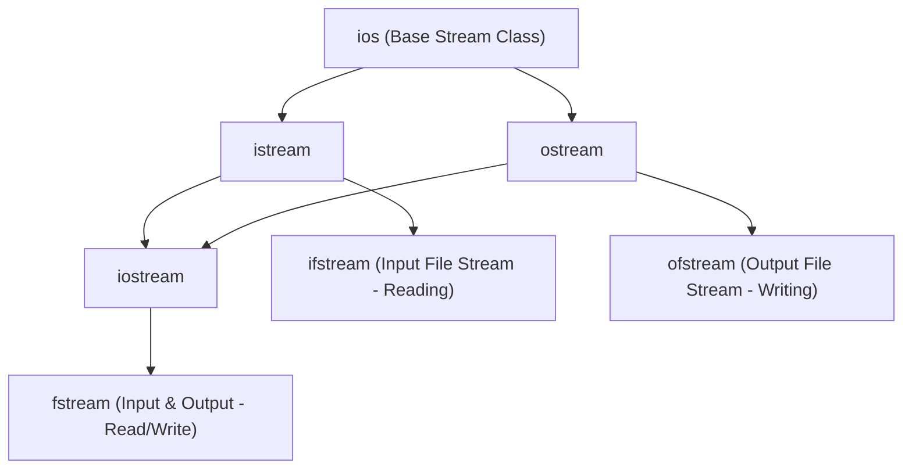
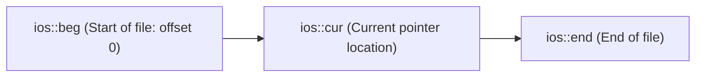

# 08 — File Handling & Streams in C++

> **Course Reference:** Lecture 77 — File Handling in C++

---

## 1. What is File Handling in C++?
File handling allows C++ programs to store data permanently on disk (secondary storage) and read data back into program memory.

C++ uses the concept of **Streams** (sequences of bytes flowing between memory and external devices).

### Core Header Files:
- `<iostream>`: Standard Input/Output streams (`cin`, `cout`).
- `<fstream>`: File stream classes (`ifstream`, `ofstream`, `fstream`).

---

## 2. The 3 File Stream Classes



| Class | Purpose | Standard Direction |
|---|---|---|
| **`ofstream`** | **Output Stream**: Creates files and writes data to disk. | Memory $\to$ File |
| **`ifstream`** | **Input Stream**: Reads data from files on disk into memory. | File $\to$ Memory |
| **`fstream`** | **Bidirectional Stream**: Supports simultaneous reading and writing. | Memory $\longleftrightarrow$ File |

---

## 3. File Opening Modes (`ios::mode`)

When opening a file with `.open(filename, mode)`, you can specify one or more opening modes combined using bitwise OR (`|`):

| Mode Flag | Meaning | Behavior |
|---|---|---|
| **`ios::in`** | Input / Read | Opens file for reading (Default for `ifstream`). |
| **`ios::out`** | Output / Write | Opens file for writing (Default for `ofstream`). **Truncates/erases** existing contents! |
| **`ios::app`** | Append | Opens file for writing. All writes are appended to the **end of the file** without erasing existing data. |
| **`ios::trunc`** | Truncate | If file exists, truncates content to 0 bytes before writing. |
| **`ios::binary`** | Binary Mode | Opens file in raw binary format (bypasses OS newline `\r\n` conversions). |
| **`ios::ate`** | At End | Opens file and immediately positions the file pointer at the end of the file. |

---

## 4. Writing & Reading Text Files

### 1. Writing to a Text File (`ofstream`)
```cpp
#include <iostream>
#include <fstream>
using namespace std;

int main() {
    // Open file in write mode (creates file if it doesn't exist):
    ofstream outFile("sample.txt");

    if (!outFile.is_open()) {
        cerr << "Error: Could not open file for writing!" << endl;
        return 1;
    }

    // Write data using insertion operator (<<):
    outFile << "Infosys Specialist Programmer L3" << endl;
    outFile << "C++ Object Oriented Programming" << endl;
    outFile << 100 << endl;

    outFile.close(); // Always close open file streams!
    cout << "Data written successfully." << endl;

    return 0;
}
```

---

### 2. Reading Line-by-Line from a Text File (`ifstream` & `getline`)
```cpp
#include <iostream>
#include <fstream>
#include <string>
using namespace std;

int main() {
    ifstream inFile("sample.txt");

    if (!inFile) {
        cerr << "Error: File not found!" << endl;
        return 1;
    }

    string line;
    // Read line-by-line until End-of-File (EOF):
    while (getline(inFile, line)) {
        cout << "Read Line: " << line << endl;
    }

    inFile.close();
    return 0;
}
```

---

## 5. File Pointers & Navigation: `seekg`, `seekp`, `tellg`, `tellp`

C++ maintains internal file offset pointers:
- **Get Pointer (`g`)**: Controls the read position in an `ifstream`.
- **Put Pointer (`p`)**: Controls the write position in an `ofstream`.



| Function | Stream | Purpose |
|---|---|---|
| **`tellg()`** | `ifstream` | Returns current byte position of the **Get (Read) pointer**. |
| **`seekg(offset, direction)`** | `ifstream` | Moves the **Get (Read) pointer** by `offset` bytes from `direction`. |
| **`tellp()`** | `ofstream` | Returns current byte position of the **Put (Write) pointer**. |
| **`seekp(offset, direction)`** | `ofstream` | Moves the **Put (Write) pointer** by `offset` bytes from `direction`. |

### Seeking Directions:
- `ios::beg`: Offset calculated from the **beginning** of the file.
- `ios::cur`: Offset calculated from the **current** pointer position.
- `ios::end`: Offset calculated from the **end** of the file (e.g., `seekg(-10, ios::end)`).

```cpp
#include <iostream>
#include <fstream>
using namespace std;

int main() {
    ifstream file("sample.txt");

    // Move pointer 8 bytes forward from the beginning:
    file.seekg(8, ios::beg);

    cout << "Current read pointer position: " << file.tellg() << endl; // Output: 8

    // Move pointer to the very end to find file size:
    file.seekg(0, ios::end);
    streampos fileSize = file.tellg();
    cout << "Total File Size: " << fileSize << " bytes" << endl;

    file.close();
    return 0;
}
```

---

## 6. Binary File Operations (Reading & Writing Custom Objects)

Binary mode stores raw memory bytes directly on disk without string conversion, making it significantly faster and compact.

- **`write((char*)&object, sizeof(object))`**: Dumps object memory bytes to disk.
- **`read((char*)&object, sizeof(object))`**: Reads bytes from disk directly into object memory.

```cpp
#include <iostream>
#include <fstream>
using namespace std;

class Student {
public:
    int id;
    char name[50];
    double gpa;

    void display() const {
        cout << "ID: " << id << ", Name: " << name << ", GPA: " << gpa << endl;
    }
};

int main() {
    Student s1 = {101, "Alice", 3.95};

    // 1. WRITE OBJECT TO BINARY FILE:
    ofstream outFile("students.dat", ios::binary | ios::out);
    outFile.write((char*)&s1, sizeof(s1));
    outFile.close();

    // 2. READ OBJECT BACK FROM BINARY FILE:
    Student s2;
    ifstream inFile("students.dat", ios::binary | ios::in);
    inFile.read((char*)&s2, sizeof(s2));
    inFile.close();

    cout << "Deserialized Object from Binary File:" << endl;
    s2.display(); // Output: ID: 101, Name: Alice, GPA: 3.95

    return 0;
}
```

---

## 7. Stream State & Error Flags

| Function | Return Type | Condition Checked |
|---|---|---|
| **`good()`** | `bool` | Returns `true` if no error has occurred and stream is healthy. |
| **`eof()`** | `bool` | Returns `true` if End-Of-File (EOF) has been reached. |
| **`fail()`** | `bool` | Returns `true` if a format error occurred (e.g., reading a string into an `int`). |
| **`bad()`** | `bool` | Returns `true` if a fatal I/O corruption or hardware failure occurred. |
| **`clear()`** | `void` | Resets error flags so the stream can be used again. |

---

## 8. Common Interview Questions & Answers

### Q1: What is the difference between `ios::out` and `ios::app`?
- **Answer**: `ios::out` opens the file for writing and **truncates/overwrites** the existing file contents to 0 bytes. `ios::app` (append mode) preserves existing contents and positions the write pointer at the **very end of the file**, ensuring all new writes are appended.

### Q2: What is the difference between `seekg()` and `seekp()`?
- **Answer**: `seekg()` (**Seek Get**) moves the read pointer in an input stream (`ifstream`), while `seekp()` (**Seek Put**) moves the write pointer in an output stream (`ofstream`).

### Q3: Why is binary file I/O faster than text file I/O?
- **Answer**: Text I/O performs dynamic character-by-character parsing and formatting (converting integers/floats to ASCII characters and translating OS newline characters `\r\n` $\leftrightarrow$ `\n`). Binary I/O dumps raw binary memory buffers directly to disk with zero conversion overhead using `read()` and `write()`.
