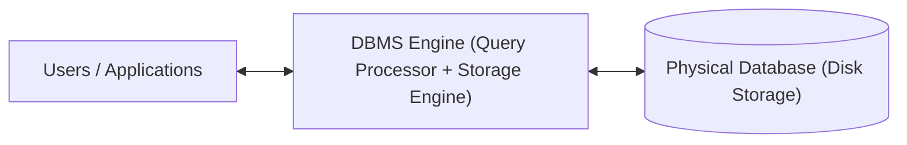
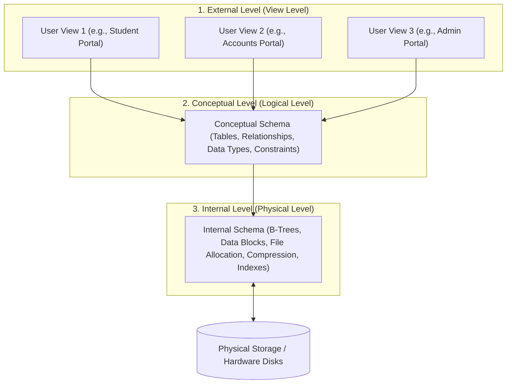
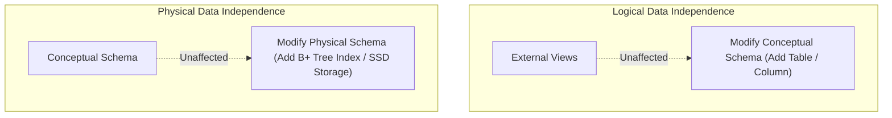

# 01 — DBMS Fundamentals & Architecture

> **Topics Covered:** What is DBMS? | File System vs DBMS | Advantages of DBMS | Three-Schema Architecture | Data Independence | 1-Tier, 2-Tier, 3-Tier Architecture | Role of DBA

---

## 1. What is a DBMS?
A **Database Management System (DBMS)** is a software system that facilitates the creation, maintenance, querying, and administration of structured collections of data (databases). It acts as an interface between end-users / applications and the underlying persistent storage.



---

## 2. File System vs DBMS (Core Interview Comparison)

| Feature | File Processing System (Traditional) | Database Management System (DBMS) |
|---|---|---|
| **Data Redundancy** | High (Same data duplicated in multiple files). | **Minimal / Controlled** via normalization and central control. |
| **Data Inconsistency** | High (Updating one file leaves stale copies in others). | **Low** (Single source of truth prevents conflicting versions). |
| **Data Access** | Requires writing custom programs for every new query. | Easy & declarative via **SQL / Query Languages**. |
| **Concurrent Access** | Poor / Prone to race conditions and file-lock contention. | Robust **Concurrency Control** (Locks, Multi-Version Concurrency Control - MVCC). |
| **Crash Recovery & ACID** | No built-in crash recovery; data corruption on power loss. | **ACID Guarantees** with Write-Ahead Logging (WAL) and automated recovery. |
| **Data Security & Access Control** | Basic OS file permissions (All-or-nothing access). | Fine-grained **Role-Based Access Control (RBAC)** at table, column, and row levels. |
| **Data Integrity Constraints** | Must be coded manually in application software. | Enforced natively by database engine (Primary Key, Foreign Key, `CHECK`, `NOT NULL`). |

---

## 3. Advantages of DBMS
1. **Controlling Data Redundancy**: Data is centralized; duplicate values are eliminated via normalization.
2. **Data Consistency**: Changes made to a record propagate instantly across all dependent queries.
3. **Data Sharing & Multi-User Support**: Multiple transactions execute concurrently without dirty reads or lost updates.
4. **Enforcing Integrity Constraints**: Schema rules (e.g., `age >= 18`, `balance >= 0`) are validated at the engine level.
5. **Backup & Recovery Subsystems**: Automated point-in-time snapshots, transaction logs, and failover capabilities.
6. **Data Independence**: Application programs are decoupled from physical storage formats.

---

## 4. The Three-Schema (ANSI-SPARC) Architecture

To decouple user applications from the physical storage details, DBMS utilizes a **3-tier schema architecture**:



### 1. External Level (View Level / User Level)
- Highest abstraction level.
- Describes **what data is visible to specific user groups** (e.g., A student views their grades, but cannot view salary details of professors).
- Implemented via SQL **Views** and permissions.

### 2. Conceptual Level (Logical Level)
- Describes **WHAT data is stored** in the database and the **relationships** among data.
- Defines tables, columns, data types, primary keys, foreign keys, and integrity constraints.
- Independent of physical storage devices and programming languages.

### 3. Internal Level (Physical Level)
- Lowest level of abstraction.
- Describes **HOW data is physically stored** on disks (block sizes, byte offsets, indexing structures like B+ Trees, hashing algorithms, data compression, encryption).

---

## 5. Data Independence (Crucial L3 Concept)

**Data Independence** is the capacity to change the schema at one level of a database system without having to change the schema at the next higher level.



### 1. Logical Data Independence
- Ability to modify the **Conceptual Schema** (e.g., adding a new column `phone_number` or splitting a table) without requiring changes to existing **External Views or Application Programs**.
- *Harder to achieve* because application code often depends on logical table structures.

### 2. Physical Data Independence
- Ability to modify the **Physical / Internal Schema** (e.g., changing storage from HDD to NVMe SSD, adding B-Tree indexes, modifying file block sizes) without altering the **Conceptual Schema or Application Queries**.
- *Easier to achieve* because SQL queries (`SELECT * FROM users WHERE id = 5`) do not specify physical file paths or index lookup steps.

---

## 6. DBMS System Architectures (1-Tier, 2-Tier, 3-Tier)

### 1. 1-Tier Architecture (Standalone / Embedded)
- The Client, Application Logic, and Database all reside on the **same physical machine** (e.g., SQLite in a mobile app, MS Access).
- *Pros*: Zero network latency, simple.
- *Cons*: Single user only, no distributed scale.

### 2. 2-Tier Architecture (Client-Server)
- **Client Tier**: Runs user interface and application business logic.
- **Server Tier**: Hosts DBMS engine and database storage.
- Communication occurs via database drivers (JDBC / ODBC).
- *Cons*: Direct database connection from client creates security risks and scalability bottlenecks (connection pool exhaustion).

### 3. 3-Tier Architecture (Modern Enterprise Web Applications)

```mermaid
flowchart LR
    Client["Client Tier (Browser / Mobile)"] <-->|HTTPS / REST| AppServer["Application Server (Business Logic / APIs)"]
    AppServer <-->|Connection Pool (JDBC/TCP)| DBServer[("Database Server (DBMS Storage Engine)")]
```

- **Client Tier (Presentation)**: Frontend UI (React, Android, iOS).
- **Application Tier (Business Logic)**: Web servers / microservices (Node.js, Spring Boot, Go) containing validation, security, and transaction orchestration.
- **Database Tier (Data Persistence)**: High-performance DBMS (PostgreSQL, MySQL, Oracle) handling persistent storage and query execution.
- *Pros*: Enhanced security (clients never talk directly to DB), high scalability via horizontal app server autoscaling, connection pooling.

---

## 7. Role and Responsibilities of Database Administrator (DBA)

A **Database Administrator (DBA)** is responsible for managing, securing, and maintaining the database environment:

| Responsibility Area | Key Tasks |
|---|---|
| **Schema Definition & Modeling** | Translates business requirements into normalized relational schemas. |
| **Security & Authorization** | Enforces Principle of Least Privilege, manages user roles, credentials, and data encryption. |
| **Performance Tuning** | Analyzes slow query logs (`EXPLAIN ANALYZE`), creates appropriate indexes, optimizes buffer pools. |
| **Backup & Disaster Recovery** | Configures automated WAL archiving, daily snapshots, tests Point-In-Time Recovery (PITR). |
| **High Availability & Replication** | Manages Primary-Replica replication, clustering, and automated failover coordinators (e.g., Patroni). |
| **Capacity & Storage Planning** | Monitors table bloat, disk IOPS saturation, plans horizontal sharding strategies. |

---

## 8. Summary Checklist for Interview
- [x] DBMS provides ACID transactions, concurrency control, and eliminates unmanaged redundancy.
- [x] Three-schema architecture separates View, Logical (Conceptual), and Physical (Internal) tiers.
- [x] Physical data independence allows changing disk layouts/indexes without breaking SQL queries.
- [x] 3-Tier architecture decouples clients from databases via application microservices and connection pools.
