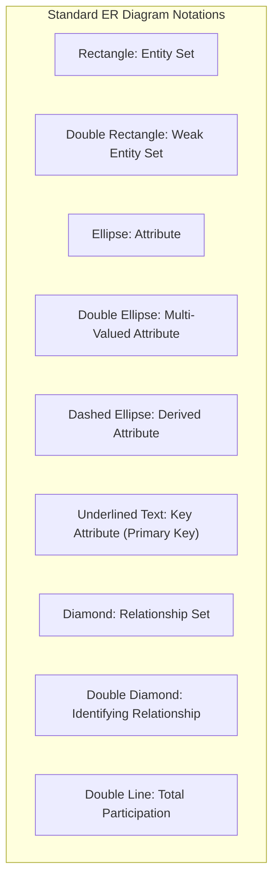
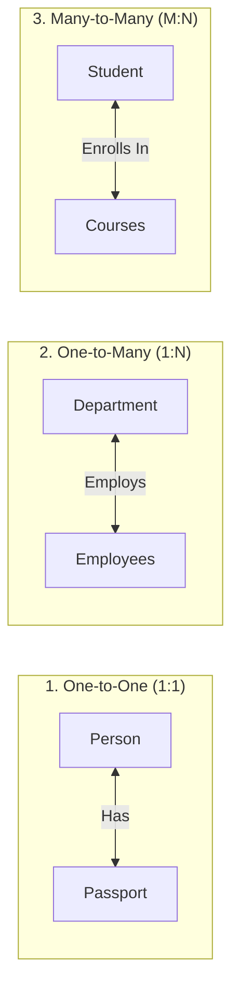
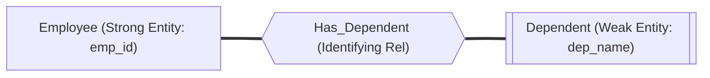
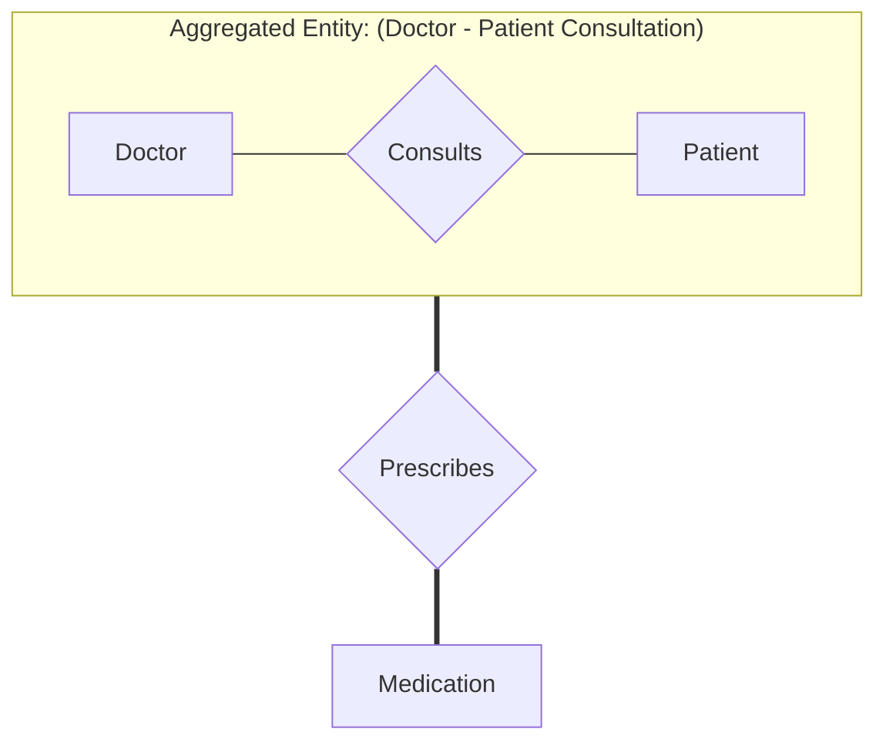
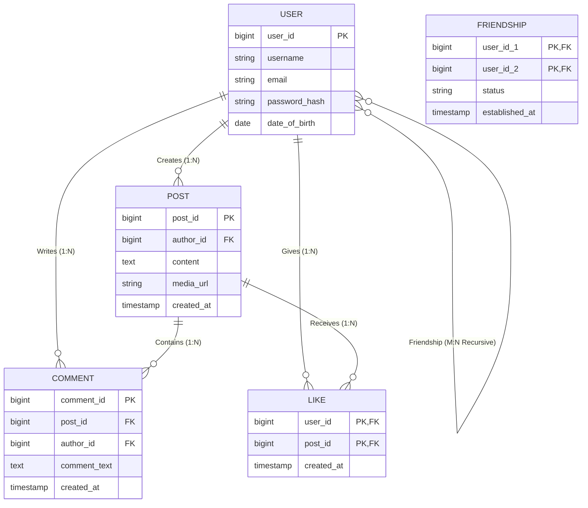

# 02 — Entity-Relationship (ER) & Extended ER (EER) Model

> **Topics Covered:** ER Model Concepts | Entities & Entity Sets | Attributes Classification | Relationships & Cardinality Ratios | Participation Constraints | Weak Entity Sets | Extended ER (Specialization, Generalization, Aggregation) | Facebook ER Diagram Case Study

---

## 1. What is the ER Model?
The **Entity-Relationship (ER) Model** is a high-level conceptual data model developed by Peter Chen (1976). It represents the logical structure of a database visually through entities, their attributes, and relationships.

---

## 2. Core ER Components & Notation Symbols

---

## 3. Detailed Attribute Classification

| Attribute Type | Definition | Example in Real Life | ER Notation |
|---|---|---|---|
| **Simple (Atomic)** | Cannot be divided into smaller sub-components. | `age`, `roll_number`, `salary` | Standard Ellipse |
| **Composite** | Can be divided into smaller sub-parts with independent meanings. | `name` $\to$ `(first_name, last_name)` `address` $\to$ `(street, city, zip)` | Ellipse connected to sub-ellipses |
| **Single-Valued** | Holds exactly one value for a given entity instance. | `aadhaar_number`, `date_of_birth` | Standard Ellipse |
| **Multi-Valued** | Can hold multiple values for a single entity instance. | `phone_numbers`, `skills`, `email_addresses` | **Double Ellipse** |
| **Stored** | Physical value stored directly in the database. | `date_of_birth` | Standard Ellipse |
| **Derived** | Value dynamically computed from stored attributes. | `age` computed from `current_date - date_of_birth` | **Dashed Ellipse** |
| **Key Attribute** | Uniquely identifies each entity instance in an entity set. | `student_id`, `ssn` | **Underlined text inside Ellipse** |

---

## 4. Relationships & Cardinality Ratios (Mapping Constraints)

A **Relationship** is an association among two or more entities.

### 1. Mapping Cardinalities (Binary Relationships)

1. **One-to-One (1:1)**: An entity in A is associated with at most one entity in B, and vice versa (e.g., A citizen has one passport; one passport belongs to one citizen).
2. **One-to-Many (1:N)**: An entity in A is associated with any number of entities in B; an entity in B is associated with at most one entity in A (e.g., One Department has many Employees; an Employee belongs to one Department).
3. **Many-to-One (N:1)**: Multiple entities in A map to one entity in B.
4. **Many-to-Many (M:N)**: An entity in A maps to multiple entities in B, and an entity in B maps to multiple entities in A (e.g., Students and Courses).

---

## 5. Participation Constraints: Total vs Partial

| Constraint Type | Definition | Visual Notation | Example |
|---|---|---|---|
| **Total Participation (Existence Dependency)** | **Every** entity in the entity set MUST participate in at least one relationship instance. | **Double Line** connecting Entity to Relationship | Every Employee MUST work for a Department. |
| **Partial Participation** | **Some** entities in the entity set may not participate in the relationship. | **Single Line** connecting Entity to Relationship | Not every Employee Manages a Department. |

---

## 6. Weak Entity Sets & Identifying Relationships

### What is a Weak Entity?
A **Weak Entity Set** is an entity set that **does not possess a primary key** of its own. It depends on the existence of a **Strong (Owner) Entity Set**.

### Key Properties:
1. **Represented by Double Rectangle**.
2. **Identifying Relationship**: Represented by a **Double Diamond** connected with **Double Lines** (Total Participation).
3. **Discriminator / Partial Key**: The attribute(s) that distinguish dependents of the *same* employee (represented by a **Dashed Underline**).
4. **Primary Key Formulation**:
   $$\text{Primary Key of Weak Entity} = \text{Primary Key of Strong Entity} + \text{Partial Key (Discriminator)}$$
   $$\text{PK of Dependent} = (\texttt{emp\_id}, \texttt{dependent\_name})$$

---

## 7. Extended ER (EER) Features

### 1. Specialization (Top-Down Approach)
The process of designating sub-groupings within an entity set that have distinct attributes.
- *Example*: Entity `Employee` specialized into `Salaried_Employee` and `Hourly_Employee`.

### 2. Generalization (Bottom-Up Approach)
The process of extracting common attributes from multiple lower-level entity sets to synthesize a higher-level super-entity set.
- *Example*: Synthesizing `Car`, `Truck`, and `Motorcycle` into a generalized `Vehicle` super-entity.

### 3. Aggregation
Treats a relationship between two entities as a **higher-level abstracted entity**, allowing it to participate in another relationship.
- *Problem*: A relationship cannot directly connect to another relationship in standard ER modeling.
- *Solution*: Aggregate `(Doctor, Patient, Treatment)` into an abstract unit that connects to `Insurance_Company`.

---

## 8. Case Study: Designing an ER Model for Facebook (Social Network)

Let's design the complete ER diagram for core social networking features:

### Key Architectural Notes for Facebook ER Model:
1. **Friendship Relationship**: A **Unary / Recursive Many-to-Many (M:N)** relationship where both participating entities come from the `USER` entity set.
2. **Like Entity**: Modeled as an associative entity with a composite primary key `(user_id, post_id)` to ensure a user can like a post at most once.
3. **Comment Entity**: Weak-like dependency on `POST` and `USER`.

---

## 9. Common Interview Questions & Answers

### Q1: What is the difference between a Candidate Key and a Discriminator (Partial Key)?
- **Answer**: A Candidate Key uniquely identifies a record across the **entire table / entity set**. A Discriminator only uniquely distinguishes weak entities belonging to the **same parent entity instance** (e.g., distinguishing children of Employee #101).

### Q2: What is the difference between Specialization and Generalization?
- **Answer**: Specialization is a **top-down** design process dividing a generalized superclass into specific subclasses based on differing attributes. Generalization is a **bottom-up** design process combining multiple subclasses into a single generalized superclass based on shared common attributes.
