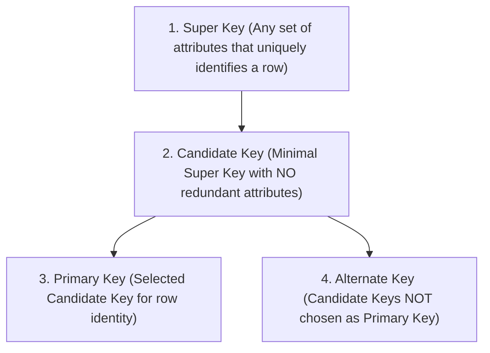
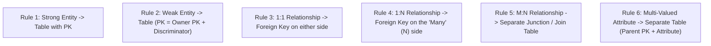

# 03 — Relational Model, Keys & ER-to-Relational Mapping

> **Topics Covered:** Relational Model Concepts | Relational Terminology | Keys in DBMS (Super, Candidate, Primary, Foreign, Alternate, Composite) | Integrity Constraints | Referential Integrity Actions | ER-to-Relational Mapping Rules

---

## 1. Relational Model Terminology

The **Relational Model** represents data as a collection of two-dimensional tables called **Relations**.

```text
Table: Students (Relation)
+------------+------------+-------+--------+
| Student_ID | Name       | Age   | Branch |  <- Attributes / Columns (Degree = 4)
+------------+------------+-------+--------+
| 101        | Alice      | 20    | CSE    |  <- Tuple / Row / Record
| 102        | Bob        | 21    | ECE    |
| 103        | Charlie    | 20    | CSE    |
+------------+------------+-------+--------+
(Cardinality = 3 rows)
```

| Relational Term | Formal Definition | Database / SQL Equivalent |
|---|---|---|
| **Relation** | A 2D table containing rows and columns. | Table |
| **Tuple** | A single row representing a specific record instance. | Row / Record |
| **Attribute** | A named column representing a property of the relation. | Column / Field |
| **Domain** | The set of permissible, atomic values for an attribute. | Data Type + Range (`INT > 0`) |
| **Degree** | **Total number of attributes (columns)** in a relation. | Column Count |
| **Cardinality** | **Total number of tuples (rows)** in a relation. | Row Count |

---

## 2. Keys in DBMS (Mathematical Hierarchy & Definitions)



### 1. Super Key
- Any set of one or more attributes that **uniquely identifies a tuple** within a relation.
- A relation can have dozens of super keys.
- *Example*: `{Student_ID}`, `{Student_ID, Name}`, `{Student_ID, Email, Age}` are all super keys.

### 2. Candidate Key
- A **Minimal Super Key** (a super key from which no attribute can be removed without losing the uniqueness property).
- Must have **NO redundant attributes**.
- A table can have multiple Candidate Keys.
- *Example*: `{Student_ID}` and `{Email}` are both Candidate Keys.

### 3. Primary Key (PK)
- The **single Candidate Key chosen by the database designer** to uniquely identify tuples in the table.
- **Rules**: Must be **UNIQUE** and **CANNOT be NULL**.

### 4. Alternate Key (Secondary Key)
- Candidate Keys that were **not chosen** as the Primary Key.
- *Formula*: $\text{Alternate Keys} = \text{Candidate Keys} - \text{Primary Key}$.

### 5. Composite Key
- A Primary Key or Candidate Key composed of **two or more attributes combined**.
- *Example*: In an enrollment table, `(student_id, course_id)` forms a composite primary key.

### 6. Foreign Key (FK)
- An attribute (or set of attributes) in one table that references the **Primary Key (or Candidate Key)** of another table (or the same table in recursive relations).
- Enforces **Referential Integrity**.

---

## 3. Relational Integrity Constraints

| Constraint | Rule Enforced | Example Violation |
|---|---|---|
| **Domain Integrity** | Every attribute value must belong to its valid atomic domain. | Inserting `"abc"` into an `INT` column. |
| **Entity Integrity** | **Primary Key attributes cannot be `NULL`** and must be unique. | Inserting `NULL` into `student_id`. |
| **Referential Integrity** | A Foreign Key value must **either match an existing Primary Key in the referenced table OR be `NULL`**. | Inserting an `Order` with `customer_id = 999` when Customer #999 does not exist. |
| **Key Constraint** | Values of Candidate / Primary keys must be unique across all rows. | Two students having the same `email`. |

---

## 4. Referential Integrity Actions (`ON DELETE` / `ON UPDATE`)

When a parent row in a referenced table is deleted or updated:

```sql
CREATE TABLE orders (
    order_id INT PRIMARY KEY,
    customer_id INT,
    FOREIGN KEY (customer_id) REFERENCES customers(customer_id)
    ON DELETE CASCADE
    ON UPDATE CASCADE
);
```

| Clause | Action Taken when Parent Record is Deleted |
|---|---|
| **`ON DELETE CASCADE`** | Automatically **deletes all child records** referencing the deleted parent. |
| **`ON DELETE SET NULL`** | Sets foreign key column in all child records to **`NULL`**. |
| **`ON DELETE RESTRICT` / `NO ACTION`** | **Rejects the delete operation** with an error if dependent child records exist. |
| **`ON DELETE SET DEFAULT`** | Sets foreign key column to a specified default value. |

---

## 5. ER-to-Relational Mapping Algorithm (Step-by-Step Rules)

Converting conceptual ER diagrams into production SQL tables follows 6 strict transformation rules:



---

### Rule 1: Strong Entity Sets
- Create a table for the entity.
- All simple attributes become columns.
- For composite attributes (e.g., `address`), flatten into sub-parts (`street, city, zip`).

```sql
CREATE TABLE employees (
    emp_id INT PRIMARY KEY,
    first_name VARCHAR(50),
    last_name VARCHAR(50),
    salary DECIMAL(10, 2)
);
```

---

### Rule 2: Weak Entity Sets
- Create a table for the weak entity.
- Include all simple attributes + the **Primary Key of the Owner Entity as a Foreign Key**.
- Primary Key = `(Owner_PK + Partial_Key)`.

```sql
CREATE TABLE dependents (
    emp_id INT,
    dep_name VARCHAR(50),
    relationship VARCHAR(30),
    PRIMARY KEY (emp_id, dep_name),
    FOREIGN KEY (emp_id) REFERENCES employees(emp_id) ON DELETE CASCADE
);
```

---

### Rule 3: 1:1 Relationships
- Place the Primary Key of one table as a **Foreign Key (with a `UNIQUE` constraint)** in the other table.
- *Best practice*: Place the FK in the entity with **Total Participation** to prevent `NULL` values.

```sql
CREATE TABLE passports (
    passport_id VARCHAR(20) PRIMARY KEY,
    issue_date DATE,
    person_id INT UNIQUE NOT NULL, -- FK with UNIQUE constraint
    FOREIGN KEY (person_id) REFERENCES persons(person_id)
);
```

---

### Rule 4: 1:N (One-to-Many) Relationships
- Place the Primary Key of the **'One' side** as a **Foreign Key in the 'Many' side table**.

```sql
-- 'Department' is One, 'Employee' is Many:
CREATE TABLE employees (
    emp_id INT PRIMARY KEY,
    name VARCHAR(50),
    dept_id INT, -- FK pointing to department
    FOREIGN KEY (dept_id) REFERENCES departments(dept_id)
);
```

---

### Rule 5: M:N (Many-to-Many) Relationships
- Create a **New Junction / Join Table (Relationship Table)**.
- Include Primary Keys of both participating entities as Foreign Keys.
- Composite Primary Key = `(EntityA_PK, EntityB_PK)`.

```sql
-- Students enroll in Courses (M:N):
CREATE TABLE enrollments (
    student_id INT,
    course_id INT,
    enrollment_date DATE,
    grade VARCHAR(2),
    PRIMARY KEY (student_id, course_id),
    FOREIGN KEY (student_id) REFERENCES students(student_id),
    FOREIGN KEY (course_id) REFERENCES courses(course_id)
);
```

---

### Rule 6: Multi-Valued Attributes
- Create a **New Table** containing the multi-valued attribute + the Primary Key of the parent entity as a Foreign Key.
- Primary Key = `(Parent_PK, Attribute_Value)`.

```sql
-- Employee has multiple phone numbers:
CREATE TABLE employee_phones (
    emp_id INT,
    phone_number VARCHAR(15),
    PRIMARY KEY (emp_id, phone_number),
    FOREIGN KEY (emp_id) REFERENCES employees(emp_id) ON DELETE CASCADE
);
```

---

## 6. Summary of Minimum Tables Required

| ER Construct | Mapping Result | Minimum Tables Created |
|---|---|---|
| **Strong Entity** | Table with attributes | 1 Table |
| **Weak Entity** | Table with Composite PK | 1 Table |
| **1:1 Relationship** | Add FK to one table | **0 New Tables** (Merged or FK added) |
| **1:N Relationship** | Add FK to 'Many' side | **0 New Tables** |
| **M:N Relationship** | **New Junction Table** | **1 New Table** |
| **Multi-Valued Attribute** | **New Child Table** | **1 New Table** |
