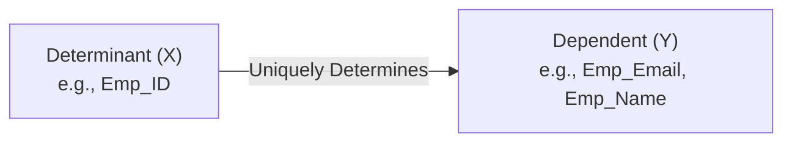
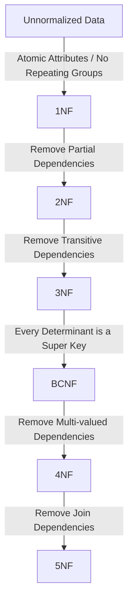
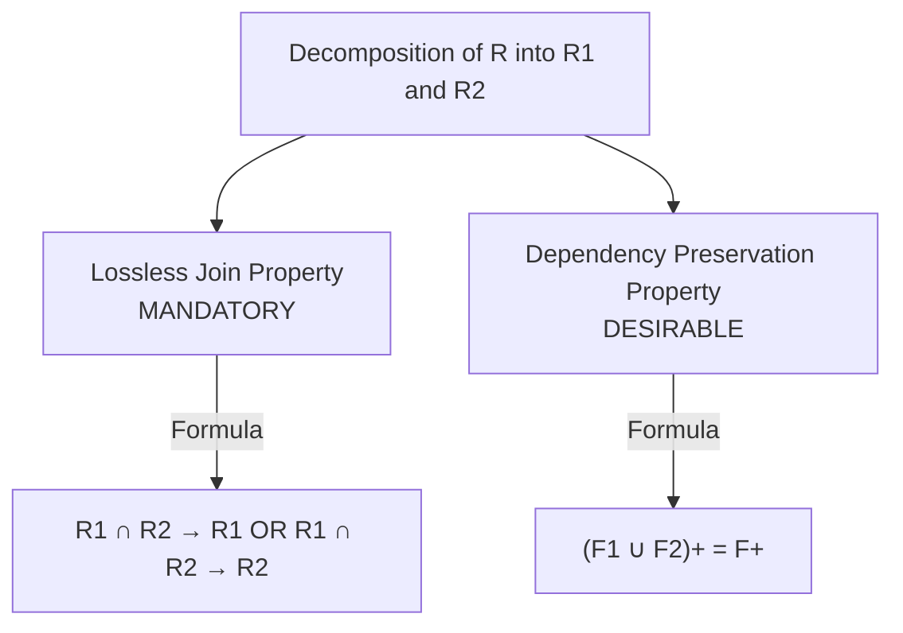
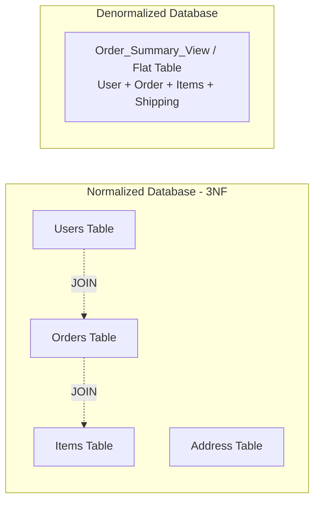

# 04. Normalization and Functional Dependencies

---

## 1. Why Normalization? (Modification Anomalies)

**Normalization** is the systematic database design technique of organizing attributes and relations to **minimize data redundancy** and eliminate undesirable **data modification anomalies** without losing information.

Without normalization, a poorly designed relational table storing multiple distinct entities into a single flat structure suffers from three critical anomalies:

```
+--------+------------+------------+---------+-------------+------------------+
| Emp_ID | Emp_Name   | Dept_Name  | Dept_HOD| Project_ID  | Project_Budget   |
+--------+------------+------------+---------+-------------+------------------+
| E101   | Alice      | Engineering| Dr. Roy | P-99        | $50,000          |
| E101   | Alice      | Engineering| Dr. Roy | P-88        | $80,000          |
| E102   | Bob        | HR         | Dr. Sen | P-99        | $50,000          |
| E103   | Charlie    | Engineering| Dr. Roy | P-99        | $50,000          |
+--------+------------+------------+---------+-------------+------------------+
```

### The Three Modification Anomalies

| Anomaly | Problem Description | Concrete Example from Table Above |
| :--- | :--- | :--- |
| **Insertion Anomaly** | Cannot insert information about an entity without artificially inserting unrelated data of another entity. | If a new department **"Finance"** is created with HOD **"Dr. Das"**, we **cannot** insert it into the database until at least one employee and project is assigned to it (assuming `Emp_ID` + `Project_ID` is the Composite PK). Inserting with `NULL` PK violates Entity Integrity. |
| **Deletion Anomaly** | Deleting one piece of data unintentionally removes completely independent critical information. | If Bob leaves the company and we delete record `E102`, we lose the entire record of the **HR Department** and its HOD **Dr. Sen** because Bob was the only employee in HR. |
| **Update / Modification Anomaly** | Updating a piece of duplicated information requires updating multiple rows; missing any row causes data inconsistency. | If Engineering changes its HOD from **"Dr. Roy"** to **"Dr. Ray"**, we must update 3 rows. If one update fails or is missed, queries will return conflicting HOD names for the same department. |

---

## 2. Functional Dependencies (FD)

A **Functional Dependency (FD)** is a constraint between two sets of attributes in a relation.

Given relation $R$, attribute set $Y$ is functionally dependent on attribute set $X$ (denoted as **$X \to Y$**, read as *"X determines Y"* or *"Y is functionally dependent on X"*) if and only if:
$$\forall t_1, t_2 \in R, \quad \text{if } t_1[X] = t_2[X] \implies t_1[Y] = t_2[Y]$$

In words: **Whenever two tuples have the same value for $X$, they MUST have the same value for $Y$.**
- $X$ is called the **Determinant**.
- $Y$ is called the **Dependent**.



---

### Types of Functional Dependencies

```
Functional Dependencies
 ├── Trivial FD (Y ⊆ X)
 ├── Non-Trivial FD (Y ⊄ X) / Completely Non-Trivial (X ∩ Y = ∅)
 ├── Full Functional Dependency (Y depends on whole X, not any proper subset)
 ├── Partial Functional Dependency (Y depends on a proper subset of Candidate Key)
 └── Transitive Functional Dependency (X → Y and Y → Z where Y is non-prime and Y ↛ X)
```

#### 1. Trivial vs Non-Trivial FD
* **Trivial FD:** $X \to Y$ where $Y \subseteq X$. (Always holds automatically).
  * Example: $\{Emp\_ID, Emp\_Name\} \to Emp\_ID$.
* **Non-Trivial FD:** $X \to Y$ where $Y \not\subseteq X$.
  * Example: $Emp\_ID \to Emp\_Name$.
* **Completely Non-Trivial FD:** $X \to Y$ where $X \cap Y = \emptyset$.
  * Example: $Emp\_ID \to \{Emp\_Email, Salary\}$.

#### 2. Full vs Partial Functional Dependency
* Let $K$ be a Candidate Key composed of composite attributes $\{A, B\}$.
* **Full Functional Dependency:** $K \to Y$ holds, and for **no** proper subset $S \subset K$ does $S \to Y$ hold.
  * Example: $\{Roll\_No, Course\_ID\} \to Grade$ (Grade depends on both student and course together).
* **Partial Functional Dependency:** A non-prime attribute $Y$ depends on a **proper subset** of a composite candidate key.
  * Example: $\{Roll\_No, Course\_ID\} \to Student\_Name$ (Since $Roll\_No \to Student\_Name$, $Student\_Name$ partially depends on the key).

#### 3. Transitive Functional Dependency
* An FD $X \to Z$ is transitive if there exists an attribute set $Y$ such that:
  1. $X \to Y$
  2. $Y \to Z$
  3. $Y \not\to X$ (Y does not functionally determine X)
  4. $Z$ is a non-prime attribute not part of candidate key.
* Example: $Emp\_ID \to Dept\_ID$ and $Dept\_ID \to Dept\_Name \implies Emp\_ID \to Dept\_Name$.

---

## 3. Armstrong's Axioms & Inference Rules

Armstrong's Axioms are a set of sound and complete inference rules used to derive all functional dependencies implied by a given set of FDs $F$.

### Primary Axioms (Sound & Complete)
1. **Reflexivity Rule:** If $Y \subseteq X$, then $X \to Y$.
   * *Example:* $\{Emp\_ID, Name\} \to Name$.
2. **Augmentation Rule:** If $X \to Y$, then $XZ \to YZ$ for any set of attributes $Z$.
   * *Example:* If $Emp\_ID \to Salary$, then $\{Emp\_ID, Dept\} \to \{Salary, Dept\}$.
3. **Transitivity Rule:** If $X \to Y$ and $Y \to Z$, then $X \to Z$.
   * *Example:* If $Emp\_ID \to Dept\_ID$ and $Dept\_ID \to HOD$, then $Emp\_ID \to HOD$.

### Secondary Derived Rules
4. **Union / Additive Rule:** If $X \to Y$ and $X \to Z$, then $X \to YZ$.
5. **Decomposition / Projective Rule:** If $X \to YZ$, then $X \to Y$ and $X \to Z$.
6. **Pseudo-Transitivity Rule:** If $X \to Y$ and $WY \to Z$, then $WX \to Z$.
7. **Composition Rule:** If $X \to Y$ and $W \to Z$, then $XW \to YZ$.

> [!WARNING]
> **Common Trap:** Decomposition applies ONLY on the right-hand side (dependent), NEVER on the left-hand side (determinant).
> - If $A \to BC \implies A \to B$ and $A \to C$ **(VALID)**.
> - If $AB \to C \not\implies A \to C$ and $B \to C$ **(INVALID)**.

---

## 4. Attribute Closure Algorithm & Finding Candidate Keys

### Attribute Closure ($X^+$)
The **Attribute Closure** of a set of attributes $X$ under an FD set $F$, denoted as $X^+$, is the set of all attributes functionally determined by $X$ using the FDs in $F$.

#### Closure Algorithm:
```text
Algorithm Compute_Closure(X, F):
1. Closure = X
2. Repeat until Closure does not change:
     For each FD (Y -> Z) in F:
       If Y ⊆ Closure:
         Closure = Closure ∪ Z
3. Return Closure
```

---

### Step-by-Step Example: Finding Candidate Keys

Given Relation $R(A, B, C, D, E, F)$ and FD set $F$:
1. $A \to BC$
2. $C \to DE$
3. $E \to F$
4. $F \to A$

#### Step 1: Categorize Attributes
- Attributes appearing **ONLY on Left (L)**: None.
- Attributes appearing **ONLY on Right (R)**: $B, D$. (These can NEVER be part of any minimal candidate key).
- Attributes appearing on **Both Sides (LR)**: $A, C, E, F$.
- Attributes appearing on **Neither Side (N)**: None.

#### Step 2: Compute Closures of LR attributes
- $A^+ = \{A\} \to \{A, B, C\} \to \{A, B, C, D, E\} \to \{A, B, C, D, E, F\} = R \implies \mathbf{A}$ **is a Candidate Key!**
- $C^+ = \{C\} \to \{C, D, E\} \to \{C, D, E, F\} \to \{A, C, D, E, F\} \to \{A, B, C, D, E, F\} = R \implies \mathbf{C}$ **is a Candidate Key!**
- $E^+ = \{E\} \to \{E, F\} \to \{A, E, F\} \to \{A, B, C, E, F\} \to \{A, B, C, D, E, F\} = R \implies \mathbf{E}$ **is a Candidate Key!**
- $F^+ = \{F\} \to \{A, F\} \to \{A, B, C, F\} \to \{A, B, C, D, E, F\} = R \implies \mathbf{F}$ **is a Candidate Key!**

#### Result:
- **Candidate Keys:** $\{A\}, \{C\}, \{E\}, \{F\}$.
- **Prime Attributes** (part of any candidate key): $\{A, C, E, F\}$.
- **Non-Prime Attributes:** $\{B, D\}$.

---

## 5. The Normal Forms: 1NF to BCNF



### Summary Comparison Table of Normal Forms

| Normal Form | Required Base Condition | Additional Strict Condition to Satisfy | Prevents Which Anomaly? |
| :--- | :--- | :--- | :--- |
| **1NF** | Relational Table | All attribute values must be **atomic** (single-valued); no composite or multivalued attributes. | Multivalued storage issues |
| **2NF** | In **1NF** | **No Partial Dependencies**: Every non-prime attribute must be fully functionally dependent on every candidate key. | Partial-key update/insert anomalies |
| **3NF** | In **2NF** | **No Transitive Dependencies**: For every non-trivial FD $X \to Y$, either **$X$ is a Super Key** OR **$Y$ is a Prime Attribute**. | Transitive anomalies |
| **BCNF** | In **3NF** | For every non-trivial FD $X \to Y$, **$X$ MUST be a Super Key**. | Anomalies caused by overlapping candidate keys |

---

### 1. First Normal Form (1NF)

**Definition:** A relation $R$ is in 1NF if and only if all underlying domains contain only **atomic (indivisible) values**, and there are no repeating groups or arrays.

#### Violation Example:
```
+---------+------------+------------------------+
| Student | City       | Phone_Numbers          |
+---------+------------+------------------------+
| Alex    | Mumbai     | 9820012345, 9820067890 |  <-- Non-atomic (Multivalued)
| Brenda  | Bangalore  | 9845011111             |
+---------+------------+------------------------+
```

#### Conversion to 1NF:
Split multivalued cells so that each cell holds exactly one atomic scalar value:
```
+---------+------------+---------------+
| Student | City       | Phone_Number  |
+---------+------------+---------------+
| Alex    | Mumbai     | 9820012345    |
| Alex    | Mumbai     | 9820067890    |
| Brenda  | Bangalore  | 9845011111    |
+---------+------------+---------------+
```

---

### 2. Second Normal Form (2NF)

**Definition:** A relation is in 2NF if:
1. It is in **1NF**.
2. **No Partial Dependency exists:** No non-prime attribute is functionally dependent on a *proper subset* of any candidate key.

> [!NOTE]
> If a relation in 1NF has **only single-attribute candidate keys** (no composite candidate keys), it is **automatically in 2NF**.

#### Violation Example:
Relation: $R(Student\_ID, Course\_ID, Course\_Fee, Grade)$
- Candidate Key: $\{Student\_ID, Course\_ID\}$
- Prime Attributes: $\{Student\_ID, Course\_ID\}$
- Non-Prime Attributes: $\{Course\_Fee, Grade\}$
- FDs:
  1. $\{Student\_ID, Course\_ID\} \to Grade$ (Full dependency — OK)
  2. $Course\_ID \to Course\_Fee$ (Partial dependency! $Course\_Fee$ depends only on part of PK).

#### Conversion to 2NF:
Decompose into two relations:
1. $R_1(\underline{Student\_ID, Course\_ID}, Grade)$ — Candidate Key: $\{Student\_ID, Course\_ID\}$
2. $R_2(\underline{Course\_ID}, Course\_Fee)$ — Candidate Key: $\{Course\_ID\}$

---

### 3. Third Normal Form (3NF)

**Definition:** A relation is in 3NF if:
1. It is in **2NF**.
2. For every non-trivial FD $X \to Y$, at least one of the following holds:
   - **$X$ is a Super Key** (LHS is super key), OR
   - **$Y$ is a Prime Attribute** (RHS is part of some candidate key).

#### Violation Example:
Relation: $R(Emp\_ID, Emp\_Name, Dept\_ID, Dept\_Name, Dept\_HOD)$
- Candidate Key: $\{Emp\_ID\}$
- Prime Attributes: $\{Emp\_ID\}$
- Non-Prime Attributes: $\{Emp\_Name, Dept\_ID, Dept\_Name, Dept\_HOD\}$
- FDs:
  1. $Emp\_ID \to \{Emp\_Name, Dept\_ID\}$ (Emp_ID is Super Key — OK)
  2. $Dept\_ID \to \{Dept\_Name, Dept\_HOD\}$ (Violation! Dept_ID is NOT a Super Key, and $\{Dept\_Name, Dept\_HOD\}$ are NOT Prime Attributes).

#### Conversion to 3NF:
Decompose into two relations:
1. $Employee(\underline{Emp\_ID}, Emp\_Name, Dept\_ID)$ — ($Dept\_ID$ is FK)
2. $Department(\underline{Dept\_ID}, Dept\_Name, Dept\_HOD)$

---

### 4. Boyce-Codd Normal Form (BCNF)

**Definition:** A relation is in BCNF (also called 3.5NF) if:
- For every non-trivial FD $X \to Y$, **$X$ MUST be a Super Key**.

> [!IMPORTANT]
> **Difference Between 3NF and BCNF:**
> 3NF allows $X \to Y$ if $Y$ is a prime attribute even when $X$ is not a super key. BCNF strictly forbids this — the determinant $X$ must be a super key regardless of whether $Y$ is prime or non-prime.

#### Classic BCNF Violation Example:
Consider student advisory system: $R(Student, Subject, Teacher)$
- **Rules:**
  1. For each subject, a student is assigned to one teacher: $\{Student, Subject\} \to Teacher$.
  2. A teacher teaches only one subject: $Teacher \to Subject$.
  3. A subject can be taught by multiple teachers.

```
Candidate Keys: {Student, Subject} and {Student, Teacher}
Prime Attributes: {Student, Subject, Teacher} (ALL attributes are prime!)
Non-Prime Attributes: None
```

- **Check 3NF:**
  - $\{Student, Subject\} \to Teacher$: LHS is candidate key $\implies$ OK.
  - $Teacher \to Subject$: LHS is NOT a key, but RHS ($Subject$) is a prime attribute $\implies$ **Satisfies 3NF!**
- **Check BCNF:**
  - $Teacher \to Subject$: LHS ($Teacher$) is NOT a super key $\implies$ **Violates BCNF!**

#### Anomaly in 3NF table:
If teacher "Prof. Smith" teaches "Physics", but no student has enrolled yet, we cannot store `(NULL, Physics, Prof. Smith)` without violating PK constraint on $Student$.

#### Conversion to BCNF:
Decompose into:
1. $R_1(\underline{Teacher}, Subject)$ with FD $Teacher \to Subject$
2. $R_2(\underline{Student, Teacher})$

---

## 6. Decomposition Properties

When decomposing relation $R$ into sub-relations $R_1, R_2, \dots, R_k$, the decomposition must satisfy two formal properties:



### 1. Lossless-Join Decomposition (Non-Lossy)
A decomposition of $R$ into $R_1$ and $R_2$ is **Lossless** if:
$$R_1 \bowtie R_2 = R$$
If joining produces **spurious (false/phantom) tuples** ($R_1 \bowtie R_2 \supset R$), the decomposition is **Lossy**.

#### Condition for Lossless Join:
For a binary decomposition $(R_1, R_2)$, it is lossless if and only if the common attributes $(R_1 \cap R_2)$ form a super key for at least one of the relations:
$$(R_1 \cap R_2) \to R_1 \quad \text{OR} \quad (R_1 \cap R_2) \to R_2$$

---

### 2. Dependency Preservation
A decomposition is **Dependency Preserving** if all original functional dependencies in $F$ can be verified directly on individual decomposed tables without computing an expensive join across tables:
$$(F_1 \cup F_2 \cup \dots \cup F_k)^+ = F^+$$

| Property | 3NF | BCNF |
| :--- | :--- | :--- |
| **Lossless Join Guarantee** | Always achievable | Always achievable |
| **Dependency Preservation Guarantee** | **Always achievable** | **NOT always achievable** (Sometimes we must choose between BCNF and preserving FDs) |

> [!TIP]
> In real-world enterprise architectures (like Infosys enterprise banking applications), **3NF is frequently chosen over BCNF** because preserving business functional dependencies without costly multi-table joins on every write is more critical than eliminating the rare anomalies prevented by BCNF.

---

## 7. Denormalization & Real-World Trade-Offs

**Denormalization** is the intentional database optimization strategy of introducing controlled redundancy by combining normalized tables to improve read performance at the cost of write performance and extra storage.

### Normalization vs Denormalization



| Dimension | Normalized Design (3NF / BCNF) | Denormalized Design |
| :--- | :--- | :--- |
| **Primary Goal** | Minimize redundancy & eliminate modification anomalies | Maximize read query performance & reduce JOIN overhead |
| **Workload Suitability** | **OLTP (Online Transaction Processing)**: High write/update frequency (e.g., Core Banking, E-Commerce checkout) | **OLAP (Online Analytical Processing)** / Read-heavy Data Warehouses, Dashboards, Reporting |
| **Read Performance** | Slower for complex queries (Requires multi-table `JOIN` operations) | Extremely fast (Single table scan, pre-aggregated data) |
| **Write Performance** | Fast (Single point of update per fact) | Slower (Must update duplicated data in multiple records) |
| **Storage Overhead** | Minimal | Higher disk footprint due to duplicate columns |
| **Data Consistency** | Guaranteed at database engine level via constraints | Requires application-level locks, triggers, or batch pipelines |

---

## 8. Infosys SP L3 Interview Questions & Answers

### Q1: What is the exact mathematical difference between 3NF and BCNF?
**Answer:**
Both require eliminating partial and transitive dependencies. For any non-trivial FD $X \to Y$:
- **3NF condition:** $X$ must be a Super Key **OR** $Y$ must be a Prime Attribute.
- **BCNF condition:** $X$ **MUST** be a Super Key unconditionally.

BCNF eliminates anomalies when a table has multiple overlapping composite candidate keys. Every BCNF table is in 3NF, but not every 3NF table is in BCNF.

---

### Q2: Why is BCNF decomposition not always preferred in production over 3NF?
**Answer:**
A decomposition into BCNF is guaranteed to be lossless, but it is **not guaranteed to preserve functional dependencies**. If an FD spans across decomposed tables in BCNF, enforcing that business rule requires performing an expensive `JOIN` on every `INSERT`/`UPDATE` operation. 3NF always guarantees both lossless join and dependency preservation, making 3NF the industry standard for OLTP systems.

---

### Q3: How do you determine if a decomposition is Lossless?
**Answer:**
For a relation $R$ decomposed into $R_1$ and $R_2$:
1. Calculate common attributes: $C = R_1 \cap R_2$.
2. Compute attribute closure $C^+$ using the FDs.
3. If $C^+$ contains all attributes of $R_1$ ($C \to R_1$) OR all attributes of $R_2$ ($C \to R_2$), the decomposition is **Lossless**. Otherwise, it is **Lossy**.

---

### Q4: When would you intentionally denormalize a database table in production?
**Answer:**
Denormalization is used when:
1. **High Read-to-Write Ratio (e.g., 99:1):** E.g., user profiles or product catalog pages where queries require joining 6–8 tables millions of times per second.
2. **Pre-computed Aggregations:** E.g., caching `total_order_amount` or `item_count` inside the `Orders` table instead of running `SUM(price)` on millions of `Order_Items` records.
3. **Data Warehousing & Star Schemas:** Fact tables and Dimension tables are denormalized for analytical OLAP workloads (e.g., Snowflake, BigQuery).
