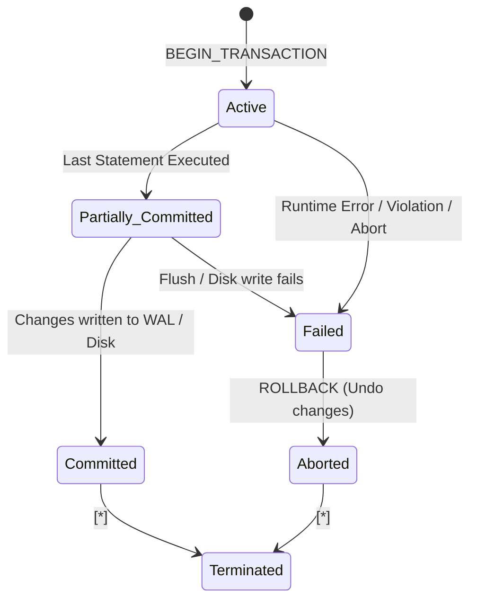
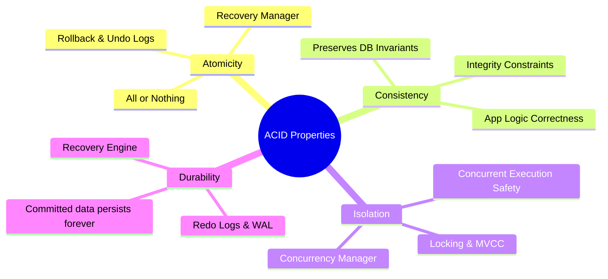
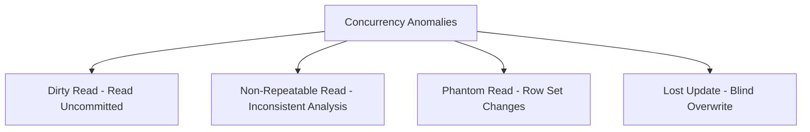
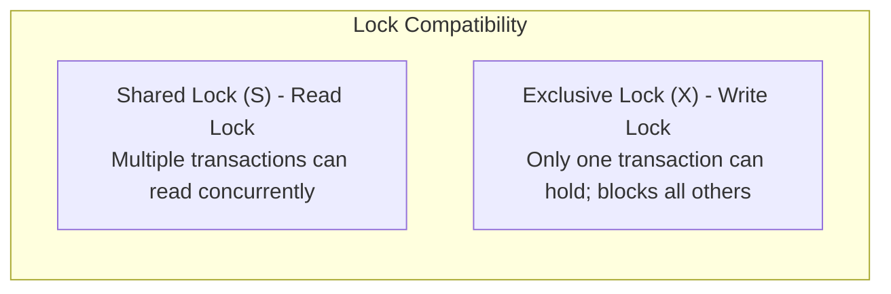
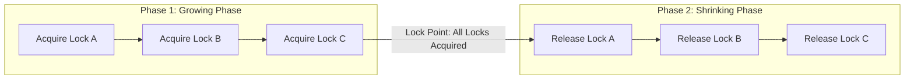
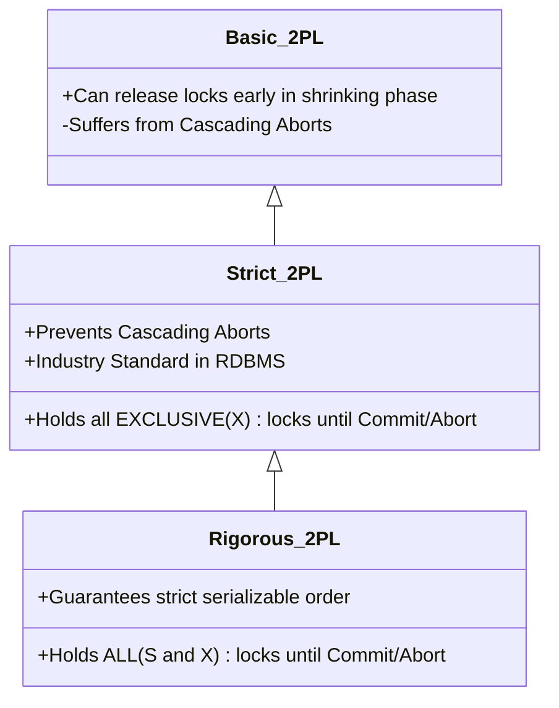
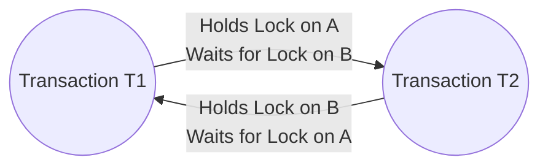

# 05. Transactions, ACID Properties, and Concurrency Control

---

## 1. What is a Transaction?

A **Transaction** is a logical unit of database processing that includes one or more database access operations (read, write, update, delete). 

A transaction must be executed as an atomic unit: either all of its operations are executed successfully to completion, or none of them are reflected in the database.

### Transaction State Transition Diagram



| State | Description |
| :--- | :--- |
| **Active** | The initial state; transaction stays here while executing read/write operations. |
| **Partially Committed** | The final read/write statement has executed, but changes are still in memory buffers and not permanently flushed to WAL/disk. |
| **Committed** | All changes have been permanently recorded in the database log (WAL) on non-volatile disk. |
| **Failed** | Normal execution cannot proceed due to system error, constraint violation, or hardware crash. |
| **Aborted** | The database has been restored to its consistent pre-transaction state via rollback (`UNDO` operations). |
| **Terminated** | The transaction has left the system cleanly (either committed or aborted). |

---

## 2. ACID Properties Deep Dive



### 1. Atomicity ("All or Nothing")
* **Concept:** A transaction is an indivisible unit of work. Either all operations succeed (`COMMIT`), or if any failure occurs, all changes made up to that point are rolled back (`ROLLBACK`).
* **Implementation Engine:** **Recovery Management Component** using **Undo Logs** (part of Write-Ahead Logging).
* **Failure Example:** Transferring \$500 from Account A to Account B. If Account A is debited and the server crashes before crediting Account B, atomicity ensures Account A is refunded on reboot.

---

### 2. Consistency ("Preservation of Invariants")
* **Concept:** Execution of a transaction must transition the database from one valid state to another valid state, satisfying all explicit integrity constraints (keys, foreign keys, check constraints) and implicit domain rules (e.g., account balance cannot be negative).
* **Implementation:** Shared responsibility between the **Database Engine** (enforces schema constraints, triggers, unique keys) and the **Application Developer** (ensures logical business correctness).

---

### 3. Isolation ("Execution in Solitude")
* **Concept:** Even though thousands of transactions execute concurrently, the intermediate uncommitted state of a transaction must remain invisible to other concurrent transactions. The net result must be equivalent to executing them serially.
* **Implementation Engine:** **Concurrency Control Manager** using **Pessimistic Locking (2PL)** or **Optimistic Concurrency Control (OCC / MVCC)**.

---

### 4. Durability ("Survivability of Commit")
* **Concept:** Once a transaction is successfully committed, its updates survive permanently in the database and will not be lost even if a system crash, power outage, or OS crash occurs immediately afterward.
* **Implementation Engine:** **Recovery Manager** using **Write-Ahead Logging (WAL)** and **Redo Logs** flushed to non-volatile storage (SSD/HDD) before returning success to the client.

---

## 3. Concurrency Anomalies (Read/Write Phenomena)

When multiple transactions execute concurrently without proper isolation, four major phenomena occur:



### 1. Dirty Read (Reading Uncommitted Data)
* **Scenario:** Transaction $T_1$ modifies a row without committing. Transaction $T_2$ reads this modified row. Then $T_1$ aborts and rolls back. $T_2$ has now operated on "dirty", non-existent data.

```
T1: BEGIN ─── UPDATE balance=800 ───────────────────────── ROLLBACK (balance reverts to 1000)
T2:                   └─── BEGIN ─── READ balance (sees 800) ─── Makes financial decision based on 800!
```

---

### 2. Non-Repeatable Read (Fuzzy Read)
* **Scenario:** Transaction $T_1$ reads a row. Transaction $T_2$ modifies or deletes that row and **commits**. Transaction $T_1$ reads the exact same row again and observes different values within the same transaction.

```
T1: BEGIN ─── READ balance (sees 1000) ────────────────────────── READ balance (sees 1500!)
T2:                   └─── BEGIN ─── UPDATE balance=1500 ─── COMMIT
```

---

### 3. Phantom Read
* **Scenario:** Transaction $T_1$ executes a range query (e.g., `SELECT * FROM Users WHERE age > 30`). Transaction $T_2$ **inserts** a new row matching that filter condition and **commits**. Transaction $T_1$ runs the same range query again and finds "phantom" new rows that were not present before.

```
T1: BEGIN ─── SELECT COUNT(*) WHERE age > 30 (returns 5) ──────── SELECT COUNT(*) WHERE age > 30 (returns 6!)
T2:                   └─── BEGIN ─── INSERT (age=35) ─── COMMIT
```

---

### 4. Lost Update
* **Scenario:** Transaction $T_1$ and $T_2$ read the same row with balance = \$100. $T_1$ adds \$50 (writes 150). $T_2$ subtracts \$20 (writes 80). If both write blindly without locks, $T_2$'s commit overwrites $T_1$'s update, losing \$50 permanently.

---

## 4. SQL Isolation Levels Matrix

ANSI/ISO SQL standard defines 4 standard isolation levels to balance concurrency performance vs consistency:

| Isolation Level | Dirty Read | Non-Repeatable Read | Phantom Read | Lost Update | Implementation Mechanism |
| :--- | :---: | :---: | :---: | :---: | :--- |
| **READ UNCOMMITTED** | ❌ **Permitted** | ❌ **Permitted** | ❌ **Permitted** | ❌ **Permitted** | No shared read locks; blind writes allowed. |
| **READ COMMITTED** *(Postgres & Oracle Default)* | ✅ **Prevented** | ❌ **Permitted** | ❌ **Permitted** | ✅ **Prevented** | Short-lived read locks (released immediately after statement) OR MVCC snapshot at statement level. |
| **REPEATABLE READ** *(MySQL InnoDB Default)* | ✅ **Prevented** | ✅ **Prevented** | ❌ **Permitted** *(Prevented in InnoDB via Gap Locks)* | ✅ **Prevented** | Shared read locks held until transaction ends OR MVCC snapshot fixed at transaction start. |
| **SERIALIZABLE** | ✅ **Prevented** | ✅ **Prevented** | ✅ **Prevented** | ✅ **Prevented** | Strict 2PL with Range/Predicate locks OR Serializable Snapshot Isolation (SSI). |

> [!IMPORTANT]
> **MySQL InnoDB Special Behavior:** MySQL's default isolation level is `REPEATABLE READ`, but unlike standard ANSI definitions, InnoDB **also prevents Phantom Reads** in `REPEATABLE READ` using **Next-Key Locking** (Index-record lock + Gap lock).

---

## 5. Lock-Based Concurrency Protocols

### 1. Lock Types & Compatibility Matrix



| Existing Lock / Requested Lock | **Shared (S)** | **Exclusive (X)** |
| :--- | :---: | :---: |
| **Shared (S)** | ✅ **Grant** | ❌ **Wait (Conflict)** |
| **Exclusive (X)** | ❌ **Wait (Conflict)** | ❌ **Wait (Conflict)** |

---

### 2. Two-Phase Locking (2PL)

A transaction is said to follow the **Two-Phase Locking (2PL)** protocol if all lock operations precede the first unlock operation.



* **Phase 1: Growing Phase (Acquisition):** A transaction may acquire locks, but cannot release any lock.
* **Lock Point:** The exact point in time when the transaction has acquired its final lock.
* **Phase 2: Shrinking Phase (Release):** A transaction may release locks, but cannot acquire any new locks.

> [!NOTE]
> **Guarantee:** Basic 2PL guarantees **Conflict Serializability**.
> **Limitation:** Basic 2PL does **NOT** prevent cascading rollbacks or deadlocks.

---

### 3. Variations of 2PL



* **Strict 2PL:** Holds all **Exclusive ($X$) locks** until the transaction commits or aborts. (Shared locks can be released in shrinking phase).
  * **Benefit:** Completely eliminates Cascading Rollbacks.
* **Rigorous 2PL:** Holds **both Shared ($S$) and Exclusive ($X$) locks** until commit/abort.
  * **Benefit:** Guarantees that transactions can be serialized in the order of their commit points.

---

## 6. Deadlock Handling in DBMS

A **Deadlock** occurs when two or more transactions are in a simultaneous wait state, each waiting for a lock held by the other.



---

### 1. Deadlock Detection (Wait-For Graph)
* The database constructs a directed **Wait-For Graph (WFG)** $G = (V, E)$ where vertices $V$ are transactions and edges $E$ represent waiting dependencies ($T_1 \to T_2$ means $T_1$ waits for $T_2$).
* **Detection Rule:** A deadlock exists if and only if the Wait-For Graph contains a **cycle**.
* **Resolution:** The DBMS picks a "victim" transaction based on cost/age, aborts it, and rolls back its changes to break the cycle.

---

### 2. Deadlock Prevention Schemes (Timestamp-Based)
Transactions are assigned unique timestamps $TS(T_i)$ when they begin (older transactions have smaller timestamps):

| Scheme | Type | Rule when Older $T_{old}$ requests lock held by Younger $T_{young}$ | Rule when Younger $T_{young}$ requests lock held by Older $T_{old}$ |
| :--- | :--- | :--- | :--- |
| **Wait-Die** | Non-preemptive | **$T_{old}$ is allowed to WAIT.** | **$T_{young}$ DIES (aborts & restarts with original timestamp).** |
| **Wound-Wait** | Preemptive | **$T_{old}$ WOUNDS (preempts/aborts) $T_{young}$ and takes the lock.** | **$T_{young}$ is allowed to WAIT.** |

---

## 7. Infosys SP L3 Interview Questions & Answers

### Q1: What is the difference between Strict 2PL and Rigorous 2PL?
**Answer:**
- **Strict 2PL** requires that all **Exclusive (X / Write) locks** be held until the transaction terminates (`COMMIT` or `ROLLBACK`), while Shared (S / Read) locks can be released during the shrinking phase. This prevents cascading aborts.
- **Rigorous 2PL** is stricter: it requires **both Shared and Exclusive locks** to be held until transaction completion. The serialization order of transactions matches their exact commit order.

---

### Q2: How does MVCC (Multi-Version Concurrency Control) eliminate read-write contention?
**Answer:**
Under MVCC (used in PostgreSQL, MySQL InnoDB, Oracle):
- **Readers do not block Writers, and Writers do not block Readers.**
- When a row is modified, rather than overwriting in-place with an exclusive lock, the database creates a new version of the row tagged with a transaction timestamp/ID (`xmin`/`xmax`).
- Readers see an immutable historical snapshot corresponding to their transaction start time without taking read locks.

---

### Q3: Why does MySQL InnoDB default to REPEATABLE READ instead of READ COMMITTED?
**Answer:**
Historically in early MySQL replication architectures, statement-based binary logging (`binlog_format = STATEMENT`) required `REPEATABLE READ` with Next-Key Locking to guarantee that transactions replayed on read-replicas produced the exact same deterministic state as the master. Modern systems with row-based replication often configure `READ COMMITTED` for lower lock contention and higher throughput.
