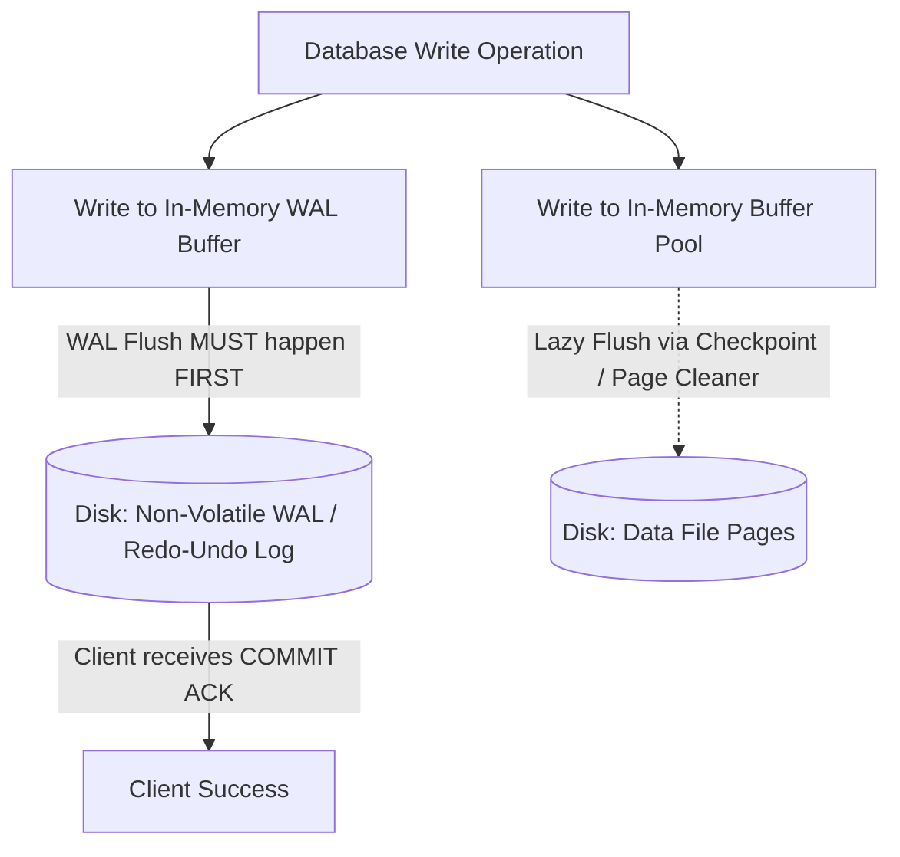
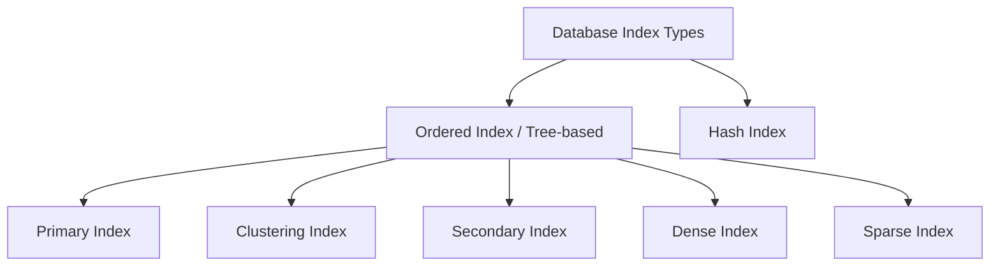
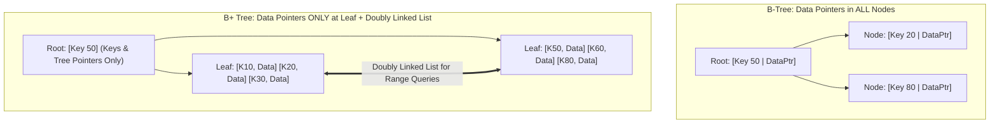

# 06. Atomicity, Crash Recovery, and Indexing

---

## 1. Atomicity Implementation & Crash Recovery (WAL)

To guarantee **Atomicity** and **Durability** in the presence of system crashes, power failures, and transaction aborts, modern DBMS engines employ **Write-Ahead Logging (WAL)**.



---

### The Write-Ahead Logging (WAL) Protocol

The WAL protocol mandates two fundamental rules:
1. **Rule 1 (Atomicity / Undo Rule):** Before an updated data page in memory is flushed to permanent disk, the corresponding **undo log record** must already be written to non-volatile log storage on disk. (Ensures uncommitted dirty data written to disk can be rolled back).
2. **Rule 2 (Durability / Redo Rule):** Before a transaction is reported as successfully **COMMITTED** to the client, all log records for that transaction (up to the `<T, COMMIT>` record) must be flushed to non-volatile disk. (Data pages themselves can be flushed later lazily).

---

### Anatomy of Log Records

Every database modification generates an append-only log record with:
- `<T_id, START>`: Transaction begins.
- `<T_id, X, old_value, new_value>`: Data item $X$ updated from `old_value` to `new_value`.
  - `old_value` is used for **UNDO** (Atomicity/Rollback).
  - `new_value` is used for **REDO** (Durability/Replay).
- `<T_id, COMMIT>`: Transaction successfully finished.
- `<T_id, ABORT>`: Transaction aborted and rolled back.

---

### Deferred Update vs Immediate Update

| Parameter | Deferred Update (No-Undo / Redo) | Immediate Update (Undo / Redo) |
| :--- | :--- | :--- |
| **When are disk data pages modified?** | Only **after** the transaction commits. | While the transaction is still **active** (in buffer pool). |
| **Crash Recovery Requirement** | Never needs **UNDO** (uncommitted changes never touch disk). Only needs **REDO** for committed transactions. | Needs **both UNDO** (for uncommitted transactions on crash) and **REDO** (for committed transactions not yet flushed). |
| **Concurrency & Buffer Memory** | Lower concurrency; requires holding all modified buffers in memory until commit. | Higher concurrency; standard approach used in enterprise DBMS (Postgres, Oracle, InnoDB). |

---

### Checkpointing

If a database system ran for months without maintenance, the WAL file would grow infinitely, and recovery after a crash would take days scanning from the beginning of time.

**Checkpointing** is a periodic maintenance process that syncs in-memory state to disk:
1. Flush all dirty data pages currently in memory buffer pool to disk.
2. Flush all in-memory WAL buffer records to disk.
3. Write a `<CHECKPOINT [List of active transactions]>` record to the log and flush it.

```
Log Timeline:
...─── [T1 Start] ─── [T2 Start] ─── [CHECKPOINT (Active: T2)] ─── [T3 Start] ─── [CRASH!]
                                            ▲
                Recovery only needs to scan back to this Checkpoint!
```

#### ARIES Recovery Algorithm (3 Phases upon Restart):
1. **Analysis Phase:** Scan WAL forward from the last checkpoint to identify all dirty pages and transactions that were active at the moment of crash.
2. **Redo Phase:** Replay history forward from the earliest unwritten log point to restore the database to the exact state it was in right before crash.
3. **Undo Phase:** Scan backward and rollback (undo) all transactions that were active (uncommitted) at the time of crash.

---

## 2. Indexing Fundamentals

An **Index** is an auxiliary persistent data structure (typically a B+ Tree or Hash Table) that enables the database engine to locate specific records in $O(\log N)$ or $O(1)$ disk I/O operations without scanning every block of the entire table ($O(N)$ Full Table Scan).

```
Full Table Scan (No Index):
Query: SELECT * FROM Employees WHERE Emp_ID = 84920
Disk: Reads ALL 100,000 disk blocks sequentially ──> 100,000 Disk I/Os (~10 seconds)

With B+ Tree Index on Emp_ID:
Disk: Root Block ──> Internal Node Block ──> Leaf Node Block (3-4 I/Os, ~5 milliseconds)
```

---

## 3. Classification of Indexes



### 1. Dense Index vs Sparse Index

```
Dense Index (Entry for EVERY search key):
Index: [10 -> Block 1, Rec 1] [20 -> Block 1, Rec 2] [30 -> Block 2, Rec 1] [40 -> Block 2, Rec 2]
Data:  [10, Alice] [20, Bob]  [30, Charlie] [40, Dave]

Sparse Index (Entry for FIRST key in each Block):
Index: [10 -> Block 1]  [30 -> Block 2]  [50 -> Block 3]
Data:  Block 1: [10, Alice], [20, Bob] | Block 2: [30, Charlie], [40, Dave]
```

| Dimension | Dense Index | Sparse Index |
| :--- | :--- | :--- |
| **Entries** | Contains an index entry for **every single search-key value** in the data file. | Contains an index entry only for some search-key values (usually **one per disk block**). |
| **Storage Size** | Large memory and disk footprint. | Significantly smaller memory/disk footprint. |
| **Lookup Speed** | Faster for direct key matches. | Slightly slower (must scan within the identified block). |
| **Prerequisite** | Can be built on ordered or unordered files. | **Data file MUST be physically sorted** on the search key. |

---

### 2. Primary vs Clustering vs Secondary Index

| Index Type | Data File Ordered On? | Key or Non-Key Attribute? | Dense or Sparse? | Max Indexes Allowed Per Table |
| :--- | :--- | :--- | :--- | :---: |
| **Primary Index** | **Ordered** on Primary Key | **Candidate / Primary Key** (Unique) | Usually **Sparse** | **1** |
| **Clustering Index** | **Ordered** on Non-Key attribute (e.g., `Dept_ID`) | **Non-Key** (Duplicate values permitted) | Usually **Sparse** (1 entry per unique cluster value) | **1** |
| **Secondary Index** | **Unordered** OR ordered on a different key | Key or Non-Key | **Must be Dense** | **Multiple (N)** |

---

## 4. B-Trees vs B+ Trees (Why B+ Trees Rule Databases)



### In-Depth Comparison Table

| Feature | B-Tree | B+ Tree (Industry Standard) |
| :--- | :--- | :--- |
| **Data Record Pointers** | Stored in **both internal nodes and leaf nodes**. | Stored **EXCLUSIVELY in leaf nodes**. Internal nodes store only navigation search keys and child page pointers. |
| **Fan-out & Tree Height** | Low fan-out per page (because data pointers consume space) $\implies$ **Taller tree height** ($4-6$ levels). | **High fan-out** (hundreds of keys per $16\text{ KB}$ page) $\implies$ **Shallow tree height** ($3-4$ levels for billions of records). |
| **Range Queries (`BETWEEN / > / <`)** | **Extremely slow:** Requires expensive recursive tree traversals (in-order tree walks) back and forth across levels. | **Extremely fast:** O(log N) lookup to find start leaf, then simply traverses the **doubly linked list of leaf pages**. |
| **Leaf Node Chaining** | Leaf nodes are isolated. | All leaf nodes are linked via a **bidirectional doubly linked list**. |
| **Lookup Consistency** | Variable lookup time (finding key in root is $O(1)$, leaf is $O(\log N)$). | **Predictable and uniform $O(\log N)$ lookup time** (every search reaches leaf level). |
| **Deletion Overhead** | Complex; deleting from internal node requires tree reorganization. | Simpler; deletions always occur at the leaf level. |

---

## 5. Clustered vs Non-Clustered Indexes (MySQL InnoDB Architecture)

```mermaid
graph TB
    subgraph Clustered_Index [Clustered Index - Primary Key: ID]
        CIRoot[Root Node: ID] --> CILeaf[Leaf Nodes: Contain ACTUAL ROW DATA [ID, Name, Age, Salary]]
    end
    subgraph Secondary_Index [Secondary Index - Index on Email]
        SIRoot[Root Node: Email] --> SILeaf[Leaf Nodes: Contain [Email, Primary Key ID]]
    end
    SILeaf -.->|Double Lookup / Bookmark Lookup| CIRoot
```

### 1. Clustered Index (Index-Organized Table)
* In engines like MySQL InnoDB, the table **is** the clustered index.
* Leaf nodes of the clustered index contain the **actual full data rows** (columns).
* There can be **only one** clustered index per table because data rows can be physically sorted in only one order on disk.
* By default, MySQL InnoDB uses the **`PRIMARY KEY`** as the clustered index. If no PK exists, InnoDB uses the first `UNIQUE NOT NULL` column, or generates a hidden 6-byte row ID (`DB_ROW_ID`).

---

### 2. Secondary (Non-Clustered) Index
* Secondary index leaf nodes do **not** store row pointers/physical disk addresses; they store the **Primary Key value**.
* **Query Execution (Bookmark Lookup):**
  1. `SELECT * FROM Users WHERE email = 'alice@example.com';`
  2. Traverses the Secondary Index on `email` to find leaf node $\implies$ retrieves `ID = 101`.
  3. Traverses the Clustered Index on `ID` with value `101` $\implies$ retrieves complete row data (`Name`, `Age`, `Salary`, etc.).

> [!TIP]
> **Covering Index Optimization:**
> If a query only requests columns already present in the secondary index (e.g., `SELECT id, email FROM Users WHERE email = '...'`), the DBMS performs an **Index-Only Scan** and skips traversing the clustered index entirely.

---

## 6. Hash Indexes

* **Structure:** In-memory array of buckets using a hash function $h(k) \to \text{Bucket ID}$.
* **Time Complexity:** Average $O(1)$ point lookup.
* **Limitations:**
  1. **Zero Range Query Support:** Hashing destroys natural ordering. `WHERE salary > 50000` requires a full table scan.
  2. **No Sorting / Partial Key Search:** Cannot optimize `ORDER BY` or `WHERE prefix_key LIKE 'abc%'`.

---

## 7. Infosys SP L3 Interview Questions & Answers

### Q1: Why are B+ Trees preferred over B-Trees and Binary Search Trees in Database Engines?
**Answer:**
1. **Vs Binary Search Trees:** BSTs have a fanout of 2, creating trees hundreds of levels deep on millions of records. B+ Trees have fanouts of $1000+$, reducing height to $3-4$ levels, minimizing slow physical disk I/Os.
2. **Vs B-Trees:** B+ Trees store only keys and child pointers in internal nodes (no row data pointers), fitting vastly more keys per disk block. Crucially, B+ Tree leaf nodes are connected via a doubly linked list, enabling lightning-fast range queries ($O(\log N)$ to find lower bound + linear scan along leaf chain).

---

### Q2: What is the Write-Ahead Logging (WAL) protocol and why is it essential?
**Answer:**
WAL requires that log records describing a data change (both undo and redo values) must be flushed to non-volatile disk **before** the actual data page is written to disk, and all transaction log records must be flushed before sending a `COMMIT` acknowledgment to the client. This guarantees:
- **Atomicity:** Any uncommitted dirty pages flushed to disk can be rolled back using undo logs.
- **Durability:** Any committed transactions not yet flushed to data pages can be restored on reboot using redo logs.

---

### Q3: What is a Covering Index and why is it important for performance?
**Answer:**
A Covering Index is a secondary index that includes all the columns requested in a query's `SELECT`, `WHERE`, `JOIN`, and `ORDER BY` clauses. When a covering index is available, the database engine satisfies the entire query solely from the secondary index leaf nodes, completely eliminating the secondary-to-primary index lookup ("bookmark lookup").
