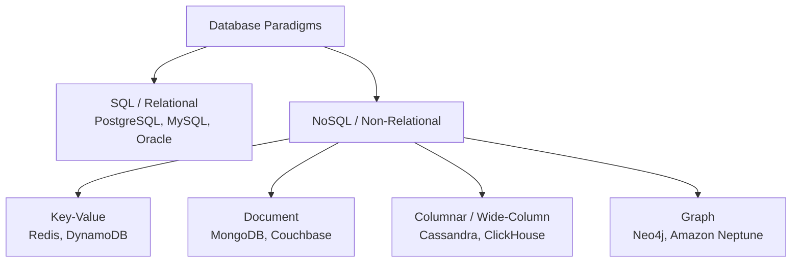
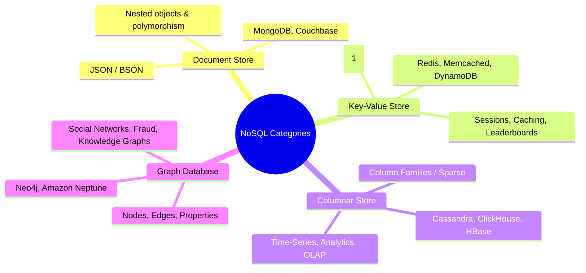
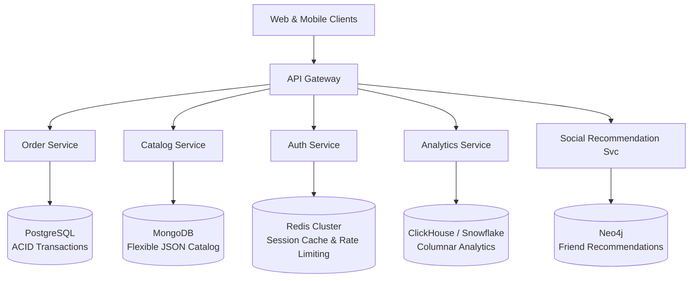

# 07. SQL vs. NoSQL and Types of Databases

---

## 1. SQL (Relational) vs. NoSQL (Non-Relational)



### Comprehensive Comparison Matrix

| Dimension | SQL (Relational Databases) | NoSQL (Non-Relational Databases) |
| :--- | :--- | :--- |
| **Data Model** | Tabular: Relations (Tables) with strict Rows (Tuples) and Columns (Attributes). | Diverse: JSON Documents, Key-Value pairs, Column families, Graph nodes/edges. |
| **Schema** | **Strict / Rigid Schema:** Schema must be pre-defined (`DDL`) before inserting data. Schema changes require `ALTER TABLE`. | **Dynamic / Schema-less (Schema-on-Read):** Heterogeneous records with varying fields can coexist in the same collection. |
| **Transaction Guarantee** | **ACID** (Atomicity, Consistency, Isolation, Durability) compliant by default. | **BASE** (Basically Available, Soft state, Eventual consistency) or tunable consistency. |
| **Scaling Strategy** | **Vertical Scaling (Scale-Up):** Add more CPU, RAM, and SSD storage to a single master server. (Sharding is complex and manual). | **Horizontal Scaling (Scale-Out):** Native distributed design; partitions data across commodity clusters easily. |
| **Query Mechanism** | Structured Query Language (**SQL**) with powerful multi-table `JOIN`, subqueries, and aggregations. | Specialized APIs, JSON query filters, or Cypher/CQL (No native multi-table joins). |
| **Data Relationships** | Highly normalized (3NF) with foreign keys enforcing referential integrity. | Denormalized / Nested data structures optimized for single-query retrieval. |
| **Typical Workloads** | Complex OLTP, Core Banking, Financial Ledgers, ERP, E-commerce order processing. | Big Data analytics, Social feeds, IoT sensor streams, Real-time leaderboards, User sessions. |

---

## 2. ACID vs. BASE Model

```
ACID (Strong Consistency)               BASE (High Availability & Scalability)
├── Atomicity (All or nothing)          ├── Basically Available (System remains responsive despite node failures)
├── Consistency (Strict invariants)     ├── Soft State (Data values may change over time without user input)
├── Isolation (Concurrent isolation)    └── Eventual Consistency (Data across all replicas will converge eventually)
└── Durability (Committed data survives)
```

---

## 3. The 4 Major Types of NoSQL Databases



---

### 1. Document-Oriented Databases (e.g., MongoDB, Couchbase)

* **Data Structure:** Self-describing documents encoded in **JSON**, **BSON** (Binary JSON), or **XML**.
* **Key Feature:** Embed child collections directly as nested objects or arrays inside parent documents.

```json
{
  "_id": "usr_9921",
  "name": "Sarah Connor",
  "email": "sarah@example.com",
  "addresses": [
    { "type": "billing", "city": "Los Angeles", "zip": "90001" },
    { "type": "shipping", "city": "Pasadena", "zip": "91101" }
  ],
  "preferences": {
    "theme": "dark",
    "notifications": true
  }
}
```

* **Best For:** Content management systems (CMS), user profile management, product catalogs with varying attribute sets (e.g., shoes have "size", laptops have "RAM").
* **Drawbacks:** Lack of atomic multi-document joins; updating deeply nested arrays can cause document re-allocation overhead.

---

### 2. Key-Value Stores (e.g., Redis, AWS DynamoDB)

* **Data Structure:** Giant distributed Hash Map mapping an opaque string key to an arbitrary value payload (String, List, Hash, Set, Sorted Set, Bitmaps).
* **Performance:** Sub-millisecond latency ($O(1)$ operations) because data resides entirely in RAM or fast SSD memory engines.

```
Key: "user:session:tok_99182"  ───>  Value: "{\"user_id\": 104, \"role\": \"admin\", \"exp\": 1718000000}"
Key: "product:101:stock"       ───>  Value: "42"
```

* **Best For:** Session token storage, distributed caching (Redis/Memcached), real-time gaming leaderboards (Redis `ZSET`), API rate-limiters.
* **Drawbacks:** Querying or filtering by value attributes without knowing the key is impossible without scanning everything.

---

### 3. Columnar / Wide-Column Stores (e.g., Apache Cassandra, ClickHouse)

* **Data Structure:** Data is physically stored and compressed by **columns** rather than traditional relational **rows**.

```
Row-Oriented Storage (Postgres/MySQL):
Block 1: [ID=1, Name=Alice, Age=30, Country=US]
Block 2: [ID=2, Name=Bob,   Age=25, Country=UK]

Column-Oriented Storage (ClickHouse/Cassandra):
Block 1 (ID):      [1, 2, 3, 4, 5, ...]
Block 2 (Name):    [Alice, Bob, Charlie, ...]
Block 3 (Age):     [30, 25, 40, 22, ...]
Block 4 (Country): [US, UK, US, CA, ...]
```

* **Why Columnar is Superior for OLAP Analytics:**
  - `SELECT AVG(age) FROM users;` only reads **Block 3 (Age)** from disk, ignoring 90% of unneeded columns.
  - Identical data types in the same column allow massive compression ratios ($5\times - 10\times$).
* **Best For:** High-volume time-series metrics, IoT sensor ingestion, clickstream analytics, data warehousing.
* **Drawbacks:** Modifying or inserting single full rows is slow and write-amplified.

---

### 4. Graph Databases (e.g., Neo4j, Amazon Neptune)

* **Data Structure:** **Nodes** (entities), **Edges/Relationships** (directed, labeled connections), and **Properties** (key-value metadata on nodes and edges).
* **Core Advantage (Index-Free Adjacency):** Each node maintains direct physical memory pointers to all adjacent nodes. Traversing relationships is $O(1)$ per edge rather than expensive relational self-joins ($O(N \log N)$).

```mermaid
graph LR
    U1((User: Alice)) -->|FRIENDS_WITH {since: 2021}| U2((User: Bob))
    U2 -->|LIKES| P1((Page: TechNews))
    U1 -->|WORKS_AT| C1((Company: Infosys))
    U3((User: Charlie)) -->|WORKS_AT| C1
```

* **Best For:** Social networks ("Friends of friends"), fraud detection rings (detecting circular money transfers), recommendation engines, knowledge graphs.
* **Drawbacks:** Poor horizontal partitioning scalability (graph partitioning across distributed servers is an NP-hard problem).

---

## 4. Summary Matrix of Database Types

| Database Category | Prominent Technologies | Primary Query Mechanism | Ideal Use Case |
| :--- | :--- | :--- | :--- |
| **Relational (RDBMS)** | PostgreSQL, MySQL, Oracle, MS SQL Server | SQL (with ACID & JOINs) | Financial transactions, ERP, E-commerce checkouts |
| **Document** | MongoDB, Couchbase, AWS DocumentDB | JSON / BSON Queries | Catalogs, CMS, User profiles, Rapidly changing schemas |
| **Key-Value** | Redis, Memcached, DynamoDB | `GET(key)`, `SET(key, val)` | Caching, Auth sessions, Real-time counters |
| **Columnar / OLAP** | ClickHouse, Apache Cassandra, Snowflake | SQL / CQL (Column-scans) | Real-time analytics, IoT telemetry, Log analysis |
| **Graph** | Neo4j, Amazon Neptune, ArangoDB | Cypher / Gremlin | Social graphs, Fraud detection, Recommendation networks |
| **In-Memory** | Redis, Memcached, Aerospike | In-memory API | Sub-millisecond latency caching and queuing |

---

## 5. Polyglot Persistence Architecture

In modern enterprise cloud architectures (such as those designed at Infosys), no single database handles every workload. **Polyglot Persistence** is the practice of using different database engines tailored to specific microservice requirements within the same overall platform.



---

## 6. Infosys SP L3 Interview Questions & Answers

### Q1: How do you choose between MongoDB and PostgreSQL for a new greenfield application?
**Answer:**
- Choose **PostgreSQL** if:
  1. The domain requires strict **ACID transactions** and referential integrity across interconnected entities (e.g., order billing, banking).
  2. The data schema is structured and well-defined.
  3. Relational joins and complex aggregations across multiple domains are required.
- Choose **MongoDB** if:
  1. The schema is dynamic, polymorphic, or rapidly evolving (e.g., product catalog with 100+ categories).
  2. Data is naturally self-contained and accessed as whole hierarchical documents (embeds > joins).
  3. Rapid horizontal scale-out write partitioning across sharded clusters is an immediate Day-1 requirement.

---

### Q2: Why are columnar databases (like ClickHouse or Cassandra) faster than row-oriented databases for analytics?
**Answer:**
Row-oriented databases store entire rows contiguously in disk pages. A query like `SELECT AVG(salary) FROM employees` must load all employee records (including names, addresses, bios) into RAM, wasting 95% of disk I/O bandwidth. 
Columnar databases store each column contiguously. The query reads **only the salary column blocks**, reducing disk I/O by orders of magnitude. Furthermore, contiguous column data compresses exceptionally well ($5\times-10\times$) due to identical data types.

---

### Q3: What is "Index-Free Adjacency" in Graph Databases?
**Answer:**
In relational databases, querying relationships (e.g., finding Bob's friends' favorite movies) requires searching a secondary B+ Tree index on foreign keys for every hop, costing $O(\log N)$ per step. 
In graph databases with **Index-Free Adjacency**, each node directly holds physical memory pointers to its adjacent neighbor nodes and edges. Traversal is an instantaneous pointer dereference ($O(1)$ per edge), allowing deep 5–10 hop traversals without degrading under large datasets.
