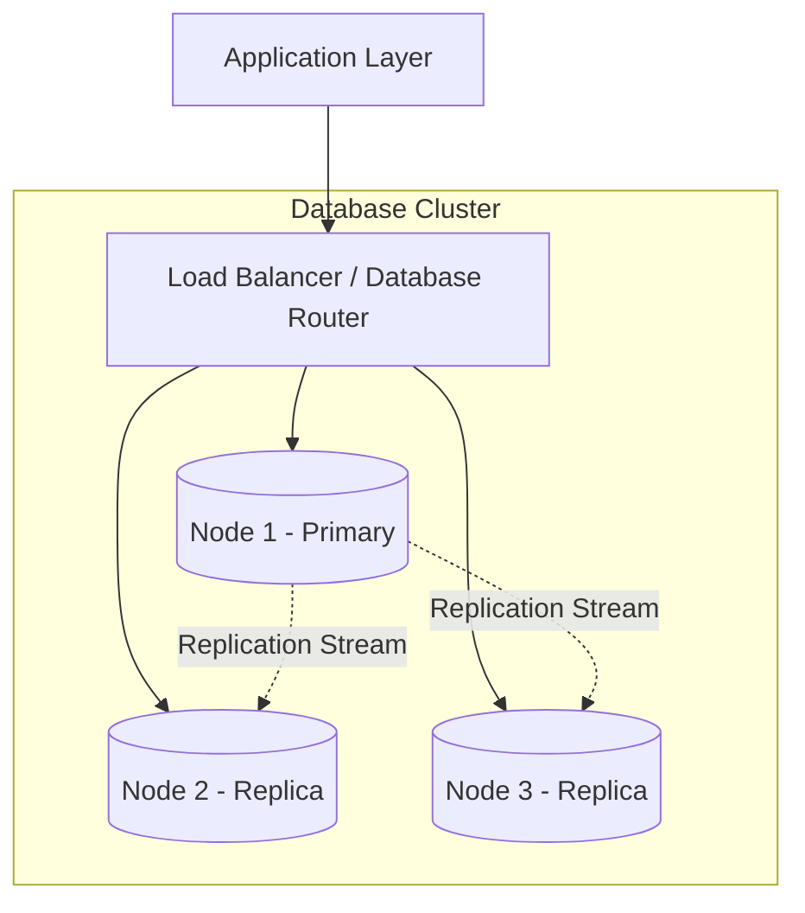
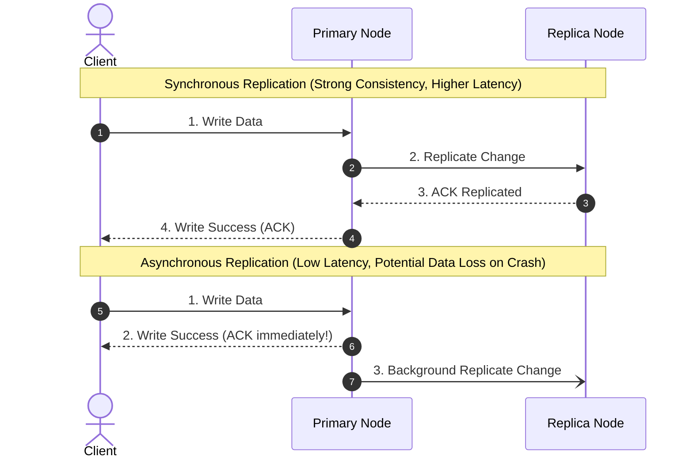
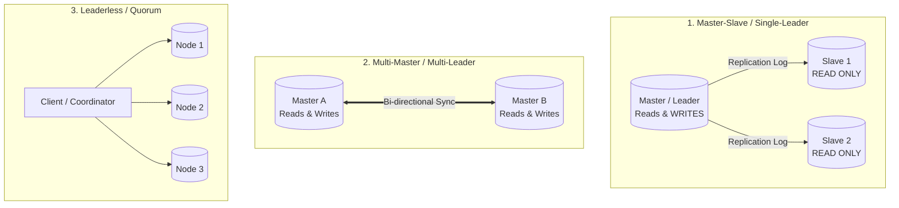
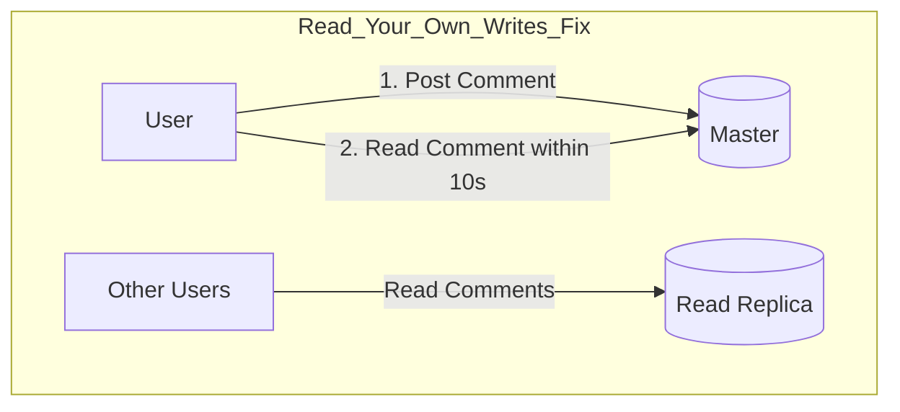
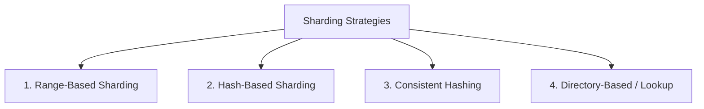
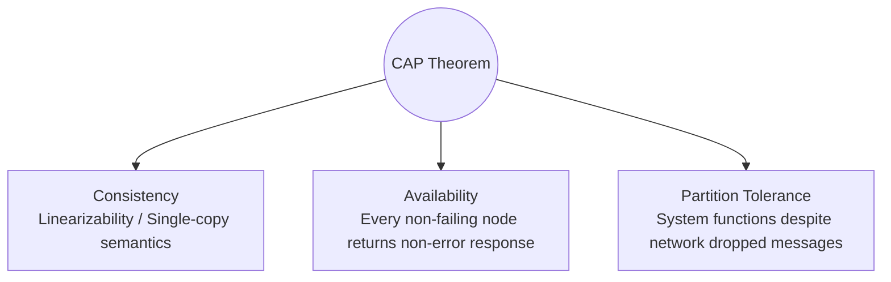
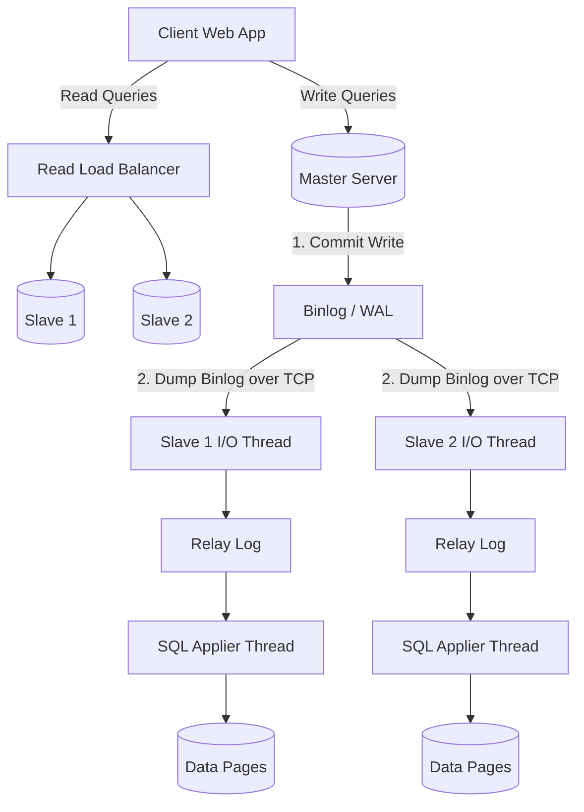

# 08. Distributed Databases: Replication, Sharding, and CAP Theorem

---

## 1. Distributed Database Fundamentals & Clustering

A **Distributed Database System** consists of multiple interconnected database nodes that communicate over a computer network to manage data transparently as a single unified system.



### Core Motivations for Distribution:
1. **High Availability (HA) & Fault Tolerance:** If node 1 catches fire, nodes 2 and 3 continue serving queries without downtime.
2. **Horizontal Scalability (Throughput & Storage):** Distribute billions of rows and hundreds of thousands of read/write queries across commodity machines.
3. **Geographic Proximity (Low Latency):** Replicate data closer to end-users (e.g., US-East, Europe, Asia-Pacific).

---

## 2. Replication in DBMS

**Replication** is the process of keeping multiple copies of data on physically separate machines to improve fault tolerance and read throughput.

---

### 1. Synchronous vs. Asynchronous Replication



| Dimension | Synchronous Replication | Asynchronous Replication | Semi-Synchronous Replication |
| :--- | :--- | :--- | :--- |
| **Commit Rule** | Primary waits for **all** replicas to acknowledge before confirming to client. | Primary commits locally and ACKs client immediately; replicates in background. | Primary waits for at least **one** replica to ACK before confirming to client. |
| **Write Latency** | High (bounded by slowest network/replica). | Low & predictable. | Moderate. |
| **Data Loss Risk** | **Zero data loss** on primary crash. | Risk of data loss if primary crashes before log reaches replica. | Zero data loss if at least 1 replica survives. |
| **Availability Impact** | If one replica halts, all writes freeze. | Primary continues writing even if replicas are down. | Balanced availability. |

---

### 2. Replication Architectures



#### A. Master-Slave (Primary-Replica / Single-Leader)
* **How it works:** All data-modifying queries (`INSERT`, `UPDATE`, `DELETE`) **must** go exclusively to the **Master (Primary)**. Slaves (Replicas) pull the binary replication log (`binlog`) and apply changes to maintain identical copies for **Read-Only** traffic.
* **Failover:** If Master fails, a consensus system (e.g., Raft, ZooKeeper) elects a healthy slave to become the new Master.
* **Best For:** Read-heavy web applications (e.g., Blogs, E-commerce browsing).

#### B. Multi-Master (Multi-Leader)
* **How it works:** Multiple nodes can accept both reads and writes. Nodes asynchronously synchronize changes with each other.
* **Challenge (Write Conflicts):** If User A updates record 10 on Master 1 while User B updates record 10 on Master 2 simultaneously, a conflict arises. Resolved via **Last-Write-Wins (LWW)**, CRDTs (Conflict-free Replicated Data Types), or custom merge logic.
* **Best For:** Multi-region deployments with high write volumes across continents.

#### C. Leaderless Replication (Dynamo-Style / Cassandra)
* **How it works:** Clients write directly to multiple replicas using a **Quorum System**:
  - $N$ = Total Replicas, $W$ = Write Quorum, $R$ = Read Quorum.
  - **Strong Consistency Condition:** $$W + R > N$$
  - If $N=3, W=2, R=2 \implies 2 + 2 = 4 > 3$, at least one node in the read set is guaranteed to hold the most up-to-date write.

---

### 3. Replication Lag & Consistency Anomalies

In asynchronous master-slave setups, replicas lag behind the master by a few milliseconds to seconds (**Replication Lag**). This causes user-facing anomalies:



* **Read-Your-Own-Writes Consistency:** A user submits a form, refreshes the page, and the data disappears because the read went to a lagging replica.
  * **Solution:** Route a user's reads to the **Master** for $N$ seconds immediately after they perform a write, or track client version timestamps.
* **Monotonic Reads:** A user refreshes a page and sees a new post (from replica A), then refreshes again and the post disappears (because the request hit lagging replica B).
  * **Solution:** Sticky sessions (hash user ID to route the same user consistently to the same replica).

---

## 3. Partitioning and Sharding

When a dataset exceeds the physical storage or I/O capacity of a single physical server, data must be **partitioned**.

```
Vertical Partitioning (Split Columns):
[User_Table: ID, Name, Email, Bio, Profile_Picture_Blob]
   ├── Node 1 (Core Info):   [ID, Name, Email]
   └── Node 2 (Heavy Media): [ID, Bio, Profile_Picture_Blob]

Horizontal Partitioning / Sharding (Split Rows):
[User_Table: 10 Million Rows]
   ├── Shard 1 (Node A): Users with ID 1 to 3,333,333
   ├── Shard 2 (Node B): Users with ID 3,333,334 to 6,666,666
   └── Shard 3 (Node C): Users with ID 6,666,667 to 10,000,000
```

---

### Sharding Routing Strategies



#### 1. Range-Based Sharding
* **Mechanism:** Data is partitioned based on discrete ranges of the shard key (e.g., `A-G` $\to$ Shard 1, `H-P` $\to$ Shard 2, `Q-Z` $\to$ Shard 3).
* **Pros:** Range queries (`WHERE age BETWEEN 20 AND 30`) are localized to a single shard.
* **Cons:** Causes massive **Hotspots** (e.g., if partitioning by date, today's shard absorbs 100% of write traffic).

#### 2. Hash-Based Sharding ($Key \pmod N$)
* **Mechanism:** Shard ID = $\text{Hash}(Shard\_Key) \pmod N$ (where $N$ is the number of database shards).
* **Pros:** Uniform distribution; eliminates write hotspots.
* **Cons:** Changing cluster size from $N$ to $N+1$ causes almost all keys to remap, requiring massive, expensive data migrations.

#### 3. Consistent Hashing (Virtual Nodes)
* **Mechanism:** Both data keys and server nodes are mapped to points on a circular 32-bit/128-bit hash ring. A key is assigned to the first server encountered clockwise.
* **Advantage:** Adding or removing a node only requires moving $K/N$ keys from its immediate neighbor, leaving all other shards untouched.

---

### Sharding Engineering Challenges

1. **Cross-Shard JOINs:** Extremely slow; requires sending partial queries to multiple shards and merging datasets over the network.
2. **Distributed Transactions:** Modifying data across multiple shards requires expensive **Two-Phase Commit (2PC)** protocols, reducing system throughput.
3. **Resharding Complexity:** Splitting full shards online without application downtime requires complex CDC (Change Data Capture) pipelines.

---

## 4. The CAP Theorem (Brewer's Conjecture)

The **CAP Theorem** states that in any distributed data store, it is mathematically impossible to simultaneously provide all three of the following guarantees:



### The 3 Properties:
1. **Consistency (C - Linearizability):** Every read receives the most recent write or an error. (Single-copy consistency).
2. **Availability (A):** Every non-failing node must return a valid (non-error) response to every request (without guaranteeing it is the latest write).
3. **Partition Tolerance (P):** The system continues to operate despite an arbitrary number of messages being dropped or delayed by network failure between nodes.

---

### Why "CA" is an Illusion in Real-World Distributed Systems

> [!IMPORTANT]
> **Network Partitions ($P$) are physical realities of hardware/cables:** Network switches fail, cables get cut, and packets drop. Therefore, **Partition Tolerance ($P$) is non-negotiable** in distributed systems.
> 
> When a network partition inevitably occurs between Node 1 and Node 2:
> - **If you choose Consistency (CP):** Node 2 must reject client writes/reads because it cannot sync with Node 1 $\implies$ **Sacrifices Availability**.
> - **If you choose Availability (AP):** Node 2 accepts writes and serves stale reads independently $\implies$ **Sacrifices Consistency**.

```
            ┌─────────────────────────────┐
            │   Network Partition Occurs  │
            └──────────────┬──────────────┘
                           │
            ┌──────────────┴──────────────┐
            ▼                             ▼
    ┌───────────────┐             ┌───────────────┐
    │  Choose CP    │             │  Choose AP    │
    │ (HBase, Mongo,│             │ (Cassandra,   │
    │  Postgres HA) │             │  Couchbase,   │
    │ Block request │             │  DynamoDB)    │
    │ to prevent    │             │ Accept write; │
    │ stale data    │             │ allow stale   │
    └───────────────┘             └───────────────┘
```

---

## 5. PACELC Theorem (Extended CAP)

The CAP theorem only describes behavior **during rare network partitions**. The **PACELC Theorem** extends CAP to explain how systems behave during normal operation:

$$\text{If } \mathbf{P} \text{ (Partition): } \mathbf{A} \text{ or } \mathbf{C}; \quad \mathbf{E} \text{ (Else / Normal State): } \mathbf{L} \text{ or } \mathbf{C}$$

```
                ┌───────────────────────────────┐
                │        PACELC Theorem         │
                └───────────────┬───────────────┘
                                │
        ┌───────────────────────┴───────────────────────┐
        ▼                                               ▼
┌──────────────────────────────┐        ┌──────────────────────────────┐
│  If Partition (P)            │        │  Else Normal (E)             │
│  ├── Availability (A)        │        │  ├── Latency (L)             │
│  └── Consistency (C)         │        │  └── Consistency (C)         │
└──────────────────────────────┘        └──────────────────────────────┘
```

### Real-World Database Classifications:
* **MongoDB:** **PC/EC** $\implies$ In partition, chooses Consistency (refuses writes to minority). In normal operation, waits for primary sync (chooses Consistency over Latency).
* **Apache Cassandra / DynamoDB:** **PA/EL** $\implies$ In partition, chooses Availability. In normal operation, returns immediately without waiting for cross-replica sync (chooses Latency over Consistency).
* **MySQL / PostgreSQL (Async Replication):** **PA/EL** $\implies$ Low latency reads from replicas, but eventual consistency.

---

## 6. Master-Slave Architecture Deep Dive



### Inner Mechanism of MySQL Master-Slave Replication:
1. **Binary Logging:** Master logs every schema and row mutation to its `binlog`.
2. **I/O Thread:** Slave connects to Master; a dedicated I/O thread streams binlog events into the Slave's local `Relay Log`.
3. **SQL Thread:** The Slave's SQL execution thread sequentially reads and replays queries/row changes from the relay log onto the local database engine.

---

## 7. Infosys SP L3 Interview Questions & Answers

### Q1: Can a distributed database ever be "CA" (Consistent and Available)?
**Answer:**
No, not in any distributed network where nodes communicate over physical networks. Networks are inherently susceptible to dropped packets, partition events, and latency spikes. A system can only be CA if it runs as a **single node on a single machine** (where network partitions are impossible). In any multi-node distributed system, Partition Tolerance ($P$) is mandatory, forcing an architectural trade-off between $CP$ and $AP$.

---

### Q2: What is the difference between Sharding and Partitioning?
**Answer:**
- **Partitioning** is the generic concept of dividing a database table into smaller sub-tables. It can be vertical (splitting columns) or horizontal (splitting rows) on the **same physical server**.
- **Sharding** is **Horizontal Partitioning across multiple independent physical server nodes**. Each shard is a separate database instance holding a unique subset of rows.

---

### Q3: How do you solve the "Read-Your-Own-Writes" consistency problem in Master-Slave replication?
**Answer:**
1. **User-Pinned Master Reads:** Route read requests for the specific user who just wrote data to the **Master** for a short duration (e.g., 5 seconds) after their write.
2. **Replication Timestamp / GTID Tracking:** Include the transaction's Global Transaction ID (GTID) or timestamp in the user's session cookie. The read load balancer only routes the read to a replica if that replica's executed GTID is $\ge$ the user's session GTID.
3. **Optimistic UI Updates:** Update the client UI locally immediately upon API success while the replica catches up in the background.
