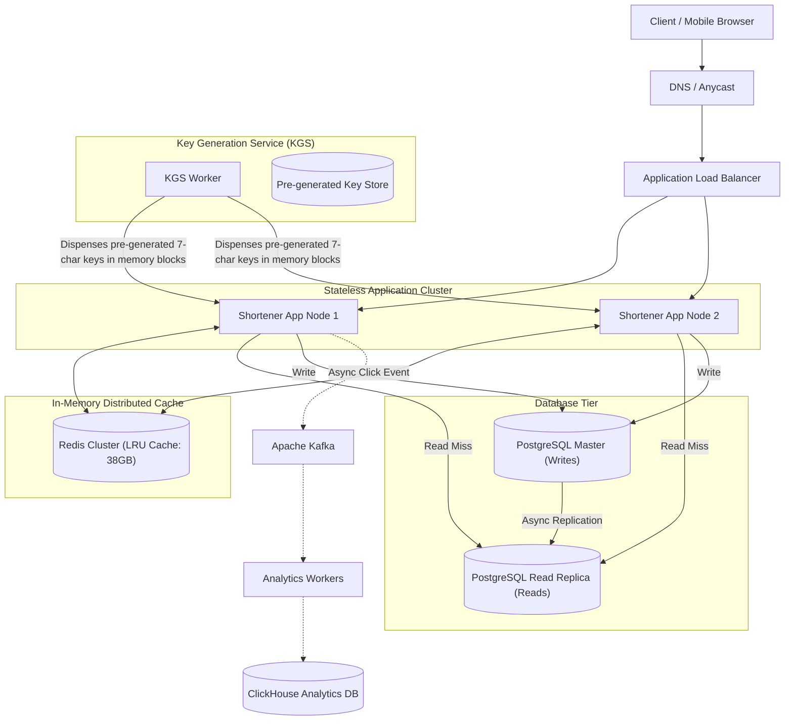

# Case Study 01 — URL Shortener (e.g., TinyURL / Bitly)

## 1. Problem
Design a high-scale URL shortening service that takes long URLs (e.g., `https://example.com/very/long/path?query=123`) and generates a short, unique alias (e.g., `https://tiny.url/aB3x9Z`). When a user visits the short alias, the service redirects them to the original long URL with ultra-low latency.

---

## 2. Functional Requirements
1. **Shorten URL**: Given a long URL, return a unique 7-character short URL.
2. **Redirection**: Given a short URL alias, redirect the user via HTTP 301/302 to the original long URL.
3. **Custom Aliases (Optional)**: Allow users to specify a custom short alias (up to 16 chars).
4. **Link Expiration**: URLs expire after a default of 5 years unless a custom TTL is set.
5. **Analytics (Basic)**: Track redirect click counts and basic referrer metrics.

---

## 3. Non-Functional Requirements
1. **High Availability ($99.99\%$)**: Redirections must never fail.
2. **Ultra-Low Latency**: Redirect lookup $< 15\text{ms}$ at the 99th percentile (p99).
3. **Read-Heavy Workload**: Read-to-write ratio of $\approx 100:1$.
4. **Predictable & Short Hashes**: URLs should be short, alphanumeric, and non-guessable.

---

## 4. Assumptions & Constraints
- Workload is heavily read-dominant.
- URLs once written are rarely updated, but frequently read.
- System requires high storage durability for at least 5 years.

---

## 5. Practical Scale Estimation

### Traffic Calculations
- **New Short URLs per Month**: $100\text{ Million writes/month}$.
- **Writes per Second (RPS)**:
  $$\text{Write RPS} = \frac{100,000,000 \text{ writes}}{30 \text{ days} \times 86,400\text{ s}} \approx 40\text{ writes/sec}$$
- **Read-to-Write Ratio**: $100:1$.
- **Read RPS (Redirects)**:
  $$\text{Read RPS} = 40 \times 100 = 4,000\text{ reads/sec}$$
- **Peak Read RPS ($2.5\times$)**: $4,000 \times 2.5 = 10,000\text{ reads/sec}$.

### Storage Calculations (5 Years)
- **Total URLs stored in 5 years**:
  $$\text{Total Records} = 100\text{M/month} \times 12 \times 5 = 6\text{ Billion URLs}$$
- **Size per Record**:
  - `short_key`: 7 bytes
  - `long_url`: 500 bytes
  - `created_at` / `expires_at`: 16 bytes
  - `user_id`: 8 bytes
  - Total $\approx 550\text{ bytes per record}$.
- **Total Storage (5 Years)**:
  $$\text{Storage} = 6\text{ Billion} \times 550\text{ bytes} \approx 3.3\text{ TB (Easily managed)}$$

### Memory / Caching Calculations (80-20 Rule)
- 20% of hot URLs generate 80% of daily read traffic.
- **Daily Read Requests**: $4,000\text{ RPS} \times 86,400\text{ s} \approx 350\text{ Million requests/day}$.
- **Daily Unique Hot URLs to Cache ($20\%$)**: $0.20 \times 350\text{M} \times 550\text{ bytes} \approx 38.5\text{ GB RAM}$.
- *Conclusion*: A single medium Redis node ($64\text{ GB RAM}$) can cache all hot URLs in memory!

---

## 6. API Design

### 1. Create Short URL
- **Endpoint**: `POST /api/v1/urls`
- **Request Body**:
```json
{
  "long_url": "https://example.com/very/long/article?id=99",
  "custom_alias": "my-cool-link",
  "ttl_days": 365
}
```
- **Response** (`201 Created`):
```json
{
  "short_url": "https://tiny.url/aB3x9Z",
  "long_url": "https://example.com/very/long/article?id=99",
  "expires_at": "2027-09-11T00:00:00Z"
}
```

### 2. Redirect URL
- **Endpoint**: `GET /{short_key}`
- **Response**: `HTTP 302 Found` with `Location: https://example.com/very/long/article?id=99` header.

> [!NOTE]
> **HTTP 301 (Permanent) vs 302 (Temporary) Redirect**:
> - **301 Moved Permanently**: Browser caches the redirect locally. Subsequent clicks bypass your servers completely. Saves server load, but **breaks click analytics tracking**.
> - **302 Found (Recommended)**: Browser always hits your server first before redirecting. Enables **accurate real-time analytics and tracking**.

---

## 7. Data Model

### Relational Schema (PostgreSQL)
```sql
CREATE TABLE urls (
    short_key VARCHAR(16) PRIMARY KEY,
    long_url VARCHAR(2048) NOT NULL,
    user_id BIGINT,
    created_at TIMESTAMP WITH TIME ZONE DEFAULT CURRENT_TIMESTAMP,
    expires_at TIMESTAMP WITH TIME ZONE NOT NULL
);

CREATE INDEX idx_urls_expires_at ON urls(expires_at);
```

---

## 8. High-Level Architecture



---

## 9. Request / Data Flow

### Write Flow (Create Short URL):
1. Client sends `POST /api/v1/urls` with `long_url`.
2. App server fetches an unused 7-character key from its local pre-allocated KGS memory buffer (zero collision check needed!).
3. App server writes `(short_key, long_url, expires_at)` to PostgreSQL Master.
4. App server populates Redis cache: `SET aB3x9Z -> https://example.com/...`.
5. Returns `https://tiny.url/aB3x9Z` to client in $< 20\text{ms}$.

### Read Flow (Redirect):
1. Client requests `GET /aB3x9Z`.
2. Load Balancer routes request to an App Server.
3. App Server checks Redis cache:
   - **Cache Hit ($90\%+$ cases)**: Returns HTTP 302 with `Location` header in $< 2\text{ms}$.
   - **Cache Miss**: Queries PostgreSQL Read Replica, populates Redis, returns HTTP 302.
4. App server fires an asynchronous click tracking event to Apache Kafka for analytics logging.

---

## 10. Key Encoding & Generation Logic

### Why 7 Characters with Base62?
- Characters available: `a-z` (26) + `A-Z` (26) + `0-9` (10) = **62 characters**.
- Total unique combinations with 7 characters:
  $$62^7 = 3,521,614,606,208 \approx 3.52 \text{ Trillion unique URLs}$$
- At 100 Million URLs/month, $3.52\text{ Trillion}$ keys will last **~2,900 years**!

### Key Generation Methods Comparison:

| Method | Mechanism | Pros | Cons / Trade-offs |
|---|---|---|---|
| **1. Hash of Long URL (MD5/SHA256) + Base62** | Take first 7 chars of `base62(MD5(url))`. | Deterministic. | ❌ **Hash Collisions**: Two different URLs might produce the same 7 chars $\to$ requires expensive DB collision lookup loops. |
| **2. Auto-Increment ID + Base62** | Convert auto-increment integer ID $125 \to$ `cb` in Base62. | Zero collisions; simple math. | ❌ **Predictable / Security risk**: Competitors can scrape URLs sequentially (`tiny.url/1`, `tiny.url/2`). Single DB sequence bottleneck. |
| **3. Key Generation Service (KGS - RECOMMENDED)** | Dedicated standalone service pre-generates billions of random Base62 keys offline and stores them in DB. | ✅ **Zero runtime collisions**; $O(1)$ lightning-fast key retrieval; completely unpredictable keys. | Requires managing a standalone KGS key management service. |

---

## 11. Database Choice: Why SQL over NoSQL?
- **Dataset Size is Small**: 5 years of data is only $3.3\text{ TB}$.
- **Data is Structured and Relational**: A single simple table with strict uniqueness constraints on `short_key`.
- **Read-Heavy Nature**: Read scaling is solved trivially using PostgreSQL Read Replicas + Redis.
- *(Alternative)*: A Key-Value store like **AWS DynamoDB or Cassandra** also works exceptionally well due to pure primary key lookups (`GET key`).

---

## 12. Caching Strategy
- **Pattern**: Cache-Aside (Lazy Loading).
- **TTL**: 7 days with LRU eviction policy.
- **Cache Sizing**: 64GB Redis cluster easily covers 20% daily active hot URLs (38.5 GB).

---

## 13. Scaling Strategy ($1K \to 100K \to 10M$ Users)
- **1,000 Users**: Single EC2 instance running Nginx + Node.js/Python + SQLite.
- **100,000 Users**: 3 Stateless App instances behind AWS ALB + PostgreSQL Master with 2 Read Replicas + Single Redis node.
- **10,000,000 Users**:
  - Global DNS Anycast routing users to nearest regional ALB.
  - Multi-node Redis Cluster with master-replica replication.
  - Database sharding using Consistent Hashing on `short_key` if data exceeds 10TB.
  - Asynchronous analytics pipeline via Kafka + ClickHouse.

---

## 14. Reliability & Fault Tolerance
- **What if Redis crashes?** $\to$ Redis Sentinel automatically promotes a replica within 5 seconds. Read replicas absorb temporary database reads with rate limiting.
- **What if KGS server crashes?** $\to$ App servers maintain an in-memory buffer of 5,000 pre-fetched keys; redundant standby KGS instances are deployed.
- **Database Failover** $\to$ PostgreSQL Multi-AZ synchronous standby is promoted automatically within 30 seconds.

---

## 15. Performance Optimizations
- **KGS Local Memory Buffering**: App servers load batches of 1,000 keys from KGS into local RAM, reducing KGS network calls to near zero.
- **Bloom Filters**: Placed before cache to immediately return `404 Not Found` for non-existent short keys, preventing cache penetration attacks.

---

## 16. Security Considerations
- **Rate Limiting**: Limit URL creation to 10 requests/minute per IP / user token to prevent spam.
- **Malicious URL Detection**: Integrate with Google Safe Browsing API asynchronously via Kafka to flag and disable phishing links.

---

## 17. Key Trade-offs
- **KGS Pre-generation vs Real-time Hashing**: Sacrificed KGS storage space (~30GB of pre-generated keys on disk) in exchange for zero runtime hash collisions and $O(1)$ write latency.
- **HTTP 302 vs HTTP 301**: Sacrificed client-side browser caching in exchange for accurate real-time click tracking and analytics.

---

## 18. Bottlenecks (What Breaks First?)
- **The First Bottleneck**: **Redis RAM exhaustion** if a viral URL campaign drives millions of unique links into cache.
- *Fix*: Enforce strict LRU eviction and ensure TTL is set on all keys.

---

## 19. Interview Follow-ups & Conversational Answers

### Interviewer: "How does the Key Generation Service (KGS) ensure two app servers don't get the same short key?"
> **Good Answer**: "KGS pre-generates 7-character Base62 keys offline and stores them in two tables: `unused_keys` and `used_keys`. When an application server requests keys, KGS dispenses a batch of 1,000 keys in a single transaction, marks them as used, and the app server stores them in local memory. Even if two app servers request keys at the same exact millisecond, KGS hands out distinct non-overlapping ranges."

### Interviewer: "What happens if an app server crashes with 1,000 unused keys in its memory buffer?"
> **Good Answer**: "Those 1,000 keys are simply lost. Because our 7-character Base62 keyspace has 3.5 Trillion combinations and we only need 6 Billion keys over 5 years, losing a few thousand keys has zero practical impact on the system."

---

## 20. 2-Minute Interview Verbal Script
> "To design a URL shortener like TinyURL handling 100M new URLs per month and a 100:1 read-to-write ratio:
> 
> I start with a stateless application tier behind an L7 Load Balancer. For URL generation, I use a dedicated **Key Generation Service (KGS)** that pre-generates 7-character Base62 keys offline, dispensing them in batches of 1,000 to app servers to guarantee $O(1)$ writes with zero runtime collisions.
> 
> For the database, since 5-year storage is only 3.3TB and lookups are key-value in nature, I use PostgreSQL with a primary B-Tree index on `short_key`, scaled with Read Replicas.
> 
> Because reads represent 99% of traffic, I place a **Redis Cache Cluster** using the Cache-Aside pattern, caching the 20% hottest URLs (requiring ~38GB RAM) to deliver redirects in under 2 milliseconds via HTTP 302. Analytics clicks are published asynchronously to Kafka so redirect latency remains unaffected."

---

## Reusable Patterns Extracted

| Pattern | Why It Was Used | Other Systems Where It Applies |
|---|---|---|
| **Offline Token Pre-generation (KGS)** | Eliminates runtime race conditions and hash collision checking. | Unique Ticket ID generation, Order ID generation, Promo Code engines. |
| **Base62 Encoding** | Maximizes key density with URL-safe alphanumeric characters. | Document IDs, Referral codes, Pastebin. |
| **Cache-Aside with 80/20 Sizing** | Delivers sub-2ms read latencies for read-heavy key lookups. | Social feeds, Product catalog, DNS resolvers. |
| **Asynchronous Event Pipeline (Kafka)** | Offloads non-critical telemetry/analytics from the critical user path. | Payment clickstream, User activity logs, IoT telemetry. |
