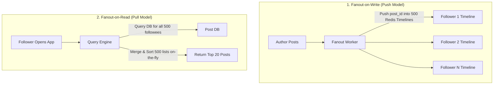

# Case Study 03 — Social Media News Feed (e.g., Twitter / Instagram)

## 1. Problem
Design a social media news feed system where hundreds of millions of users can publish posts (text, images) and instantly view a aggregated, chronological feed of posts from friends and accounts they follow.

---

## 2. Functional Requirements
1. **Publish Post**: A user can publish a post (text, image URLs).
2. **Follow / Unfollow**: A user can follow or unfollow other users.
3. **View News Feed**: A user can fetch a reverse-chronological feed of the latest posts from accounts they follow with infinite scrolling (cursor pagination).
4. **Like & Comment**: Users can like and comment on posts.

---

## 3. Non-Functional Requirements
1. **Ultra-Low Read Latency**: Rendering the home feed must take $< 100\text{ms}$.
2. **High Availability ($99.99\%$)**: Feed retrieval must remain available even if some background indexing services lag.
3. **Eventual Consistency**: It is acceptable if a follower sees a new post 2–5 seconds after it is published.
4. **Massive Scale**: Support 100M Daily Active Users (DAU) and handle celebrity accounts with 100M+ followers.

---

## 4. Assumptions & Constraints
- 100 Million Daily Active Users (DAU).
- Each user views feed 10 times a day and posts 1 time per day ($10:1$ read-to-write ratio for requests; but reading aggregated feeds from 500 followees makes the underlying data read-to-write ratio $\approx 5000:1$).
- Maximum 800 posts cached in a user's pre-computed timeline.

---

## 5. Practical Scale Estimation

### Traffic Calculations
- **New Posts per Day**: $100\text{M DAU} \times 1\text{ post} = 100\text{ Million posts/day}$.
- **Post Write RPS**:
  $$\text{Write RPS} = \frac{100,000,000}{86,400\text{ s}} \approx 1,150\text{ posts/sec (Peak: } 3,000\text{ RPS)}$$
- **Feed Views per Day**: $100\text{M} \times 10\text{ views} = 1\text{ Billion feed views/day}$.
- **Feed Read RPS**:
  $$\text{Read RPS} = \frac{1,000,000,000}{86,400\text{ s}} \approx 11,500\text{ reads/sec (Peak: } 30,000\text{ RPS)}$$

### Storage Calculations (5 Years)
- Post metadata: `post_id` (8B), `user_id` (8B), `content` (280B), `media_url` (100B), `timestamp` (8B) $\approx 400\text{ bytes}$.
- **Storage per day**: $100\text{M} \times 400\text{ B} = 40\text{ GB/day}$.
- **5-Year Storage**: $40\text{ GB} \times 365 \times 5 \approx 73\text{ TB}$ (Stored in distributed NoSQL DB like Cassandra).

### Feed Cache Memory Sizing (Redis)
- Cache top 800 post IDs (`post_id` = 8 bytes) for active users (100M DAU):
  $$\text{Memory} = 100\text{M users} \times 800\text{ post IDs} \times 8\text{ bytes} \approx 640\text{ GB RAM}$$
- *Conclusion*: A cluster of 10 Redis instances (64GB RAM each) easily caches the entire active feed timelines for 100 million users!

---

## 6. API Design

### 1. Create Post
- **Endpoint**: `POST /api/v1/posts`
- **Request Body**:
```json
{
  "content": "Excited to prepare for my L3 interview!",
  "media_ids": ["med_98765"]
}
```
- **Response** (`201 Created`):
```json
{
  "post_id": "pst_123456789",
  "created_at": "2026-09-11T19:40:00Z"
}
```

### 2. Get User News Feed (Cursor Pagination)
- **Endpoint**: `GET /api/v1/feed?limit=20&cursor=pst_987654`
- **Response** (`200 OK`):
```json
{
  "posts": [
    {
      "post_id": "pst_999999",
      "author": {"user_id": "usr_42", "username": "alice"},
      "content": "Hello world!",
      "created_at": "2026-09-11T19:39:00Z",
      "like_count": 142
    }
  ],
  "next_cursor": "pst_999900"
}
```

---

## 7. Data Model

```sql
-- Relational or Document DB for Users & Followers
CREATE TABLE users (
    user_id BIGINT PRIMARY KEY,
    username VARCHAR(64) UNIQUE NOT NULL,
    created_at TIMESTAMP WITH TIME ZONE DEFAULT CURRENT_TIMESTAMP
);

CREATE TABLE follows (
    follower_id BIGINT NOT NULL,
    followee_id BIGINT NOT NULL,
    created_at TIMESTAMP WITH TIME ZONE DEFAULT CURRENT_TIMESTAMP,
    PRIMARY KEY (follower_id, followee_id)
);
CREATE INDEX idx_follows_followee ON follows(followee_id);

-- Cassandra / ScyllaDB for Posts (Time-Series partitioned by author)
CREATE TABLE posts (
    user_id BIGINT,
    post_id BIGINT,
    content TEXT,
    media_url VARCHAR(512),
    created_at TIMESTAMP,
    PRIMARY KEY (user_id, created_at, post_id)
) WITH CLUSTERING ORDER BY (created_at DESC);
```

---

## 8. High-Level Architecture

```mermaid
flowchart TD
    Client[Mobile / Web Client] --> CDN[CDN Edge (Images/Static)]
    Client --> ALB[Application Load Balancer]
    
    subgraph AppCluster["Stateless Web Services"]
        PostService[Post Service]
        FeedService[Feed Service]
    end
    
    ALB --> PostService
    ALB --> FeedService
    
    subgraph FanoutPipeline["Asynchronous Fanout Workers"]
        Kafka[Apache Kafka: 'post-created' topic]
        FanoutWorker[Fanout Ingestion Workers]
    end
    
    subgraph CachingTier["In-Memory Feed Store"]
        RedisFeed[("Redis Cluster (User Timeline Sorted Sets)")]
        RedisPostCache[("Redis Post Object Cache")]
    end
    
    subgraph PersistenceTier["Distributed Storage"]
        PostDB[("Cassandra / ScyllaDB (Posts Log)")]
        UserDB[("PostgreSQL (Users & Follows Graph)")]
    end

    PostService -->|1. Save Post| PostDB
    PostService -->|2. Emit Event| Kafka
    Kafka --> FanoutWorker
    
    FanoutWorker -->|3. Fetch Followers| UserDB
    FanoutWorker -->|4. Push post_id to normal followers| RedisFeed
    
    FeedService -->|1. Read Timeline post_ids| RedisFeed
    FeedService -->|2. Hydrate Post Details| RedisPostCache
    RedisPostCache -.->|Cache Miss| PostDB
```

---

## 9. Core Architectural Mechanism: Fanout-on-Write vs Fanout-on-Read vs Hybrid



| Strategy | Mechanism | Pros | Cons / L3 Critical Issue |
|---|---|---|---|
| **Fanout-on-Write (Push)** | When a user posts, background workers push the `post_id` into the Redis timeline of **every single follower**. | ✅ Feed retrieval is ultra-fast $O(1)$ from Redis Sorted Set (`ZREVRANGEBYSCORE`). | ❌ **The Celebrity Problem**: If a user with 50 million followers posts, the fanout worker must perform 50 million Redis writes, locking queues and delaying feeds. |
| **Fanout-on-Read (Pull)** | Do nothing on write. When a user opens the app, dynamically query all followees' posts, merge, and sort. | ✅ Writes are instant $O(1)$; zero fanout write spikes. | ❌ **Crippling Read Latency**: User following 1,000 accounts requires querying and merging 1,000 post lists on every page refresh! |
| **Hybrid Fanout (RECOMMENDED)** | **Push for regular users; Pull for celebrities**. | ✅ Fast $O(1)$ reads for 99.9% of users; celebrity posts do not cause 50M write storms. | Requires merge logic in Feed Service. |

---

## 10. The Hybrid Fanout Implementation (Level 2 Deep Dive)
1. **Regular User ($< 25,000\text{ followers}$)**:
   - Uses **Fanout-on-Write**. Worker pushes `post_id` into followers' Redis Sorted Sets.
2. **Celebrity User ($> 25,000\text{ followers}$, e.g., Cristiano Ronaldo)**:
   - **Do NOT fan out on write**. Post is simply written to the Celebrity's own post list.
3. **When a Follower opens their feed**:
   - Feed Service reads follower's Redis timeline ($O(1)$).
   - Feed Service checks which celebrities the user follows, fetches their latest posts ($O(\text{celebrities})$), merges them with the timeline in memory ($O(N \log K)$ via Min-Heap), and returns top 20 posts in $< 20\text{ms}$.

---

## 11. Feed Storage in Redis: Sorted Sets
Each user has a Redis key: `timeline:user_id` stored as a **Redis Sorted Set (ZSET)**:
- **Member**: `post_id` (e.g., `pst_123456`)
- **Score**: `created_at_timestamp` (e.g., `1773456789`)
- **Query Top 20**: `ZREVRANGEBYSCORE timeline:usr_42 +inf -inf LIMIT 0 20` $\to$ Returns top 20 latest post IDs in $< 1\text{ms}$.
- **Trimming**: `ZREMRANGEBYRANK timeline:usr_42 0 -801` $\to$ Keeps only the top 800 most recent post IDs to bound RAM consumption.

---

## 12. Database Choice
- **Post Metadata & Timelines**: **Apache Cassandra / ScyllaDB** because of its write-optimized LSM-tree storage engine and native time-series clustering (`PRIMARY KEY (user_id, created_at)`).
- **User & Follow Graph**: **PostgreSQL / MySQL** with B-Tree indexes for relational queries.

---

## 13. Caching Strategy
1. **Redis Timeline Cache**: Stores lists of `post_id`s in Sorted Sets (640GB cluster).
2. **Redis Post Object Cache**: Stores the actual post content JSON (`SET post:12345 {...}`). Feed Service hydratess the `post_id`s in batch (`MGET`) from this cache with a 98% hit rate.
3. **CDN**: All media files (photos, videos) are served from Cloudflare CDN edge.

---

## 14. Scaling Strategy ($1K \to 100K \to 10M \to 100M$ Users)
- **1,000 Users**: Single PostgreSQL instance with Fanout-on-Read SQL query with `INNER JOIN follows`.
- **100,000 Users**: Fanout-on-Write workers using Celery/RabbitMQ + Redis Sorted Sets.
- **10,000,000 Users**: Hybrid Fanout pipeline + Kafka topic partitioning by `user_id` + Cassandra for post storage.
- **100,000,000 Users**: Multi-region Cassandra clusters, Redis cluster with local read replicas, and intelligent feed ranking ML services.

---

## 15. Reliability & Fault Tolerance
- **What if Redis feed cache is wiped?** $\to$ Feed Service falls back to reconstructing the user's timeline by querying the user's followees from Cassandra/Postgres on demand, repopulating Redis asynchronously.
- **Worker Crash during Fanout** $\to$ Kafka offset commits ensure fanout tasks are re-assigned to healthy workers.

---

## 16. Security Considerations
- **Private Accounts**: Fanout workers check account visibility flags before pushing `post_id`s into timelines.
- **Spam & Abuse Filtering**: Posts pass through asynchronous AI toxicity/spam classifiers via Kafka before becoming publicly visible.

---

## 17. Key Trade-offs
- **Hybrid Fanout vs Pure Push**: Added application-level merge complexity for celebrity posts in exchange for eliminating 50M-write fanout stampedes.
- **Eventual Consistency vs Instant Delivery**: Sacrificed immediate 0ms post visibility across all followers in exchange for decoupling post creation from background fanout workers.

---

## 18. Bottlenecks (What Breaks First?)
- **The First Bottleneck**: **Kafka consumer lag on fanout workers** when multiple high-profile accounts post simultaneously.
- *Fix*: Scale fanout worker pods horizontally and prioritize push queues by active user status.

---

## 19. Interview Follow-ups & Conversational Answers

### Interviewer: "Why store only post IDs in the Redis timeline instead of full post objects?"
> **Good Answer**: "Storing full post objects in every follower's timeline causes massive memory duplication—if 1,000 followers have the same post in their feeds, that post is stored 1,000 times in RAM! By storing only 8-byte `post_id`s in the timeline Sorted Set and keeping a single shared `post_id -> post_content` Redis cache, we reduce RAM consumption by over 85% and ensure that if the author edits or deletes their post, the change is reflected instantly across all followers."

### Interviewer: "How do you handle inactive users who haven't logged in for 6 months?"
> **Good Answer**: "We do NOT compute timelines for inactive users. When a user posts, our fanout worker checks the follower's `last_active_at` timestamp. If the follower hasn't opened the app in 30 days, we skip pushing to their Redis cache. When that inactive user finally logs back in, we dynamically construct their feed on demand."

---

## 20. 2-Minute Interview Verbal Script
> "To design a high-scale social news feed like Twitter or Instagram for 100M Daily Active Users:
> 
> The core design decision revolves around **Feed Generation: Push vs Pull vs Hybrid**.
> 
> A pure pull model results in unacceptable read latency because merging feeds from 500 followees on the fly takes hundreds of milliseconds. A pure push model causes the 'Celebrity Bottleneck' where a single post from an account with 50M followers creates a 50M write storm.
> 
> Therefore, I use a **Hybrid Fanout Architecture**:
> - For 99% of regular users, we use **Fanout-on-Write**: when a user posts, background Kafka workers push the `post_id` into their followers' Redis Sorted Sets (`ZSET`) in $O(1)$ read time.
> - For celebrity accounts (>25k followers), we **do not fan out**. Instead, when a follower requests their feed, the Feed Service reads their cached Redis timeline and merges the celebrity's recent posts on the fly in memory using a Min-Heap.
> 
> Posts are persisted in Cassandra for high write throughput, and only `post_id`s are stored in timeline caches to eliminate memory duplication."

---

## Reusable Patterns Extracted

| Pattern | Why It Was Used | Other Systems Where It Applies |
|---|---|---|
| **Hybrid Push/Pull Architecture** | Balances ultra-fast reads with write-spike prevention for high-degree nodes. | Notification fanouts, Live event broadcasts, Group chat messaging. |
| **Two-Tier Hydration (ID List + Object Cache)** | Eliminates data duplication in RAM; makes updates/deletes instantaneous. | Search result pagination, E-commerce recommendation lists. |
| **Inactive User Pruning** | Saves hundreds of gigabytes of RAM by avoiding pre-computing state for dormant accounts. | Email inbox indexing, Push notification queues. |
| **Redis Sorted Set (`ZSET`) Timeline** | Provides $O(\log N + M)$ range retrieval by timestamp with automatic score sorting. | Activity logs, Leaderboards, Recent transaction history. |
