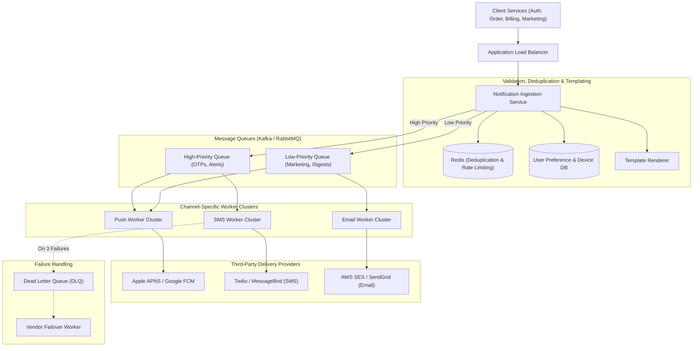

# Case Study 04 — Distributed Notification System

## 1. Problem
Design a high-scale, multi-channel notification platform capable of delivering tens of millions of notifications per day across iOS Push (APNS), Android Push (FCM), SMS (Twilio), and Email (SendGrid/AWS SES). The system must support priority routing (e.g., instant 2FA OTPs vs scheduled promotional newsletters), user notification preferences, rate limiting, and deduplication.

---

## 2. Functional Requirements
1. **Multi-Channel Support**: Deliver notifications via iOS Push, Android Push, SMS, and Email.
2. **Priority Tiers**: Support **High-Priority** (OTPs, fraud alerts $\to$ $< 5\text{s}$ delivery) and **Low-Priority** (marketing, weekly digests $\to$ bulk throughput).
3. **User Notification Settings**: Respect user preferences (e.g., "SMS disabled", "Do Not Disturb 10 PM–8 AM").
4. **Template Engine**: Dynamic parameter interpolation (e.g., `Hello {name}, your code is {otp}`).
5. **Deduplication & Idempotency**: Prevent sending duplicate notifications for the same event within a time window.
6. **Delivery Tracking**: Track message states: `QUEUED`, `SENT`, `DELIVERED`, `FAILED`.

---

## 3. Non-Functional Requirements
1. **High Reliability & Zero Loss for Critical Alerts**: Critical 2FA codes and billing receipts must never be silently dropped.
2. **High Throughput**: Capable of processing bursts of $10,000+\text{ notifications/sec}$.
3. **Pluggable Architecture**: Easily swap or add third-party vendors (e.g., failover from Twilio to MessageBird) with zero downtime.
4. **Low Latency**: High-priority notifications delivered to downstream vendor in $< 1\text{ second}$.

---

## 4. Assumptions & Constraints
- 50 Million notifications sent daily.
- 5% are High Priority (OTPs, alerts); 95% are Low Priority (marketing, newsletters).
- Third-party delivery providers (APNS, FCM, Twilio) have varying latency and rate limits.

---

## 5. Practical Scale Estimation

### Traffic Calculations
- **Daily Volume**: $50\text{ Million notifications/day}$.
- **Average Throughput**:
  $$\text{Average RPS} = \frac{50,000,000}{86,400\text{ s}} \approx 600\text{ notifications/sec}$$
- **Peak Throughput ($5\times$ during flash marketing campaigns)**: $3,000\text{ notifications/sec}$.
- **High-Priority Ingestion**: $\approx 150\text{ RPS}$ (Peak: $500\text{ RPS}$).

### Storage Estimation (3-Year Audit Log)
- Notification record: `notification_id` (16B), `user_id` (8B), `channel` (8B), `content_preview` (100B), `status` (8B), `timestamps` (16B) $\approx 200\text{ bytes}$.
- **Storage per Year**: $50\text{M/day} \times 200\text{ bytes} \times 365 \approx 3.65\text{ TB/year}$.
- **3-Year Storage**: $\approx 11\text{ TB}$ (Stored in Cassandra or PostgreSQL partitioned by month).

---

## 6. API Design

### 1. Send Notification
- **Endpoint**: `POST /api/v1/notifications/send`
- **Headers**: `Idempotency-Key: 9b1deb4d-3b7d-4bad-9bdd`
- **Request Body**:
```json
{
  "user_id": "usr_99",
  "priority": "HIGH", 
  "channels": ["SMS", "PUSH"],
  "template_id": "tpl_otp_login",
  "template_data": {
    "name": "Alex",
    "otp": "849201"
  }
}
```
- **Response** (`202 Accepted`):
```json
{
  "notification_id": "notif_10029384",
  "status": "QUEUED"
}
```

---

## 7. Data Model

```sql
-- User Notification Preferences
CREATE TABLE user_preferences (
    user_id BIGINT PRIMARY KEY,
    sms_enabled BOOLEAN DEFAULT TRUE,
    email_enabled BOOLEAN DEFAULT TRUE,
    push_enabled BOOLEAN DEFAULT TRUE,
    quiet_hours_start TIME, -- e.g., '22:00:00'
    quiet_hours_end TIME    -- e.g., '08:00:00'
);

-- Device Tokens for Push Notifications
CREATE TABLE user_devices (
    device_id VARCHAR(128) PRIMARY KEY,
    user_id BIGINT NOT NULL,
    platform VARCHAR(16) NOT NULL, -- 'IOS', 'ANDROID'
    push_token VARCHAR(512) NOT NULL,
    updated_at TIMESTAMP WITH TIME ZONE DEFAULT CURRENT_TIMESTAMP
);
CREATE INDEX idx_user_devices_user ON user_devices(user_id);

-- Notification Log
CREATE TABLE notification_logs (
    notification_id VARCHAR(64) PRIMARY KEY,
    user_id BIGINT NOT NULL,
    channel VARCHAR(16) NOT NULL,
    priority VARCHAR(16) NOT NULL,
    status VARCHAR(32) NOT NULL, -- 'QUEUED', 'SENT', 'FAILED', 'DELIVERED'
    error_message TEXT,
    created_at TIMESTAMP WITH TIME ZONE DEFAULT CURRENT_TIMESTAMP
);
```

---

## 8. High-Level Architecture



---

## 9. Request / Data Flow

### Step-by-Step Notification Processing Flow:
1. **Ingress**: Auth Service sends `POST /notifications/send` with `priority = HIGH` and `Idempotency-Key`.
2. **Deduplication Check**: Ingestion service checks Redis `SETNX dedup:user_99:tpl_otp_login 1 EX 60`. If key exists, drop duplicate request.
3. **Preference & Device Resolution**: Fetches user's notification settings and active device tokens from Cache/DB. If user disabled SMS, route to Push instead.
4. **Template Rendering**: Merges template string with parameters (`849201`).
5. **Priority Queue Publishing**:
   - High-Priority items published to `kafka.notifications.high_priority`.
   - Marketing messages published to `kafka.notifications.low_priority`.
6. **Worker Processing & Rate Limiting**:
   - Channel workers consume from the queue and enforce downstream vendor rate limits using Token Bucket in Redis.
7. **Delivery & Third-Party Fallback**:
   - Worker sends SMS via Twilio API.
   - If Twilio returns `503 Service Unavailable`, worker retries with Exponential Backoff. If failure persists, it falls back to MessageBird.
8. **Logging**: State updated to `SENT` in `notification_logs`.

---

## 10. Prioritization & Queue Isolation
- **The Problem with a Single Shared Queue**: If the marketing team sends a 5-million-user newsletter blast at 2:00 PM, a critical 2FA OTP sent at 2:01 PM will be stuck at position 3,000,000 in the queue, taking 20 minutes to arrive!
- **The Solution: Physical Queue Isolation**:
  - **High-Priority Queue**: Dedicated workers with 0-second queue wait times, reserved strictly for OTPs and transaction alerts.
  - **Low-Priority Queue**: Scaled separately for bulk marketing jobs with lower concurrency.

---

## 11. Deduplication & Idempotency
- **Why it matters**: Network retries between upstream services and the notification gateway can trigger duplicate SMS sends, confusing users and doubling costs.
- **Mechanism**:
  - Hash key: `SHA256(user_id + template_id + payload_hash)`.
  - Stored in Redis with a 5-minute TTL: `SETNX notif:dedup:{hash} 1 EX 300`.
  - If `SETNX` returns 0, the event is flagged as a duplicate and immediately acknowledged without re-sending.

---

## 12. Database Choice
- **User Preferences & Device Tokens**: **PostgreSQL / MySQL** with Read Replicas (Relational queries by `user_id`, high consistency).
- **Notification Logs & Tracking**: **Cassandra / ClickHouse** (Write-heavy append-only event log partitioned by `created_date`).

---

## 13. Caching Strategy
- **User Preferences & Devices**: Cached in Redis with Cache-Aside (`user:prefs:usr_99`). Invalidated on user settings update.
- **Templates**: Cached in local memory (Caffeine/Guava) inside worker instances since templates change rarely.

---

## 14. Scaling Strategy ($1K \to 100K \to 10M \to 50M$ Notifications)
- **1,000/day**: Single web server running Celery workers with SQLite/Postgres.
- **100,000/day**: RabbitMQ queues + dedicated worker pools for SMS and Email.
- **10,000,000/day**:
  - Apache Kafka topics partitioned by `user_id` to maintain per-user ordering.
  - Dedicated Redis cluster for distributed rate limiting and deduplication.
- **50,000,000+/day**:
  - Multi-region worker deployment.
  - Dynamic vendor routing (routing traffic to the lowest-cost vendor with the highest current delivery rate).

---

## 15. Reliability & Fault Tolerance
- **Dead Letter Queues (DLQ)**: If a notification fails 3 retries (due to invalid phone number or vendor outage), it is routed to a DLQ for manual inspection or secondary fallback.
- **Third-Party Vendor Failover**: SMS workers maintain a circuit breaker. If Twilio error rate exceeds 15%, the circuit breaker trips to `Open` and automatically routes subsequent SMS traffic to MessageBird/AWS SNS.

---

## 16. Security Considerations
- **PII & Data Protection**: Sensitive fields (like OTPs or reset passwords) are masked in logs (`Code: ******`).
- **Encrypted Device Tokens**: Push notification tokens stored encrypted at rest with AES-256.

---

## 17. Key Trade-offs
- **Queue Isolation vs Infrastructure Cost**: Maintained separate physical queues and worker pools for High vs Low priority, increasing server costs in exchange for guaranteed <2s OTP delivery.
- **Eventual Consistency vs Sync Delivery**: Sacrificed synchronous HTTP response to client in exchange for non-blocking asynchronous queue processing.

---

## 18. Bottlenecks (What Breaks First?)
- **The First Bottleneck**: **Third-party vendor rate limits** (e.g., Twilio rejecting requests with HTTP 429 when concurrency surges).
- *Fix*: Channel workers strictly respect vendor rate limits using a local Token Bucket rate limiter before firing requests.

---

## 19. Interview Follow-ups & Conversational Answers

### Interviewer: "How do you guarantee that a user never receives the same promotional email twice?"
> **Good Answer**: "We implement a two-tier deduplication check. First, at the API Gateway, we check an `Idempotency-Key` sent by the upstream scheduler. Second, the Ingestion Service computes a deduplication hash of `(user_id, campaign_id, date)` and executes a Redis atomic `SETNX` with a 24-hour expiration. If the key exists, the message is discarded before reaching the message queue."

### Interviewer: "What happens if Apple APNS goes down completely for 30 minutes?"
> **Good Answer**: "The Push notification worker detects connection timeouts and trips a Circuit Breaker to `Open`. Messages remain safely buffered in the Kafka Push topic without being lost. The worker pauses consumption for 30 seconds between probes. Once APNS recovers, the worker resumes consuming messages at a controlled rate without overwhelming APNS."

---

## 20. 2-Minute Interview Verbal Script
> "To design a distributed, multi-channel notification platform handling 50M notifications daily:
> 
> The core architectural challenge is **handling priority tiers and third-party vendor rate limits**.
> 
> When client services call the Notification Ingestion API, the service performs **atomic Redis deduplication** and checks user preferences and device tokens from cache.
> 
> To prevent marketing campaigns from starving critical OTPs, I implement **Physical Queue Isolation**:
> - **High-Priority Queue**: Dedicated Kafka topic for OTPs and fraud alerts with dedicated workers guaranteeing $< 2\text{s}$ delivery.
> - **Low-Priority Queue**: Scaled separately for bulk marketing emails and digests.
> 
> Dedicated channel worker clusters (SMS, Push, Email) consume messages and enforce vendor rate limits using token buckets. If a vendor like Twilio fails, circuit breakers automatically fail over to a backup provider like MessageBird, while permanent failures route to a Dead Letter Queue."

---

## Reusable Patterns Extracted

| Pattern | Why It Was Used | Other Systems Where It Applies |
|---|---|---|
| **Priority Queue Isolation** | Prevents large bulk jobs from starving latency-critical transactions. | Payment processing, Video transcoding queues, CI/CD builds. |
| **Vendor Circuit Breaker & Failover** | Gracefully handles third-party API outages and rate limits. | Payment gateways (Stripe $\to$ PayPal), SMS gateways, Mapping APIs. |
| **Atomic Redis Deduplication (`SETNX`)** | Prevents duplicate actions caused by network retries. | E-commerce orders, Webhook event ingestion, Financial transfers. |
| **Dead Letter Queue (DLQ)** | Isolates poison-pill messages and permanently failing events for inspection. | Async background workers, Event-driven microservices. |
