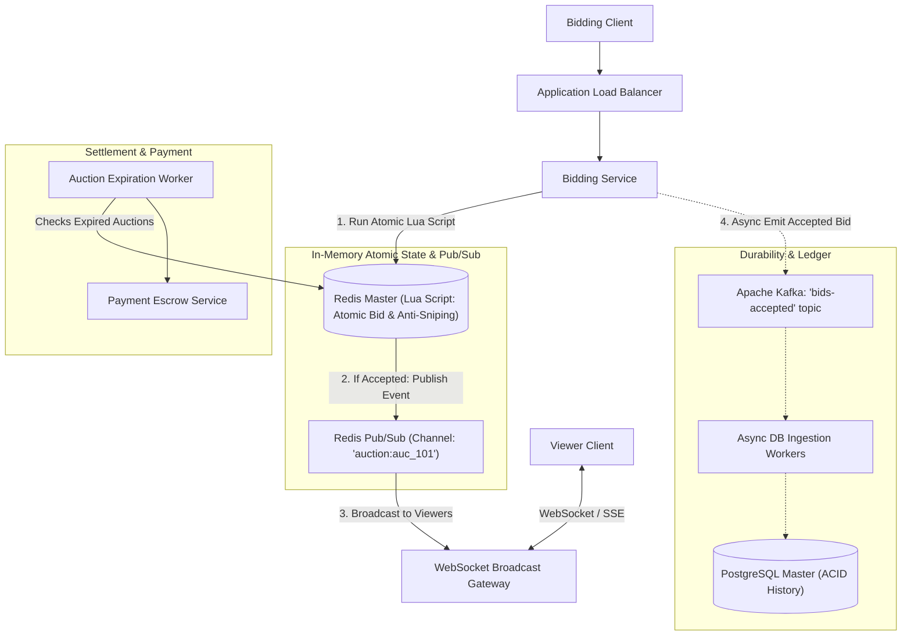

# Case Study 06 — Real-Time Auction Platform (e.g., eBay / Sotheby's Live)

## 1. Problem
Design a high-concurrency, real-time live auction platform where thousands of users place competing bids on items with a live countdown timer. The system must process bids in sub-milliseconds, **strictly guarantee that only higher bids are accepted**, broadcast the new highest bid to all active bidders in $< 200\text{ms}$, and dynamically extend the timer by 60 seconds if a bid arrives in the final 30 seconds (anti-sniping protection).

---

## 2. Functional Requirements
1. **Create & List Auctions**: Sellers can list auction items with starting price, reserve price, and end time.
2. **Real-Time Bidding**: Bidders place bids; a bid is accepted only if `bid_amount >= current_highest_bid + min_increment`.
3. **Live Bid & Timer Broadcast**: All active viewers on the auction page receive instant updates of new highest bids and remaining time.
4. **Anti-Sniping (Soft Close)**: If a bid is accepted in the final 30 seconds, automatically extend the auction end time by 60 seconds.
5. **Auction Settlement**: When the timer hits zero, declare the winning bidder and initiate payment escrow.

---

## 3. Non-Functional Requirements
1. **Strict Data Consistency for Bids**: Two concurrent bids must never corrupt the highest bid state; bids must be strictly serialized.
2. **Ultra-Low Latency**: Bid broadcast latency $< 200\text{ms}$ to all connected clients.
3. **High Availability ($99.99\%$)**: Platform must not crash during final seconds of high-value auctions.
4. **Auditability**: Complete, tamper-proof historical ledger of every bid attempt.

---

## 4. Assumptions & Constraints
- 10,000 concurrent active auctions.
- Popular celebrity auction can attract 50,000 concurrent viewers and 2,000 bids/second in the final 60 seconds.

---

## 5. Practical Scale Estimation

### Traffic Calculations
- **Active Viewer Read Traffic**: 50,000 viewers listening to real-time WebSocket / SSE streams per hot auction.
- **Peak Bidding Write Traffic**: 2,000 bids/sec per active hot auction.
- **Platform-wide Average RPS**: 10,000 read requests/sec, 500 bid writes/sec.

### Storage Estimation (5 Years)
- Auction Item: 1 KB. 1 Million auctions/year $\to 1\text{ GB/year}$.
- Bids Ledger: 100 bytes per bid. 100 Million bids/year $\to 10\text{ GB/year}$.
- *Conclusion*: Storage footprint is lightweight ($\approx 50\text{ GB}$ over 5 years); the primary challenge is **in-memory concurrency and low-latency broadcast**.

---

## 6. API Design

### 1. Place a Bid
- **Endpoint**: `POST /api/v1/auctions/{auction_id}/bids`
- **Headers**: `Idempotency-Key: uuid-9988`
- **Request Body**:
```json
{
  "bidder_id": "usr_777",
  "bid_amount": 1500.00
}
```
- **Response** (`200 OK`):
```json
{
  "status": "ACCEPTED",
  "auction_id": "auc_101",
  "highest_bid": 1500.00,
  "highest_bidder_id": "usr_777",
  "end_time": "2026-09-11T20:01:30Z"
}
```
- **Response on Rejection** (`400 Bad Request`):
```json
{
  "status": "REJECTED",
  "error": "OUTBID",
  "current_highest_bid": 1550.00
}
```

### 2. Real-Time Stream (WebSockets / SSE)
- **Endpoint**: `WSS /ws/auctions/{auction_id}`
- **Broadcast Event**:
```json
{
  "type": "NEW_HIGHEST_BID",
  "auction_id": "auc_101",
  "highest_bid": 1500.00,
  "bidder_name": "Alex***",
  "remaining_seconds": 75
}
```

---

## 7. Data Model

### PostgreSQL Relational Schema (ACID Master Record)
```sql
CREATE TABLE auctions (
    auction_id VARCHAR(32) PRIMARY KEY,
    seller_id BIGINT NOT NULL,
    title VARCHAR(256) NOT NULL,
    current_highest_bid DECIMAL(12, 2) NOT NULL,
    highest_bidder_id BIGINT,
    min_increment DECIMAL(10, 2) DEFAULT 10.00,
    end_time TIMESTAMP WITH TIME ZONE NOT NULL,
    status VARCHAR(16) DEFAULT 'ACTIVE', -- 'ACTIVE', 'COMPLETED', 'CANCELLED'
    version INT DEFAULT 1 -- For Optimistic Concurrency
);

CREATE TABLE bids_history (
    bid_id BIGINT GENERATED ALWAYS AS IDENTITY PRIMARY KEY,
    auction_id VARCHAR(32) NOT NULL,
    bidder_id BIGINT NOT NULL,
    bid_amount DECIMAL(12, 2) NOT NULL,
    created_at TIMESTAMP WITH TIME ZONE DEFAULT CURRENT_TIMESTAMP
);
CREATE INDEX idx_bids_auction ON bids_history(auction_id, bid_amount DESC);
```

---

## 8. High-Level Architecture



---

## 9. Request / Data Flow

### The Atomic Bidding Flow (Sub-Millisecond Execution):
1. **User places bid** ($1500) via `POST /bids`.
2. **Atomic Execution via Redis Lua Script**:
   - The Bidding Service does **NOT query SQL**. It executes an atomic Lua script directly in Redis RAM:
   ```lua
   -- KEYS[1] = "auction:auc_101"
   -- ARGV[1] = bidder_id, ARGV[2] = bid_amount, ARGV[3] = current_time
   local auction = redis.call('HMGET', KEYS[1], 'highest_bid', 'min_inc', 'end_time', 'status')
   local highest_bid = tonumber(auction[1])
   local min_inc = tonumber(auction[2])
   local end_time = tonumber(auction[3])
   local status = auction[4]
   local new_bid = tonumber(ARGV[2])
   local now = tonumber(ARGV[3])

   if status ~= 'ACTIVE' or now >= end_time then
       return {err = "AUCTION_CLOSED"}
   end
   if new_bid < (highest_bid + min_inc) then
       return {err = "BID_TOO_LOW", highest_bid}
   end

   -- Anti-Sniping: If bid placed in last 30s, extend by 60s
   if (end_time - now) < 30 then
       end_time = end_time + 60
       redis.call('HSET', KEYS[1], 'end_time', end_time)
   end

   -- Update state atomically
   redis.call('HMSET', KEYS[1], 'highest_bid', new_bid, 'highest_bidder', ARGV[1])
   return {"SUCCESS", new_bid, end_time}
   ```
3. **Single-Threaded Atomicity**: Because Redis runs Lua scripts atomically in a single thread, **race conditions are physically impossible**. Bids are strictly serialized in RAM ($< 1\text{ms}$).
4. **Real-Time Broadcast**:
   - If Lua script returns `SUCCESS`, Bidding Service publishes the update to Redis Pub/Sub: `PUBLISH auction:auc_101 {...}`.
   - All WebSocket Broadcast Gateways receive the event and push it down 50,000 client sockets in $< 50\text{ms}$.
5. **Asynchronous Durability**:
   - Bid event published to Kafka; async workers write the audit log to PostgreSQL `bids_history`.

---

## 10. Anti-Sniping (Soft Close) Mechanism
- **The Problem with Hard Closes**: Malicious bots submit bids at 23:59:59.999 to win without allowing real humans to counter-bid ("sniping").
- **Solution**: Dynamic Timer Extension. If a bid is accepted within 30 seconds of closing, the auction end time extends by 60 seconds. The countdown automatically synchronizes via the WebSocket broadcast frame.

---

## 11. Settlement & Payment Escrow
1. When auction ends (`end_time` reached):
2. Expiration worker acquires Redis lock for `auc_101`, updates status to `COMPLETED` in PostgreSQL.
3. Winner's pre-authorized payment method is charged via Payment Gateway.
4. If payment fails after 3 retries, system automatically notifies the second-highest bidder (Runner-Up offer).

---

## 12. Database Choice
- **In-Memory Auction State**: **Redis Hashes + Lua Scripts** for single-threaded atomic bid evaluation and sub-millisecond execution.
- **Historical Ledger & Financial Records**: **PostgreSQL** with strict foreign keys and transactional auditing.

---

## 13. Caching & Broadcast Strategy
- **WebSocket Gateways** subscribe to Redis Pub/Sub channels.
- Read traffic (viewers watching price tick up) is completely isolated from the write traffic (bidders submitting transactions).

---

## 14. Scaling Strategy ($1K \to 100K \to 10M$ Bidders)
- **1,000 Bidders**: Single PostgreSQL instance with `SELECT ... FOR UPDATE` row locks.
- **100,000 Bidders**:
  - Redis Master for atomic Lua script bids + Redis Pub/Sub.
  - 10 WebSocket Broadcast Gateways handling 10,000 connections each.
- **10,000,000 Bidders**:
  - Redis Cluster sharded by `auction_id` (each auction lives entirely on one Redis node to preserve atomic Lua transactions).
  - Edge SSE (Server-Sent Events) via Cloudflare Workers for viewer broadcasting.

---

## 15. Reliability & Fault Tolerance
- **Redis Master Failover**: Redis AOF (Append-Only File) persistence with `fsync=always` enabled. Redis Sentinel promotes replica within 3 seconds upon failure.
- **Network Clock Drift**: All timer calculations are evaluated strictly using **Server Time (UTC)**, never trusting client device clocks.

---

## 16. Security Considerations
- **Pre-authorization of Funds**: Bidders must place a temporary $50 credit hold before bidding to prevent spam bots from submitting fake billion-dollar bids.
- **Rate Limiting**: Max 5 bids per second per user ID to prevent automated script spamming.

---

## 17. Key Trade-offs
- **Redis In-Memory State vs Pure SQL**: Sacrificed immediate synchronous SQL durability in exchange for handling 2,000 bids/sec in sub-millisecond Lua script RAM.
- **Anti-Sniping Extension vs Fixed Ending**: Sacrificed deterministic auction close times in exchange for maximum fair revenue realization.

---

## 18. Bottlenecks (What Breaks First?)
- **The First Bottleneck**: **Redis Pub/Sub message fanout saturation** if 100,000 viewers are connected to a single gateway node.
- *Fix*: Decouple WebSocket servers across a cluster; use SSE at the CDN edge for viewer streaming.

---

## 19. Interview Follow-ups & Conversational Answers

### Interviewer: "Why use a Redis Lua script instead of standard database transactions for bidding?"
> **Good Answer**: "In the final 10 seconds of a hot auction, thousands of bids arrive per second for the same item. Executing SQL transactions with pessimistic row locks (`SELECT FOR UPDATE`) causes severe DB lock contention and connection pool exhaustion. A Redis Lua script executes atomically in memory within 0.2ms in a single thread, evaluating the bid condition, extending the anti-sniping timer, and setting the new price with zero race conditions."

### Interviewer: "How do you prevent bidders from manipulating their client clock to bid after the auction expired?"
> **Good Answer**: "The client clock is completely untrusted. The Redis Lua script compares the current server Unix timestamp (`redis.call('TIME')`) against the auction's `end_time`. If the server clock indicates the auction has ended, the bid is rejected regardless of what the client device's clock displays."

---

## 20. 2-Minute Interview Verbal Script
> "To design a real-time live auction platform like eBay:
> 
> The core challenge is **serializing high-frequency bids and broadcasting price updates in sub-milliseconds without race conditions**.
> 
> To achieve this:
> 1. We isolate active auction state in **Redis RAM**. When a bid arrives, the Bidding Service executes an **Atomic Redis Lua Script**. Because Redis is single-threaded, the script checks if the bid is valid (`bid >= highest + min_inc`), extends the anti-sniping timer if within 30s of closing, and updates the highest bid in $< 1\text{ms}$ with guaranteed zero race conditions.
> 2. Upon acceptance, the event is published to **Redis Pub/Sub**, and a cluster of **WebSocket/SSE Gateways** broadcasts the new price and timer to 50,000 connected viewers in $< 50\text{ms}$.
> 3. Bids are asynchronously streamed to **Apache Kafka** to persist the permanent audit ledger in **PostgreSQL**.
> 4. When the server timer expires, an automated worker marks the auction completed and triggers payment escrow."

---

## Reusable Patterns Extracted

| Pattern | Why It Was Used | Other Systems Where It Applies |
|---|---|---|
| **Atomic Redis Lua Scripts** | Evaluates complex multi-step condition & write atomically in RAM. | Rate limiting (Sliding window), Inventory counters, Leaderboard rank updates. |
| **Pub/Sub Live Broadcast** | Separates 1 write from 50,000 listening read streams. | Live sports commentary, Crypto price tickers, Stock order books. |
| **Server-Authoritative Clock** | Prevents client clock tampering in time-sensitive transactions. | Online gaming timers, Flash sale unlocks, 2FA OTP validation. |
| **Anti-Sniping Dynamic Extension** | Extends expiration triggers dynamically based on last-second events. | Domain name auctions, High-frequency trade settlements. |
