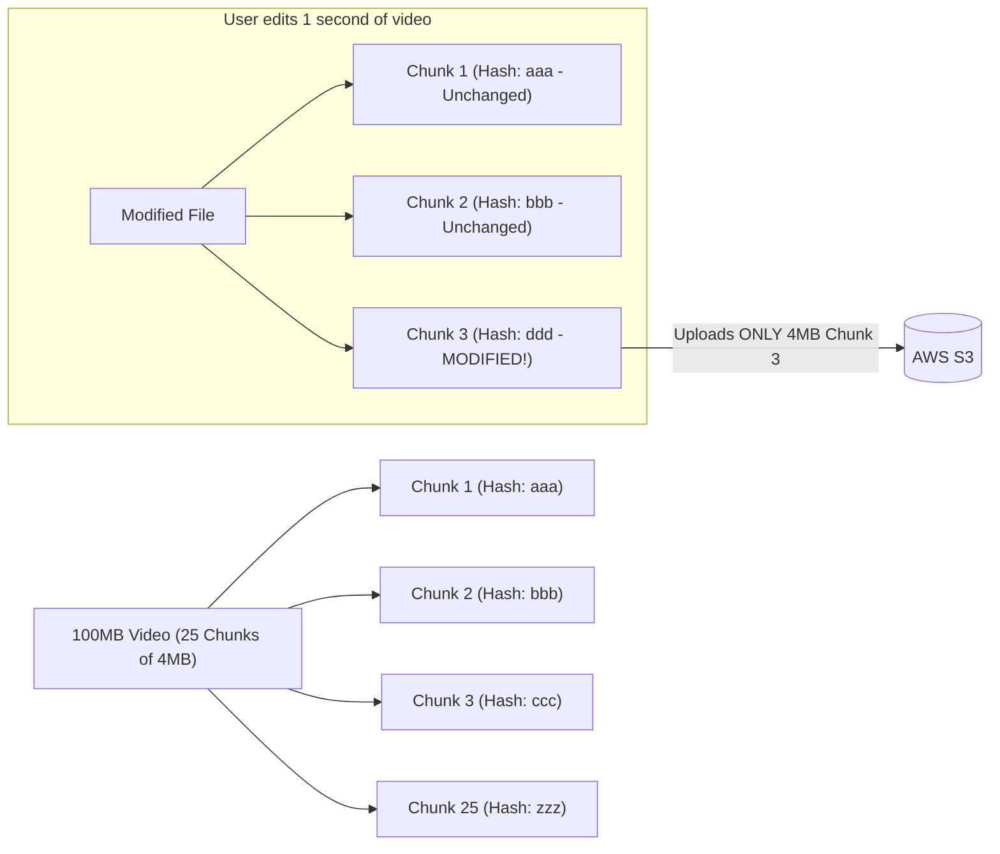

# Case Study 08 — Cloud File Storage & Sync Service (e.g., Google Drive / Dropbox)

## 1. Problem
Design a high-scale cloud file storage and cross-device synchronization service (like Dropbox or Google Drive). The system must allow users to upload and download large files (up to 50GB), synchronize file edits across multiple devices in near real-time, preserve file version history, minimize bandwidth consumption via chunking and deduplication, and handle resumable uploads over unreliable networks.

---

## 2. Functional Requirements
1. **File Upload & Download**: Upload files up to 50GB; download files and folders.
2. **Cross-Device File Synchronization**: When a file is modified on Device A (e.g., Laptop), the changes automatically sync to Device B (e.g., Phone) within seconds.
3. **File Versioning**: Maintain revision history for up to 30 days; allow users to view and restore past versions.
4. **Resumable Uploads**: If network disconnects midway through a 10GB upload, resume from the exact last uploaded chunk without restarting.
5. **Sharing & Permissions**: Share files/folders with `VIEW` or `EDIT` permissions.

---

## 3. Non-Functional Requirements
1. **Extreme Data Durability ($99.999999999\%$ — "Eleven Nines")**: Data must never be lost.
2. **Bandwidth Optimization**: Only upload/sync modified chunks of a file (Delta Sync), never re-uploading the entire multi-gigabyte file.
3. **High Availability ($99.99\%$)**: Instant access to metadata and file downloads.
4. **Strong Consistency for Metadata**: Users must always see the latest committed file revision.

---

## 4. Assumptions & Constraints
- 50 Million Daily Active Users (DAU).
- Average user modifies/uploads 2 files per day; average file size = 2 MB.
- 10% of files have identical chunks across different users (deduplication opportunity).

---

## 5. Practical Scale Estimation

### Traffic Calculations
- **Total Uploads/Updates per Day**: $50\text{M users} \times 2\text{ files} = 100\text{ Million file updates/day}$.
- **Average Write RPS**:
  $$\text{Write RPS} = \frac{100,000,000}{86,400\text{ s}} \approx 1,150\text{ writes/sec (Peak: } 3,000\text{ RPS)}$$
- **Total Daily Data Ingestion**: $100\text{M} \times 2\text{ MB} = 200\text{ TB/day}$.

### Storage Estimation (5 Years)
- **5-Year Raw File Data**: $200\text{ TB/day} \times 365 \times 5 \approx 365\text{ Petabytes}$ (Stored in AWS S3 Object Storage).
- **Storage with Deduplication ($15\%$ savings)**: $\approx 310\text{ PB}$.
- **Metadata Storage**: $\approx 100\text{ Billion file chunks} \times 100\text{ bytes} \approx 10\text{ TB}$ (Stored in PostgreSQL / Cassandra).

---

## 6. API Design

### 1. Initiate Resumable Upload
- **Endpoint**: `POST /api/v1/files/upload/init`
- **Request Body**:
```json
{
  "file_name": "presentation.key",
  "file_size": 104857600,
  "total_chunks": 25,
  "chunk_hashes": ["sha256_chunk_1", "sha256_chunk_2", "..."]
}
```
- **Response** (`200 OK`):
```json
{
  "upload_session_id": "sess_998877",
  "existing_chunks": ["sha256_chunk_1", "sha256_chunk_5"],
  "upload_urls": {
    "sha256_chunk_2": "https://s3.aws.com/presigned_url_chunk_2",
    "sha256_chunk_3": "https://s3.aws.com/presigned_url_chunk_3"
  }
}
```

### 2. Commit File Version
- **Endpoint**: `POST /api/v1/files/upload/commit`
- **Request Body**:
```json
{
  "upload_session_id": "sess_998877",
  "file_id": "fil_123",
  "parent_folder_id": "fld_456",
  "ordered_chunk_hashes": ["sha256_1", "sha256_2", "sha256_3"]
}
```

---

## 7. Data Model

### PostgreSQL Metadata Schema
```sql
CREATE TABLE files (
    file_id VARCHAR(64) PRIMARY KEY,
    owner_id BIGINT NOT NULL,
    parent_folder_id VARCHAR(64),
    name VARCHAR(256) NOT NULL,
    latest_version INT NOT NULL DEFAULT 1,
    is_deleted BOOLEAN DEFAULT FALSE,
    created_at TIMESTAMP WITH TIME ZONE DEFAULT CURRENT_TIMESTAMP
);

CREATE TABLE file_versions (
    file_id VARCHAR(64) NOT NULL,
    version_num INT NOT NULL,
    file_size BIGINT NOT NULL,
    created_at TIMESTAMP WITH TIME ZONE DEFAULT CURRENT_TIMESTAMP,
    PRIMARY KEY (file_id, version_num)
);

CREATE TABLE file_chunks (
    file_id VARCHAR(64) NOT NULL,
    version_num INT NOT NULL,
    chunk_index INT NOT NULL,
    chunk_hash VARCHAR(64) NOT NULL, -- SHA-256 Hash
    PRIMARY KEY (file_id, version_num, chunk_index)
);

-- Global Deduplication Registry
CREATE TABLE global_chunks (
    chunk_hash VARCHAR(64) PRIMARY KEY, -- SHA-256
    s3_key VARCHAR(256) NOT NULL,
    chunk_size INT NOT NULL,
    reference_count INT NOT NULL DEFAULT 1
);
```

---

## 8. High-Level Architecture

```mermaid
flowchart TD
    ClientApp["Client App (Desktop / Mobile Daemon)"] --> ALB[Application Load Balancer]
    
    subgraph Microservices["Stateless Control Plane"]
        MetaService[Metadata Service]
        SyncService[Sync & Notification Service]
        AuthService[Auth & Permission Service]
    end
    
    ALB --> MetaService
    ALB --> SyncService
    ALB --> AuthService
    
    subgraph DirectStorageTier["Direct Object Storage (Data Plane)"]
        S3[("AWS S3 Block Store (Encrypted 4MB Chunks)")]
    end
    
    subgraph MetaStorage["Metadata & Chunk Registry"]
        MetaDB[("PostgreSQL Master (Files, Versions, Chunks)")]
        MetaReplica[("PostgreSQL Read Replica")]
        RedisCache[("Redis Metadata Cache")]
    end
    
    subgraph RealTimeSync["Real-Time Sync Push"]
        Kafka[Apache Kafka: 'file-changes' topic]
        SyncGateway[WebSocket / Long-Polling Gateway]
    end

    ClientApp -->|1. Check Existing Hashes (Dedup)| MetaService
    MetaService --> MetaDB
    MetaService --> RedisCache
    
    ClientApp -->|2. Upload Missing Chunks Directly via Pre-signed S3 URLs| S3
    ClientApp -->|3. Commit File Version| MetaService
    
    MetaService -->|4. Publish FileChanged Event| Kafka
    Kafka --> SyncGateway
    SyncGateway -->|5. Push Delta Sync Notification| ClientDevice2["Client Device B (Phone)"]
    ClientDevice2 -->|6. Download only new chunks| S3
```

---

## 9. Core Architectural Mechanisms

### 1. Chunking & Delta Sync (The Dropbox Secret)
- Instead of treating a 1GB file as a monolithic blob, the client split the file into fixed **4MB chunks**.
- When a user edits 1 paragraph in a 500-page document:
  1. Client recalculates SHA-256 hashes for all chunks.
  2. Only **1 chunk out of 250 chunks** has a modified hash!
  3. Client uploads **only that single 4MB chunk** to S3, saving 99.6% of bandwidth!



---

### 2. Client-Side Deduplication (Cross-User Storage Optimization)
1. Before uploading any chunk, the client computes its SHA-256 hash `sha256_chunk_x`.
2. Client queries Metadata Service: *"Does `sha256_chunk_x` already exist in global storage?"*
3. If **YES** (another user already uploaded this identical chunk):
   - Service increments `reference_count` in `global_chunks` table.
   - **Upload is skipped entirely!** The file version points to the existing chunk in S3. Instant upload!
4. If **NO**:
   - Service generates a secure **Pre-signed AWS S3 URL**, and the client uploads the raw 4MB chunk directly to S3.

---

## 10. Data Plane vs Control Plane Separation
- **Control Plane (Metadata Service)**: Handles user authentication, folder hierarchy, permissions, and file metadata. Handles JSON requests only.
- **Data Plane (Direct S3 Transfer)**: Heavy 4MB–50GB binary chunk transfers **never pass through application servers**. Clients upload and download binary chunks **directly to/from AWS S3** using Pre-signed S3 URLs. This prevents application servers from saturating CPU and network bandwidth.

---

## 11. Cross-Device Synchronization Flow
1. User saves `presentation.key` on Laptop (Device A).
2. Desktop sync daemon detects file change, chunks file, and uploads missing chunks to S3.
3. Desktop daemon commits Version 2 to `Metadata Service`.
4. `Metadata Service` writes changes to Postgres and emits a `FileUpdated` event to Apache Kafka.
5. `Sync Gateway` (WebSocket / Long Polling connection) pushes notification to User's Phone (Device B):
   `{ "file_id": "fil_123", "version": 2, "modified_chunks": [3] }`
6. Phone sync daemon queries Metadata Service for Chunk 3's pre-signed URL, downloads 4MB from S3, and reconstructs the file locally in the background.

---

## 12. Conflict Resolution (Offline Editing)
- **Problem**: User edits the same file on Laptop (offline on a plane) and Phone simultaneously.
- **Resolution**:
  - When Device A reconnects and tries to commit Version 2, the server detects Version 2 already exists from Device B.
  - The server **does not overwrite**. It accepts Device A's upload as a **Conflicted Copy** (e.g., `presentation (Alice's conflicted copy 2026-09-11).key`) and notifies the user to merge manually.

---

## 13. Database Choice
- **Metadata, Folder Hierarchy, & Sharing**: **PostgreSQL** (ACID transactions, strict foreign keys, hierarchical recursive queries for folder structures).
- **Binary Chunk Storage**: **AWS S3 / Google Cloud Storage** (Industry-standard $99.999999999\%$ durability, automatic multi-AZ redundancy, immutable blob storage).

---

## 14. Caching Strategy
- **Redis Cache**: Caches file metadata, user quotas, and chunk-to-S3-key mappings to accelerate repeated sync queries.

---

## 15. Scaling Strategy ($1K \to 100K \to 10M \to 50M$ Users)
- **1,000 Users**: Single Web server + S3 + PostgreSQL.
- **100,000 Users**: Pre-signed S3 uploads + Long Polling for sync + Redis metadata cache.
- **10,000,000 Users**:
  - WebSocket gateways for instant push synchronization.
  - Shard PostgreSQL metadata DB by `user_id` or `workspace_id`.
  - Edge S3 Transfer Acceleration using AWS CloudFront edge locations for global uploads.

---

## 16. Reliability & Fault Tolerance
- **S3 Durability**: Object storage automatically replicates chunks across at least 3 physical availability zones.
- **Resumable Upload State**: Upload sessions stored in Redis with 24-hour TTL; if network drops at chunk 24 of 25, client queries session and uploads only chunk 25 upon reconnecting.

---

## 17. Security Considerations
- **Pre-signed URL Expiration**: Pre-signed S3 upload/download URLs expire after 15 minutes.
- **Encryption at Rest**: Chunks encrypted using AES-256 before writing to S3 disk.
- **Client-Side Encryption (Zero-Knowledge)**: Optional client-side chunk encryption using user's private key before transmission.

---

## 18. Key Trade-offs
- **Direct S3 Pre-signed Uploads vs Proxying via App Servers**: Sacrificed centralized application packet inspection in exchange for infinite upload/download bandwidth scalability.
- **Fixed 4MB Chunks vs Variable-Size Rolling Chunks (Rabin Fingerprints)**: Used fixed 4MB chunking for architectural simplicity and low CPU overhead on mobile devices.

---

## 19. Bottlenecks (What Breaks First?)
- **The First Bottleneck**: **PostgreSQL recursive folder queries** when a user moves a folder containing 100,000 nested files.
- *Fix*: Use Materialized Path or Closure Tables for folder hierarchy indexing.

---

## 20. Interview Follow-ups & Conversational Answers

### Interviewer: "Why shouldn't binary file uploads flow through our application microservices?"
> **Good Answer**: "Uploading 10GB files through application servers exhausts server memory buffers, locks HTTP worker threads for minutes, and saturates backend network interfaces. Instead, we decouple the Control Plane from the Data Plane: the application server only issues a secure, time-limited **Pre-signed S3 URL**, allowing the client to stream binary chunks directly to AWS S3. The app server only handles a lightweight 1KB JSON metadata commit."

### Interviewer: "How does client-side deduplication work, and what is its main security risk?"
> **Good Answer**: "Before uploading a 4MB chunk, the client computes its SHA-256 hash and asks the server if it already exists. If it exists, the upload is skipped. The security risk is **Hash Guessing / Unauthorized Confirmation**: an attacker who knows a private document's hash could claim ownership. To prevent this, the server can enforce a **Proof of Ownership** check—requiring the client to sign a random nonce with a key derived from the file content before acknowledging deduplication."

---

## 21. 2-Minute Interview Verbal Script
> "To design a cloud storage and synchronization platform like Dropbox or Google Drive:
> 
> The architecture relies on three foundational pillars: **File Chunking & Delta Sync**, **Separation of Control and Data Planes**, and **Real-Time Notification Sync**.
> 
> 1. Files are split on the client into **4MB chunks** identified by their SHA-256 hashes. When a file is modified, the client only uploads the modified chunks (Delta Sync) and skips chunks that already exist in global storage (Deduplication).
> 2. Binary chunks are uploaded **directly to AWS S3 using Pre-signed URLs**, ensuring application servers never touch heavy binary streams and are never bandwidth-bottlenecked.
> 3. File metadata, folder hierarchies, and chunk mappings are stored in **PostgreSQL**.
> 4. When an upload completes, the Metadata Service emits an event to **Apache Kafka**, prompting **WebSocket/Long-Polling Sync Gateways** to notify the user's other devices to download only the newly modified 4MB chunks."

---

## Reusable Patterns Extracted

| Pattern | Why It Was Used | Other Systems Where It Applies |
|---|---|---|
| **Control Plane vs Data Plane Separation** | Offloads heavy binary streaming directly to S3; keeps app servers lean. | Video streaming platforms, Image sharing services, Artifact registries (Docker Hub). |
| **Chunking & Content-Addressable Storage (CAS)** | Enables delta syncing, resumable uploads, and deduplication via hash keys. | Git version control, BitTorrent, Backup systems (Borg/Restic). |
| **Pre-signed S3 URLs** | Grants secure, direct client-to-storage upload access without credentials. | User avatar uploads, Invoice PDF downloads, Log archive shipping. |
| **Conflicted Copy Resolution** | Gracefully handles offline concurrent edits without data loss. | Collaborative note apps (Notion, Evernote), Distributed document sync. |
