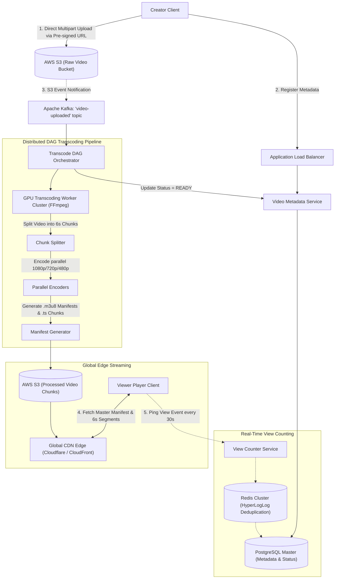
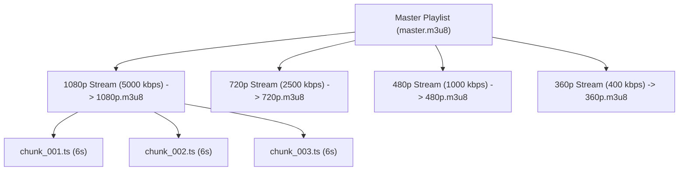

# Case Study 09 — Video Sharing Platform (e.g., YouTube / Netflix)

## 1. Problem
Design a high-scale global video-sharing platform (like YouTube or Netflix) supporting multi-gigabyte video uploads, asynchronous distributed video transcoding pipelines (converting raw videos into multiple resolutions and codecs), Adaptive Bitrate Streaming (HLS / DASH), global CDN video delivery, and real-time view count tracking.

---

## 2. Functional Requirements
1. **Video Upload**: Creators upload raw video files (up to 4K resolution, 50GB size) with resumable multipart capability.
2. **Asynchronous Video Processing (Transcoding)**: Automatically transcode raw uploads into multiple resolutions (`1080p`, `720p`, `480p`, `360p`) and codecs (`H.264`, `VP9`, `AV1`), chunking them into 6-second streaming segments.
3. **Adaptive Bitrate Streaming**: Viewers stream video smoothly, with client players automatically adjusting video quality based on their current network bandwidth.
4. **Search & Metadata**: Search videos by title, tags, and category; view creator channels.
5. **View Counter**: Accurately track view counts while filtering bot abuse and spam.

---

## 3. Non-Functional Requirements
1. **Low Latency Playback (Zero Buffering)**: Time-to-First-Frame $< 500\text{ms}$; zero mid-stream stalls.
2. **High Availability ($99.99\%$)**: Video playback must remain operational globally.
3. **Scalability**: Support 1 Billion Daily Video Views and 500 hours of video uploaded every minute.
4. **Storage Durability**: Stored video chunks must never be lost ($99.999999999\%$ on S3).

---

## 4. Assumptions & Constraints
- 100 Million Daily Active Users (DAU); 1 Billion video views per day.
- 500 hours of video uploaded per minute $\approx 720,000\text{ hours/day}$.
- Read-to-Write ratio is highly asymmetric $\approx 1000:1$.

---

## 5. Practical Scale Estimation

### Traffic Calculations
- **Video Views per Day**: $1\text{ Billion views/day}$.
- **Average Playback RPS**:
  $$\text{Playback RPS} = \frac{1,000,000,000}{86,400\text{ s}} \approx 11,500\text{ requests/sec (Peak: } 30,000\text{ RPS)}$$
- **Video Uploads**: $500\text{ videos/minute} \approx 8.3\text{ uploads/sec}$.

### Storage Estimation (5 Years)
- Average raw uploaded video size = 500 MB.
- Daily Raw Storage: $720,000\text{ videos/day} \times 500\text{ MB} \approx 360\text{ TB/day}$.
- **Transcoded Output**: Transcoding into 4 resolutions increases storage by $\approx 2.5\times \to 900\text{ TB/day}$.
- **5-Year Storage**: $900\text{ TB/day} \times 365 \times 5 \approx 1.6\text{ Exabytes}$ (Stored in AWS S3 with cold storage lifecycle policies).

### Bandwidth Estimation (CDN Ingress/Egress)
- Average video bitrate = 2 Mbps (250 KB/sec).
- **Concurrent Streaming Viewers**: 10 Million viewers.
- **Total Egress Bandwidth**: $10\text{M} \times 2\text{ Mbps} = 20\text{ Tbps}$ (Terabits per second — offloaded $95\%+$ to Global CDNs).

---

## 6. API Design

### 1. Initiate Multipart Video Upload
- **Endpoint**: `POST /api/v1/videos/upload/init`
- **Request Body**:
```json
{
  "title": "System Design SP L3 Masterclass",
  "description": "Complete guide to system design interviews.",
  "file_size": 2147483648,
  "file_format": "mp4"
}
```
- **Response** (`200 OK`):
```json
{
  "video_id": "vid_987654",
  "upload_url": "https://s3.aws.com/raw-videos/vid_987654?signature=xyz"
}
```

### 2. Fetch Video Streaming Manifest (Adaptive Bitrate)
- **Endpoint**: `GET /api/v1/videos/{video_id}/manifest.m3u8`
- **Response**: HLS Master Playlist (Text/M3U8 file containing stream links for 1080p, 720p, 480p, 360p).

---

## 7. Data Model

### PostgreSQL Relational Schema
```sql
CREATE TYPE video_status AS ENUM ('UPLOADED', 'PROCESSING', 'READY', 'FAILED');

CREATE TABLE videos (
    video_id VARCHAR(32) PRIMARY KEY,
    creator_id BIGINT NOT NULL,
    title VARCHAR(256) NOT NULL,
    description TEXT,
    duration_seconds INT NOT NULL,
    status video_status DEFAULT 'UPLOADED',
    manifest_url VARCHAR(512), -- Points to CDN master.m3u8
    thumbnail_url VARCHAR(512),
    view_count BIGINT DEFAULT 0,
    created_at TIMESTAMP WITH TIME ZONE DEFAULT CURRENT_TIMESTAMP
);
CREATE INDEX idx_videos_creator ON videos(creator_id);

CREATE TABLE video_resolutions (
    video_id VARCHAR(32) NOT NULL,
    resolution VARCHAR(16) NOT NULL, -- '1080p', '720p', '480p', '360p'
    codec VARCHAR(16) NOT NULL,      -- 'H264', 'VP9', 'AV1'
    bitrate_kbps INT NOT NULL,
    playlist_url VARCHAR(512) NOT NULL,
    PRIMARY KEY (video_id, resolution, codec)
);
```

---

## 8. High-Level Architecture



---

## 9. Core Streaming Mechanism: Adaptive Bitrate (HLS / DASH)



### How Adaptive Bitrate Streaming Works:
1. When a user clicks "Play", the video player fetches `master.m3u8` from the CDN.
2. The player inspects current network download speeds:
   - On high-speed 5G/Wi-Fi: Player requests `1080p.m3u8` and downloads `chunk_001.ts` (6-second video chunk).
   - If user drives into a tunnel and bandwidth drops: Player seamlessly switches next chunk request to `480p` (`480p/chunk_002.ts`) **without pausing or buffering!**
3. **Every 6-second `.ts` chunk is an independent static file cached permanently at CDN edge servers**.

---

## 10. The Distributed Video Transcoding Pipeline
- **Why it matters**: Transcoding a 2-hour 4K movie on a single machine takes 4 hours.
- **DAG Split-and-Merge Pipeline**:
  1. **Splitter Worker**: Splits the raw 50GB file into hundreds of smaller **60-second raw segments**.
  2. **Parallel Encoding Workers**: 100 GPU workers encode the 60-second segments in parallel across all resolutions (`1080p`, `720p`, `480p`) using FFmpeg.
  3. **Segmenter & Packager**: Splits encoded files into 6-second `.ts` fragments and generates `.m3u8` playlist index files.
  4. **Uploader**: Uploads all chunks and manifests to the `Processed S3 Bucket`.
  5. *Result*: A 2-hour movie is completely processed and ready in **under 5 minutes**!

---

## 11. Real-Time View Count Ingestion (Preventing DB Meltdown)
- **Problem**: 1 Billion views/day = 11,500 view increments/second. Running `UPDATE videos SET view_count = view_count + 1` directly on SQL will crash the database.
- **Solution (Redis HyperLogLog + Write-Behind Batching)**:
  1. Client sends a view ping only after watching $>30\text{ seconds}$ of video.
  2. View Counter Service checks if this `(user_id, video_id)` view was already counted today using **Redis HyperLogLog (HLL)** or Bloom filter (only 12KB RAM per video!).
  3. Increments an in-memory Redis counter: `INCR view_count:vid_987654`.
  4. An asynchronous scheduled worker flushes view count increments in batch every 10 seconds to PostgreSQL:
     ```sql
     UPDATE videos SET view_count = view_count + $batch_count WHERE video_id = 'vid_987654';
     ```

---

## 12. Database Choice
- **Video Metadata & User Channels**: **PostgreSQL / MySQL** with Read Replicas (ACID consistency for creator records and video state transitions).
- **Video Binary Chunks & Manifests**: **AWS S3 Object Storage** (Immutable, highly durable storage with CDN origin integration).
- **Search Indexing**: **ElasticSearch** (Full-text search on titles, descriptions, and video tags).

---

## 13. Caching Strategy
- **Global CDN (Cloudflare / Fastly / CloudFront)**: **95%+ of video traffic is served directly from CDN edge caches**.
- **Edge Cache Optimization**: 6-second video chunks (`.ts` files) are completely immutable; they are cached at the CDN with `Cache-Control: public, max-age=31536000` (1-year TTL).

---

## 14. Scaling Strategy ($1K \to 100K \to 10M \to 1B$ Views)
- **1,000 Views**: Single server + Local file storage + basic HTML5 video tag.
- **100,000 Views**: S3 storage + CloudFront CDN + HLS streaming.
- **10,000,000 Views**: Distributed Celery/Kafka transcoding workers with GPU spot instances.
- **1,000,000,000 Views**:
  - Multi-CDN routing (dynamically routing viewers to the fastest CDN in their region).
  - Open Connect / Edge Appliances (deploying custom storage hardware directly inside ISP data centers, like Netflix).

---

## 15. Reliability & Fault Tolerance
- **Transcoding Worker Failure**: Transcoding tasks are tracked via Kafka consumer offsets. If a worker pod crashes while transcoding chunk 42, the orchestrator automatically re-assigns chunk 42 to another worker.
- **CDN Origin Shielding**: An intermediate caching tier sits between the CDN and S3 to prevent CDN cache misses from hammering the origin S3 bucket.

---

## 16. Security Considerations
- **Content DRM & Encryption**: Encrypt video chunks with AES-128; players fetch decryption keys via secure HTTPS tokens (Widevine / FairPlay).
- **Signed Cookie Access**: Paid content (e.g., Netflix movies) requires signed CDN cookies to prevent unauthorized URL sharing.

---

## 17. Key Trade-offs
- **Chunked S3 Video Storage vs Single File**: Sacrificed file simplicity (storing millions of 6s `.ts` files instead of 1 `.mp4` file) in exchange for zero-buffering Adaptive Bitrate Streaming.
- **Async Transcoding Lag vs Upload Speed**: Allowed a 2-minute processing delay before videos become public in exchange for high-quality multi-device resolution support.

---

## 18. Bottlenecks (What Breaks First?)
- **The First Bottleneck**: **Transcoding queue backlog** during viral events or global holidays.
- *Fix*: Autoscale GPU transcoding worker nodes based on Kafka queue backlog depth.

---

## 19. Interview Follow-ups & Conversational Answers

### Interviewer: "How does Adaptive Bitrate Streaming (HLS) work in practice?"
> **Good Answer**: "The raw video is transcoded into multiple bitrates (e.g., 1080p, 720p, 480p) and sliced into short 6-second `.ts` segments. An `.m3u8` master playlist lists all available stream qualities. The client video player continuously monitors available network throughput and CPU. If it detects network throttling, it dynamically requests the next 6-second segment from the 480p playlist instead of 1080p, preventing any video playback buffering."

### Interviewer: "How do you count 100 Million daily video views without crashing your SQL database?"
> **Good Answer**: "We decouple view counting from the database using Redis. When a user watches $>30\text{s}$, the request hits a View Counter service which checks Redis HyperLogLog to filter bot/duplicate views and increments an in-memory Redis key (`INCR video:views:vid_123`). Background workers flush these batched increments into PostgreSQL every 10 seconds, reducing database writes from 11,500/sec to just 100/sec."

---

## 20. 2-Minute Interview Verbal Script
> "To design a video streaming platform like YouTube or Netflix:
> 
> The architecture separates **Video Ingestion & Transcoding** from **Global Playback Delivery**.
> 
> 1. Creators upload raw video files **directly to AWS S3 using Pre-signed Multipart URLs**.
> 2. Upload completion triggers an event to **Apache Kafka**, initiating an asynchronous **DAG Transcoding Pipeline**. The video is split into 60-second segments, transcoded in parallel across GPU workers into multiple resolutions (1080p down to 360p), sliced into **6-second `.ts` chunks**, and packaged with an **HLS `.m3u8` master playlist**.
> 3. For playback, **95%+ of video traffic is offloaded to a Global CDN**. The client player downloads the master playlist and dynamically switches resolutions between 6-second chunks based on real-time network conditions (Adaptive Bitrate Streaming).
> 4. View counts are deduplicated in memory via **Redis HyperLogLog** and batch-written to PostgreSQL to protect the database from write spikes."

---

## Reusable Patterns Extracted

| Pattern | Why It Was Used | Other Systems Where It Applies |
|---|---|---|
| **Adaptive Bitrate Streaming (HLS/DASH)** | Smooth playback across fluctuating mobile networks by switching resolution per segment. | Audio/Podcast streaming (Spotify), Live game broadcasting (Twitch). |
| **DAG Split-and-Merge Processing** | Cuts multi-hour compute jobs down to minutes via distributed parallel segment workers. | Big data MapReduce, CI/CD artifact building, Image rendering pipelines. |
| **Write-Behind Batch Counters (Redis $\to$ SQL)** | Absorbs tens of thousands of write increments in RAM before flushing to DB in batch. | Social post like counters, Ad click trackers, Game scoreboards. |
| **Edge Cache Immutability** | Static chunks with 1-year cache headers offload 95%+ egress bandwidth from origin. | Software package distribution (npm, apt), Static website assets. |
