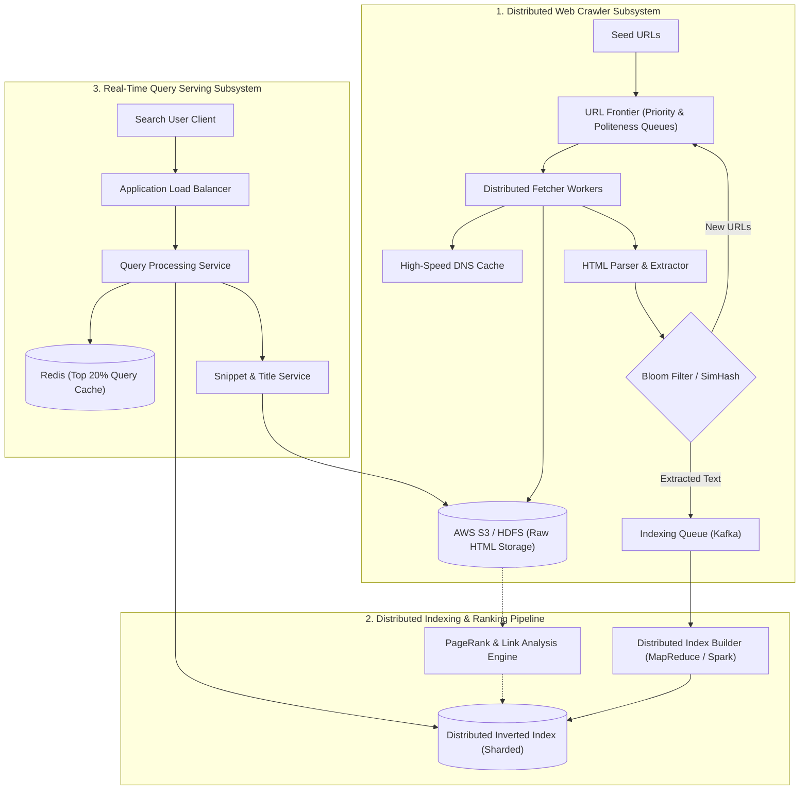
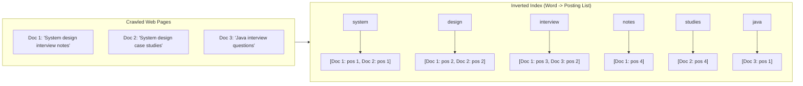
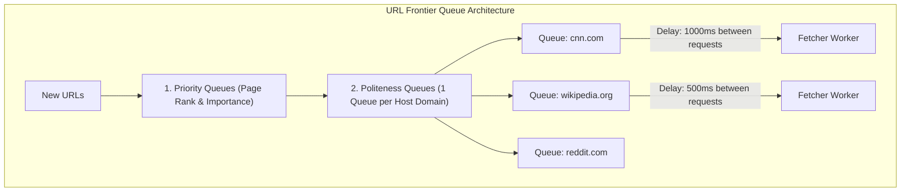

# Case Study 10 — Web Crawler & Search Engine (e.g., Google Search)

## 1. Problem
Design a large-scale web crawler and search engine capable of crawling billions of web pages across the public internet, deduplicating URLs and content, parsing HTML documents, building a distributed **Inverted Index**, ranking search results using relevance algorithms (TF-IDF and PageRank principles), and returning ranked search results in $< 100\text{ms}$.

---

## 2. Functional Requirements
1. **Web Crawling**: Start from a set of seed URLs, crawl web pages recursively, follow links, and store raw HTML.
2. **Politeness & Rules**: Respect `robots.txt` directives and throttle per-domain crawl rates to avoid crashing target web hosts.
3. **Deduplication**: Prevent crawling the same URL multiple times and skip duplicate/mirrored content.
4. **Indexing (Inverted Index)**: Parse HTML, tokenize text, eliminate stop words, stem words, and build an Inverted Index mapping `Word -> [List of Document IDs + Positions]`.
5. **Search Query Execution**: Return ranked, relevant web pages matching multi-keyword search queries with highlighted snippets in $< 100\text{ms}$.

---

## 3. Non-Functional Requirements
1. **Ultra-Low Query Latency**: p99 search query response time $< 100\text{ms}$.
2. **Scalability**: Crawl and index 10 Billion web pages ($> 1\text{ Petabyte}$ raw HTML).
3. **Robustness & Politeness**: Handle crawler traps (infinite dynamic URL loops), malformed HTML, and dead servers gracefully.
4. **Freshness**: Periodically re-crawl high-traffic, frequently updated news pages.

---

## 4. Assumptions & Constraints
- 10 Billion web pages crawled and indexed.
- Average page size = 100 KB (Compressed HTML).
- Search query traffic: 50,000 queries/second.

---

## 5. Practical Scale Estimation

### Crawling & Storage Calculations
- **Total Web Pages**: 10 Billion pages.
- **Raw Storage**:
  $$\text{Storage} = 10\text{ Billion pages} \times 100\text{ KB} \approx 1\text{ Petabyte (Raw HTML)}$$
- **Inverted Index Storage**: $\approx 30\%$ of raw text size $\approx 300\text{ TB}$.
- **Crawling Throughput**: To refresh 10 Billion pages every month (30 days):
  $$\text{Crawl RPS} = \frac{10,000,000,000}{30 \times 86,400\text{ s}} \approx 3,850\text{ pages/sec (400 MB/sec bandwidth)}$$

### Search Query Scale
- **Average Query RPS**: $50,000\text{ queries/sec}$ (Peak: $120,000\text{ RPS}$).
- **Daily Query Volume**: $50,000 \times 86,400 \approx 4.3\text{ Billion queries/day}$.

---

## 6. High-Level Architecture

---

## 7. The Core Mechanism: Inverted Index

### How Query Execution Works:
1. User searches: `"system design interview"`.
2. Query service looks up the **Posting Lists** for `system`, `design`, and `interview` in memory:
   - `system` $\to [Doc\ 1, Doc\ 2]$
   - `design` $\to [Doc\ 1, Doc\ 2]$
   - `interview` $\to [Doc\ 1, Doc\ 3]$
3. **Intersection of Lists**: Computes $[Doc\ 1, Doc\ 2] \cap [Doc\ 1, Doc\ 2] \cap [Doc\ 1, Doc\ 3] = \mathbf{[Doc\ 1]}$.
4. Ranks matching documents by relevance score and returns top 10 URLs with highlighted snippets in $< 20\text{ms}$!

---

## 8. Web Crawler Design & Politeness

### Two Essential Rules of Crawling:
1. **Politeness**: Never flood a single website with 1,000 requests/second. The URL Frontier maintains a dedicated FIFO queue per host domain (`cnn.com`) and enforces a mandatory delay (e.g., 500ms–1s) between requests to the same domain.
2. **Priority**: High-authority domains (e.g., Wikipedia, NYTimes) and frequently changing homepages are assigned high priority and re-crawled daily, while obscure sub-pages are crawled monthly.

---

## 9. Deduplication & Crawler Traps (Level 2 Deep Dive)
- **URL Deduplication**: Before adding a discovered URL to the Frontier, check an in-memory **Bloom Filter** (stores 10 Billion URLs in ~12GB RAM). If bit is already `1`, the URL has already been queued/crawled $\to$ skip!
- **Content Deduplication (SimHash / MinHash)**: Mirror sites or re-published articles have different URLs but identical text. The parser computes a 64-bit **SimHash fingerprint** of the page text. If Hamming distance $< 3$, the page is marked as a duplicate and omitted from the index.
- **Crawler Trap Mitigation**: Prevent crawlers from getting stuck in infinite dynamic loops (e.g., `/calendar?year=2026&month=12&day=31...`) by enforcing maximum URL path depth (e.g., max 10 subdirectories) and limiting total pages crawled per domain.

---

## 10. Relevance Ranking: PageRank & TF-IDF (Level 3 Awareness)
1. **TF-IDF (Term Frequency - Inverse Document Frequency)**:
   - **TF**: How often the search term appears in this specific document.
   - **IDF**: How rare the search term is across all 10 billion documents.
   - Formula: $\text{Score} = \text{TF} \times \log\left(\frac{N}{\text{DF}}\right)$.
2. **PageRank (Link Graph Authority)**:
   - Models web pages as a directed graph. A page's importance is determined by the quantity and quality of backlinks pointing to it:
     $$\text{PR}(A) = (1-d) + d \sum \frac{\text{PR}(T_i)}{C(T_i)}$$
3. **Combined Final Ranking Score**: $\text{Final Rank} = w_1(\text{TF-IDF}) + w_2(\text{PageRank}) + w_3(\text{Click-Through Rate}) + w_4(\text{Freshness})$.

---

## 11. Database & Storage Choice
- **Raw HTML Pages**: **AWS S3 / Distributed Blob Store (HDFS)** (High-capacity, cost-effective sequential storage).
- **Inverted Index**: **Distributed In-Memory Sharded Index (Custom Lucene / RocksDB / BigTable)**.
- **URL Frontier & Host Delays**: **Redis Cluster** (Fast queue pop & domain rate-limiting timers).

---

## 12. Caching Strategy
- **Query Cache (Redis)**: Caches top 20% high-frequency search queries (e.g., "weather", "news", "world cup"). Satisfies 60% of all search queries directly in $< 2\text{ms}$ without hitting the inverted index!
- **DNS Cache**: Fetcher workers maintain a massive in-memory DNS cache to avoid repeated DNS resolution lookups for billions of crawled pages.

---

## 13. Scaling Strategy ($1K \to 100K \to 10M \to 50K\text{ QPS}$)
- **1,000 Queries**: Single ElasticSearch node with standard full-text index.
- **10,000 Queries**: ElasticSearch cluster with 5 read shards.
- **50,000+ Queries/sec across 10 Billion Documents**:
  - **Inverted Index Sharding by Document ID (Term-Document Partitioning)**: Each index shard holds the complete inverted index for a subset of 100 Million documents. The Query Service broadcasts the query to all shards in parallel and merges the top 10 results in memory via Min-Heap.

---

## 14. Reliability & Fault Tolerance
- **Crawler Worker Crash**: Fetcher workers check out batches of URLs from Kafka. If a worker dies, the URL batch is re-queued for another worker after timeout.
- **Index Shard Replication**: Every index shard has 2 read replicas across different availability zones to prevent search outages.

---

## 15. Security Considerations
- **Search Query Sanitization**: Prevent ReDoS (Regular Expression Denial of Service) attacks by limiting search query length to 128 characters.
- **Malware Scanning**: Crawled files checked against antivirus signatures before parsing.

---

## 16. Key Trade-offs
- **Document-Partitioned Index vs Term-Partitioned Index**: Chose Document Partitioning (query hits all shards, but shards are self-contained) because it avoids massive network shuffle during multi-term queries.
- **Bloom Filter False Positives**: Accepted a 0.01% false positive rate (1 in 10,000 new URLs mistakenly skipped) in exchange for keeping the entire 10-billion URL visited registry in just 12GB of RAM.

---

## 17. Bottlenecks (What Breaks First?)
- **The First Bottleneck**: **Inverted Index posting list intersection latency** when searching common broad terms (e.g., "the", "hotel").
- *Fix*: Remove stop words and store pre-computed intersections for popular two-word phrases.

---

## 18. Interview Follow-ups & Conversational Answers

### Interviewer: "How do you partition a 300TB Inverted Index across 100 servers?"
> **Good Answer**: "We use **Document-Based Partitioning (Local Inverted Index)**: We distribute the 10 Billion documents evenly across 100 shards (each shard indexing 100M documents). When a search query arrives, the Query Service broadcasts the query to all 100 shards simultaneously. Each shard computes its local top 10 results and returns them to the aggregator, which merges the 1,000 candidates in memory and returns the global top 10 in $< 50\text{ms}$."

### Interviewer: "How does the crawler avoid downloading identical content hosted on different URLs?"
> **Good Answer**: "We use **SimHash or 64-bit MinHash content fingerprinting**. After parsing the HTML text, the parser computes a SimHash vector based on word frequencies. We store these 64-bit hashes in a database. If a new page has a Hamming distance of $\le 3$ bits from an existing hash, it is identified as near-identical duplicate content and omitted from the index."

---

## 19. 2-Minute Interview Verbal Script
> "To design a web search engine like Google indexing 10 Billion pages and serving 50,000 queries/sec:
> 
> The system has two distinct subsystems: **The Crawling & Indexing Pipeline** and **The Real-Time Query Engine**.
> 
> 1. **Web Crawler**: Seed URLs enter a **URL Frontier** with Priority Queues (ranking) and Politeness Queues (enforcing per-domain rate limits). Discovered URLs are deduplicated in RAM via a **Bloom Filter**.
> 2. **Distributed Indexer**: Extracted text is tokenized, stemmed, and compiled into an **Inverted Index** mapping `Word -> [Doc IDs + Positions]` using MapReduce/Spark. Documents are scored using a combination of **TF-IDF relevance and PageRank link authority**.
> 3. **Query Engine**: 
>    - The top 20% of frequent queries are served directly from a **Redis Query Cache** in $< 2\text{ms}$.
>    - Cache misses are broadcast to a **Document-Partitioned Inverted Index cluster**, intersecting posting lists across shards in parallel and merging the top 10 results in under 50 milliseconds."

---

## Reusable Patterns Extracted

| Pattern | Why It Was Used | Other Systems Where It Applies |
|---|---|---|
| **Inverted Index Structure** | Provides $O(\text{term occurrences})$ lightning-fast document lookups. | ElasticSearch logs, E-commerce catalog search, Email search. |
| **Bloom Filter Visited Registry** | Checks membership across billions of items in mere gigabytes of RAM. | Cache penetration protection, Recommendation deduplication, Malware URL filters. |
| **Scatter-Gather (Broadcast & Merge)** | Queries multiple partitioned shards in parallel and aggregates top $K$ results. | Distributed SQL queries, Log aggregation (Datadog), Distributed metrics. |
| **Politeness Queue (Per-Host Rate Limiting)** | Prevents overwhelming downstream external target servers. | Web scrapers, Multi-tenant webhook delivery systems. |
