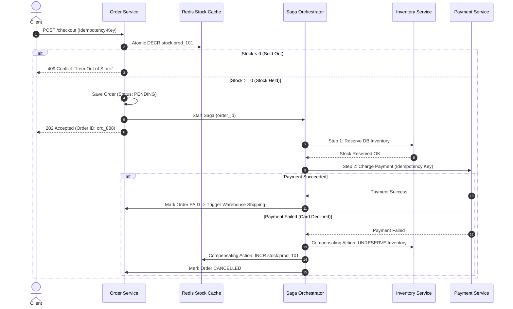

# Case Study 11 — E-Commerce Platform (e.g., Amazon / Flipkart)

## 1. Problem
Design a high-scale e-commerce platform capable of handling millions of product catalog searches, shopping cart management, **strict inventory decrement without overselling**, resilient distributed payment processing with idempotency, and multi-step order fulfillment workflows.

---

## 2. Functional Requirements
1. **Product Catalog & Search**: Browse, filter, and search millions of products by category, brand, price, and ratings.
2. **Shopping Cart**: Users can add, update, and persist cart items across multiple devices.
3. **Checkout & Order Creation**: Convert cart into an order, calculate taxes/discounts, and reserve inventory.
4. **Payment Processing**: Execute secure payments with third-party gateways (Stripe, PayPal) with strict idempotency.
5. **Inventory Management**: Decrement physical warehouse stock accurately; release held stock on payment failure.
6. **Order Fulfillment State Machine**: Track lifecycle: `PENDING` $\to$ `PAID` $\to$ `PACKED` $\to$ `SHIPPED` $\to$ `DELIVERED`.

---

## 3. Non-Functional Requirements
1. **Strict Data Consistency on Inventory & Orders**: Never oversell stock (if inventory $= 0$, prevent further purchases).
2. **High Availability ($99.99\%$) for Browsing & Cart**: Catalog search and product pages must never go down.
3. **Payment Idempotency**: Network retries or user double-clicks must NEVER double-charge a customer.
4. **Flash-Sale Concurrency**: Handle $50,000\text{ orders/sec}$ during Black Friday / holiday sales.

---

## 4. Assumptions & Constraints
- 50 Million Daily Active Users (DAU); 5 Million orders per day.
- 10 Million products in the catalog.
- Peak Black Friday flash-sale: 50,000 concurrent checkout requests/sec on popular products.

---

## 5. Practical Scale Estimation

### Traffic Calculations
- **Catalog Browsing & Search RPS**: $100,000\text{ reads/sec}$ (Peak: $250,000\text{ RPS}$).
- **Orders per Day**: $5\text{ Million orders/day}$.
- **Average Order Write RPS**:
  $$\text{Order RPS} = \frac{5,000,000}{86,400\text{ s}} \approx 60\text{ orders/sec (Peak: } 5,000\text{ RPS)}$$

### Storage Estimation (5 Years)
- Product Catalog: 10M products $\times$ 5 KB $\approx 50\text{ GB}$.
- Order History (5 Years): 5M orders/day $\times 365 \times 5 = 9.1\text{ Billion orders}$.
- At 1 KB per order record $\approx 9.1\text{ TB}$ (PostgreSQL partitioned by year/month).

---

## 6. API Design

### 1. Checkout & Create Order (Idempotent)
- **Endpoint**: `POST /api/v1/orders/checkout`
- **Headers**: `Idempotency-Key: 9b1deb4d-3b7d-4bad-9bdd-2b0d7b3dcb6d`
- **Request Body**:
```json
{
  "user_id": "usr_42",
  "shipping_address_id": "addr_999",
  "cart_items": [
    {"product_id": "prod_101", "quantity": 1, "price": 999.00}
  ],
  "payment_token": "tok_visa_5544"
}
```
- **Response** (`201 Created`):
```json
{
  "order_id": "ord_888777",
  "total_amount": 999.00,
  "status": "PROCESSING"
}
```

---

## 7. Data Model

```sql
-- PostgreSQL Order Database (ACID Core)
CREATE TABLE products (
    product_id VARCHAR(32) PRIMARY KEY,
    name VARCHAR(256) NOT NULL,
    base_price DECIMAL(10, 2) NOT NULL,
    category_id INT NOT NULL
);

CREATE TABLE inventory (
    product_id VARCHAR(32) PRIMARY KEY,
    available_stock INT NOT NULL CHECK (available_stock >= 0),
    reserved_stock INT NOT NULL DEFAULT 0,
    version INT NOT NULL DEFAULT 1 -- For Optimistic Locking
);

CREATE TABLE orders (
    order_id VARCHAR(64) PRIMARY KEY,
    user_id BIGINT NOT NULL,
    total_amount DECIMAL(10, 2) NOT NULL,
    status VARCHAR(32) NOT NULL, -- 'PENDING', 'PAID', 'CANCELLED', 'SHIPPED'
    idempotency_key VARCHAR(128) UNIQUE NOT NULL,
    created_at TIMESTAMP WITH TIME ZONE DEFAULT CURRENT_TIMESTAMP
);

CREATE TABLE order_items (
    order_id VARCHAR(64) NOT NULL,
    product_id VARCHAR(32) NOT NULL,
    quantity INT NOT NULL,
    unit_price DECIMAL(10, 2) NOT NULL,
    PRIMARY KEY (order_id, product_id)
);
```

---

## 8. High-Level Architecture

```mermaid
flowchart TD
    Client[Web / Mobile Client] --> CDN[CDN Edge (Images & Static Assets)]
    Client --> ALB[Application Load Balancer]
    
    subgraph Microservices["Stateless Domain Services"]
        CatalogService[Catalog & Search Service]
        CartService[Cart Service]
        OrderService[Order Orchestrator Service]
        PaymentService[Payment Service]
        InventoryService[Inventory Service]
    end
    
    ALB --> CatalogService
    ALB --> CartService
    ALB --> OrderService
    
    subgraph CatalogStorage["Catalog & Cart Tier"]
        ElasticSearch[("ElasticSearch (Product Facets & Search)")]
        RedisCart[("Redis Cluster (User Carts & Sessions)")]
    end
    
    subgraph CoreDatabases["Transactional Core Tier"]
        OrderDB[("PostgreSQL Order DB (ACID)")]
        InvDB[("PostgreSQL Inventory DB")]
        RedisInv[("Redis In-Memory Inventory Stock Counters")]
    end
    
    subgraph SagaEventBroker["Distributed Saga Workflow"]
        Kafka[Apache Kafka: 'order-events' topic]
        SagaOrchestrator[Order Saga Orchestrator]
    end

    CatalogService --> ElasticSearch
    CartService --> RedisCart
    
    OrderService --> OrderDB
    OrderService --> RedisInv
    OrderService --> SagaOrchestrator
    
    SagaOrchestrator --> Kafka
    Kafka --> PaymentService
    Kafka --> InventoryService
```

---

## 9. Core Architectural Flows

### 1. The Distributed Order Saga Workflow (Level 3 Awareness)



---

## 10. Inventory Concurrency: How to Guarantee Zero Overselling

| Approach | Implementation | Pros | Cons / Trade-offs |
|---|---|---|---|
| **1. Pessimistic DB Locking (`SELECT FOR UPDATE`)** | Locks the inventory row during transaction. | Guaranteed consistency in SQL. | ❌ **Severe bottleneck**: Holds DB locks during slow 5-second payment gateway calls, exhausting connection pools. |
| **2. SQL Atomic Conditional Decrement** | `UPDATE inventory SET available_stock = available_stock - 1 WHERE product_id = 'prod_101' AND available_stock >= 1;` | Simple, safe, non-blocking. | Good for moderate scale (<1,000 orders/sec). |
| **3. Redis Atomic Lua Decrement (Flash-Sale RECOMMENDED)** | Decrements in-memory Redis counter via atomic Lua script: `redis.call('DECRBY', stock_key, qty)`. | ✅ **Ultra-fast ($< 1\text{ms}$)**; absorbs 50,000 requests/sec in RAM; only winners proceed to database. | Requires synchronizing Redis counter with database on startup and cancellations. |

---

## 11. Payment Idempotency (Preventing Double Charges)
- **The Problem**: User clicks "Submit Payment", but network connection drops before receiving the HTTP response. User clicks "Submit" again.
- **The Solution**:
  1. Client sends unique `Idempotency-Key: uuid-12345` in header.
  2. Order Service performs atomic Redis lock `SET lock:payment:uuid-12345 NX EX 120`.
  3. The `Idempotency-Key` is forwarded directly to Stripe / PayPal API.
  4. Payment gateway natively checks the key: if the charge was already processed, it returns the previous charge result without billing the customer's card again!

---

## 12. Database Choice: Polyglot Persistence
- **Orders & Inventory Transactions**: **PostgreSQL** (ACID guarantees, foreign key relations, zero data loss).
- **Product Catalog**: **MongoDB / DynamoDB** (Flexible document schema to accommodate diverse attributes for shoes vs laptops).
- **Product Search & Filtering**: **ElasticSearch** (Faceted search, typo tolerance, price-range aggregations).
- **Shopping Carts & Session State**: **Redis Hashes** (Fast $O(1)$ item updates, automatic 30-day TTL).

---

## 13. Caching Strategy
- **Product Details**: Cache-Aside in Redis with 1-hour TTL.
- **Static Assets (Product Images)**: AWS S3 + Cloudflare CDN edge caching.
- **Stock Counters (Flash Sale Items)**: Cached in Redis RAM for sub-millisecond atomic decrements.

---

## 14. Scaling Strategy ($1K \to 100K \to 10M$ Orders)
- **1,000 Orders/day**: Monolith + PostgreSQL + SQLite cart.
- **100,000 Orders/day**: Redis shopping cart + ElasticSearch for catalog search + Read Replicas for product viewing.
- **5,000,000+ Orders/day (Black Friday Scale)**:
  - Microservice domains (Catalog, Cart, Order, Payment, Shipping).
  - Shard PostgreSQL Order DB by `user_id` or `order_id` using Consistent Hashing.
  - Asynchronous Saga Orchestrator over Apache Kafka.

---

## 15. Reliability & Fault Tolerance
- **Inventory Reconciliation Job**: Nightly background cron checks for orphaned held inventory (e.g., crashed checkout sessions) and reconciles Redis stock counters with PostgreSQL physical stock.
- **Dead Letter Queue (DLQ)**: Payment webhook failures route to a DLQ for automated retry or support team alert.

---

## 16. Security Considerations
- **PCI-DSS Compliance**: The e-commerce backend **never touches raw credit card numbers**. Frontend uses Stripe Elements / Hosted Fields to tokenize card data directly with the payment processor.
- **Rate Limiting on Checkout**: Max 5 checkout attempts/minute per IP to prevent card-testing fraud.

---

## 17. Key Trade-offs
- **Saga Pattern vs 2-Phase Commit (2PC)**: Chose Saga (eventual consistency with compensating transactions) because 2PC is synchronous, blocking, and reduces overall system availability.
- **Redis Inventory Counter vs Direct SQL**: Sacrificed immediate SQL synchronous updates in exchange for handling 50,000 flash-sale orders/sec in RAM.

---

## 18. Bottlenecks (What Breaks First?)
- **The First Bottleneck**: **Inventory row lock contention in SQL during flash sales** on a single viral product (e.g., iPhone launch).
- *Fix*: Absorb flash-sale stock checks using Redis atomic Lua decrements before database writes.

---

## 19. Interview Follow-ups & Conversational Answers

### Interviewer: "Why shouldn't we hold database locks while calling the payment gateway?"
> **Good Answer**: "Payment gateway API calls are unpredictable and can take 2 to 10 seconds over the public internet. If you execute `SELECT ... FOR UPDATE` on an inventory row and hold that lock while waiting for Stripe's HTTP response, you block all other customers from purchasing any items related to that row and quickly exhaust the database connection pool. Instead, we reserve inventory in a quick 5ms local transaction or in Redis, release the lock, call the payment gateway asynchronously, and execute a compensating rollback if payment fails."

### Interviewer: "How does the Saga pattern handle a payment failure?"
> **Good Answer**: "In the Saga Orchestrator, when the Payment Service returns `PAYMENT_DECLINED`, the orchestrator initiates a sequence of **Compensating Transactions** in reverse order: it calls the Inventory Service to release the reserved stock, increments the Redis stock counter, marks the Order as `CANCELLED`, and sends an email notification to the customer prompting them to update their payment method."

---

## 20. 2-Minute Interview Verbal Script
> "To design a scalable e-commerce platform like Amazon or Flipkart:
> 
> The architecture is built around **Polyglot Persistence**, **Atomic Flash-Sale Inventory Management**, and **The Distributed Saga Pattern**.
> 
> 1. **Catalog & Search**: Product listings are stored in **MongoDB** for schema flexibility and indexed in **ElasticSearch** for faceted search, with product pages cached in **Redis** and images served via **CDN**.
> 2. **Shopping Cart**: Stored in **Redis Hashes** with a 30-day TTL for fast cross-device sync.
> 3. **Checkout & Inventory**: To prevent overselling under flash-sale traffic, we use an **Atomic Redis Lua script** to decrement stock in RAM in $< 1\text{ms}$. If stock is available, we write the order as `PENDING` in **PostgreSQL**.
> 4. **Distributed Transactions**: We execute payment and shipping using a **Saga Orchestrator over Apache Kafka**. If Stripe charges successfully using an **Idempotency-Key**, the order transitions to `PAID`. If payment fails, the Saga triggers compensating transactions to release held inventory and restore stock automatically."

---

## Reusable Patterns Extracted

| Pattern | Why It Was Used | Other Systems Where It Applies |
|---|---|---|
| **Saga Pattern (Compensating Transactions)** | Replaces blocking 2PC across microservices for multi-step distributed workflows. | Hotel & flight travel packages, Banking fund transfers, Ride-hailing booking. |
| **Payment Idempotency Keys** | Prevents duplicate credit card billing during network retries. | Subscription renewals, SaaS billing, Money transfer APIs. |
| **Atomic Inventory Decrement (`stock >= qty`)** | Enforces zero overselling at the database and memory layer. | Concert tickets, Flash sales, Warehouse pick-and-pack systems. |
| **Polyglot Persistence Architecture** | Uses the optimal DB for each domain (ES for Search, Redis for Cart, Postgres for Orders). | Enterprise ERPs, Streaming platforms, Content management systems. |
