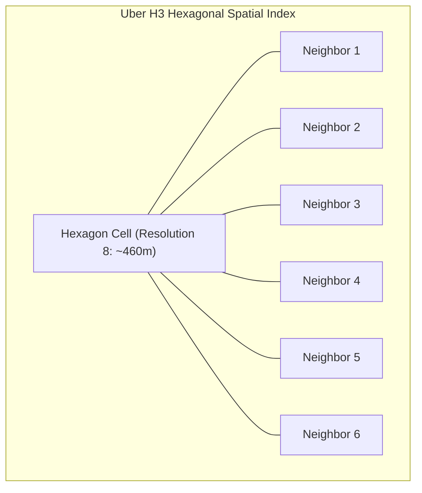

# Case Study 12 — Taxi Hailing & Ride Dispatch Platform (e.g., Uber / Lyft)

## 1. Problem
Design a real-time ride-hailing and taxi dispatch system (like Uber or Lyft). The system must process continuous GPS location streams from hundreds of thousands of active drivers (every 4 seconds), perform high-speed geospatial proximity queries to find nearby available drivers within a 5km radius, match riders with drivers via a state-machine offer pipeline, calculate dynamic surge pricing, and provide real-time turn-by-turn map tracking over WebSockets.

---

## 2. Functional Requirements
1. **Driver Location Updates**: Active drivers stream their GPS coordinates (Latitude, Longitude) every 4 seconds.
2. **Rider Request Ride**: Riders specify pickup and drop-off locations, view estimated fares, and request a ride.
3. **Driver-Rider Matching**: System locates the top $K$ nearest available drivers within a 5km radius and dispatches a ride offer (with a 15-second acceptance countdown).
4. **Real-Time Trip Tracking**: Both rider and driver see live vehicle movements and updated ETAs on a map.
5. **Dynamic Surge Pricing**: Automatically adjust fares in real-time based on local supply (available drivers) vs demand (rider requests) per geographical cell.

---

## 3. Non-Functional Requirements
1. **Ultra-Low Latency Matching & Dispatch**: Match rider and dispatch ride offer in $< 1\text{ second}$.
2. **High Write Throughput for GPS Telemetry**: Ingest $125,000+\text{ GPS pings/second}$ smoothly without database degradation.
3. **High Availability ($99.99\%$)**: Ride matching and live tracking must never experience outages.
4. **Strong Consistency for Driver State**: A driver must NEVER be dispatched to two different riders simultaneously.

---

## 4. Assumptions & Constraints
- 500,000 active concurrent drivers; 5 Million daily riders.
- Driver GPS ping frequency: Every 4 seconds.
- Total daily completed trips: 10 Million.

---

## 5. Practical Scale Estimation

### Traffic Calculations
- **Active Driver GPS Write RPS**:
  $$\text{GPS Ingestion RPS} = \frac{500,000 \text{ drivers}}{4 \text{ seconds}} = 125,000\text{ writes/sec}$$
- **Rider Ride Request RPS**: 10M trips/day $\to \approx 120\text{ requests/sec (Peak: } 500\text{ RPS)}$.
- **Rider Nearby Driver Views (Search RPS)**: $20,000\text{ reads/sec}$ (riders browsing the map).

### Storage Estimation (5 Years)
- **Current Driver Location (In-Memory)**: 500,000 drivers $\times$ 64 bytes $\approx \mathbf{32\text{ MB RAM}}$ (Fits entirely in a single Redis instance!).
- **Historical Trip Records (5 Years)**: 10M trips/day $\times 365 \times 5 = 18.25\text{ Billion trips}$.
- At 500 bytes per completed trip record $\approx 9.1\text{ TB}$ (PostgreSQL partitioned by month).

---

## 6. API Design

### 1. Driver Location Update (High-Frequency Stream)
- **Endpoint**: `POST /api/v1/drivers/location` (Over WebSocket or persistent gRPC stream)
- **Payload**:
```json
{
  "driver_id": "drv_101",
  "latitude": 37.7749,
  "longitude": -122.4194,
  "status": "AVAILABLE", 
  "bearing": 180,
  "timestamp": 1773456789
}
```

### 2. Request Ride
- **Endpoint**: `POST /api/v1/rides/request`
- **Request Body**:
```json
{
  "rider_id": "rdr_99",
  "pickup_lat": 37.7750,
  "pickup_lng": -122.4180,
  "dropoff_lat": 37.7890,
  "dropoff_lng": -122.4010,
  "ride_type": "PREMIUM"
}
```
- **Response** (`202 Accepted`):
```json
{
  "ride_id": "ride_554433",
  "status": "SEARCHING_FOR_DRIVER",
  "estimated_fare": 24.50,
  "surge_multiplier": 1.4
}
```

---

## 7. Data Model

### PostgreSQL Schema (Trip Records & Users)
```sql
CREATE TABLE trips (
    trip_id VARCHAR(64) PRIMARY KEY,
    rider_id BIGINT NOT NULL,
    driver_id BIGINT,
    pickup_location GEOGRAPHY(POINT, 4326) NOT NULL,
    dropoff_location GEOGRAPHY(POINT, 4326) NOT NULL,
    fare_amount DECIMAL(10, 2) NOT NULL,
    surge_multiplier DECIMAL(3, 2) DEFAULT 1.0,
    status VARCHAR(32) NOT NULL, -- 'REQUESTED', 'ACCEPTED', 'IN_TRANSIT', 'COMPLETED', 'CANCELLED'
    created_at TIMESTAMP WITH TIME ZONE DEFAULT CURRENT_TIMESTAMP
);
CREATE INDEX idx_trips_rider ON trips(rider_id);
CREATE INDEX idx_trips_driver ON trips(driver_id);
```

---

## 8. High-Level Architecture

```mermaid
flowchart TD
    DriverApp[Driver Mobile App] -->|1. Stream GPS every 4s via WebSocket| WS_Driver[Driver WebSocket Gateway]
    RiderApp[Rider Mobile App] --> ALB[Application Load Balancer]
    
    subgraph LocationIngestionTier["High-Speed Location & Geospatial Index"]
        LocationService[Location Ingestion Service]
        RedisGeo[("Redis Cluster (Uber H3 / Redis Geospatial Index)")]
    end
    
    WS_Driver --> LocationService
    LocationService --> RedisGeo
    
    subgraph MatchingAndSurgeTier["Matching & Pricing Engine"]
        RideService[Ride Request Service]
        SurgeService[Dynamic Surge Pricing Engine]
        MatchingEngine[Dispatch & Matching Engine]
        DriverStateMachine[Driver State Machine (Redis Lock)]
    end
    
    ALB --> RideService
    RideService --> SurgeService
    RideService --> MatchingEngine
    
    MatchingEngine -->|2. Find nearest 10 drivers within 5km| RedisGeo
    MatchingEngine -->|3. Atomic Lock Driver State| DriverStateMachine
    MatchingEngine -->|4. Push Offer to Driver (15s)| WS_Driver
    
    subgraph TripStorage["Transactional Storage & Analytics"]
        TripDB[("PostgreSQL Master (Trips & Accounting)")]
        Kafka[Apache Kafka: 'gps-telemetry-stream']
        AnalyticsWorker[Supply-Demand Aggregator]
    end
    
    LocationService -.->|Async Telemetry Stream| Kafka
    Kafka -.-> AnalyticsWorker
    AnalyticsWorker -.-> SurgeService
    RideService --> TripDB
```

---

## 9. Core Mechanisms

### 1. Geospatial Indexing: Uber H3 Hexagonal Grid vs GeoHash



- **Why Hexagons (Uber H3)?**
  - In square grids (GeoHash/S2), corner neighbors are $\sqrt{2}\approx 1.414\times$ farther than adjacent neighbors.
  - In a **Hexagonal Grid (H3)**, **all 6 neighboring cells are at the exact identical distance** from the center cell. This makes radius queries and smooth vehicle trajectory calculations mathematically uniform.
- **Implementation in Redis**:
  - Each driver's coordinate is mapped to an H3 Hex Cell ID (e.g., `8828308281fffff`).
  - Redis maintains a Set per cell: `SADD h3:8828308281fffff drv_101`.
  - Finding nearby drivers = Fetching members from the center cell + its 6 immediate neighbor cells in $< 1\text{ms}$!

---

### 2. The Driver-Rider Matching Engine Flow
1. Rider requests ride at `(lat, lng)`.
2. `Matching Engine` converts pickup coordinates to H3 Cell ID and queries Redis for available drivers in that cell and adjacent neighbors.
3. Drivers are filtered by `status = AVAILABLE` and ranked by ETA.
4. **Atomic Driver Reservation (Redis Lock)**:
   - Engine executes atomic lock: `SET lock:driver:drv_101 ride_5544 NX EX 15`.
   - Driver status temporarily marked `OFFERED`.
5. **Dispatch Offer**:
   - Offer sent down the driver's active WebSocket with a 15-second countdown.
6. **Scenario A (Driver Accepts)**:
   - Driver clicks "Accept" within 15s. Lock is converted to `status = BUSY`. Trip record written to PostgreSQL. Both parties enter Live Tracking mode.
7. **Scenario B (Driver Rejects or 15s Timeout)**:
   - Redis lock expires. Engine immediately fails over and dispatches the offer to the second-nearest driver.

---

### 3. Dynamic Surge Pricing (Supply vs Demand)
- The city is divided into H3 cells (Resolution 8, ~460m radius).
- Every 10 seconds, `Surge Engine` aggregates:
  $$\text{Supply} = \text{Count of AVAILABLE drivers in Cell } X$$
  $$\text{Demand} = \text{Count of Ride Requests & Active Map Views in Cell } X$$
- If $\frac{\text{Demand}}{\text{Supply}} > 2.0 \implies \text{Surge Multiplier} = 1.5\times \text{ to } 2.5\times$.
- Fares adjust dynamically to encourage more drivers to relocate into the high-demand surge cell.

---

## 10. Database Choice
- **Real-Time Driver Locations**: **Redis In-Memory Data Store (H3 Index / Geospatial Sets)** (125,000 writes/sec with sub-millisecond lookups).
- **Trip Records & Billing**: **PostgreSQL** (ACID transactions, financial ledger integrity).
- **Historical GPS Telemetry**: **Apache Cassandra / ClickHouse** (High-throughput append-only GPS breadcrumbs for route replay and driver pay auditing).

---

## 11. Caching & In-Memory Strategy
- **Driver State Machine**: Stored in Redis with 15-second offer expiration locks.
- **Surge Pricing Grid**: Cached in Redis Hashes (`HGET surge_multipliers cell_id`).

---

## 12. Scaling Strategy ($1K \to 100K \to 500K$ Active Drivers)
- **1,000 Drivers**: Single PostgreSQL instance with PostGIS `ST_DWithin`.
- **50,000 Drivers**: Redis `GEOADD` and `GEORADIUS` for in-memory location tracking.
- **500,000 Drivers (Global Scale)**:
  - Cluster of Go/Netty WebSocket Gateways handling driver GPS streams.
  - Shard Redis by Geographical City / Region (e.g., `redis-sf`, `redis-nyc`, `redis-london`).
  - Asynchronous GPS trajectory archiving via Apache Kafka into ClickHouse.

---

## 13. Reliability & Fault Tolerance
- **Driver Disconnects during Trip**: WebSocket gateway detects disconnect; driver app automatically reconnects with backoff and resumes the active `trip_id` state stored in Redis.
- **Redis Node Failure**: Redis Sentinel/Cluster maintains active replicas with automated failover in $< 3\text{s}$.

---

## 14. Performance Optimizations
- **Location Throttling**: If a driver is stationary at a red light, the mobile app sends pings only every 15 seconds instead of every 4 seconds, cutting server ingestion load by 40%.

---

## 15. Security Considerations
- **Rider & Driver Phone Number Masking**: Calls between rider and driver route through a Twilio Voice Proxy; real phone numbers are never exposed.
- **GPS Spoofing Detection**: Backend algorithms detect impossible speed jumps (e.g., driver moving 500 mph between two pings) to ban spoofing bots.

---

## 16. Key Trade-offs
- **Redis In-Memory State vs Direct SQL**: Sacrificed immediate SQL persistence of every 4-second GPS coordinate in exchange for handling 125,000 writes/sec in RAM.
- **Sequential 15s Offer Dispatch vs Broadcast to 10 Drivers**: Dispatched ride offer sequentially to the top 1 driver at a time to prevent multiple drivers rushing towards the same rider.

---

## 17. Bottlenecks (What Breaks First?)
- **The First Bottleneck**: **Redis write throughput on a single hot regional node** during rush hour.
- *Fix*: Shard Redis by H3 top-level parent hexagon cell IDs across a cluster.

---

## 18. Interview Follow-ups & Conversational Answers

### Interviewer: "Why use Uber H3 Hexagonal indexing instead of GeoHash or standard latitude/longitude SQL queries?"
> **Good Answer**: "Standard SQL queries with `ST_DWithin` perform slow table scans under 125,000 writes/sec. GeoHash grids have edge boundary issues where adjacent coordinates fall into completely different string prefixes. Uber H3 divides the world into uniform **Hexagonal Cells** where all 6 neighbor cells are equidistant from the center. This makes radius queries and surge pricing calculations mathematically uniform and allows us to look up nearby drivers via simple $O(1)$ Redis Set lookups."

### Interviewer: "How do you prevent two riders from being matched with the same driver simultaneously?"
> **Good Answer**: "We use a **Distributed Lock in Redis** on the driver's ID (`SET lock:driver:drv_101 ride_id NX EX 15`). When the matching engine selects a driver, it atomically claims the driver for 15 seconds. If another matching engine worker attempts to select the same driver, the `SETNX` call fails, and that worker immediately skips to the next nearest driver."

---

## 19. 2-Minute Interview Verbal Script
> "To design a real-time taxi-hailing platform like Uber handling 500,000 active drivers streaming GPS coordinates every 4 seconds:
> 
> The core challenge is **ingesting 125,000 GPS writes/sec and performing sub-second proximity matching**.
> 
> 1. Drivers maintain persistent **WebSockets/gRPC streams** to a cluster of Location Gateways.
> 2. Instead of writing raw GPS pings to a relational database, coordinates are mapped to **Uber H3 Hexagonal Grid IDs** and indexed in **Redis RAM**. Each hexagonal cell maintains a set of available drivers.
> 3. When a rider requests a ride:
>    - The Matching Engine queries Redis for drivers in the pickup H3 cell and its 6 neighbor cells in $< 5\text{ms}$.
>    - It acquires an **Atomic Redis Lock** on the top candidate (`drv_101`) and pushes a 15-second offer down the driver's WebSocket.
>    - If the driver accepts, the trip is persisted to **PostgreSQL** and live tracking begins.
> 4. **Surge Pricing** is computed every 10s per H3 cell by comparing the ratio of active ride requests to available driver sets in Redis."

---

## Reusable Patterns Extracted

| Pattern | Why It Was Used | Other Systems Where It Applies |
|---|---|---|
| **Hexagonal Spatial Indexing (H3)** | Uniform equidistant neighbor searches and spatial aggregation. | Food delivery dispatch (DoorDash), Drone routing, Micro-mobility scooters (Lime). |
| **High-Frequency In-Memory Telemetry Stream** | Absorbs 125k writes/sec in RAM; keeps permanent DB out of the critical path. | Connected vehicle tracking, Fitness tracker streams, Stock ticker ingestion. |
| **State-Machine Offer Dispatch (15s TTL)** | Serializes candidate matching with automated timeout failover. | Emergency dispatch (911), Freelancer gig assignment, Delivery driver routing. |
| **Dynamic Surge Pricing Matrix** | Balances marketplace supply and demand in real-time per geographic cell. | Hotel room pricing, Airline ticketing, Electricity spot pricing. |
