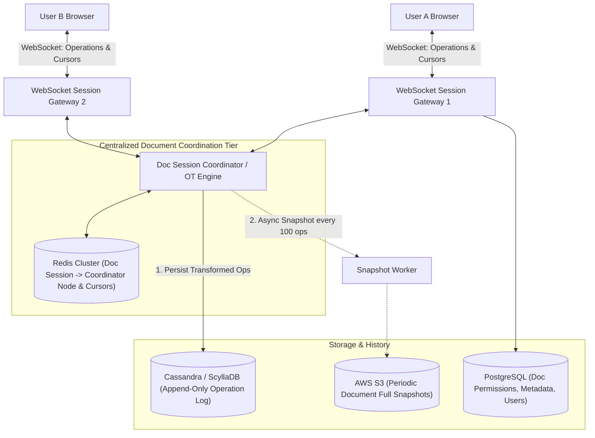

# Case Study 13 — Collaborative Document Editor (e.g., Google Docs / Notion)

## 1. Problem
Design a real-time collaborative document editing system (like Google Docs or Notion). The system must allow multiple users to edit the same rich-text document simultaneously, synchronize keystrokes in $< 100\text{ms}$, display live collaborator cursor positions, resolve concurrent editing conflicts deterministically without data loss, maintain a full version history, and support offline editing.

---

## 2. Functional Requirements
1. **Real-Time Concurrent Editing**: Multiple users can type, delete, and format text in the same document simultaneously.
2. **Live Cursor & Selection Presence**: Show active collaborators' cursor positions and text highlights in real-time.
3. **Conflict Resolution & Convergence**: Concurrent edits from different users must merge deterministically so all clients converge to the exact same document state.
4. **Document Version History**: Automatic periodic snapshotting; allow users to view and restore past revisions.
5. **Offline Editing & Reconciliation**: Users can continue typing while offline; edits merge automatically upon reconnection.
6. **Access Control**: Role-based permissions (`OWNER`, `EDITOR`, `VIEWER`).

---

## 3. Non-Functional Requirements
1. **Ultra-Low Latency**: Keystroke sync latency $< 100\text{ms}$ between collaborators.
2. **Eventual Convergence**: All collaborators must see identical document content once all in-flight edits are processed.
3. **High Availability ($99.99\%$)**: Server crashes must not corrupt or freeze active editing sessions.
4. **Data Durability**: Zero lost keystrokes or corrupted document paragraphs.

---

## 4. Assumptions & Constraints
- 10 Million Daily Active Documents; 50 Million Daily Active Users (DAU).
- Average active document has 2–5 concurrent editors; hot documents can have up to 100 simultaneous editors.
- Document size: Average 100 KB text.

---

## 5. Practical Scale Estimation

### Traffic Calculations
- **Active Concurrent Editing Sessions**: 500,000 active documents simultaneously.
- **Keystroke Operation RPS**:
  - Assume 100,000 users typing simultaneously at 3 keystrokes/second.
  - **In-Flight Operations RPS**: $\approx 300,000\text{ operations/sec}$.
- **Cursor Movement Pings**: $500,000\text{ pings/sec}$ (throttled to 10 updates/sec per active client).

### Storage Estimation (5 Years)
- 10 Million new documents/month $\times$ 100 KB $\approx 1\text{ TB/month}$.
- **5-Year Document Snapshots**: $1\text{ TB} \times 12 \times 5 \approx 60\text{ TB}$ (AWS S3).
- **Operation Log Storage (Append-Only)**: $\approx 200\text{ TB}$ (Cassandra / DynamoDB).

---

## 6. High-Level Architecture



---

## 7. Conflict Resolution: Operational Transformation (OT) vs CRDT (Level 3 Awareness)

When two users insert characters at the same position simultaneously:
- User A types `'X'` at index 3: `Insert('X', 3)`.
- User B types `'Y'` at index 3: `Insert('Y', 3)`.
Without transformation, User A sees `"ABXCY"` while User B sees `"ABYCX"` (State Divergence!).

```mermaid
flowchart LR
    subgraph OperationalTransformation["1. Operational Transformation (OT: Google Docs)"]
        ClientA["Client A: Insert('X', 3)"] --> CentralServer["Central OT Server"]
        ClientB["Client B: Insert('Y', 3)"] --> CentralServer
        CentralServer -->|Transforms Op B based on Op A: Insert('Y', 4)| Transform["Transformed Op B"]
        Transform --> ClientA
    end

    subgraph CRDT["2. CRDTs (Conflict-free Replicated Data Types: Figma)"]
        Node1["Client A (Generates Unique Fractional Index: 3.5)"]
        Node2["Client B (Generates Unique Fractional Index: 3.6)"]
        Node1 <-->|P2P / Mesh Sync (No Central Server needed)| Node2
    end
```

### Detailed Comparison:

| Feature | Operational Transformation (OT) | Conflict-free Replicated Data Types (CRDT) |
|---|---|---|
| **Mechanism** | Transforms operation coordinates relative to concurrent operations (`Op' = Transform(Op1, Op2)`). | Assigns every character a globally unique, immutable **Fractional Index ID** (e.g., LSEQ, Yjs). |
| **Architecture** | **Centralized Server Authority** (Server serializes all operations and decides official order). | **Decentralized / P2P Friendly** (Edits can merge in any order with guaranteed mathematical convergence). |
| **Memory Overhead** | **Low (Zero memory bloat)**; stores plain text characters. | **Higher (1.5x–3x memory bloat)**; every single character carries unique UUID + metadata. |
| **Industry Adoption** | **Google Docs, Microsoft Office Online**. | **Figma, Notion, Apple Notes, Linear**. |
| **L3 Decision** | Best for centralized web office suites with central database persistence. | Best for offline-first, peer-to-peer, or canvas-based collaborative tools (Figma). |

---

## 8. The Operational Transformation (OT) Flow in Practice (Google Docs Model)
1. Document state on Server at revision $0$: `"CAT"`.
2. **User A** types `'H'` at index 0 $\to$ `Op_A = Insert('H', 0)`.
3. **User B** types `'S'` at index 3 $\to$ `Op_B = Insert('S', 3)` (Intending `"CATS"`).
4. Both operations travel over WebSockets to the Central `Doc Session Coordinator`:
   - Server applies `Op_A` first: Document becomes `"HCAT"` (Revision 1).
   - Server receives `Op_B` (which was created against Revision 0).
   - **OT Transformation**: The server knows `Op_A` shifted all indices after 0 to the right by $+1$.
   - Server transforms `Op_B` $\to \mathbf{Op\_B' = Insert('S', 4)}$.
   - Server applies `Op_B'` $\to$ Document becomes `"HCATS"` (Revision 2).
5. Server broadcasts `Op_A` to User B, and transformed `Op_B'` to User A.
6. **Both clients converge to `"HCATS"`!**

---

## 9. Live Presence & Cursor Tracking
- **Cursor Updates**: When User A moves their cursor, client emits `CURSOR_MOVE { doc_id: 101, user: "Alice", pos: 42, color: "#FF0000" }`.
- **Throttling**: Cursor events are throttled on the client to **max 10 updates/sec (100ms intervals)** to avoid network flood.
- **Ephemeral State in Redis**: Cursor positions are stored in Redis RAM (`HSET doc:101:cursors alice 42`) with a 10-second TTL. If a user closes the tab, their cursor disappears automatically.

---

## 10. Document Snapshotting & Operation Replay
- **The Problem**: A document edited over 3 years accumulates 500,000 individual keystroke operations in the log. Replaying 500,000 operations every time a user opens the doc will take 30 seconds!
- **Solution (Snapshotting)**:
  1. Every 100 operations or every 5 minutes, an asynchronous worker compiles the current document in memory into a **Full JSON Document Snapshot** and saves it to AWS S3.
  2. When a user opens the document:
     - Load the latest **Snapshot** (e.g., Revision 5,000) from S3.
     - Replay only the subsequent operations (Revisions 5,001 to 5,024) from Cassandra.
     - Document renders in $< 50\text{ms}$!

---

## 11. Database Choice
- **Operation Log (Append-Only Stream)**: **Apache Cassandra / ScyllaDB** (`PRIMARY KEY (doc_id, revision_num)`). Writes are append-only and immutable.
- **Full Document Snapshots**: **AWS S3** (Cost-effective, highly durable blob storage).
- **Metadata, Folders & Permissions**: **PostgreSQL** (ACID relations for user accounts, workspace roles, and sharing ACLs).

---

## 12. Caching Strategy
- **Active Document In-Memory Cache**: The `Doc Session Coordinator` holds the active document state in RAM during active editing sessions.
- **Redis Presence Cache**: Stores live collaborator lists and cursor positions.

---

## 13. Scaling Strategy ($1K \to 100K \to 10M$ Documents)
- **1,000 Docs**: Single Node.js server running OT with in-memory state + PostgreSQL.
- **100,000 Docs**: Stateless WebSocket gateways + Redis Session Router routing all editors of `doc_101` to a dedicated `Doc Session Coordinator` actor node.
- **10,000,000 Docs**:
  - Shard Document Coordinators by `doc_id` using Consistent Hashing.
  - Cassandra cluster for global append-only operation log.
  - CDN edge caching for read-only published documents.

---

## 14. Reliability & Fault Tolerance
- **Coordinator Node Crash**: If the server holding `doc_101` crashes, the WebSocket gateways reconnect to a new coordinator node. The new node loads the last S3 snapshot, replays uncommitted operations from Cassandra, and resumes the session within 2 seconds with zero data loss.

---

## 15. Security Considerations
- **Granular Permissions**: Operations checked against user permission level (`VIEWER` cannot submit `Insert` operations).
- **Audit History**: Every single keystroke operation is tied to a verified `user_id` and timestamp.

---

## 16. Key Trade-offs
- **Centralized OT Coordinator vs Decentralized CRDT**: Chose Centralized OT for Google Docs to keep client memory footprint light (no UUID per character) and maintain single authoritative sequencing.
- **Snapshot Frequency vs S3 Cost**: Balanced snapshotting every 100 ops to keep document load latency under 50ms while bounding storage costs.

---

## 17. Bottlenecks (What Breaks First?)
- **The First Bottleneck**: **OT transformation computation on a single hot document with 100+ simultaneous editors**.
- *Fix*: Throttle client operation batching (send word/sentence diffs instead of individual character keystrokes during high contention).

---

## 18. Interview Follow-ups & Conversational Answers

### Interviewer: "What is the difference between Operational Transformation (OT) and CRDTs?"
> **Good Answer**: "OT relies on a **Centralized Server** that transforms incoming operation indices relative to previously applied concurrent operations so all clients converge. It is lightweight in memory and used by Google Docs. CRDTs (Conflict-free Replicated Data Types) assign every character an immutable, globally unique fractional index. CRDTs require no central server and can merge operations in any order, making them ideal for peer-to-peer and offline-first apps like Figma, but they have higher memory overhead per character."

### Interviewer: "How do you handle a user who edits a document offline for 2 hours and then reconnects?"
> **Good Answer**: "The client maintains a local operation queue. Upon reconnecting, the client sends its queued operations along with the last server revision number it had seen (e.g., Revision 100). The server fetches all intermediate operations from Revision 101 to the current Revision 150 from Cassandra, transforms the client's offline operations against that 50-operation diff using OT, commits the transformed operations, and broadcasts the updates to other active collaborators."

---

## 19. 2-Minute Interview Verbal Script
> "To design a real-time collaborative document editor like Google Docs:
> 
> The core challenge is **synchronizing concurrent edits in real-time with guaranteed convergence and zero data loss**.
> 
> 1. Collaborators establish bidirectional **WebSocket connections** through stateless gateways to a dedicated **Doc Session Coordinator** pinned to that document via consistent hashing.
> 2. For conflict resolution, we implement **Operational Transformation (OT)**: The central coordinator serializes incoming keystroke operations, transforms character indices to account for concurrent edits, commits the transformed operation to an **Append-Only Cassandra Operation Log**, and broadcasts the transformed operation to all collaborators in $< 50\text{ms}$.
> 3. Collaborator cursors and presence are broadcast via throttled (10Hz) ephemeral updates stored in **Redis RAM**.
> 4. To ensure fast document loading, background workers compile **Full JSON Document Snapshots into AWS S3** every 100 operations, allowing users to open large documents instantly without replaying millions of historical keystrokes."

---

## Reusable Patterns Extracted

| Pattern | Why It Was Used | Other Systems Where It Applies |
|---|---|---|
| **Operational Transformation (OT) / CRDT** | Deterministically merges concurrent edits into a single consistent state. | Collaborative whiteboards (Miro), Code co-editors (VS Code Live Share), Spreadsheets. |
| **Snapshotting + Operation Log Replay** | Allows instant document loading by avoiding long historical log replays. | Database recovery logs (WAL), Event Sourcing, Game state savepoints. |
| **Pinned Document Coordinator (Consistent Hashing)** | Routes all concurrent editors of an entity to a single authoritative in-memory worker. | Multiplayer game rooms, Live auction bidding engines, Chat channels. |
| **Throttled Ephemeral Presence Streams** | Displays live peer telemetry without saturating network bandwidth. | Live video viewer reactions, Live vehicle map tracking, Typing indicators. |
