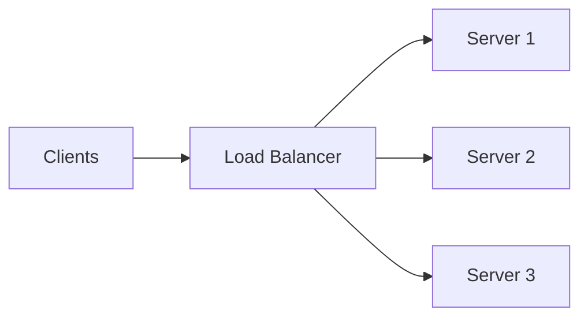

# System Design Building Blocks — The Architect's Mental Toolbox

This file serves as your mental toolbox for system design interviews. Every complex distributed architecture is assembled from these 14 battle-tested building blocks.

---

## 1. Load Balancer (Layer 4 & Layer 7)

1. **What it is**: A reverse proxy that distributes incoming network traffic across multiple backend servers.
2. **Why we use it**: Eliminates Single Points of Failure (SPOFs), enables horizontal scaling, performs health checks, and terminates TLS.
3. **Where it sits**: In front of web servers (Internet $\to$ App) and between internal service tiers (App $\to$ Internal Services).
4. **When to use it**: Any system with more than 1 application server ($> 1,000\text{ RPS}$).
5. **When NOT to use it**: Single-node hobby projects or when serverless auto-routing handles ingress (e.g., AWS Lambda).
6. **Main trade-offs**: Adds a minor network hop ($0.5–2\text{ms}$); requires managing redundant active-passive load balancers.
7. **Failure scenarios**: If the primary LB crashes without an automated VRRP / DNS failover to a hot standby, all ingress traffic halts.
8. **L3 Follow-up**: *"When do you choose L4 (NLB) over L7 (ALB)?"* $\to$ Choose L4 for raw TCP/UDP streaming, gaming, extreme packet throughput, and long-lived WebSockets; choose L7 for HTTP header inspection, cookie-based routing, and microservice path-based routing (`/users` vs `/orders`).

---

## 2. API Gateway

1. **What it is**: An intelligent single-entry reverse proxy orchestrating API management for microservices.
2. **Why we use it**: Centralizes cross-cutting concerns: authentication, rate limiting, request routing, telemetry, and SSL termination.
3. **Where it sits**: Directly behind the Load Balancer, before internal microservices.
4. **When to use it**: Microservice architectures where multiple frontend clients (Mobile, Web, IoT) need a unified entry point.
5. **When NOT to use it**: Simple monolithic architectures or internal monolithic apps (adds unnecessary latency).
6. **Main trade-offs**: Centralized policy enforcement vs Single bottleneck point for all API traffic.
7. **Failure scenarios**: If API Gateway memory exhausts during token validation, all downstream APIs become unreachable.
8. **L3 Follow-up**: *"How do you prevent the API Gateway from becoming a latency bottleneck?"* $\to$ Keep gateway logic purely I/O bound (validate JWTs statelessly via public keys; avoid synchronous database lookups in gateway filters).

---

## 3. Content Delivery Network (CDN)

1. **What it is**: A globally distributed network of edge proxy servers (PoPs) that caches content near users.
2. **Why we use it**: Reduces latency for global users ($< 20\text{ms}$), absorbs DDoS attacks, and offloads $90\%+$ of static asset bandwidth from the origin.
3. **Where it sits**: At the very edge of the network, between end users and the DNS / Load Balancer.
4. **When to use it**: Any web system serving images, video segments (HLS), CSS/JS bundles, or cacheable public API responses.
5. **When NOT to use it**: Strictly private, dynamic, personalized user data (e.g., user bank account balance).
6. **Main trade-offs**: Instant global edge speed vs Cache invalidation complexity (stale static assets).
7. **Failure scenarios**: CDN provider outage $\to$ DNS failover must route traffic directly to origin servers (which must be capacity-provisioned to avoid melting).
8. **L3 Follow-up**: *"How do you handle instant cache invalidation on a CDN?"* $\to$ Use **Asset Fingerprinting / URL Versioning** (`bundle.a9f2.js`) with an infinite TTL for static files, and Webhook-triggered CDN Purge APIs for dynamic resources.

---

## 4. Cache (General In-Memory)

1. **What it is**: A high-speed, volatile data storage layer (RAM) storing a subset of transient data.
2. **Why we use it**: Reading from RAM ($100\text{ ns}$) is $1,000\times$ faster than reading from SSD disks ($50\ \mu\text{s}$), protecting databases from read query exhaustion.
3. **Where it sits**: Client-side, CDN edge, App local RAM (Guava/Caffeine), or Distributed tier (Redis/Memcached).
4. **When to use it**: Read-heavy workloads ($>80\%$ reads), expensive database queries, and frequently accessed static data.
5. **When NOT to use it**: Rapidly mutating data, strictly transactional financial ledgers requiring ACID writes, or write-heavy workloads with near-zero repeat reads.
6. **Main trade-offs**: Sub-millisecond reads vs Stale data risk and cache invalidation complexity.
7. **Failure scenarios**: Cache stampede (thundering herd) when a hot key expires $\to$ Mitigated via mutex distributed locks or probabilistic early refresh.
8. **L3 Follow-up**: *"How do you size a cache cluster?"* $\to$ Apply the **80/20 rule**: Estimate daily read traffic, calculate the 20% most active unique items, and provision enough RAM to hold those items with a 20% safety buffer.

---

## 5. Redis (In-Memory Data Structure Store)

1. **What it is**: An ultra-fast, in-memory, single-threaded key-value data structure store supporting Strings, Hashes, Lists, Sets, Sorted Sets, Bitmaps, and HyperLogLog.
2. **Why we use it**: Provides sub-millisecond execution, atomic operations, distributed locking (`SETNX`), and Pub/Sub messaging.
3. **Where it sits**: Beside application servers as a shared distributed cache, session store, rate limiter, or leaderboard engine.
4. **When to use it**: Distributed caching, user session storage, atomic counters, live rankings (Sorted Sets), rate limiting, and temporary state holding (10-min ticket locks).
5. **When NOT to use it**: Terabyte-scale persistent cold storage (RAM is expensive compared to SSD/S3).
6. **Main trade-offs**: Extreme throughput and data structures vs High RAM cost and data volatility risk during hard crashes.
7. **Failure scenarios**: Primary Redis master crashes $\to$ Redis Sentinel automatically promotes a replica within 3 seconds.
8. **L3 Follow-up**: *"Why is Redis single-threaded yet so fast?"* $\to$ It executes entirely in RAM (zero disk I/O seeks), uses non-blocking I/O multiplexing (`epoll`), and avoids CPU context switching and lock contention overhead.

---

## 6. SQL Relational Database (PostgreSQL / MySQL)

1. **What it is**: A structured, tabular database engine providing strict schemas, ACID transactions, and relational joins.
2. **Why we use it**: Guarantees zero data loss, enforces relational integrity, and supports complex multi-table analytical joins.
3. **Where it sits**: At the persistent storage tier behind application microservices.
4. **When to use it**: Financial transactions, e-commerce orders, user identity, booking calendars, and relational domain entities.
5. **When NOT to use it**: Unstructured JSON documents, high-throughput time-series sensor ingestion ($>50k\text{ writes/sec}$ on a single node), or massive petabyte-scale unstructured data.
6. **Main trade-offs**: Strong consistency and ACID integrity vs Difficult horizontal write sharding.
7. **Failure scenarios**: Primary master database crashes $\to$ Automated failover promotes a synchronous standby replica in $< 30\text{ seconds}$.
8. **L3 Follow-up**: *"How do you scale a SQL database before resorting to sharding?"* $\to$ 1. Optimize indexes using `EXPLAIN ANALYZE`, 2. Add Redis caching for hot reads, 3. Add Read Replicas for read-heavy queries, 4. Vertical scale CPU/RAM, 5. Partition large tables by date range.

---

## 7. NoSQL Database (Cassandra / MongoDB / DynamoDB)

1. **What it is**: Non-relational, distributed databases optimized for horizontal scalability, high write throughput, and flexible data models.
2. **Why we use it**: Scales horizontally across hundreds of commodity nodes with linear throughput and zero single-node storage limits.
3. **Where it sits**: At the persistent storage tier for write-heavy, document, or key-value workloads.
4. **When to use it**: Product catalogs (MongoDB), IoT telemetry / Chat history (Cassandra), User profiles / Carts (DynamoDB).
5. **When NOT to use it**: Systems requiring complex multi-table ACID transactions and normalized relationships (e.g., core banking ledger).
6. **Main trade-offs**: Linear horizontal scale vs Eventual consistency and lack of complex SQL joins.
7. **Failure scenarios**: Network partition occurs $\to$ AP systems (Cassandra) accept writes on both sides and reconcile later; CP systems (MongoDB) fail writes until the primary is restored.
8. **L3 Follow-up**: *"Why does Cassandra excel at write-heavy workloads?"* $\to$ It uses an **LSM-Tree storage engine**: writes append sequentially to an in-memory MemTable and Write-Ahead Log (WAL) with zero random disk seeks, turning random writes into high-speed sequential disk flushes.

---

## 8. Message Queue (RabbitMQ / AWS SQS)

1. **What it is**: A message broker supporting point-to-point asynchronous task queues with consumer acknowledgments.
2. **Why we use it**: Decouples producer from consumer, smooths out sudden traffic spikes (backpressure buffer), and provides worker retry resilience.
3. **Where it sits**: Between synchronous API services and asynchronous background worker pools.
4. **When to use it**: Background jobs (sending emails, generating invoices), task scheduling, worker pool dispatch.
5. **When NOT to use it**: High-throughput event replay, multi-consumer event streaming, or sub-millisecond synchronous user responses.
6. **Main trade-offs**: Decoupled async reliability vs Eventual consistency and message deletion once acknowledged.
7. **Failure scenarios**: Worker crashes while processing message $\to$ Visibility timeout expires; broker automatically redelivers message to another healthy worker.
8. **L3 Follow-up**: *"How do you handle toxic 'poison pill' messages that cause workers to crash repeatedly?"* $\to$ Configure a **Dead Letter Queue (DLQ)**: after 3 failed retry attempts, route the message to the DLQ for engineer inspection and remove it from the primary queue.

---

## 9. Distributed Event Streaming Log (Apache Kafka)

1. **What it is**: A distributed, partitioned, append-only commit log designed for high-throughput event streaming and data pipelines.
2. **Why we use it**: Massive throughput (millions of events/sec), persistent event retention, partition-level strict ordering, and multi-consumer replayability.
3. **Where it sits**: As the central event backbone across microservices, analytics pipelines, and CDC (Change Data Capture) systems.
4. **When to use it**: Real-time event sourcing, activity tracking (clickstream), log aggregation, metric pipelines, and inter-microservice event choreography.
5. **When NOT to use it**: Simple background worker task queues (use SQS/RabbitMQ; Kafka has higher operational complexity).
6. **Main trade-offs**: Extreme throughput and event replayability vs Operational complexity (managing partitions, consumer offsets, and ZooKeeper/KRaft).
7. **Failure scenarios**: Kafka broker crashes $\to$ Partition replicas on other brokers automatically elect a new partition leader with zero message loss.
8. **L3 Follow-up**: *"How does Kafka guarantee message ordering?"* $\to$ Kafka guarantees strict in-order delivery **only within a single partition**. Messages with the same **Partition Key** (e.g., `user_id` or `order_id`) always hash to the exact same partition, ensuring sequential processing per entity.

---

## 10. Object Storage (AWS S3 / GCS)

1. **What it is**: A distributed, highly durable storage service designed for storing unstructured binary blobs via HTTP REST APIs.
2. **Why we use it**: Massive scale (exabytes), eleven nines ($99.999999999\%$) of durability, cost efficiency, and native CDN origin integration.
3. **Where it sits**: Behind CDNs for serving media, and as the cold storage tier for backups and video assets.
4. **When to use it**: Images, videos, PDF documents, database snapshots, big data data lakes, and static website bundles.
5. **When NOT to use it**: Low-latency block storage for transactional databases (use NVMe EBS SSDs).
6. **Main trade-offs**: Infinite scale and durability vs Higher latency per operation ($20–100\text{ms}$) compared to local SSDs ($0.1\text{ms}$).
7. **Failure scenarios**: Entire AWS data center suffers power loss $\to$ S3 automatically stores data redundantly across at least 3 availability zones, surviving data center destruction.
8. **L3 Follow-up**: *"How do you securely allow clients to upload 5GB files to S3 without passing through your backend servers?"* $\to$ Generate a short-lived (15-minute) **Pre-signed S3 URL** from the backend. The client streams the binary payload directly to AWS S3, bypassing application servers.

---

## 11. Search Engine (ElasticSearch / OpenSearch)

1. **What it is**: A distributed full-text search and analytics engine built on Apache Lucene, utilizing **Inverted Indexes** and BKD-trees.
2. **Why we use it**: Delivers fuzzy full-text search, auto-complete, typo tolerance, multi-facet filtering, and geospatial radius queries in $< 50\text{ms}$.
3. **Where it sits**: Alongside primary databases, populated asynchronously via Kafka or CDC (Change Data Capture).
4. **When to use it**: E-commerce product search, log analysis (ELK stack), autocomplete search boxes, geospatial property search.
5. **When NOT to use it**: Primary source-of-truth transactional database (not designed for strict ACID writes or relational integrity).
6. **Main trade-offs**: Ultra-fast fuzzy search vs Eventual consistency lag from the primary database and high memory consumption.
7. **Failure scenarios**: ElasticSearch node crashes $\to$ Shard replicas automatically serve search traffic while a replacement pod synchronizes.
8. **L3 Follow-up**: *"How do you keep ElasticSearch in sync with PostgreSQL with zero data loss?"* $\to$ Use **Change Data Capture (CDC)** with Debezium and Apache Kafka: PostgreSQL Write-Ahead Log (WAL) changes stream into Kafka, and Kafka Connect indexes updates into ElasticSearch with at-least-once delivery guarantees.

---

## 12. Rate Limiter

1. **What it is**: A traffic control mechanism that throttles incoming requests based on IP, user token, or API key.
2. **Why we use it**: Prevents Denial-of-Service (DDoS) attacks, brute-force password cracking, API scraping, and downstream service starvation.
3. **Where it sits**: At the API Gateway, Load Balancer (WAF), or application middleware tier.
4. **When to use it**: On all public-facing endpoints (especially Auth, Checkout, and Search APIs).
5. **When NOT to use it**: High-throughput internal intra-datacenter service-to-service gRPC calls without external client exposure.
6. **Main trade-offs**: API protection and stability vs Potential rejection of legitimate bursty user traffic.
7. **Failure scenarios**: Redis rate-limiter cluster crashes $\to$ Fallback to **Fail-Open** mode (allow requests to pass through) while alerting ops, to prevent blocking all legitimate users.
8. **L3 Follow-up**: *"Which rate-limiting algorithm is best for APIs?"* $\to$ **Token Bucket** (allows short bursts while enforcing a steady average rate) or **Sliding Window Counter in Redis** (prevents traffic spikes at boundary edges).

---

## 13. Authentication & Authorization Service

1. **What it is**: A centralized identity service that verifies user identity (AuthN) and issues scoped permission tokens (AuthZ).
2. **Why we use it**: Enforces Single Sign-On (SSO), validates credentials (bcrypt/Argon2), issues JWTs / OAuth2 tokens, and centralizes RBAC policies.
3. **Where it sits**: Standalone microservice behind the API Gateway.
4. **When to use it**: Any multi-tenant or user-facing application requiring secure logins and permission enforcement.
5. **When NOT to use it**: Public, anonymous, read-only static websites.
6. **Main trade-offs**: Centralized security management vs Token revocation complexity with stateless JWTs.
7. **Failure scenarios**: Auth service suffers database outage $\to$ Existing users continue making API calls uninterrupted because stateless JWTs are validated cryptographically at the API Gateway without hitting the Auth DB.
8. **L3 Follow-up**: *"How do you handle instant user revocation with stateless JWTs?"* $\to$ Issue short-lived Access Tokens (5–10 minutes) with long-lived Refresh Tokens in HttpOnly cookies. In emergency account lockouts, write a small `user_id -> revoked_timestamp` record to Redis that the API Gateway checks.

---

## 14. Notification Service

1. **What it is**: A centralized messaging gateway that routes outgoing alerts across Push (APNS/FCM), SMS (Twilio), and Email (SendGrid/SES).
2. **Why we use it**: Isolates third-party provider complexity, handles dynamic templating, enforces user quiet hours, and provides vendor failover.
3. **Where it sits**: Asynchronous background service consuming events from Apache Kafka.
4. **When to use it**: Sending OTPs, order confirmation emails, marketing push notifications, and payment receipts.
5. **When NOT to use it**: Real-time synchronous bidirectional in-app chat (use WebSocket Gateways).
6. **Main trade-offs**: Multi-channel delivery reliability vs Third-party vendor latency and API rate limits.
7. **Failure scenarios**: Primary SMS vendor (Twilio) suffers an outage $\to$ Circuit breaker trips and automatically diverts SMS traffic to a backup vendor (MessageBird / AWS SNS).
8. **L3 Follow-up**: *"How do you ensure marketing email blasts don't delay urgent 2FA OTP codes?"* $\to$ Implement **Physical Queue Isolation**: create a dedicated High-Priority Kafka topic for OTPs with dedicated workers, completely separated from Low-Priority marketing queues.
