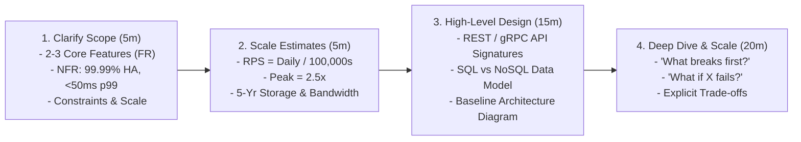
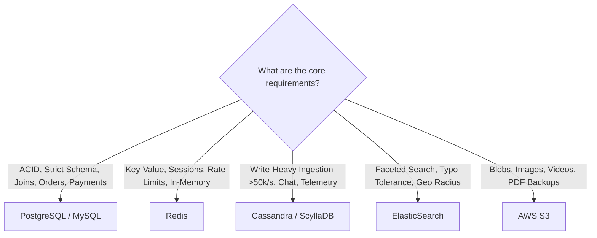

# System Design Last-Minute Revision (30–60 Minute Pre-Interview Guide)

This document is your ultra-dense, high-impact review sheet for the final 30–60 minutes before your **Infosys Specialist Programmer (SP) L3 System Design** interview.

---

## 1. The 4-Step Interview Execution Playbook

---

## 2. Latency Numbers to Memorize

| Operation | Latency | Key Takeaway |
|---|---|---|
| **L1 CPU Cache** | $0.5\text{ ns}$ | CPU registers |
| **Main Memory (RAM / Redis)** | $\mathbf{100\text{ ns}}$ | **$1,000\times$ faster than SSD!** |
| **Sequential Read 1MB from SSD** | $\mathbf{50\ \mu\text{s}}$ | Disk I/O |
| **LAN Data Center Round Trip** | $\mathbf{0.5\text{ ms}}$ | Internal microservice RPC |
| **Cross-Continent WAN (NY $\to$ London)** | $\mathbf{100\text{ ms}}$ | Cross-region network latency |

---

## 3. Core Architectural Building Blocks Summary

- **Layer 4 vs Layer 7 Load Balancers**: L4 (NLB) routes by IP/Port (fast, raw TCP); L7 (ALB) inspects HTTP URLs, headers, and cookies.
- **API Gateway**: Reverse proxy + Auth (JWT) + Rate Limiting (Token Bucket) + Telemetry + Circuit Breaking.
- **CDN**: Pull CDN edge caching using Anycast; use asset fingerprinting (`bundle.a8f9.js`) for instant cache busting.
- **Cache-Aside Pattern**: Read Cache $\to$ On miss read DB $\to$ Populate Cache with TTL.
- **Cache Failure Mitigations**:
  - *Stampede*: Mutex distributed lock on miss (`SETNX`).
  - *Penetration*: Bloom Filter or cache `null` with short TTL.
  - *Avalanche*: Add random TTL jitter (`TTL = 3600s + rand(0, 300)`).
- **Message Queues vs Kafka**: RabbitMQ/SQS = Point-to-point task queue (pop & delete); Kafka = Distributed append-only replayable streaming commit log.
- **Blob / Media Storage**: Never in database; always direct to **AWS S3 Object Storage** using Pre-signed URLs.

---

## 4. Database Selection & Scaling Rules

- **CAP Theorem**: In a network partition ($P$), pick **Consistency ($CP$)** (reject writes) OR **Availability ($AP$)** (accept writes, reconcile later).
- **Database Scaling Progression**:
  1. Optimize SQL indexes (`EXPLAIN ANALYZE`).
  2. Add Redis caching layer (Cache-Aside).
  3. Add Read Replicas (for read-heavy traffic).
  4. Table Partitioning by date range.
  5. Horizontal Sharding using Consistent Hashing (when data $> 2\text{TB}$).

---

## 5. Quick-Reference: 13 Case Studies at a Glance

| # | System | Core Secret / Architecture Pattern | Database Choice | Primary Bottleneck & Fix |
|---|---|---|---|---|
| 01 | **URL Shortener** | Base62 Key Generation Service (KGS) offline pre-generation; HTTP 302 redirects. | PostgreSQL + Redis Cache-Aside | Redis RAM exhaustion $\to$ Enforce LRU eviction. |
| 02 | **Ticketing System** | Hybrid locking: Redis atomic lock (`SETNX` 10m TTL) + Optimistic DB update. | PostgreSQL (ACID) + Redis Locks | Lock contention $\to$ Edge Virtual Waiting Room. |
| 03 | **News Feed** | **Hybrid Fanout**: Push for regular users ($< 25k$ followers); Pull for celebrities. | Cassandra (Posts) + Redis (ZSET Timelines) | Celebrity fanout write storm $\to$ Dynamic on-read merge. |
| 04 | **Notification System** | **Physical Queue Isolation**: High-priority (OTPs) vs Low-priority (Marketing). | PostgreSQL (Preferences) + Kafka | SMS vendor rate limits $\to$ Token bucket rate limiting. |
| 05 | **Chat Application** | Stateful WebSocket Gateways + Redis Session Registry + TimeUUID messages. | Cassandra / ScyllaDB (Time-Series) | Open TCP socket limits $\to$ Tune Linux file descriptors. |
| 06 | **Auction Platform** | **Atomic Redis Lua Script** for bid checks and 60s anti-sniping dynamic timer extensions. | Redis (Atomic Lua) + Postgres (Audit Ledger) | Race conditions in final 5s $\to$ Single-threaded Redis Lua. |
| 07 | **Online Rental** | ElasticSearch BKD-tree geo search + **PostgreSQL GiST `EXCLUDE` date range constraints**. | Postgres (PostGIS) + ElasticSearch + Redis | Double-booking $\to$ Postgres GiST exclusion constraint. |
| 08 | **Cloud Storage** | **Client-side 4MB Chunking + SHA-256 Deduplication**; Direct S3 Pre-signed uploads. | S3 (Chunks) + PostgreSQL (Metadata) | Bandwidth saturation $\to$ Control/Data plane split. |
| 09 | **Video Sharing** | **Adaptive Bitrate Streaming (HLS/DASH)** via 6s `.ts` chunks; Parallel GPU DAG transcode. | S3 (Chunks) + Postgres (Metadata) + CDN | Transcoding queue lag $\to$ Autoscale GPU worker pods. |
| 10 | **Search Engine** | Distributed Inverted Index (Document-Partitioned); URL Frontier politeness queues. | S3 (HTML) + Inverted Index (RAM) | Posting list intersection latency $\to$ Top-20% query cache. |
| 11 | **E-Commerce** | **Distributed Saga Orchestrator** (Compensating transactions) + Redis stock decrement. | Postgres (Orders) + Mongo (Catalog) + Redis | Flash-sale stock lock contention $\to$ Redis atomic Lua. |
| 12 | **Taxi Hailing** | **Uber H3 Hexagonal Grid Indexing** in Redis; 15s atomic driver dispatch state machine. | Redis (H3 Spatial Index) + Postgres (Trips) | 125k GPS writes/sec $\to$ In-memory Redis spatial index. |
| 13 | **Collab Editor** | **Centralized Operational Transformation (OT)** + S3 Snapshotting every 100 ops. | Cassandra (Op Log) + S3 (Snapshots) | OT transformation compute CPU $\to$ Client operation batching. |

---

## 6. Top 10 "What NOT to Say" Interview Red Flags 🚫

1. ❌ **Don't jump immediately to drawing architecture boxes**: Always spend the first 5 minutes clarifying requirements, constraints, and scale numbers.
2. ❌ **Don't say "I'll use Microservices and Kafka" without justification**: Start with a simple modular baseline architecture and introduce microservices only when team scale or distinct workload scaling demands it.
3. ❌ **Don't claim "NoSQL is faster than SQL"**: SQL with proper B-Tree indexes is exceptionally fast; NoSQL excels at horizontal scaling and write partitioning.
4. ❌ **Don't say "Sticky Sessions" are good for user state**: Sticky sessions break autoscaling and create traffic hotspots; always store sessions in an external **Redis cluster**.
5. ❌ **Don't use Pessimistic DB Locks (`SELECT FOR UPDATE`) for long holds**: Holding SQL row locks for minutes exhausts database connection pools; use in-memory Redis distributed locks with automated TTLs.
6. ❌ **Don't ignore Failure Scenarios**: Always proactively address what happens when the Master DB, Redis cache, or network connections fail.
7. ❌ **Don't store binary images or videos in database BLOB columns**: Always stream binary files directly to **AWS S3 Object Storage** via Pre-signed URLs.
8. ❌ **Don't say "We will retry failed requests immediately in a loop"**: Immediate retries create retry storms; always use **Exponential Backoff with Full Jitter**.
9. ❌ **Don't claim 100% availability**: 100% availability is statistically impossible; state your target SLA as **99.99% ("four nines")**.
10. ❌ **Don't stay silent**: Continuously narrate your engineering trade-offs aloud so the interviewer can evaluate your technical thought process.

---

## 7. The Golden 30-Second Interview Closer
> *"To summarize our architecture: we kept the application tier strictly stateless to enable seamless horizontal autoscaling behind Layer 7 Load Balancers, used Redis caching to protect our database and achieve sub-10ms read latencies, buffered write-heavy operations via Apache Kafka to prevent downstream exhaustion, eliminated all Single Points of Failure with Multi-AZ redundancy, and enforced idempotency and circuit breakers to guarantee resilience under partial failures."*
