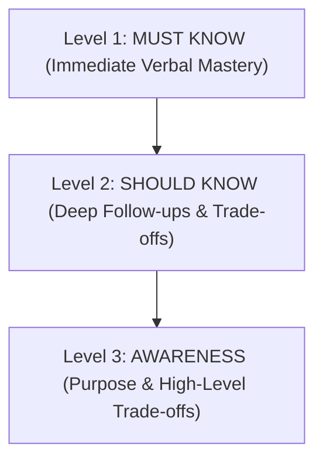
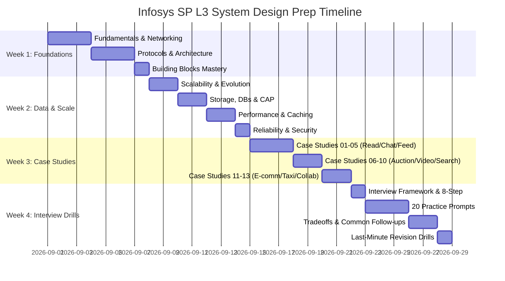

# System Design Roadmap for Infosys Specialist Programmer (SP) L3

## 1. What is the SP L3 System Design Interview?

The **Infosys Specialist Programmer (SP) L3** role is an advanced engineering tier requiring strong algorithmic capability coupled with practical architectural decision-making. 

In the L3 System Design round, interviewers evaluate whether you can:
- Design scalable, reliable, and maintainable systems from scratch.
- Justify every technology and component choice ("Why SQL vs NoSQL?", "Why Redis?").
- Reason through traffic spikes, component crashes, and network partitions.
- Identify the exact point where a system breaks first (bottleneck analysis).
- Communicate technical trade-offs conversationally without overengineering.

---

## 2. The L3 Depth Hierarchy

To maximize interview readiness and avoid getting lost in academic theory, all concepts in these notes follow this 3-tier hierarchy:

- 🟢 **Level 1 — MUST KNOW**: Core concepts you must explain immediately and fluently without hesitation (e.g., Horizontal scaling, Load balancing, Cache-aside, Read replicas, SQL indexing, Stateless services).
- 🟡 **Level 2 — SHOULD KNOW**: Nuanced mechanisms and failure scenarios that appear during interview follow-ups (e.g., Consistent hashing, Cache stampede mitigations, Database sharding strategies, Connection pooling, Distributed locks with TTL).
- 🟣 **Level 3 — AWARENESS**: Advanced distributed patterns where you need to know **what problem it solves** and **the high-level trade-off**, without deriving implementation internals (e.g., Saga pattern, CQRS, Event Sourcing, CRDTs, LSM-trees, PACELC, Gossip protocol).

---

## 3. Core Syllabus & Repository Map

| # | Topic File | Core Focus | L3 Priority |
|---|------------|------------|-------------|
| 01 | [Fundamentals](01-system-design-fundamentals.md) | Scalability, Availability, Reliability, Fault Tolerance, Latency vs Throughput | 🔥 High |
| 02 | [Networking](02-networking.md) | DNS resolution, L4 vs L7 Load Balancers, Reverse Proxy vs API Gateway, CDN | 🔥 High |
| 03 | [Protocols](03-protocols.md) | TCP vs UDP, HTTP/1.1 vs HTTP/2 vs HTTP/3, WebSockets vs SSE vs Polling, REST vs gRPC | 🔥 High |
| 04 | [Architecture Patterns](04-architecture-patterns.md) | Monolith vs Microservices, Event-Driven Architecture, Pub/Sub, Saga & CQRS (Awareness) | 🔥 High |
| 05 | [Web Concepts](05-web-concepts.md) | Stateless sessions, Redis session store, JWT vs Cookies, Serialization, Idempotency keys | ⚡ Medium |
| 06 | [Scalability](06-scalability.md) | Horizontal scaling, Stateless tier, Database scaling, Read vs Write heavy, $1K \to 100K \to 10M$ | 🔥 Critical |
| 07 | [Storage & Databases](07-storage-and-databases.md) | CAP Theorem, SQL vs NoSQL, B-Trees vs LSM, Sharding, Consistent Hashing, Object Storage | 🔥 Critical |
| 08 | [Performance](08-performance.md) | Latency numbers, Caching patterns (Cache-aside, Write-through), Cache stamps, Message Queues | 🔥 Critical |
| 09 | [Reliability](09-reliability.md) | High Availability (99.99%), SPOF removal, Failover, Circuit Breakers, Rate Limiting, RPO/RTO | 🔥 High |
| 10 | [Security](10-security.md) | AuthN vs AuthZ, OAuth2/JWT, TLS 1.3, Data encryption at rest, WAF, DDoS mitigation | ⚡ Medium |
| 11 | [Interview Framework](11-system-design-interview-framework.md) | 4-step interview strategy, 8-step Design From Scratch execution script, Time management | 🔥 Critical |

---

## 4. The 13 Case Studies & Reusable Pattern Focus

Each case study teaches reusable architectural patterns that appear repeatedly in real interviews:

1. **[01. URL Shortener](case-studies/01-url-shortener.md)**: Base62 encoding, Key Generation Service (KGS), 100:1 read-heavy caching.
2. **[02. Ticketing System](case-studies/02-ticketing-system.md)**: Seat selection concurrency, distributed locking, 10-minute cart reservation holding.
3. **[03. News Feed](case-studies/03-news-feed.md)**: Fanout-on-write vs Fanout-on-read vs Hybrid celebrity model, Redis sorted sets timeline.
4. **[04. Notification System](case-studies/04-notification-system.md)**: Priority message queues, multi-channel gateways (APNS/FCM/SMS), deduplication, idempotency.
5. **[05. Chat Application](case-studies/05-chat-application.md)**: WebSockets connection management, Session Gateway, Cassandra message history, presence heartbeats.
6. **[06. Auction Platform](case-studies/06-auction-platform.md)**: Real-time bidding, Redis Pub/Sub, optimistic locking on bid updates, countdown sync.
7. **[07. Online Rental Platform](case-studies/07-online-rental-platform.md)**: Geospatial search (GeoHash/QuadTree), double-booking prevention, calendar index.
8. **[08. Cloud Storage System](case-studies/08-cloud-storage-system.md)**: Chunking, client-side deduplication (SHA-256), S3 storage, metadata synchronization.
9. **[09. Video Sharing Platform](case-studies/09-video-sharing-platform.md)**: Chunked uploads, async transcoding DAG pipeline, adaptive bitrate (HLS/DASH), CDN edge caching.
10. **[10. Search Engine](case-studies/10-search-engine.md)**: Web crawler frontier queue, Bloom filter deduplication, inverted index, query caching.
11. **[11. E-Commerce Platform](case-studies/11-ecommerce-platform.md)**: Product catalog, inventory locking, distributed payment saga, order state machine.
12. **[12. Taxi Hailing Application](case-studies/12-taxi-hailing-application.md)**: Driver location updates, Geospatial indexing (H3/GeoHash), driver-rider matching, surge pricing.
13. **[13. Collaborative Document Editor](case-studies/13-collaborative-document-editor.md)**: Real-time WebSocket sync, Operational Transformation vs CRDT (Awareness), document versioning.

---

## 5. Dedicated Interview Toolkits

- **[Building Blocks Toolbox](interview/building-blocks.md)**: Master the 14 fundamental components (LB, API Gateway, CDN, Cache, Redis, SQL, NoSQL, Queue, Kafka, Object Store, Search Engine, Rate Limiter, Auth Service, Notification Service).
- **[System Design Practice (20 Prompts)](interview/system-design-practice.md)**: 20 mock interview prompts across Easy, Medium, and L3 with requirements, clarifying questions, and bottlenecks.
- **[Interview Question Bank](interview/system-design-questions.md)**: Beginner, Intermediate, and L3 questions formatted as `Question -> Short Answer -> Explanation -> Possible Follow-up`.
- **[Trade-Off Cheatsheet](interview/tradeoffs.md)**: Quick-reference comparison tables for every architectural decision.
- **[Common Follow-ups & Failure Scenarios](interview/common-followups.md)**: Battle-tested answers for emergency scenarios (Redis crash, DB outage, 10x traffic spike, partial failure).
- **[Estimation Cheatsheet](interview/estimation-cheatsheet.md)**: Mental-math formulas and quick conversion tables.
- **[Last-Minute Revision (30-60 Min)](interview/last-minute-revision.md)**: Ultra-dense summary for quick pre-interview review.

---

## 6. Recommended 4-Week Study Schedule

---

## 7. Golden Rules for the L3 Interview

1. **Never jump directly to an architecture diagram**: Always clarify requirements, scale, and constraints first.
2. **Start simple, then scale**: Begin with a clean baseline architecture (Client $\to$ LB $\to$ Stateless App $\to$ Database), then scale components as bottlenecks emerge.
3. **Justify every technology choice**: Explain *why* you chose PostgreSQL over MongoDB, or Redis over Memcached.
4. **Proactively discuss failures**: Don't wait for the interviewer to ask "What if this server dies?". State your redundancy and failover strategy upfront.
5. **State trade-offs explicitly**: Acknowledge what you are gaining and what you are sacrificing with every architectural decision.
