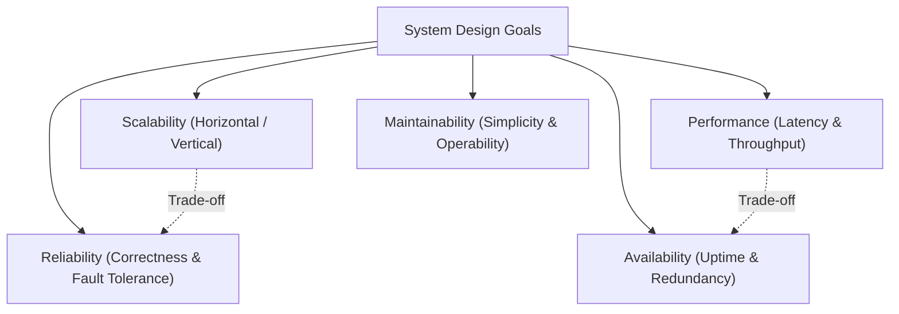
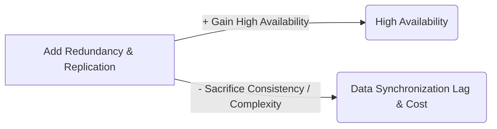

# 01 — System Design Fundamentals

## 1. What is it?
System Design is the process of defining the architecture, modules, interfaces, and data models for a system to satisfy specified functional and non-functional requirements. It is about making deliberate technical choices, managing complexity, and balancing trade-offs under constraints like scale, cost, time, and hardware limitations.

---

## 2. Why does it matter?
A system that works for 100 users will often collapse at 100,000 users without thoughtful architecture. System design ensures:
- **Scalability**: The system can handle growth gracefully.
- **Availability**: The system remains accessible during hardware faults or network disruptions.
- **Reliability & Fault Tolerance**: Errors do not cascade, and data is never silently corrupted or lost.
- **Cost Efficiency**: Resources are utilized optimally without over-provisioning.
- **Maintainability**: The codebase and infrastructure can evolve without catastrophic rewrites.

---

## 3. How does it work?

System design balances interconnected non-functional attributes:

### Depth Hierarchy for Fundamentals
- 🟢 **Level 1 (MUST KNOW)**: Scalability (Horizontal vs Vertical), High Availability vs Reliability, Fault Tolerance, Latency vs Throughput.
- 🟡 **Level 2 (SHOULD KNOW)**: Single Point of Failure (SPOF) mitigation, SLA/SLO/SLI, MTBF and MTTR metrics, Degradation strategies (graceful degradation vs hard failure).
- 🟣 **Level 3 (AWARENESS)**: Multi-region active-active synchronization costs, Byzantine fault tolerance principles.

---

## 4. Key Concepts & Definitions

| Attribute | Definition | Practical Metric / Example | Level |
|---|---|---|---|
| **Scalability** | Ability to handle increased load by adding resources without redesigning the core system. | Handling $10\times$ RPS by adding application instances. | 🟢 Level 1 |
| **Availability** | Percentage of time the system is operational and accessible to requests. | "Four Nines" ($99.99\%$ uptime = max 52.6 minutes downtime/year). | 🟢 Level 1 |
| **Reliability** | Probability that the system performs its required function correctly over a specified duration. | Zero lost payments; data is written and read accurately without corruption. | 🟢 Level 1 |
| **Fault Tolerance** | Ability of a system to continue operating properly in the event of failure of some of its components. | If 1 of 3 database replicas crashes, queries continue seamlessly. | 🟢 Level 1 |
| **Latency** | Time taken for a single request to travel from client to server and return a response. | Round-trip time (e.g., p99 latency $< 50\text{ ms}$). | 🟢 Level 1 |
| **Throughput** | Number of operations or requests processed by the system per unit of time. | Transactions per second (e.g., $10,000\text{ RPS}$). | 🟢 Level 1 |
| **Maintainability** | Ease with which a system can be modified to fix defects, improve performance, or adapt to changes. | Modular services, clear documentation, comprehensive telemetry. | 🟡 Level 2 |

### Crucial Distinction: Availability vs Reliability
- **Available but Unreliable**: A banking service responds in 10ms with HTTP 200, but debits the wrong amount or returns corrupted account balances.
- **Reliable but Unavailable**: A banking service processes transactions with 100% mathematical precision, but is offline for 4 hours every weekend.

---

## 5. Example: Evolution of an E-Commerce Checkout
1. **Single Node (Simple)**: Client $\to$ Web Server (Monolith + SQLite). Good for 100 users, but crashes if the server restarts (Zero fault tolerance, poor availability).
2. **Scalable & Available**: Client $\to$ Load Balancer $\to$ 3 Stateless Web Servers $\to$ PostgreSQL Master + Read Replica $\to$ Redis Cache.
   - If 1 Web Server crashes, LB reroutes traffic (Fault tolerant).
   - If read traffic surges $5\times$, read replicas handle the load (Scalable).

---

## 6. Advantages of Formal System Design
- Prevents expensive rewrites when product reaches product-market fit.
- Identifies single points of failure (SPOFs) before deploying to production.
- Allows predictable infrastructure budget planning based on growth estimates.

---

## 7. Disadvantages / Limitations
- **Overengineering Risk**: Introducing microservices or Kafka prematurely increases operational burden and latency for small systems.
- **Increased Initial Latency**: Adding abstraction layers (proxies, gateways, caches) adds serialization and network hops.

---

## 8. Trade-offs (What We Gain vs What We Sacrifice)

- **Strong Consistency vs Low Latency**: Enforcing global consistency requires distributed locks or synchronous quorum replication, increasing request latency.
- **Simplicity vs Scalability**: Monoliths are easy to deploy and debug; distributed microservices scale teams and workloads independently but introduce complex distributed network failures.

---

## 9. When would I use it?
Always apply system design thinking at the start of any feature or architecture planning:
- When traffic is expected to exceed the capacity of a single commodity server ($> 1,000\text{ RPS}$).
- When business downtime translates directly to revenue loss (e.g., payments, health services).
- When multi-team development requires decoupled service boundaries.

---

## 10. Interview Questions

### Q1: What is the difference between horizontal and vertical scaling?
- **Short Answer**: Vertical scaling adds more CPU/RAM to an existing machine (scale up); horizontal scaling adds more commodity machines to a pool (scale out).
- **Conversational Explanation**: "Vertical scaling is simple because it requires no architectural changes, but it has a hard hardware ceiling and creates a single point of failure. Horizontal scaling requires stateless application layers and load balancing, but provides virtually unlimited scaling and high fault tolerance."

### Q2: What is the difference between Latency and Throughput?
- **Short Answer**: Latency is the delay of a single request; throughput is the total volume of requests processed per second.
- **Conversational Explanation**: "Think of a highway: latency is how fast a single car travels from point A to B; throughput is how many cars cross the bridge per minute. You can have high throughput with high latency (e.g., batch processing)."

---

## 11. L3 Follow-up Questions & Scenarios

### If the Interviewer Asks: "How do you achieve 99.99% availability?"
- **Good Answer**: 
  > "To reach four nines (less than 53 minutes of downtime per year), we must eliminate every Single Point of Failure (SPOF). At the network layer, we use multi-AZ redundant load balancers with DNS health checks. At the application layer, we run stateless services across multiple availability zones behind auto-scaling groups. At the database layer, we implement automated master-replica failover with synchronous replication to standby instances in a secondary zone, combined with automated health monitoring and zero-downtime deployment strategies like blue-green deployments."

### If the Interviewer Asks: "Why shouldn't we design for 99.999% from day one?"
- **Good Answer**: 
  > "Moving from 99.9% to 99.999% (five nines = ~5 minutes downtime/year) increases infrastructure cost and engineering complexity exponentially. It requires multi-region active-active deployment, automated cross-region data replication, conflict resolution mechanisms, and complex multi-datacenter consensus. If the product business requirement only calls for 99.9%, overengineering to five nines wastes capital and slows developer velocity."

---

## 12. What NOT to Say in an Interview 🚫
- ❌ *Don't say*: "I will use microservices and Kafka to make the system scalable from day one." (Red flag: Overengineering without requirement justification).
- ❌ *Don't say*: "Availability and Reliability are essentially the same thing." (Shows lack of foundational clarity).
- ❌ *Don't say*: "We can just scale vertically whenever traffic spikes." (Demonstrates lack of understanding of hardware limits and SPOF risks).

---

## 13. Quick Revision Summary
- **Horizontal Scaling**: Scale out with stateless commodity servers + Load Balancers.
- **Availability ($99.99\%$)**: High uptime via redundancy and automated failover.
- **Reliability**: Correctness of execution without silent data corruption.
- **Latency vs Throughput**: Delay of one operation vs Total capacity per second.
- **L3 Rule of Thumb**: Eliminate all SPOFs $\to$ Decouple state from compute $\to$ Measure p99 latency, not just averages.
