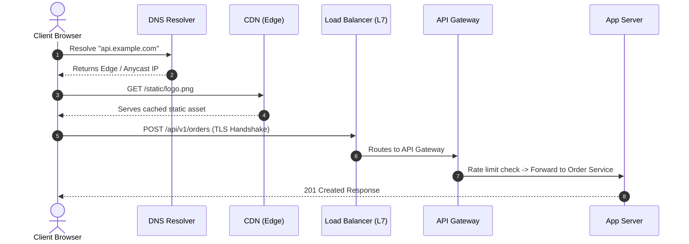
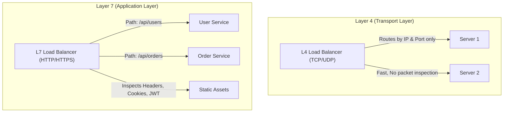
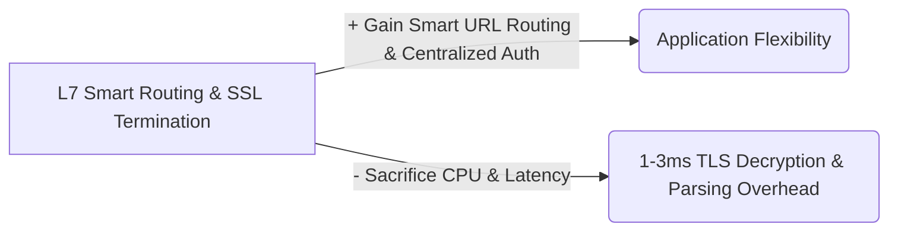

# 02 — Networking & Infrastructure

## 1. What is it?
Networking in system design provides the foundational communication layer connecting clients, load balancers, application microservices, and databases across local and wide-area networks. It governs how requests are addressed (IP), routed (DNS), distributed (Load Balancers / Proxies), and accelerated (CDNs / Edge caching).

---

## 2. Why does it matter?
Even the fastest application logic collapses if:
- DNS resolution is slow or un-cached.
- Traffic bottlenecks at a single un-scaled ingress proxy.
- Unhealthy application instances continue receiving requests due to broken health checks.
- Static assets overload backend servers instead of being served from the edge.

---

## 3. How does it work?

### The End-to-End Request Flow

### Depth Hierarchy
- 🟢 **Level 1 (MUST KNOW)**: DNS Resolution steps, Forward vs Reverse Proxy, Load Balancer (L4 vs L7, Round Robin, Least Connections, Health Checks), CDN (Push vs Pull).
- 🟡 **Level 2 (SHOULD KNOW)**: Consistent Hashing on LBs, Anycast routing, API Gateway duties (Auth, Rate Limiting, SSL termination, Circuit Breaking), Dynamic Content Acceleration (DCA).
- 🟣 **Level 3 (AWARENESS)**: BGP Anycast routing mechanisms, TLS 1.3 0-RTT resumption, TCP slow-start implications on CDN edge termination.

---

## 4. Key Components & Concepts

### 1. DNS (Domain Name System)
Translates human-readable domain names (`api.example.com`) to machine-routable IP addresses (`198.51.100.45`).

#### 🔍 Step-by-Step DNS Resolution Mechanism:
1. **Browser / OS Cache**: Checks local cache. If found, returns IP.
2. **Recursive Resolver (ISP / 8.8.8.8)**: Queries root nameserver (`.`).
3. **Root Nameserver**: Responds with TLD nameserver IP (`.com`).
4. **TLD Nameserver**: Responds with Authoritative Nameserver IP (`example.com`).
5. **Authoritative Nameserver**: Returns final A/AAAA record (`198.51.100.45`) with a TTL (Time To Live).
6. Resolver caches the result and returns it to the client.

### 2. Forward Proxy vs Reverse Proxy

| Feature | Forward Proxy | Reverse Proxy |
|---|---|---|
| **Location** | Sits in front of **Clients** | Sits in front of **Backend Servers** |
| **Purpose** | Protects/anonymizes clients, bypasses firewalls, content filtering. | Protects servers, load balances, terminates SSL, caches responses. |
| **Visibility** | Server only sees the Proxy IP, not the client. | Client only sees the Proxy IP, not internal server IPs. |
| **Example** | Corporate proxy, Tor, VPN. | Nginx, HAProxy, Envoy, AWS ALB. |

### 3. Load Balancers: L4 vs L7

| Dimension | Layer 4 (L4) Load Balancer | Layer 7 (L7) Load Balancer |
|---|---|---|
| **OSI Layer** | Transport Layer (TCP/UDP) | Application Layer (HTTP/HTTPS/gRPC) |
| **Inspection** | IP address, Port, TCP SYN | Full HTTP header, URL path, Cookies, Payload |
| **Speed / Throughput** | Ultra-high throughput, ultra-low latency | Slightly higher CPU overhead (decrypts TLS, parses HTTP) |
| **Routing Capability** | Simple packet routing (IP hash, Round Robin) | Smart routing (`/users` $\to$ User Cluster, `/video` $\to$ Media Cluster) |
| **SSL Termination** | Passes raw TCP through or terminates L4 | Decrypts SSL/TLS, inspects headers, re-encrypts if needed |
| **Technology** | AWS NLB, Linux IPVS, HAProxy (TCP mode) | AWS ALB, Nginx, HAProxy (HTTP mode), Envoy |

#### Common Load Balancing Algorithms:
- **Round Robin**: Distributes requests sequentially. Best for uniform servers and short requests.
- **Weighted Round Robin**: Routes more traffic to servers with higher CPU/RAM specs.
- **Least Connections**: Routes to the server currently handling the fewest active connections. Best for long-running connections (e.g., WebSockets).
- **IP Hash**: Hashes client IP to ensure the same client consistently reaches the same server (sticky routing without cookies).
- **Consistent Hashing**: Minimizes key remapping when backend servers are added or removed (crucial for caching tiers).

### 4. Reverse Proxy vs API Gateway
- **Reverse Proxy (e.g., Nginx)**: Handles traffic routing, SSL termination, static file serving, and basic caching.
- **API Gateway (e.g., Kong, AWS API Gateway)**: An intelligent reverse proxy with application-level orchestration:
  - Authentication and token validation (JWT).
  - Centralized rate limiting and IP throttling.
  - Request/response transformation.
  - Analytics, request logging, and distributed tracing correlation.
  - API versioning and circuit breaking.

### 5. CDN (Content Delivery Network)
A globally distributed network of edge proxy servers (Points of Presence - PoPs) that caches content close to end users to reduce latency and origin server load.

- **Push CDN**: Origin server actively uploads/pushes content to CDN servers whenever changes occur.
  - *Best for*: Infrequently updated, large static files (software updates, media releases).
- **Pull CDN (Cache-aside at Edge)**: CDN fetches content from origin only when a cache miss occurs on the edge server.
  - *Best for*: High-traffic websites with dynamic/static mix, news sites, product images.

---

## 5. Practical Example: Handling Flash Sale Ingress
When 500,000 users hit `ecommerce.com/sale`:
1. DNS Geo-routing routes Indian users to Mumbai CDN PoP.
2. CDN serves images, HTML, CSS, JavaScript directly from edge cache (90% traffic offloaded).
3. Checkout requests (`POST /checkout`) bypass CDN cache to AWS ALB (L7 Load Balancer).
4. ALB terminates TLS, validates headers, and forwards to Kong API Gateway.
5. Kong applies rate limiting (max 10 req/sec per user) and routes to Checkout Microservice pool using Least Connections.

---

## 6. Advantages
- **High Availability**: Health checks automatically detect dead servers and divert traffic within seconds.
- **Horizontal Scalability**: Add 50 new backend servers seamlessly behind the load balancer with zero client impact.
- **Global Low Latency**: CDNs drop static content fetch times from 200ms to <15ms.

---

## 7. Disadvantages / Limitations
- **Load Balancers can become SPOFs**: If not deployed as an active-passive or active-active redundant pair with DNS failover.
- **Cache Invalidation Complexity**: CDN stale cache can serve outdated pricing or outdated UI code unless proper cache-control headers (`Cache-Control: max-age=3600, s-maxage=86400, stale-while-revalidate`) or automated cache purge pipelines are implemented.

---

## 8. Trade-offs (What We Gain vs What We Sacrifice)

---

## 9. When would I use what?
- Use **L4 LB (NLB)** when you need raw throughput millions of requests/sec with extreme low latency and do not need to inspect HTTP paths (e.g., Gaming UDP traffic, IoT raw TCP streams).
- Use **L7 LB (ALB/Nginx)** when you need microservice path-based routing (`/auth`, `/orders`), SSL termination, and WebSocket support.
- Use **API Gateway** when microservices require centralized authentication, rate limiting, and telemetry.
- Use **Pull CDN** for almost all public-facing web applications serving images, videos, and static frontend bundles.

---

## 10. Interview Questions

### Q1: What happens when a backend server behind a Load Balancer crashes?
- **Short Answer**: The Load Balancer's health check fails; the LB marks the instance unhealthy and stops routing new traffic to it.
- **Conversational Explanation**: "Load balancers run active health checks (e.g., `GET /health` every 5 seconds). If a server fails 2 consecutive checks, the LB removes it from the active upstream pool. Ongoing TCP connections are either closed or retried on another node if idempotency is configured."

### Q2: How does a Pull CDN handle cache invalidation?
- **Short Answer**: Either via TTL expiration, cache purge APIs, or URL versioning/fingerprinting.
- **Conversational Explanation**: "The industry standard for static assets (JS/CSS) is file fingerprinting (e.g., `app.v2.a8f9.js`) with an infinite TTL. When we deploy new code, the URL changes, rendering the old cache obsolete. For dynamic assets, we use webhook-triggered CDN purge APIs or `stale-while-revalidate` HTTP headers."

---

## 11. L3 Follow-up Questions & Scenarios

### If the Interviewer Asks: "How do you prevent the Load Balancer itself from becoming a Single Point of Failure (SPOF)?"
- **Good Answer**: 
  > "We deploy redundant load balancers in an Active-Passive or Active-Active configuration using floating Virtual IPs via VRRP (Virtual Router Redundancy Protocol) or Keepalived. In cloud environments (like AWS Route 53 + ALB), DNS handles load balancing across multiple ALBs in different availability zones using Anycast routing and automated health check failovers."

### If the Interviewer Asks: "Why use an API Gateway if we already have a Layer 7 Load Balancer?"
- **Good Answer**: 
  > "An L7 load balancer is primarily a traffic distributor and reverse proxy. An API Gateway sits behind the LB and handles cross-cutting business concerns: validating JWT tokens, managing client API keys, enforcing rate limits per tier, request/response payload mapping, and circuit breaking. Separating them keeps the LB lean and focused on high-throughput packet routing while the API Gateway enforces API business governance."

---

## 12. What NOT to Say in an Interview 🚫
- ❌ *Don't say*: "A CDN is only for images and video files." (CDNs also accelerate dynamic API responses, handle edge compute/workers, and provide DDoS protection).
- ❌ *Don't say*: "Sticky sessions are the best way to scale user state." (Sticky sessions break auto-scaling and cause uneven load distribution; always store session state in an external Redis store).
- ❌ *Don't say*: "L7 is always better than L4 because it is smarter." (L4 is dramatically faster and has much lower memory/CPU overhead for pure TCP streaming).

---

## 13. Quick Revision Summary
- **DNS**: Hierarchical resolution (Browser $\to$ OS $\to$ Resolver $\to$ Root $\to$ TLD $\to$ Authoritative).
- **L4 vs L7**: L4 routes by IP/Port (fast, blind); L7 routes by URL/Headers/Cookies (smart, TLS-terminating).
- **Reverse Proxy vs API Gateway**: Reverse proxy distributes and terminates SSL; API Gateway adds Auth, Rate Limiting, and Telemetry.
- **CDN**: Edge caching using Anycast; use Pull CDN for dynamic scale and Asset Fingerprinting for instant cache busting.
