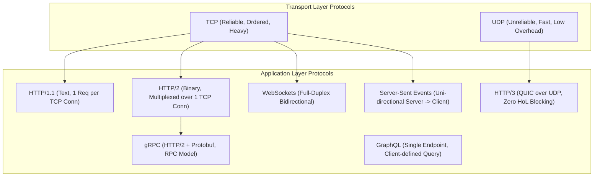
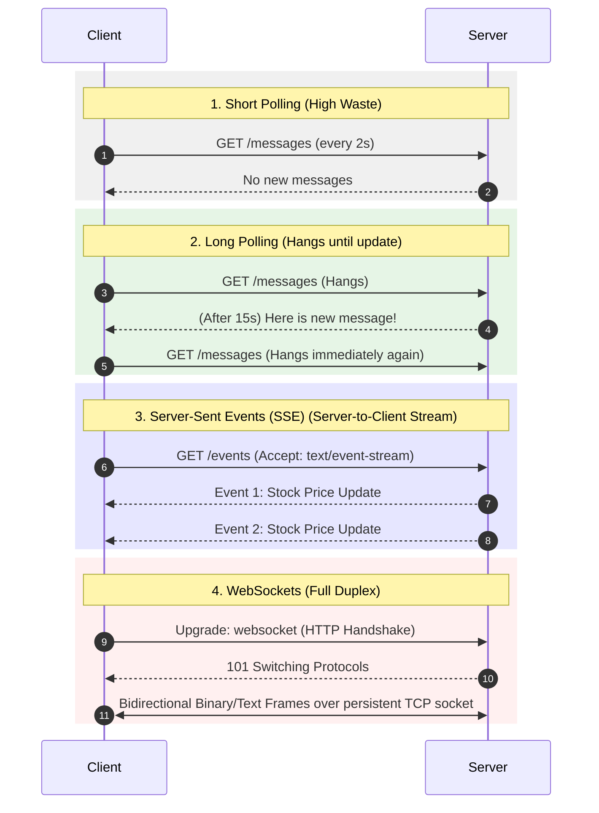
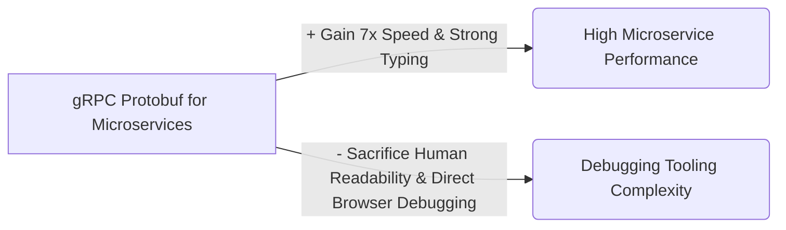

# 03 — Protocols & API Communication

## 1. What is it?
Protocols define the rules, syntax, sequencing, and error-handling mechanisms for exchanging data across a network. In system design, choosing the right protocol dictates communication latency, throughput, connection overhead, reliability, and real-time responsiveness.

---

## 2. Why does it matter?
Using the wrong protocol creates severe architectural bottlenecks:
- Using HTTP Polling instead of WebSockets for chat wastes bandwidth and exhausts server sockets.
- Using REST/JSON over HTTP/1.1 for high-frequency internal microservice communication introduces severe serialization and connection-handshake overhead compared to gRPC/Protobuf.
- Using TCP for live video broadcasting causes rebuffering delays when packets drop, whereas UDP allows seamless continuous streaming.

---

## 3. How does it work?

### Depth Hierarchy
- 🟢 **Level 1 (MUST KNOW)**: TCP vs UDP, HTTP Methods & Idempotency, WebSockets vs SSE vs Long Polling, REST principles.
- 🟡 **Level 2 (SHOULD KNOW)**: HTTP/1.1 vs HTTP/2 (Multiplexing, Head-of-Line Blocking) vs HTTP/3 (QUIC), gRPC vs REST vs GraphQL, WebSocket connection state management.
- 🟣 **Level 3 (AWARENESS)**: TCP Congestion Control (Tahoe, Cubic, BBR), TLS 1.3 0-RTT handshakes, Protobuf wire serialization format.

---

## 4. Key Protocol Comparisons

### 1. Transport Protocols: TCP vs UDP

| Feature | TCP (Transmission Control Protocol) | UDP (User Datagram Protocol) |
|---|---|---|
| **Connection Type** | Connection-oriented (3-Way Handshake: SYN $\to$ SYN-ACK $\to$ ACK) | Connectionless (No handshake; fires datagrams immediately) |
| **Reliability** | 100% Guaranteed delivery (ACKs + Automatic Retransmissions) | Best-effort delivery (Packets can be lost with no retries) |
| **Ordering** | Guaranteed in-order packet assembly via Sequence Numbers | No ordering guarantees; packets arrive out of order |
| **Flow & Congestion Control** | Yes (Sliding window flow control + AIMD Congestion avoidance) | None (Transmits at application speed) |
| **Header Overhead** | 20–60 bytes per packet | 8 bytes per packet |
| **Speed / Latency** | Higher latency due to handshakes and ACKs | Ultra-low latency |
| **Primary Use Cases** | Web browsing (HTTP/HTTPS), File transfers (FTP), Databases, Email | DNS lookups, VoIP, Video Streaming, Online Gaming, HTTP/3 (QUIC) |

---

### 2. The Evolution of HTTP

| Version | Underlying Transport | Key Mechanism | Major Bottleneck Solved / Created |
|---|---|---|---|
| **HTTP/1.1** | TCP | Keep-Alive persistent connections; Sequential request/response pipelining. | ❌ **Head-of-Line (HoL) Blocking at App Layer**: Only 1 in-flight request per TCP socket at a time. |
| **HTTP/2** | TCP | **Binary Framing**, **Multiplexing** (multiple parallel streams over a single TCP connection), **HPACK** header compression, Server Push. | ✅ Solved HTTP-level HoL blocking. ❌ **TCP-Level HoL Blocking**: 1 dropped packet stalls all streams in the TCP connection. |
| **HTTP/3** | **QUIC (over UDP)** | Built-in TLS 1.3 encryption, Independent stream multiplexing directly over UDP. | ✅ Solves TCP-level HoL blocking entirely. Fast connection migration (switching Wi-Fi to 5G seamlessly). |

---

### 3. Real-Time Communication Protocols

| Technology | Directionality | Protocol | Connection Lifecycle | Reconnection / Fallback | Best Use Case |
|---|---|---|---|---|---|
| **Short Polling** | Unidirectional (Client pulls) | HTTP | Connect $\to$ Check $\to$ Close (repeated every $N$ sec) | Native HTTP retry | Simple dashboards with infrequent updates. |
| **Long Polling** | Unidirectional (Client pulls) | HTTP | Connection held open by server until data arrives or timeout | Client immediately sends new long-poll HTTP request | Fallback when WebSockets blocked by corporate firewalls. |
| **Server-Sent Events (SSE)** | **Unidirectional (Server $\to$ Client)** | HTTP/2 | Single long-lived persistent HTTP connection | Built-in browser reconnection & event IDs | Stock tickers, live sports scores, LLM token streaming (ChatGPT). |
| **WebSockets** | **Bidirectional (Full Duplex)** | WS / WSS (TCP) | Single persistent bidirectional TCP connection | Must implement custom heartbeat/ping-pong & reconnect | Real-time chat, multiplayer gaming, collaborative editing (Google Docs). |

---

### 4. API Paradigms: REST vs GraphQL vs gRPC

| Feature | REST (Representational State Transfer) | GraphQL | gRPC (Google Remote Procedure Call) |
|---|---|---|---|
| **Protocol** | HTTP/1.1 or HTTP/2 | HTTP/1.1 or HTTP/2 | **HTTP/2 strictly** |
| **Payload Format** | JSON (Human-readable text) | JSON | **Protocol Buffers (Protobuf - Binary)** |
| **Data Fetching** | Fixed endpoints (`/users`, `/orders`); prone to Over-fetching / Under-fetching | Client specifies exact query; Single endpoint (`/graphql`) | Strict RPC method invocation defined in `.proto` contract |
| **Performance / Speed** | Moderate (JSON serialization overhead) | Moderate (Query parsing & execution overhead) | **Ultra-Fast & Compact (Up to 7-10x faster than REST/JSON)** |
| **Streaming Support** | Limited (Chunked transfer / SSE) | Subscriptions (over WebSockets) | **Native Streaming (Client, Server, Bidirectional)** |
| **Browser Support** | Universal (All browsers) | Universal (All browsers) | Requires gRPC-Web proxy for frontend; best for backend |
| **Primary Use Case** | Public APIs, CRUD web services, Mobile backends | Complex dashboard UIs with nested relational data | **Internal Microservice-to-Microservice communication** |

---

## 5. HTTP Methods & Idempotency Rules

| HTTP Method | Safe? (Read-only) | Idempotent? ($N$ calls = $1$ call result) | Primary Purpose |
|---|---|---|---|
| **GET** | ✅ Yes | ✅ Yes | Retrieve resource without modifying state. |
| **POST** | ❌ No | ❌ No | Create a new resource or execute non-idempotent action. |
| **PUT** | ❌ No | ✅ Yes | Replace/overwrite entire resource. |
| **PATCH** | ❌ No | ❌ No (Can be idempotent if structured) | Partially update fields of a resource. |
| **DELETE** | ❌ No | ✅ Yes | Remove a resource. Repeated calls yield same state (absent). |

---

## 6. Advantages & Disadvantages
- **WebSockets**:
  - *Advantage*: Ultra-low latency bidirectional communication with minimal 2-byte frame overhead after handshake.
  - *Disadvantage*: Stateful connections; makes load balancing and horizontal autoscaling harder (requires sticky routing or Redis Pub/Sub backplane).
- **gRPC**:
  - *Advantage*: Strongly-typed `.proto` contracts, fast binary serialization, built-in multiplexing.
  - *Disadvantage*: Not human-readable, difficult to test with simple `curl` commands, poor native browser support.

---

## 7. Trade-offs (What We Gain vs What We Sacrifice)

---

## 8. When would I use what?
1. **Public APIs**: Use **REST** for simple resource CRUD; use **GraphQL** if frontend clients have wildly diverse data requirements (mobile app vs desktop).
2. **Internal Microservices**: Use **gRPC** over HTTP/2 for high-throughput, low-latency inter-service RPC.
3. **Live Streaming / Real-Time**:
   - If updates flow **only from server to client** (e.g., Live scores, AI text generation) $\to$ **SSE**.
   - If updates flow **both ways** (e.g., Chat, Gaming, Co-editing) $\to$ **WebSockets**.

---

## 9. Interview Questions

### Q1: What is the difference between WebSockets and Server-Sent Events (SSE)?
- **Short Answer**: WebSockets are bidirectional and full-duplex over custom TCP; SSE is unidirectional (server-to-client only) over standard HTTP.
- **Conversational Explanation**: "If we only need to stream data from server to client—like live cryptocurrency prices or ChatGPT streaming responses—SSE is simpler, works over standard HTTP/2, and has native browser reconnection. If we need two-way communication like a chat room or collaborative whiteboard, WebSockets are required."

### Q2: What makes HTTP/2 faster than HTTP/1.1?
- **Short Answer**: Multiplexing over a single TCP connection, binary framing, and HPACK header compression.
- **Conversational Explanation**: "In HTTP/1.1, the browser opened 6 separate TCP connections to fetch assets sequentially. HTTP/2 introduces binary framing and multiplexes dozens of streams simultaneously over a single persistent TCP connection, eliminating connection handshake overhead and application-level head-of-line blocking."

---

## 10. L3 Follow-up Questions & Scenarios

### If the Interviewer Asks: "How do you scale a WebSocket server horizontally across 10 instances?"
- **Good Answer**: 
  > "Because WebSocket connections are stateful and long-lived, Client A connected to Server 1 cannot directly message Client B connected to Server 2. To scale horizontally, we keep the WebSocket servers as connection termination gateways and connect them via an internal Pub/Sub message broker (like Redis Pub/Sub or Kafka). When Server 1 receives a message for Client B, it publishes to a Redis channel. Server 2 subscribes to that channel, receives the event, and pushes it down the active WebSocket to Client B."

### If the Interviewer Asks: "Why is gRPC faster than REST over JSON?"
- **Good Answer**: 
  > "First, gRPC uses Protocol Buffers (binary serialization), which produces payloads 60–80% smaller than text-based JSON and requires significantly less CPU to serialize/deserialize. Second, gRPC runs strictly on HTTP/2, leveraging persistent multiplexed streams and binary framing, avoiding repeated TCP handshakes and header overhead."

---

## 11. What NOT to Say in an Interview 🚫
- ❌ *Don't say*: "WebSockets should always be used whenever we need real-time data." (If communication is purely server-to-client, SSE is far simpler and traverses corporate proxies/firewalls more reliably).
- ❌ *Don't say*: "PUT and POST are identical; both are used to update data." (PUT is idempotent and replaces the entire resource; POST is non-idempotent and creates a child resource).
- ❌ *Don't say*: "HTTP/2 completely eliminated all head-of-line blocking." (HTTP/2 solved application-level HoL blocking, but TCP-level HoL blocking remains; HTTP/3 over QUIC solves TCP HoL blocking).

---

## 12. Quick Revision Summary
- **TCP vs UDP**: TCP is reliable/ordered (3-way handshake); UDP is fast/loss-tolerant.
- **HTTP/1.1 vs HTTP/2 vs HTTP/3**: 1.1 = text & sequential; 2 = binary multiplexing over TCP; 3 = QUIC over UDP.
- **Real-Time**: Short Poll (wasteful) $\to$ Long Poll (hangs) $\to$ SSE (Server $\to$ Client) $\to$ WebSockets (Full Duplex).
- **APIs**: REST for public CRUD; GraphQL for flexible client queries; gRPC for high-speed internal microservices.
