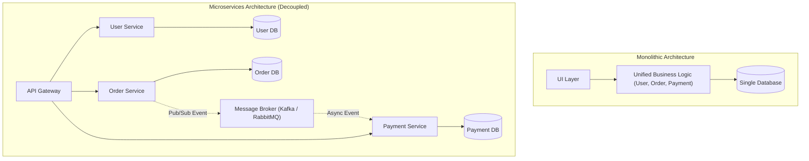
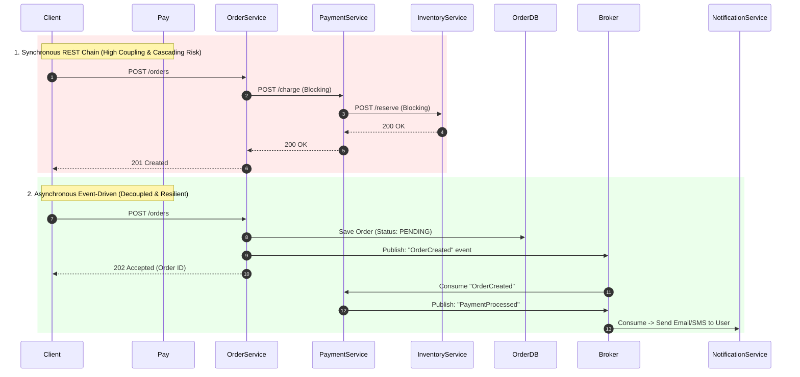
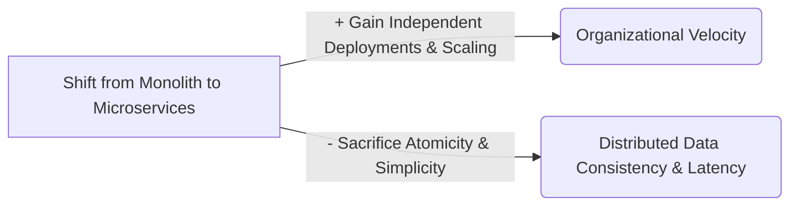

# 04 — Architecture Patterns

## 1. What is it?
Architecture patterns define the high-level structural organization and interaction models of software systems. They determine how components communicate, how responsibilities are separated, how data flows across service boundaries, and how systems scale under organizational and operational growth.

---

## 2. Why does it matter?
Choosing the wrong architecture creates catastrophic friction:
- Adopting microservices too early introduces distributed tracing overhead, network latency, and deployment complexity for a 3-person team.
- Staying in a tangled monolith when having 200 developers causes constant Git merge conflicts, coupled deployments, and slow release cycles.
- Using synchronous REST calls across a chain of 10 microservices causes cascading outages if one service slows down.

---

## 3. How does it work?

### Depth Hierarchy
- 🟢 **Level 1 (MUST KNOW)**: Monolith vs Microservices, Multi-Tier (3-Tier) Architecture, Synchronous (REST/gRPC) vs Asynchronous (Event-Driven/Queue) communication.
- 🟡 **Level 2 (SHOULD KNOW)**: Database-per-service pattern, Distributed transaction challenges, Event Choreography vs Event Orchestration.
- 🟣 **Level 3 (AWARENESS)**: Saga Pattern (Compensating transactions), CQRS (Command Query Responsibility Segregation), Event Sourcing principles.

---

## 4. Key Architectural Patterns

### 1. Monolith vs Microservices vs Modular Monolith

| Dimension | Monolith | Microservices | Modular Monolith |
|---|---|---|---|
| **Structure** | Single codebase, single deployable binary/archive. | Multiple independently deployable, fine-grained services. | Single binary, but strictly enforced internal module boundaries. |
| **Database** | Shared single database. | Database-per-service (strictly isolated). | Single database, but schema separated by module domains. |
| **Deployment** | All-or-nothing deployment. Single failure can bring down entire app. | Independent CI/CD pipelines per service. Zero-downtime canary rollouts. | Single deployment pipeline with rapid testing of internal modules. |
| **Communication** | Fast in-memory function calls (nanoseconds). | Network calls (REST/gRPC/Kafka) $\to$ Latency in milliseconds. | In-memory function calls / domain events. |
| **Operational Cost** | Low (Single server or uniform cluster). | High (Requires Kubernetes, Service Mesh, Distributed Tracing, Helm). | Low-to-Moderate. |
| **Team Fit** | Small teams (<15-20 engineers). | Large engineering organizations (50+ engineers, multiple teams). | Medium teams scaling towards modularity. |

---

### 2. Synchronous vs Asynchronous (Event-Driven) Communication

| Dimension | Synchronous (REST / gRPC) | Asynchronous / Event-Driven (EDA) |
|---|---|---|
| **Interaction** | Request-Response. Caller blocks and waits for reply. | Fire-and-Forget / Publish-Subscribe. Caller does not wait. |
| **Coupling** | **Tight coupling**: Caller must know callee address and availability. | **Loose coupling**: Producer only emits events to message broker. |
| **Failure Impact** | **Cascading failures**: If payment service is down, order creation fails immediately. | **Fault tolerant**: Events buffer in queue if consumer is down; processed upon recovery. |
| **Throughput** | Limited by slowest service in synchronous chain. | High throughput (Buffers spikes; consumers process at own pace). |
| **Complexity** | Simple mental model, easy debugging. | Eventual consistency, out-of-order events, duplicate event handling required. |

---

### 3. Level 3 Awareness: Advanced Distributed Patterns

#### A. Saga Pattern (Distributed Transactions)
- **Problem**: In microservices, we cannot run an ACID transaction across separate databases (e.g., Order DB, Payment DB, Inventory DB).
- **Solution**: A sequence of local transactions. Each transaction updates its own database and publishes an event. If a step fails (e.g., Payment fails), the Saga executes **compensating transactions** (e.g., unreserve inventory, cancel order) to rollback state.
  - **Choreography**: Services listen to events and decide next action autonomously (Best for simple workflows: 2-3 services).
  - **Orchestration**: A central Saga Orchestrator tells each service what local transaction to execute (Best for complex multi-step workflows).

#### B. CQRS (Command Query Responsibility Segregation)
- **Problem**: Read queries need complex joins and denormalized data, while write commands need strict ACID validation.
- **Solution**: Separate the **Command model** (optimized for Writes: INSERT/UPDATE into relational DB) from the **Query model** (optimized for Reads: ElasticSearch / Redis / Read Replica). Events synchronize writes to the read store asynchronously.

#### C. Event Sourcing
- **Problem**: Traditional DBs only store current state; you lose historical audit trail.
- **Solution**: Instead of storing mutable state, store an append-only log of immutable domain events (`AccountOpened`, `MoneyDeposited`, `MoneyWithdrawn`). Current state is computed by replaying events from genesis.

---

## 5. Practical Example: E-Commerce Order Fulfillment
1. User clicks "Place Order".
2. **Synchronous Entry**: Client $\to$ API Gateway $\to$ Order Service (Saves order state as `PENDING`, returns Order ID in 50ms).
3. **Asynchronous Execution**: Order Service emits `OrderCreated` event to Apache Kafka.
4. Payment Service consumes event, charges credit card, emits `PaymentSucceeded`.
5. Inventory Service consumes `PaymentSucceeded`, decrements warehouse stock, emits `InventoryReserved`.
6. Notification Service consumes event and triggers push notification / email to user.

---

## 6. Advantages & Disadvantages
- **Microservices**:
  - *Advantages*: Independent deployment, isolated tech stacks (Go for performance, Python for ML), isolated fault domains.
  - *Disadvantages*: Distributed system complexity, data inconsistency, network latency, difficult end-to-end debugging.
- **Event-Driven Architecture**:
  - *Advantages*: Extreme decoupling, handles massive traffic spikes via queue buffering.
  - *Disadvantages*: Eventual consistency; tracing event flows requires correlation IDs.

---

## 7. Trade-offs (What We Gain vs What We Sacrifice)

---

## 8. When would I use what?
- **Use Monolith / Modular Monolith**: Early-stage startups, greenfield projects, small teams (<15 engineers), or when domain boundaries are still evolving.
- **Use Microservices**: Large engineering teams (multiple cross-functional squads), distinct scaling requirements (e.g., video processing service needs GPUs while auth service needs standard CPUs).
- **Use Event-Driven Architecture**: High-throughput asynchronous pipelines, notifications, background processing, order state machines, and microservice decoupling.

---

## 9. Interview Questions

### Q1: When should an organization choose a Monolith over Microservices?
- **Short Answer**: When the team is small, the product domain is evolving, and high developer velocity with low operational complexity is needed.
- **Conversational Explanation**: "A monolith is ideal when starting a new product. It avoids network overhead, simplifies testing and deployments, and keeps all code in one place. Moving to microservices is only justified when team communication bottlenecks or distinct component scaling needs outweigh the cost of managing distributed infrastructure."

### Q2: How do you handle distributed transactions across microservices?
- **Short Answer**: Using the Saga Pattern with compensating transactions, instead of heavy two-phase commit (2PC).
- **Conversational Explanation**: "Because microservices have isolated databases, 2PC creates blocking and availability bottlenecks. Instead, we use a Saga—either Choreography or Orchestration—where each service executes a local transaction. If step 3 fails, the system triggers compensating transactions in reverse to undo the previous steps and ensure eventual consistency."

---

## 10. L3 Follow-up Questions & Scenarios

### If the Interviewer Asks: "What happens if an event consumer crashes while processing an event?"
- **Good Answer**: 
  > "We ensure the message broker uses consumer acknowledgments (ACKs). The broker only marks the event as processed after the consumer completes its local transaction and sends an ACK. If the consumer crashes midway, the broker redelivers the message to another healthy consumer instance. To prevent side effects from duplicate deliveries, every consumer must be idempotent—for example, checking a processed-message deduplication table in its database before executing business logic."

### If the Interviewer Asks: "How do you choose between Saga Choreography and Saga Orchestration?"
- **Good Answer**: 
  > "For simple workflows involving 2 to 3 services, Choreography is great because it requires no central coordinator. However, as workflows grow to 5+ steps, Choreography becomes hard to track due to cyclic dependencies. In complex workflows, Orchestration is preferred because a dedicated orchestrator service explicitly coordinates the steps, maintains transaction state, and handles error rollbacks centrally."

---

## 11. What NOT to Say in an Interview 🚫
- ❌ *Don't say*: "Microservices are always better and more modern than monoliths." (Top red flag: Great engineers start with monoliths or modular monoliths and extract services only when bounded contexts demand it).
- ❌ *Don't say*: "We can just use Two-Phase Commit (2PC) across all our microservices." (2PC is synchronous, blocking, and creates severe availability SPOFs in distributed cloud environments).
- ❌ *Don't say*: "Microservices make systems faster." (Microservices introduce network hops and serialization latency; they improve organizational scalability, not raw execution speed).

---

## 12. Quick Revision Summary
- **Monolith vs Microservices**: Monolith = in-memory speed & simplicity; Microservices = independent deployments & scale.
- **Modular Monolith**: Clean domain boundaries in a single binary—the sweet spot before microservices.
- **Sync vs Async**: Sync (REST/gRPC) for immediate user responses; Async (Queues/Kafka) for decoupled, resilient background processing.
- **Saga Pattern**: Sequence of local transactions with compensating rollback actions for distributed workflows.
- **CQRS**: Separate Write database (normalized ACID) from Read database (denormalized fast query).
