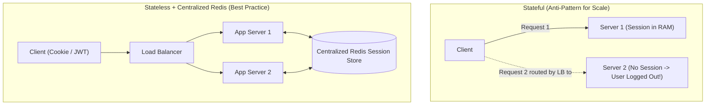
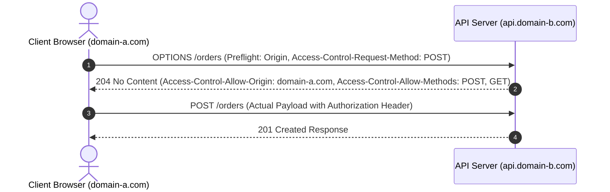
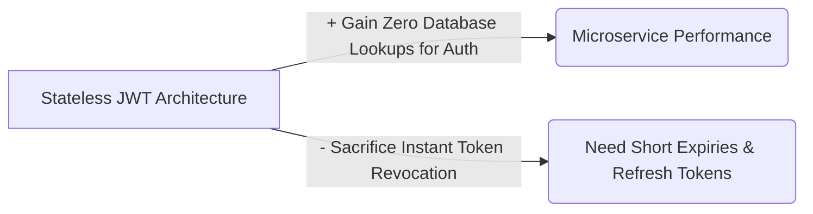

# 05 — Web Concepts & State Management

## 1. What is it?
Web concepts govern how HTTP clients interact with web servers, how user state and identity are maintained across inherently stateless HTTP requests, how data is serialized across the wire, and how cross-domain browser security is enforced.

---

## 2. Why does it matter?
Handling state incorrectly directly prevents horizontal scalability:
- Storing user sessions in local server RAM makes horizontal auto-scaling impossible because a user's next request will fail if routed to a different server.
- Failing to implement idempotency keys causes duplicate charges when users double-click "Submit Payment" or when mobile network connections drop and retry.
- Misunderstanding CORS blocks frontend clients from communicating with backend APIs.

---

## 3. How does it work?



### Depth Hierarchy
- 🟢 **Level 1 (MUST KNOW)**: Stateless vs Stateful Architecture, Session Cookies vs JWT (JSON Web Tokens), Centralized Session Store (Redis), Idempotency Keys.
- 🟡 **Level 2 (SHOULD KNOW)**: JWT Revocation strategies (Blacklisting / Short-lived + Refresh tokens), CORS Preflight (`OPTIONS` request) flow, Serialization formats (JSON vs Protobuf).
- 🟣 **Level 3 (AWARENESS)**: SameSite cookie security attributes (`Strict`, `Lax`, `None`), Token sidejacking mitigations, Schema evolution compatibility with Avro/Protobuf.

---

## 4. Key Concepts & Mechanisms

### 1. State Management Strategies

| Strategy | How it Works | Pros | Cons / Scaling Impact | Level |
|---|---|---|---|---|
| **Server Local Memory** | Session stored in server's RAM. | Fast in-memory access. | ❌ **Breaks horizontal scaling**. If server restarts, all sessions are lost. | 🟢 Level 1 |
| **Sticky Sessions (Session Affinity)** | Load Balancer hashes IP/Cookie to route user to the *exact same* server. | Works with in-memory sessions. | ❌ **Uneven traffic distribution**; if a server dies, all its pinned users lose their sessions. | 🟢 Level 1 |
| **Centralized Store (Redis)** | Server stores session ID in cookie; Session data stored in fast in-memory Redis cluster. | ✅ **Fully stateless app servers**; any server can process any request. High availability via Redis replicas. | Adds one network hop (1ms) to Redis per request. | 🟢 Level 1 |
| **Client-Side Tokens (JWT)** | Session payload signed cryptographically and sent in HTTP `Authorization: Bearer <token>` header. | ✅ **Zero server storage needed**. Ideal for microservices and mobile clients. | ❌ **Hard to revoke instantly**; token payload cannot be modified until expiration. | 🟢 Level 1 |

---

### 2. Session Cookies vs JWT (Deep Dive Comparison)

```mermaid
sequenceDiagram
    autonumber
    rect rgb(240, 240, 255)
    Note over Client,Server: 1. Server-Side Session with Redis
    Client->>Server: POST /login (Credentials)
    Server->>Redis: SET session:xyz {userId: 42, role: "admin"} TTL=3600
    Server-->>Client: Set-Cookie: sessionId=xyz; HttpOnly; Secure
    Client->>Server: GET /orders (Cookie: sessionId=xyz)
    Server->>Redis: GET session:xyz
    Server-->>Client: 200 OK (Orders)
    end

    rect rgb(255, 245, 230)
    Note over Client,Server: 2. Stateless JWT Token
    Client->>Server: POST /login (Credentials)
    Server-->>Client: Return JWT: {header.payload.signature}
    Client->>Server: GET /orders (Authorization: Bearer <jwt>)
    Server->>Server: Verify cryptographic signature locally (No DB lookup!)
    Server-->>Client: 200 OK (Orders)
    end
```

| Dimension | Centralized Session (Redis + Cookie) | Stateless JWT (JSON Web Token) |
|---|---|---|
| **Storage Location** | Server-side in Redis cluster; Client holds only random ID. | Client-side (Local storage or HttpOnly Cookie); Server holds zero state. |
| **Verification Cost** | Network hop to Redis (0.5–1ms). | Local CPU cryptographic signature verification (0.05ms). |
| **Revocation / Logout** | **Instant**: Simply delete `session:xyz` from Redis. | **Difficult**: Token remains valid until it expires unless maintaining a revocation blacklist. |
| **Payload Size** | Minimal (Random 32-character string). | Larger (Encodes user ID, roles, metadata $\to$ adds 500B–2KB per request). |
| **Best Used For** | Standard Web Applications where instant revocation is required (Banking, Admin portals). | Mobile apps, Cross-domain Single Sign-On (SSO), High-throughput microservice APIs. |

#### 🔑 The Standard JWT Token Pattern (Short-lived + Refresh Token):
To solve the JWT revocation issue:
1. Issue a **Short-lived Access Token** (valid for 10–15 minutes) sent in memory.
2. Issue a **Long-lived Refresh Token** (valid for 7–30 days) stored securely in an `HttpOnly`, `Secure`, `SameSite` cookie.
3. If an account is compromised, invalidate the Refresh Token in the database. When the 15-minute access token expires, the client cannot refresh.

---

### 3. Serialization Formats

| Format | Type | Human Readable? | Serialization Speed | Payload Size | Schema Enforcement |
|---|---|---|---|---|---|
| **JSON** | Text-based | ✅ Yes | Moderate | Moderate (Includes field names in text) | Loose (Optional JSON Schema) |
| **XML** | Text-based | ✅ Yes | Slow | Large (Heavy verbose tags) | Strict (XSD) |
| **Protocol Buffers (Protobuf)** | Binary | ❌ No | **Ultra-Fast** | **Very Small (60–80% smaller than JSON)** | **Strict `.proto` contract** |
| **Apache Avro** | Binary | ❌ No | **Ultra-Fast** | **Extremely Compact** (Schema stored separately) | Strict (Dynamic Schema) |

---

### 4. CORS (Cross-Origin Resource Sharing)
CORS is a browser security mechanism that restricts web pages from making AJAX requests to a different domain (origin) than the one that served the page.



- **Origin** = Protocol + Domain + Port (e.g., `https://app.com:443`).
- **Preflight Request**: The browser automatically issues an `OPTIONS` request before sending complex HTTP requests (e.g., custom headers, `PUT`, `DELETE`, `POST` with JSON) to verify server permissions.

---

### 5. Idempotency Keys (Preventing Duplicate Transactions)
When a network glitch occurs after an order is processed, a client might retry. To prevent double charging:
1. Client generates a unique UUID `Idempotency-Key: 9b1deb4d-3b7d-4bad-9bdd-2b0d7b3dcb6d` in the request header.
2. API Gateway / App checks Redis:
   - If key exists with status `SUCCESS` $\to$ Returns cached response immediately (No duplicate work!).
   - If key exists with status `PROCESSING` $\to$ Returns `409 Conflict` (Duplicate in-flight request).
   - If key does NOT exist $\to$ Sets key with `PROCESSING` state + 5-minute TTL, executes transaction, updates key with `SUCCESS` + response payload.

---

## 6. Advantages & Disadvantages
- **Stateless Web Architecture**:
  - *Advantage*: Any server can crash or be terminated without logging out users; seamless autoscaling from 2 to 200 instances.
  - *Disadvantage*: Relies on an external Redis cluster or JWT validation infrastructure.

---

## 7. Trade-offs (What We Gain vs What We Sacrifice)



---

## 8. When would I use what?
- Use **Redis-backed Sessions** for web apps requiring strict instant revocation (e.g., financial dashboards, enterprise SaaS).
- Use **Stateless JWTs** for high-throughput mobile APIs and microservice authentication headers.
- Use **Protobuf** for internal microservice-to-microservice gRPC communication; use **JSON** for public web APIs.
- Use **Idempotency Keys** on every payment, checkout, and money transfer endpoint.

---

## 9. Interview Questions

### Q1: Why should application servers always be stateless?
- **Short Answer**: To enable horizontal scaling and high availability so that any server instance can handle any incoming request.
- **Conversational Explanation**: "When application servers hold no local session state in memory, we can place them behind a round-robin load balancer. If traffic surges, autoscaling can spin up 10 new instances instantly. If an instance crashes, no user data or active sessions are lost because state lives externally in a distributed Redis cache."

### Q2: What is the purpose of a CORS preflight request?
- **Short Answer**: A preflight `OPTIONS` request checks whether the destination server permits cross-origin requests from the client domain before sending the actual payload.
- **Conversational Explanation**: "Browsers enforce the Same-Origin Policy. When a frontend at `foo.com` makes a `POST` or `DELETE` with custom headers to `bar.com`, the browser first sends an `OPTIONS` request. If the server replies with matching `Access-Control-Allow-Origin` and allowed methods, the browser proceeds with the real request."

---

## 10. L3 Follow-up Questions & Scenarios

### If the Interviewer Asks: "How do you immediately revoke a JWT token if a user's phone is stolen?"
- **Good Answer**: 
  > "Because JWTs are self-contained and cryptographically verified offline, they cannot be revoked locally without an expiration. In production, we use two mechanisms: First, we keep access token lifetimes short (e.g., 5–10 minutes) and use long-lived refresh tokens. Second, for emergency revocation, we maintain a small Redis-based token blacklist (or a 'token-revoked-at' timestamp per user ID in Redis). When an API receives a request, it does a fast in-memory Redis check against the blacklist only if the user flagged an emergency."

### If the Interviewer Asks: "How do you implement idempotency for a payment API?"
- **Good Answer**: 
  > "The client sends a unique UUID in the `Idempotency-Key` header. The server uses Redis `SETNX` (set if not exists) with a 2-minute TTL on that key. If `SETNX` succeeds, the server proceeds to call the payment gateway, writes the result to the database, updates the Redis key with the final payment response, and returns. If `SETNX` fails because the key is already processing or completed, the server skips the payment call and returns the cached result."

---

## 11. What NOT to Say in an Interview 🚫
- ❌ *Don't say*: "We will use sticky sessions to handle user state across multiple servers." (Sticky sessions prevent effective auto-scaling and cause traffic hotspots).
- ❌ *Don't say*: "JWTs are encrypted, so the client cannot read the data inside them." (JWT payloads are base64-encoded and signed, NOT encrypted; anyone can decode and view the payload unless using JWE).
- ❌ *Don't say*: "CORS is a backend security feature." (CORS is a browser-enforced security mechanism, not a backend firewall; non-browser clients like Postman or curl ignore CORS completely).

---

## 12. Quick Revision Summary
- **Stateless Servers**: Decouple state $\to$ App servers are disposable $\to$ Store sessions in Redis.
- **JWT**: Stateless verification via signature; mitigate revocation via short access TTL + Refresh token.
- **Protobuf vs JSON**: Protobuf is 70% smaller, strongly-typed, and significantly faster for internal services.
- **Idempotency**: UUID idempotency key in header + Redis atomic locking $\to$ Prevents duplicate charges.
