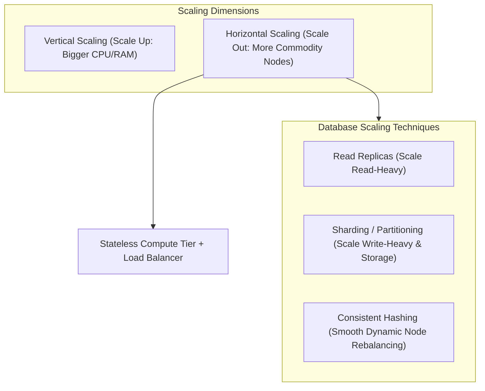
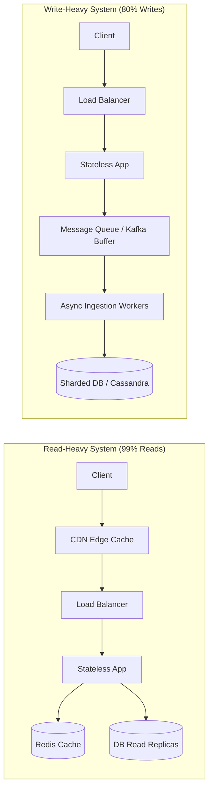
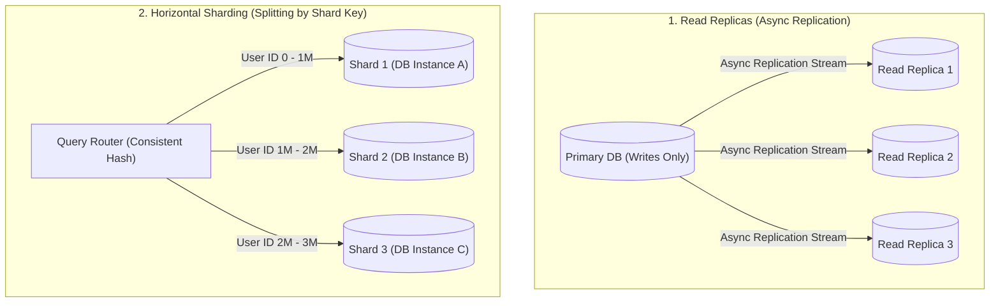
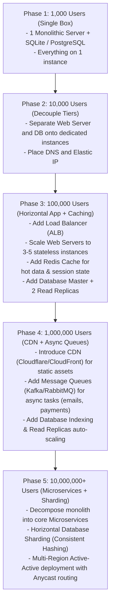
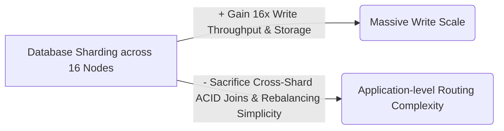

# 06 — Scalability & Growth Evolution

## 1. What is it?
Scalability is the property of a system to handle an increasing workload without degrading performance (latency, error rate) by gracefully adding computing, memory, storage, and network resources.

---

## 2. Why does it matter?
A design that runs smoothly for 1,000 users will fail completely under 10 million users unless built with scale dimensions in mind:
- Compute nodes run out of CPU and thread pools.
- Databases hit disk I/O bottlenecks and connection limits.
- Network bandwidth saturates.
- Lock contention causes database deadlocks and timeouts.

---

## 3. How does it work?

### Depth Hierarchy
- 🟢 **Level 1 (MUST KNOW)**: Horizontal vs Vertical scaling, Stateless App Tier, Read Replicas, Caching (Read-heavy scaling), $1K \to 100K \to 10M$ evolution steps.
- 🟡 **Level 2 (SHOULD KNOW)**: Database Sharding (Range-based vs Hash-based), Hotspot / Celebrity problem, Consistent Hashing (Virtual nodes), Write-heavy scaling (Message queues + Asynchronous ingestion).
- 🟣 **Level 3 (AWARENESS)**: Multi-master replication conflicts, Shard rebalancing algorithms, Dynamic autoscaling cooldown periods.

---

## 4. Key Scaling Strategies

### 1. Scaling Strategy Comparison

| Strategy | Mechanism | Pros | Cons / Limitations |
|---|---|---|---|
| **Vertical Scaling (Scale Up)** | Upgrade machine to 128 cores, 512GB RAM, NVMe SSDs. | Zero code changes; no distributed concurrency issues. | Hard hardware ceiling; expensive; Single Point of Failure (SPOF); requires downtime to upgrade. |
| **Horizontal Scaling (Scale Out)** | Add 10, 50, or 200 commodity EC2 / container instances. | Virtually unlimited scaling; high availability; cost-effective commodity hardware. | Requires stateless application tier; requires load balancers; introduces distributed network latency. |
| **Diagonal Scaling** | Combine vertical and horizontal (e.g., scale out medium-sized 8-core instances). | Balances resource utilization and cost efficiency. | Requires monitoring and fine-tuned capacity planning. |

---

### 2. Scaling Read-Heavy vs Write-Heavy Workloads

| Dimension | Read-Heavy Workload (e.g., Twitter Feed, URL Shortener) | Write-Heavy Workload (e.g., IoT Telemetry, Analytics, Logging) |
|---|---|---|
| **Primary Bottleneck** | Database Query I/O, Repeated read queries. | Disk Write Throughput, Lock contention, Index rebuild overhead. |
| **Core Solutions** | 1. **CDN Edge Caching** for static & public data. 2. **Redis / Memcached** (Cache-Aside pattern). 3. **Database Read Replicas** with Master-Slave replication. | 1. **Message Queues (Kafka / SQS)** to buffer write spikes. 2. **Batch / Bulk Writes** to database. 3. **LSM-Tree based storage** (Cassandra, RocksDB). 4. **Horizontal Database Sharding**. |

---

### 3. Database Scaling Strategies: Replicas vs Sharding

| Method | How it Works | When to Use | Trade-offs & Challenges |
|---|---|---|---|
| **Read Replicas** | Master takes all writes and streams changes asynchronously to multiple Read Replicas. | Read-heavy workloads ($>80\%$ reads). | **Replication Lag**: A user writes data and immediately reads from a replica that hasn't synced yet (stale read). |
| **Database Sharding** | Splits a single dataset horizontally across multiple distinct database servers using a **Shard Key**. | When total dataset exceeds 1-2TB or write volume exceeds single Master capacity. | **Cross-shard JOINs are impossible/slow**; Schema migrations become complex; choosing the wrong shard key causes hotspots. |

#### Sharding Key Selection:
- **Range-Based (e.g., by Alphabet A-Z or Date)**: Easy queries, but causes severe write hotspots (e.g., all current month writes hit the latest shard).
- **Hash-Based (e.g., `hash(user_id) % N`)**: Uniform distribution across shards, but adding a new shard requires rehashing all data unless using Consistent Hashing.

---

### 4. Consistent Hashing (Level 2 Deep Dive)
- **The Problem with Modulo Hashing (`hash(key) % N`)**: When you change $N$ from 4 to 5 servers, almost 100% of keys remap to different servers, causing a catastrophic cache stampede.
- **Consistent Hashing Solution**:
  1. Map servers and keys to a 360-degree virtual ring ($0 \to 2^{32}-1$).
  2. A key is stored on the first server encountered moving **clockwise**.
  3. When a server is added or removed, **only $K/N$ keys need to be remapped** (where $K$ = total keys, $N$ = total servers).
  4. **Virtual Nodes (V-Nodes)**: Each physical machine is mapped to 100–200 virtual positions on the ring to prevent uneven data skew and hotspots.

---

## 5. The Interview Scaling Evolution Framework: $1K \to 100K \to 10M$ Users

Use this step-by-step mental roadmap when an interviewer asks you to scale a system:

---

## 6. Advantages & Disadvantages
- **Horizontal Scaling**:
  - *Advantage*: Linear scaling capacity; elastic autoscaling reduces cloud bills during low-traffic periods.
  - *Disadvantage*: Requires robust telemetry, distributed logging, distributed tracing (Jaeger), and stateless service code.

---

## 7. Trade-offs (What We Gain vs What We Sacrifice)

---

## 8. When would I use what?
- If database CPU is high due to `SELECT` queries $\to$ Add **Redis Cache** and **Read Replicas**.
- If database disk write I/O is saturated $\to$ Add **Kafka write buffer**, optimize indexes, or **Shard the database**.
- If application CPU is high $\to$ Add more **stateless app instances** behind the Load Balancer.
- If static asset bandwidth is maxed out $\to$ Offload to **CDN**.

---

## 9. Interview Questions

### Q1: What is replication lag and how do you handle it?
- **Short Answer**: Replication lag is the time delay for changes on the Master DB to sync to Read Replicas.
- **Conversational Explanation**: "Because replication is asynchronous, a user who updates their profile and immediately refreshes might hit a replica that hasn't synced yet (seeing stale data). To fix this, we can route read-your-own-writes queries to the Master DB for 5 seconds after a write, or read from a consistent cache."

### Q2: Why is Hash-based sharding preferred over Range-based sharding?
- **Short Answer**: Hash-based sharding distributes writes uniformly across all nodes, avoiding localized traffic hotspots.
- **Conversational Explanation**: "If you shard an e-commerce order table by date range (e.g., month), all writes for today will hit only the shard hosting current data, leaving older shards idle. Hash-based sharding with consistent hashing distributes current orders evenly across all shards."

---

## 10. L3 Follow-up Questions & Scenarios

### If the Interviewer Asks: "How do you handle the 'Celebrity / Hotspot' problem in a sharded database?"
- **Good Answer**: 
  > "If a celebrity user like Elon Musk with 150 million followers tweets, hashing by `user_id` routes millions of reads and writes to a single shard, overwhelming that machine. To mitigate this: First, we treat celebrity accounts with a specialized hybrid caching strategy in Redis. Second, for hot write keys, we can append a random salt suffix (`user_id_1`, `user_id_2`, ..., `user_id_N`) to distribute the celebrity's data across multiple shards, aggregating them at query time."

### If the Interviewer Asks: "How do you scale write-heavy systems like IoT sensor tracking?"
- **Good Answer**: 
  > "For write-heavy streams (e.g., 100,000 writes/sec), writing directly to a relational DB will saturate disk IOPS and lock tables. Instead, we buffer writes using Apache Kafka. Stateless worker consumers batch write 1,000 records at a time using bulk `COPY` operations into a time-series or columnar database like ClickHouse or an LSM-tree database like ScyllaDB/Cassandra, which turns random disk writes into sequential append-only writes."

---

## 11. What NOT to Say in an Interview 🚫
- ❌ *Don't say*: "Whenever the database is slow, we will immediately shard it." (Sharding is the last resort; first add indexes, add Redis caching, optimize queries, and add read replicas).
- ❌ *Don't say*: "Horizontal scaling makes single requests run faster." (Horizontal scaling increases overall system *throughput* / capacity; it does not decrease the execution time of an individual CPU-bound function).
- ❌ *Don't say*: "We will use modulo hashing `% N` across 10 database shards." (Adding an 11th shard will require migrating ~90% of your data; always mention Consistent Hashing).

---

## 12. Quick Revision Summary
- **App Tier Scaling**: Keep servers strictly stateless $\to$ Auto-scale horizontally behind L7 Load Balancer.
- **Read-Heavy Scaling**: CDN $\to$ Redis Cache-Aside $\to$ Database Read Replicas.
- **Write-Heavy Scaling**: Kafka Message Buffer $\to$ Batch Inserts $\to$ LSM-Trees (Cassandra) $\to$ Horizontal Sharding.
- **Database Sharding**: Split by Shard Key using Consistent Hashing + Virtual Nodes to prevent hotspots.
- **Replication Lag Fix**: Route "Read-Your-Own-Writes" to Master or use consistent cache.
