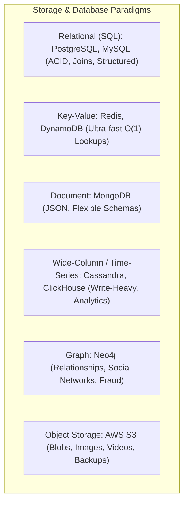
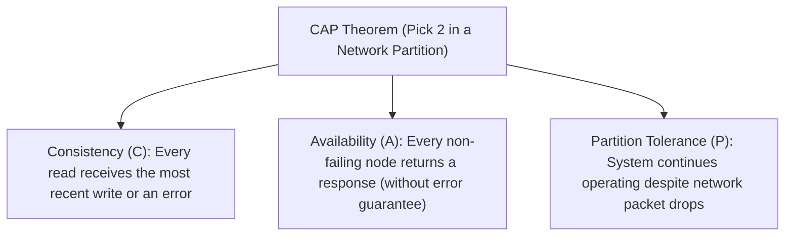
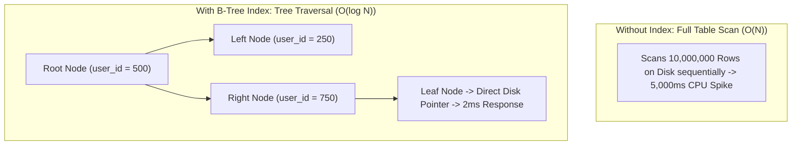
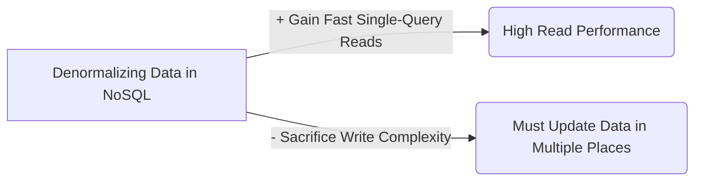

# 07 — Storage & Databases

## 1. What is it?
Storage and database systems manage the persistent state of an application. Choosing the right database paradigm, schema design, indexing strategy, and partitioning architecture dictates data consistency, query performance, and the storage scalability of a distributed system.

---

## 2. Why does it matter?
Databases are almost always the **hardest component to scale and migrate** in a system:
- Choosing SQL when data is unstructured and horizontally sharded across thousands of nodes leads to rigid schema friction.
- Choosing NoSQL when financial transactions require strict ACID guarantees leads to race conditions, double spending, and corrupted balances.
- Missing indexes on high-frequency query columns cause slow table scans ($O(N)$ instead of $O(\log N)$), spiking database CPU to 100%.

---

## 3. How does it work?

### Depth Hierarchy
- 🟢 **Level 1 (MUST KNOW)**: CAP Theorem (Practical trade-offs), SQL vs NoSQL comparison, B-Tree Indexing basics, Polyglot Persistence, Read Replicas vs Sharding.
- 🟡 **Level 2 (SHOULD KNOW)**: Covering indexes, Query optimization (`EXPLAIN`), Object Storage (S3) vs Block Storage (EBS), Master-Slave replication lag.
- 🟣 **Level 3 (AWARENESS)**: PACELC Theorem, B-Trees vs LSM-Trees (Log-Structured Merge Trees in Cassandra/RocksDB), Quorum consistency ($R + W > N$).

---

## 4. Key Concepts & Comparisons

### 1. The CAP Theorem (Practical Distributed Systems Breakdown)

In any distributed data store with network partitioning:

> [!IMPORTANT]
> **In the real world, network partitions ($P$) are unavoidable** (cables get cut, switches fail). Therefore, the real choice is always:
> **Consistency ($CP$)** OR **Availability ($AP$)** during a partition!

#### Practical Distributed Example:
Imagine 2 Database nodes: Node 1 in New York, Node 2 in London. The transatlantic network cable cuts ($P$ occurs).
- **CP System (e.g., PostgreSQL Master, HBase, ZooKeeper)**: A user in London tries to write. Node 2 knows it cannot sync with Node 1 in NY. It **rejects the write with an error** to ensure no stale/conflicting data exists. Result: **Data remains 100% Consistent, but Availability is sacrificed**.
- **AP System (e.g., Cassandra, DynamoDB, CouchDB)**: Node 2 in London **accepts the write anyway**. Both nodes stay online. When the network reconnects hours later, the nodes sync via reconciliation (last-write-wins). Result: **System remains 100% Available, but users in NY and London temporarily see inconsistent data**.

#### Level 3 Awareness: PACELC Theorem
- Extends CAP: **If Partition ($P$)**: Choose Availability ($A$) or Consistency ($C$). **Else ($E$)**: Choose Latency ($L$) or Consistency ($C$).
- Example: Even when there is NO partition, an ACID system sacrifices Latency ($L$) to ensure synchronous multi-node consistency ($C$).

---

### 2. SQL vs NoSQL Detailed Comparison

| Dimension | Relational (SQL) | NoSQL (Document / KV / Column) |
|---|---|---|
| **Data Structure** | Structured Tables with fixed columns, strict schemas. | Unstructured / Semi-structured (JSON, Key-Value, Columnar). |
| **Transactions** | **ACID** (Atomicity, Consistency, Isolation, Durability). | **BASE** (Basically Available, Soft state, Eventual consistency). |
| **Joins** | Powerful, native relational `JOIN` operations across tables. | No native joins (Data is denormalized or joined in application code). |
| **Scaling** | Vertically scales easily; Horizontally scales via Read Replicas & complex manual Sharding. | Built for **native horizontal scaling** across thousands of commodity nodes. |
| **Query Language** | Standardized SQL (`SELECT`, `GROUP BY`, `HAVING`). | Proprietary APIs or query languages (MongoDB MQL, CQL). |
| **Examples** | PostgreSQL, MySQL, Oracle, CockroachDB. | MongoDB, Redis, Cassandra, DynamoDB, Neo4j. |
| **Best Used For** | Financial systems, E-commerce orders, strict relationships, ERPs. | Real-time analytics, user sessions, catalogs, time-series IoT data. |

---

### 3. NoSQL Database Types & Use Cases

| Type | Popular Technologies | Core Mechanism | Best Use Case |
|---|---|---|---|
| **Key-Value** | Redis, AWS DynamoDB, Memcached | Hash map storage. $O(1)$ lookups by primary key. | User sessions, Caching, Rate limiting counters, Shopping carts. |
| **Document** | MongoDB, CouchDB | JSON/BSON documents with nested hierarchies. | Content management, Product catalogs, User profiles. |
| **Wide-Column / Time-Series** | Apache Cassandra, ScyllaDB, ClickHouse | High-throughput append-only writes grouped by partition key. | IoT telemetry, Financial tick data, Chat message history, Activity logs. |
| **Graph** | Neo4j, Amazon Neptune | Nodes (entities) and Edges (relationships) with pointer chasing. | Social networks ("Friends of friends"), Recommendation engines, Fraud rings. |

---

### 4. Storage Engines: B-Trees vs LSM-Trees (Level 3 Awareness)

| Dimension | B-Tree (PostgreSQL, MySQL InnoDB) | LSM-Tree (Cassandra, RocksDB, ScyllaDB) |
|---|---|---|
| **Primary Optimization** | **Read-Optimized** | **Write-Optimized** |
| **Write Mechanism** | In-place random disk page updates. Requires random I/O. | Writes append to an in-memory **MemTable** and an append-only **WAL (Write-Ahead Log)**. Flushes sequentially to **SSTables** on disk. |
| **Read Mechanism** | Fast direct traversal down tree ($O(\log N)$). | Checks MemTable $\to$ Bloom filters $\to$ Multiple SSTables (Compaction cleans duplicates). |
| **Best For** | General relational transactional workloads. | High-throughput ingestion, logs, chat messages ($>100K\text{ writes/sec}$). |

---

### 5. Indexing & Query Optimization

#### Indexing Best Practices:
1. **Primary Key**: Automatically indexed with a clustered B-Tree index.
2. **Composite Indexes (Multi-Column)**:
   - Order matters! Follow the **Leftmost Prefix Rule**: An index on `(status, created_at)` speeds up queries on `status` OR `(status, created_at)`, but will **NOT** help queries filtering only on `created_at`.
3. **Covering Index**: An index that contains all columns requested in the `SELECT` query. The database engine satisfies the query entirely from the index RAM without touching disk pages.
4. **The Index Trade-off**: Indexes make `SELECT` queries fast ($O(\log N)$) but **slow down `INSERT`, `UPDATE`, and `DELETE`** because every index tree must be updated on disk.

---

### 6. Storage Types: Object vs Block vs File

| Type | Technology | Unit of Data | Best Use Case |
|---|---|---|---|
| **Object Storage** | AWS S3, Google Cloud Storage, MinIO | Immutable Objects with metadata and unique URL. | Images, videos, PDF invoices, static assets, database backups. |
| **Block Storage** | AWS EBS, SAN, NVMe SSDs | Raw fixed-size disk blocks attached directly to a virtual server. | Database data directories (PostgreSQL, MySQL), operating system root drives. |
| **File Storage** | AWS EFS, NFS, SMB | Hierarchical directory tree accessible by multiple servers concurrently. | Shared media assets across multiple legacy application servers. |

---

## 5. Practical Example: Polyglot Persistence in E-Commerce
Rather than forcing one database to do everything:
1. **PostgreSQL (SQL)**: Handles Orders, Payments, Users (ACID transactions, relational integrity).
2. **MongoDB (Document NoSQL)**: Handles Product Catalog (Flexible schema for shirts vs laptops).
3. **Redis (Key-Value In-Memory)**: Handles User Sessions, Rate limiting, Hot product caching.
4. **ElasticSearch (Search Engine)**: Handles Full-Text search and multi-facet filtering.
5. **AWS S3 (Object Storage)**: Stores product images and customer PDF receipts.

---

## 6. Advantages & Disadvantages
- **SQL Databases**:
  - *Advantages*: Strong ACID guarantees, powerful joins, zero data duplication (normalized).
  - *Disadvantages*: Hard to scale writes horizontally; schema changes require migrations.
- **NoSQL Databases**:
  - *Advantages*: Massive horizontal scale, flexible schema, high write throughput.
  - *Disadvantages*: Eventual consistency; lack of standard joins requires denormalization.

---

## 7. Trade-offs (What We Gain vs What We Sacrifice)

---

## 8. When would I use what?
- Use **PostgreSQL / MySQL** when: Data has strong relationships, requires ACID transactions (banking, checkout), and dataset fits on a single master with read replicas (<1-2TB).
- Use **MongoDB** when: Data schema changes frequently or documents are naturally hierarchical (catalogs, CMS).
- Use **Cassandra / ScyllaDB** when: Ingestion write volume is massive (>50K/sec) and queries are always by a known partition key (IoT sensors, chat logs).
- Use **AWS S3** for: Any file, image, video, or data blob larger than 1MB.

---

## 9. Interview Questions

### Q1: How do you choose between SQL and NoSQL in a system design interview?
- **Short Answer**: Choose SQL if you need ACID transactions, complex joins, and structured relations; choose NoSQL if you need massive horizontal write scaling, high availability (AP), or flexible semi-structured documents.
- **Conversational Explanation**: "I evaluate three criteria: first, **Data Structure** (relational vs document/key-value); second, **Consistency Requirements** (do we need strict ACID for financial transactions, or is eventual consistency acceptable?); and third, **Scale** (will write throughput exceed a single SQL primary server?). For example, in an e-commerce platform, I would use PostgreSQL for orders and payments, but Redis for sessions and DynamoDB/MongoDB for the product catalog."

### Q2: Why shouldn't we store image files directly in a SQL database BLOB column?
- **Short Answer**: Storing binary blobs bloats database backups, saturates DB memory buffers, and wastes expensive database IOPS.
- **Conversational Explanation**: "Databases are optimized for structured tabular querying. Storing 5MB image blobs in SQL wastes database RAM, inflates backup sizes, and increases database CPU load. The best practice is to upload the image directly to Object Storage like AWS S3 and store only the resulting lightweight URL string in the SQL database."

---

## 10. L3 Follow-up Questions & Scenarios

### If the Interviewer Asks: "How would you optimize a database query that takes 4 seconds to execute?"
- **Good Answer**: 
  > "First, I'd run `EXPLAIN ANALYZE` on the query to inspect the execution plan and verify if the database is performing an expensive Full Table Scan (Seq Scan). If it is, I'd add a B-Tree index on the filtering and join columns. If it's a composite filter, I'll ensure the index matches the Leftmost Prefix. Next, I'll check for N+1 query patterns in the application layer. If the query involves expensive multi-table joins, I'd consider creating a Covering Index or caching the computed result in Redis."

### If the Interviewer Asks: "What is the difference between Master-Slave and Multi-Master database replication?"
- **Good Answer**: 
  > "In Master-Slave (Primary-Replica), all writes go to a single Master, which streams changes asynchronously to read replicas. It is simple and avoids write conflicts, but the Master is a write bottleneck. In Multi-Master, multiple nodes accept writes simultaneously across data centers. This provides high write availability, but introduces distributed write conflict resolution challenges (such as split-brain issues, vector clocks, or last-write-wins data loss)."

---

## 11. What NOT to Say in an Interview 🚫
- ❌ *Don't say*: "NoSQL is always faster than SQL." (SQL with proper B-Tree indexing is exceptionally fast for point lookups; NoSQL excels at horizontal scaling and partition throughput, not magic execution speed).
- ❌ *Don't say*: "We can achieve Consistency, Availability, and Partition Tolerance simultaneously (CA in a distributed network)." (In a distributed system, network partitions will happen; you MUST choose between CP and AP).
- ❌ *Don't say*: "I will put indexes on every single column in the table just in case." (Every index adds write overhead to every `INSERT`, `UPDATE`, and `DELETE`; index only high-cardinality query filter columns).

---

## 12. Quick Revision Summary
- **CAP Theorem**: In a network partition ($P$), pick **Consistency ($CP$)** (fail the write) OR **Availability ($AP$)** (accept the write, reconcile later).
- **SQL vs NoSQL**: SQL = ACID, Joins, Structured; NoSQL = Horizontal scale, flexible schemas, high write throughput.
- **Polyglot Persistence**: Use the best tool for the specific job (Postgres for Orders, Redis for Sessions, S3 for Images, ElasticSearch for Search).
- **Indexing**: B-Tree indexes turn $O(N)$ scans into $O(\log N)$ lookups; follow the Leftmost Prefix Rule for composite indexes.
- **Blobs / Media**: Never in DB; always in **AWS S3 Object Storage**.
