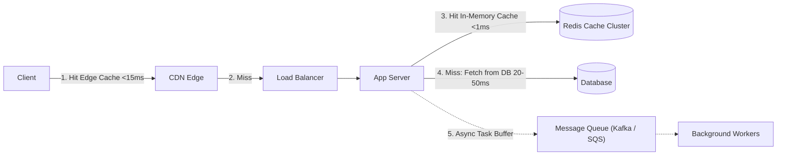
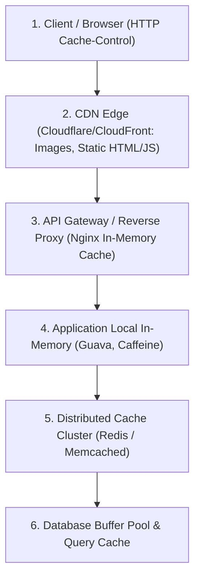
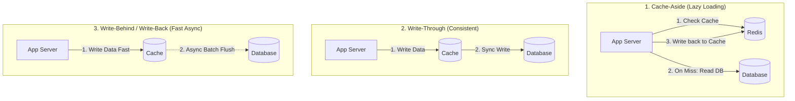
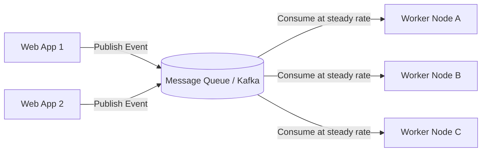
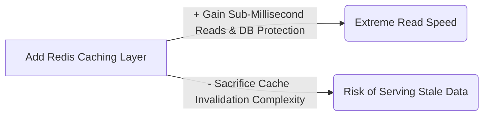

# 08 — Performance, Caching & Asynchronous Processing

## 1. What is it?
Performance in system design is the measure of how efficiently a system utilizes computing, memory, network, and storage resources to deliver low latency (fast response times) and high throughput (high transaction volumes) under both normal and peak loads.

---

## 2. Why does it matter?
Performance directly impacts user retention and infrastructure costs:
- An extra 100ms of latency reduces user conversion rates by 1-7%.
- Without caching, database CPU hits 100% under modest traffic spikes.
- Without message queues, spikes in traffic overwhelm downstream processing systems, causing cascading service crashes.

---

## 3. How does it work?

### Depth Hierarchy
- 🟢 **Level 1 (MUST KNOW)**: Latency vs Throughput, Cache-Aside pattern, Eviction policies (LRU, TTL), Message Queue basics (Producer, Consumer, Decoupling), Redis vs Memcached.
- 🟡 **Level 2 (SHOULD KNOW)**: Write-Through vs Write-Behind caching, Cache Stampede / Avalanche / Penetration mitigations, Bloom Filters, Kafka vs RabbitMQ architectural differences.
- 🟣 **Level 3 (AWARENESS)**: Latency numbers every programmer should know (RAM vs SSD vs Network), Probabilistic cache expiration (XFetch), Zero-copy network I/O.

---

## 4. Latency Numbers Every Engineer Should Know

| Hardware / Network Operation | Approximate Time | Mental Scale Comparison |
|---|---|---|
| **L1 CPU Cache Reference** | $0.5\text{ ns}$ | 1 heartbeat |
| **Main Memory (RAM) Reference** | $100\text{ ns}$ | 3 minutes |
| **Read 1 MB sequentially from RAM** | $3,000\text{ ns } (3\ \mu\text{s})$ | 1.5 hours |
| **Read 1 MB sequentially from NVMe SSD** | $50,000\text{ ns } (50\ \mu\text{s})$ | 1 day |
| **Read 1 MB sequentially from Spinning Disk** | $1,000,000\text{ ns } (1\text{ ms})$ | 1 month |
| **Send packet within same Data Center (LAN)** | $500,000\text{ ns } (0.5\text{ ms})$ | 2 weeks |
| **Round trip Cross-Continent (NY to London)** | $100,000,000\text{ ns } (100\text{ ms})$ | 8 years! |

> [!TIP]
> **Key Takeaway**: Reading from **RAM (Redis)** is **1,000x faster** than reading from **Disk (Database)** and **1,000,000x faster** than network hops across regions.

---

## 5. Caching Deep Dive

### 1. Where Caching Sits

---

### 2. Caching Strategies (Patterns)

| Strategy | Mechanism | Pros | Cons / Trade-offs | Best For |
|---|---|---|---|---|
| **Cache-Aside (Lazy Loading)** | App checks Cache. On Miss, reads DB and writes result to Cache with TTL. | Cache only contains actually requested data; Cache node failure is not fatal. | **Cache Miss Latency Penalty** (Requires 3 network round-trips on miss); Potential stale data until TTL expires. | **Read-heavy workloads** (General web apps, user profiles). |
| **Read-Through** | App treats Cache as main data store. Cache library automatically fetches from DB on miss. | Simplifies application code; centralized data fetching. | Cache schema must match DB schema. | Systems using specialized ORM cache plugins. |
| **Write-Through** | App writes to Cache, and Cache **synchronously** writes to DB before returning success. | High data consistency; data in cache is always fresh. | **Higher Write Latency** (Must wait for both Cache and DB write to complete). | Financial / transactional data requiring immediate fresh reads. |
| **Write-Behind (Write-Back)** | App writes to Cache immediately. Cache **asynchronously batches** writes to DB in background. | **Ultra-low write latency**; absorbs massive write spikes. | **Data Loss Risk**: If Cache crashes before async flush to DB, recent writes are permanently lost. | Real-time view count counters, IoT ingestion, game leaderboards. |
| **Refresh-Ahead** | Cache automatically reloads frequently accessed keys before their TTL expires based on access patterns. | Eliminates cache miss latency for hot keys. | Requires accurate prediction of key access frequencies. | Predictable periodic reads (e.g., top news stories). |

---

### 3. Cache Eviction Policies
When Cache memory is full ($100\%$ RAM utilized):
- **LRU (Least Recently Used)**: Evicts the key that hasn't been accessed for the longest time (Industry standard).
- **LFU (Least Frequently Used)**: Evicts the key with the lowest total access count.
- **FIFO (First In, First Out)**: Evicts the oldest created key regardless of access frequency.
- **TTL (Time To Live)**: Keys expire automatically after a specified time (e.g., 3600 seconds).

---

### 4. Cache Failure Scenarios & Mitigations (Critical L3 Concepts)

| Failure Scenario | What Happens? | Production Mitigation | Level |
|---|---|---|---|
| **Cache Stampede (Thundering Herd)** | A super-hot key expires (e.g., FIFA World Cup score). 50,000 concurrent requests miss cache simultaneously and hit the Database at the exact same millisecond $\to$ DB crashes. | 1. **Mutex / Distributed Lock**: Only 1 worker acquires lock to query DB and update cache; other 49,999 wait. 2. **Probabilistic Early Expiration (XFetch)**: Pre-emptively refresh the key before it expires in the background. | 🟡 Level 2 |
| **Cache Penetration** | Malicious client queries millions of non-existent IDs (`/user/random_uuid_9999`). Cache has no record $\to$ Every single request bypasses cache and hits DB $\to$ DB collapses. | 1. **Bloom Filter**: In-memory probabilistic structure placed before cache to immediately reject non-existent keys in $O(1)$. 2. **Cache NULL Values**: Store `key: null` with a short 2-minute TTL in Redis. | 🟡 Level 2 |
| **Cache Avalanche** | Thousands of cache keys were created at the same time with the exact same 24-hour TTL. All expire simultaneously $\to$ Massive spike overwhelms DB. | **Add Random TTL Jitter**: Instead of fixed `TTL = 3600s`, use `TTL = 3600s + rand(0, 300s)`. | 🟢 Level 1 |
| **Cache Breakdown** | A single extremely hot key expires under heavy load. | Same as Cache Stampede: Mutex locking on cache miss. | 🟢 Level 1 |

---

## 6. Message Queues & Asynchronous Processing

### 1. Why Use Message Queues?
1. **Decoupling**: Producer services do not need to know which or how many consumer services exist.
2. **Buffering / Backpressure**: If traffic spikes by $10\times$, the queue buffers requests safely without dropping them, allowing downstream workers to process at a steady pace.
3. **Resilience**: If worker nodes crash, messages remain safely stored in the queue until workers restart.

---

### 2. Message Queues (RabbitMQ/SQS) vs Distributed Commit Log (Kafka)

| Dimension | Traditional Message Queue (RabbitMQ / AWS SQS) | Distributed Event Log (Apache Kafka) |
|---|---|---|
| **Model** | Smart Broker, Dumb Consumer (Broker tracks message delivery & ACK). | Dumb Broker, Smart Consumer (Broker is append-only log; Consumer tracks its own offset). |
| **Message Deletion** | Messages are deleted immediately after consumer sends ACK. | Messages persist on disk for days/weeks according to retention policy. |
| **Replayability** | **Cannot replay** past messages once consumed. | **Replayable**: New consumers can replay events from beginning of time (offset 0). |
| **Throughput** | High ($10K–50K\text{ msg/sec}$). | **Extreme ($1M+\text{ msg/sec}$ via sequential disk I/O & batching)**. |
| **Ordering** | In-order per queue (ordering breaks if multiple consumers consume concurrently). | Strict in-order delivery **per Partition Key**. |
| **Best Used For** | Complex routing, background tasks, email sending, task jobs. | High-throughput event streaming, user clickstream, financial audit logs, distributed CDC. |

---

## 7. Trade-offs (What We Gain vs What We Sacrifice)

---

## 8. When would I use what?
- Use **Cache-Aside** for standard web applications with read-heavy traffic.
- Use **Write-Behind** when write latency is critical and losing the last 1-2 seconds of data during a crash is acceptable (e.g., video view counters).
- Use **RabbitMQ / SQS** for transactional asynchronous background worker tasks (e.g., generating PDF invoices, sending welcome emails).
- Use **Apache Kafka** for high-throughput distributed event streaming, real-time analytics pipelines, and event sourcing.

---

## 9. Interview Questions

### Q1: What is the Cache-Aside pattern, and what is its main limitation?
- **Short Answer**: The application reads from cache first; on a miss, it fetches from the DB and writes to the cache. Its main limitation is that the first request incurs a latency penalty (Cache Miss), and data can become stale if updated directly in the DB.
- **Conversational Explanation**: "In Cache-Aside, the application code manages the cache. When reading, it queries Redis; on a miss, it queries the database and populates Redis with a TTL. The primary trade-off is the cache miss latency overhead and the complexity of invalidating the cache whenever database records are updated."

### Q2: How do you prevent Cache Penetration in production?
- **Short Answer**: Use a Bloom Filter to verify key existence before querying, or cache empty/NULL results with a short TTL.
- **Conversational Explanation**: "Cache penetration occurs when attackers query non-existent IDs that are never in the cache, forcing every query to hit the database. We protect the system by placing an in-memory Bloom Filter at the application layer. If the Bloom Filter indicates the key doesn't exist, we reject the request immediately without touching Redis or the database."

---

## 10. L3 Follow-up Questions & Scenarios

### If the Interviewer Asks: "How do you mitigate a Thundering Herd (Cache Stampede) on a hot key?"
- **Good Answer**: 
  > "When a high-traffic key expires, we prevent thousands of requests from hammering the database concurrently by using a Mutex Lock (via Redis `SET resource_lock my_random_token NX PX 5000`). The first thread that misses the cache acquires the lock, queries the database, repopulates Redis, and releases the lock. All other threads fail to acquire the lock, sleep for 50ms, and then read the freshly populated value directly from Redis."

### If the Interviewer Asks: "How do you choose between RabbitMQ and Apache Kafka?"
- **Good Answer**: 
  > "I choose **RabbitMQ** when I need flexible message routing (topic/direct exchanges), individual message acknowledgments, and standard task queue behavior where messages are deleted once processed. I choose **Apache Kafka** when I need massive throughput (millions of events/sec), long-term message retention, strict partition-level ordering, and the ability for multiple independent consumer groups to replay historical streams."

---

## 11. What NOT to Say in an Interview 🚫
- ❌ *Don't say*: "We will put everything in Redis cache with infinite TTL." (Memory will exhaust rapidly; all cached data must have an appropriate TTL and LRU eviction policy).
- ❌ *Don't say*: "Kafka and RabbitMQ are basically interchangeable message queues." (Kafka is a partitioned append-only distributed log built for stream replay and massive throughput; RabbitMQ is a traditional message broker).
- ❌ *Don't say*: "Cache invalidation is simple; we just delete the key on every DB update." (In distributed systems, race conditions between concurrent reads and writes can easily cause stale data to be written back into the cache; use proper TTLs and cache-aside invalidation logic).

---

## 12. Quick Revision Summary
- **Latency Hierarchy**: RAM ($100\text{ ns}$) $\ll$ NVMe SSD ($50\ \mu\text{s}$) $\ll$ Network ($100\text{ ms}$).
- **Cache-Aside**: Read Cache $\to$ On miss read DB $\to$ Write to Cache.
- **Cache Stampede Fix**: Mutex / Distributed Lock on cache miss.
- **Cache Penetration Fix**: Bloom Filter or Cache `null` with short TTL.
- **Cache Avalanche Fix**: Random TTL jitter (`3600s + rand(0, 300)`).
- **Queues vs Streams**: RabbitMQ = Task queue (pop & delete); Kafka = Append-only replayable event log.
