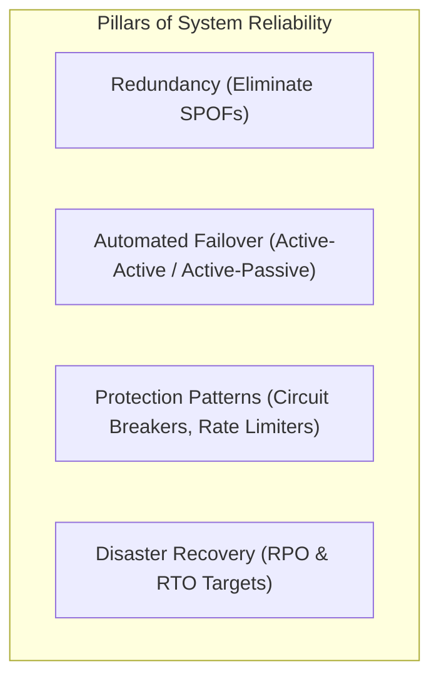
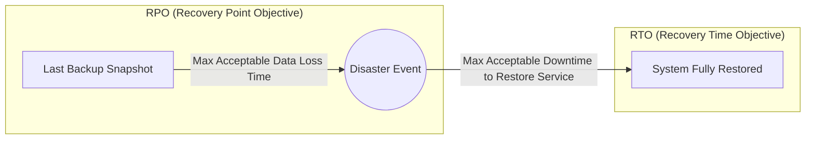
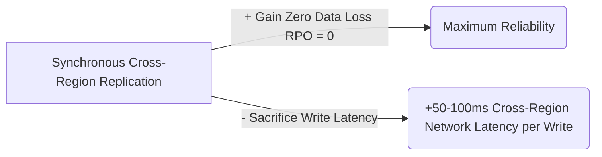

# 09 — Reliability, Fault Tolerance & High Availability

## 1. What is it?
Reliability is the probability that a system performs its intended function correctly without failure over a given period. High Availability (HA) is the percentage of time a system remains operational and accessible. Fault tolerance is the architectural capability of a system to continue delivering acceptable service despite hardware, network, or software component crashes.

---

## 2. Why does it matter?
In large-scale distributed architectures, **hardware failures, network partitions, and software bugs are statistical certainties**:
- Disks crash, cables get cut, AWS availability zones suffer power outages.
- If a single component failure causes an entire application outage, the system has a **Single Point of Failure (SPOF)**.
- Without resilience patterns (like circuit breakers and rate limiters), a single slow downstream dependency triggers cascading failures across all upstream services.

---

## 3. How does it work?



### Depth Hierarchy
- 🟢 **Level 1 (MUST KNOW)**: High Availability Nines (99.9% vs 99.99%), SPOF removal, Active-Passive vs Active-Active failover, Rate Limiting basics, Circuit Breaker states.
- 🟡 **Level 2 (SHOULD KNOW)**: RPO vs RTO in Disaster Recovery, Backup vs Replication, Exponential Backoff with Jitter, Bulkhead isolation pattern.
- 🟣 **Level 3 (AWARENESS)**: Multi-Region Active-Active consensus challenges (Split-Brain scenarios), Chaos Engineering principles.

---

## 4. Key Metrics & Availability Math

### 1. The "Nines" of Availability

| Availability | Allowed Downtime / Year | Allowed Downtime / Month | Allowed Downtime / Day | Practical Interpretation |
|---|---|---|---|---|
| **99% ("Two Nines")** | 3.65 days | 7.31 hours | 14.4 minutes | Standard development/internal tools. |
| **99.9% ("Three Nines")** | 8.77 hours | 43.8 minutes | 1.44 minutes | Standard commercial web SaaS. |
| **99.99% ("Four Nines")** | **52.6 minutes** | **4.38 minutes** | **8.64 seconds** | **Enterprise tier (E-commerce checkout, Core APIs).** |
| **99.999% ("Five Nines")** | **5.26 minutes** | **26.3 seconds** | **0.86 seconds** | Telecom, Financial transaction clearing, Healthcare. |

---

### 2. Reliability vs Availability vs Fault Tolerance

| Concept | Definition | Focus | Example |
|---|---|---|---|
| **Availability** | Percentage of time the system is online and answering requests. | **Uptime** | System responds 99.99% of the year. |
| **Reliability** | Ability of the system to execute operations **correctly without errors or data loss**. | **Correctness & Precision** | No lost financial records or corrupted ledger entries. |
| **Fault Tolerance** | System's ability to maintain operation despite zero or partial component failure. | **Graceful Continuity** | If 2 of 5 Cassandra nodes die, reads and writes continue seamlessly. |

---

### 3. Failover Architectures: Active-Passive vs Active-Active

```mermaid
flowchart TD
    subgraph ActivePassive["1. Active-Passive (Hot Standby)"]
        LB1[Load Balancer / DNS] -->|All Active Traffic| Primary[Primary Server (Active)]
        Primary -.->|Heartbeat / Sync| Standby[Standby Server (Passive / Idle)]
        Standby -.->|Promoted only on Primary Crash| Primary
    end

    subgraph ActiveActive["2. Active-Active (Full Utilization)"]
        LB2[Load Balancer] -->|50% Traffic| NodeA[Server Node A (Active)]
        LB2 -->|50% Traffic| NodeB[Server Node B (Active)]
        NodeA <-->|Real-time Sync| NodeB
    end
```

| Dimension | Active-Passive (Hot/Warm Standby) | Active-Active |
|---|---|---|
| **Resource Utilization** | Low (Passive standby server sits idle, incurring cost). | **100% (All nodes handle production traffic simultaneously)**. |
| **Failover Delay** | Takes seconds to minutes (DNS propagation, health check timeout, promotion). | **Instant (Zero downtime)**; traffic simply redirects to remaining healthy nodes. |
| **Data Synchronization** | Simpler (One-way replication from Active to Passive). | Complex (Requires bidirectional sync and conflict resolution). |
| **Cost** | High per active unit of capacity. | Highly cost-efficient. |

---

### 4. Backup vs Replication vs Disaster Recovery

| Dimension | Database Backup | Database Replication | Disaster Recovery (DR) |
|---|---|---|---|
| **What is it?** | Periodic point-in-time snapshot (e.g., daily S3 snapshot). | Continuous streaming of data to a replica in real-time. | Comprehensive plan to restore entire infrastructure after a catastrophe. |
| **Primary Purpose** | Recovery from **data corruption or accidental human deletion** (e.g., `DROP TABLE`). | **High availability & read scaling** during server crashes. | Business continuity after entire AWS Region / Data Center destruction. |
| **Recovery Speed** | Slow (Hours to restore terabytes from disk snapshot). | Fast (Seconds to promote replica to primary). | Dependent on RTO target (Minutes to hours). |

#### Critical DR Metrics: RPO vs RTO



- **RPO (Recovery Point Objective)**: The maximum acceptable age of data lost when an outage occurs (e.g., "RPO = 5 minutes" means max 5 minutes of recent transactions lost).
- **RTO (Recovery Time Objective)**: The maximum acceptable duration of system downtime to bring services back online (e.g., "RTO = 30 minutes" means the site must be restored within 30 minutes).

---

## 5. Resiliency Design Patterns

### 1. The Circuit Breaker Pattern

Prevents a failing downstream service from exhausting thread pools and causing cascading system-wide crashes.

```mermaid
stateDiagram-v2
    [*] --> Closed
    Closed --> Open: Error Threshold Exceeded (e.g., 50% failures in 10s)
    Open --> HalfOpen: Sleep Window Expires (e.g., after 30s)
    HalfOpen --> Closed: Probe Requests Succeed
    HalfOpen --> Open: Probe Requests Fail
    
    note right of Closed: Normal Operation: Requests flow through to downstream
    note right of Open: Fast Fail: Requests fail immediately / Fallback returned (No downstream calls)
    note right of HalfOpen: Canary: Small % of test requests sent to downstream
```

- **Closed**: Normal state. All requests pass through to the downstream service.
- **Open**: Downstream service is failing. All calls fail immediately without waiting for timeouts (returns a graceful cached fallback).
- **Half-Open**: After a cooldown period (e.g., 30s), a small percentage of probe requests are allowed through. If successful, breaker resets to `Closed`; if they fail, breaker returns to `Open`.

---

### 2. Rate Limiting Algorithms

Protects APIs from denial-of-service, scraping, and downstream starvation:
1. **Token Bucket (Standard)**: Tokens added to a bucket at a fixed rate (e.g., 10 tokens/sec). Each request consumes 1 token. Allows short bursts up to bucket capacity.
2. **Leaky Bucket**: Requests enter a queue and are processed at a smooth, constant output rate. Drops requests when queue is full.
3. **Sliding Window Counter (Redis)**: Uses Redis Sorted Sets (`ZADD`, `ZREMRANGEBYSCORE`) to count requests within the exact previous 60-second window, preventing edge-of-window traffic spikes.

---

### 3. Retry with Exponential Backoff + Full Jitter

Never retry failed requests immediately in a tight loop (which causes a self-inflicted DDoS attack):
$$\text{Delay} = \text{random}(0, \min(\text{MaxDelay}, \text{BaseDelay} \times 2^{\text{retry\_count}}))$$
- **Exponential Backoff**: Doubles wait time on each attempt ($100\text{ms} \to 200\text{ms} \to 400\text{ms} \to 800\text{ms}$).
- **Full Jitter**: Adds randomized noise so that thousands of retrying clients don't hit the server at the exact same synchronized second.

---

## 6. Advantages & Disadvantages
- **High Redundancy**:
  - *Advantage*: Zero single points of failure; achieves $99.99\%$ uptime.
  - *Disadvantage*: Infrastructure costs double or triple; cross-region networking overhead.

---

## 7. Trade-offs (What We Gain vs What We Sacrifice)



---

## 8. When would I use what?
- Use **Circuit Breakers** on every outbound synchronous HTTP/gRPC call between microservices.
- Use **Active-Active Load Balancing** for all stateless web/API tiers.
- Use **Active-Passive (Primary-Replica)** for SQL databases requiring strict ACID writes.
- Use **Exponential Backoff with Full Jitter** for all network client retry policies.

---

## 9. Interview Questions

### Q1: What is the difference between Replication and Backup?
- **Short Answer**: Replication provides high availability by streaming data to live replicas in real-time; backup provides point-in-time snapshots to recover from human error or catastrophic data corruption.
- **Conversational Explanation**: "Replication protects against hardware failure—if the primary database dies, a replica can be promoted in seconds. However, if a developer mistakenly executes `DROP TABLE users;`, that command replicates instantly to all replicas! Backups are periodic immutable snapshots that allow us to restore lost data to a specific point in time."

### Q2: How does a Circuit Breaker protect a microservices architecture?
- **Short Answer**: It halts requests to a failing service immediately, preventing thread starvation and cascading failures.
- **Conversational Explanation**: "If an inventory service becomes slow and starts timing out after 30 seconds, upstream checkout servers will quickly exhaust their HTTP connection thread pools waiting for responses. A Circuit Breaker detects high error rates, trips to 'Open', and returns an immediate fallback error in 1ms without waiting, keeping upstream services healthy."

---

## 10. L3 Follow-up Questions & Scenarios

### If the Interviewer Asks: "How do you handle a split-brain scenario in a distributed cluster?"
- **Good Answer**: 
  > "A split-brain occurs when a network partition divides a cluster into two disconnected halves, and both halves mistakenly elect a leader and accept writes. To prevent this, distributed systems enforce a **Quorum rule**: a new leader can only be elected if it receives votes from a strict majority of nodes:
  $$\text{Quorum} = \left\lfloor \frac{N}{2} \right\rfloor + 1$$
  > In a 5-node cluster, a partition with only 2 nodes cannot achieve a quorum (needs 3), so it automatically transitions to read-only or shuts down, preventing conflicting dual-primary writes."

### If the Interviewer Asks: "How do you achieve an RTO of under 1 minute for a critical database?"
- **Good Answer**: 
  > "We configure automated health checks and automated failover using tools like AWS RDS Multi-AZ or Patroni for PostgreSQL. The primary continuously replicates synchronously to a standby instance in a different availability zone. If the primary fails health probes for 15 seconds, the automated coordinator safely promotes the standby to primary and updates the internal DNS endpoint, achieving an RTO of under 45–60 seconds with zero data loss (RPO = 0)."

---

## 11. What NOT to Say in an Interview 🚫
- ❌ *Don't say*: "We don't need backups because our database has 3 read replicas." (Replicas instantly replicate accidental deletions and corrupted writes; snapshots are mandatory).
- ❌ *Don't say*: "If an API call fails, we will immediately retry 5 times in a loop." (This creates a retry storm and crashes recovering backends; always use Exponential Backoff + Jitter).
- ❌ *Don't say*: "Our system will have 100% uptime with zero seconds of downtime ever." (100% availability is statistically and physically impossible in distributed systems; state your target SLA as 99.99%).

---

## 12. Quick Revision Summary
- **Availability Nines**: $99.9\% = 8.7\text{ hrs/yr downtime}$; $99.99\% = 52.6\text{ mins/yr downtime}$.
- **Eliminate SPOF**: Redundant LBs $\to$ Stateless App Pool $\to$ Multi-AZ Database with automated failover.
- **RPO vs RTO**: RPO = Max acceptable lost data time; RTO = Max acceptable downtime to recover.
- **Circuit Breaker**: Closed (Normal) $\to$ Open (Fast fail) $\to$ Half-Open (Canary probe).
- **Retries**: Exponential Backoff + Full Jitter $\to$ Prevents retry storms.
