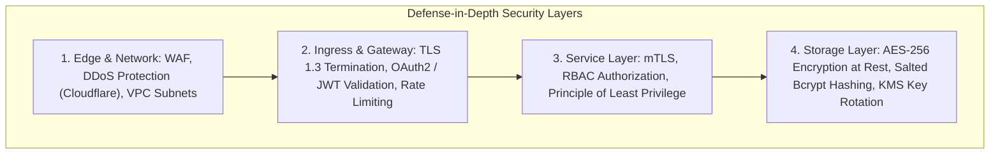
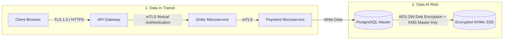
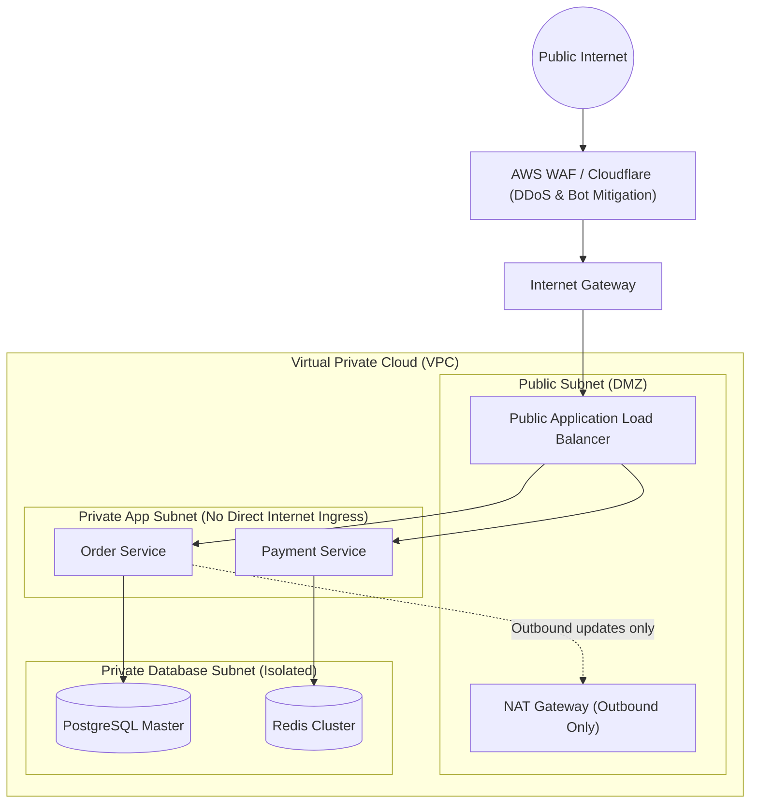
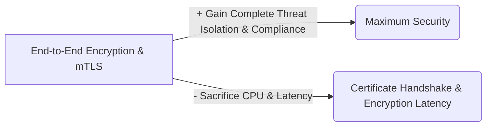

# 10 — Security & Data Protection

## 1. What is it?
Security in system design encompasses the protocols, architectural boundaries, encryption standards, and access control models implemented to protect data confidentiality, integrity, and availability against unauthorized access, data leaks, and malicious attacks.

---

## 2. Why does it matter?
A system that is fast and scalable is useless if customer data is compromised:
- Storing passwords in plain text or MD5 results in catastrophic data leaks.
- Exposing database instances in public subnets invites ransomware and direct SQL injection.
- Unprotected internal microservices allow an attacker who breaches one container to access all internal systems (lateral movement).

---

## 3. How does it work?

### Depth Hierarchy
- 🟢 **Level 1 (MUST KNOW)**: Authentication vs Authorization, JWT vs OAuth2, HTTPS/TLS 1.3, Public vs Private Subnets (VPC), Password Hashing (bcrypt/Argon2).
- 🟡 **Level 2 (SHOULD KNOW)**: RBAC vs ABAC, Mutual TLS (mTLS) for microservices, WAF (OWASP Top 10: SQLi, XSS, CSRF), Envelope Encryption (KMS).
- 🟣 **Level 3 (AWARENESS)**: Zero Trust Architecture, OAuth 2.0 PKCE flow, Secrets rotation strategies.

---

## 4. Key Security Concepts & Mechanisms

### 1. Authentication vs Authorization

| Dimension | Authentication (AuthN) | Authorization (AuthZ) |
|---|---|---|
| **Question Answered** | **"Who are you?"** (Verifying identity). | **"What are you allowed to do?"** (Verifying permissions). |
| **Mechanism** | Passwords, MFA (SMS/TOTP), Biometrics, SSO, OpenID Connect. | Roles (Admin, Editor, Viewer), RBAC, ABAC, Scopes. |
| **Token Representation** | ID Token (OIDC) or verified session identity. | Access Token with permission scopes (e.g., `orders:read`, `users:write`). |
| **Example** | Logging in with email and password to prove you are User #42. | Checking if User #42 has permission to delete an order. |

---

### 2. Authorization Models: RBAC vs ABAC

| Model | How it Works | Example Rule | Best Used For |
|---|---|---|---|
| **RBAC (Role-Based Access Control)** | Users are assigned **Roles** (e.g., `Admin`, `Support`, `Customer`). Roles have fixed permission lists. | `Admin` can delete users; `Customer` can only view own profile. | Standard enterprise SaaS, CRUD web applications. |
| **ABAC (Attribute-Based Access Control)** | Permissions evaluated dynamically based on **Attributes** (User, Resource, Environment/Time). | "Allow Doctor to view Patient records ONLY IF Doctor is assigned to Patient AND Location is Hospital IP AND Time is 9 AM–5 PM." | Healthcare (HIPAA), Defense, Fine-grained dynamic compliance. |

---

### 3. Data Protection: In Transit vs At Rest

| Security Dimension | Threat Mitigated | Standard Industry Solution |
|---|---|---|
| **In Transit (External)** | Man-in-the-Middle (MitM) packet sniffing. | **TLS 1.3 / HTTPS** (Strong cipher suites, forward secrecy). |
| **In Transit (Internal)** | Lateral attacker sniffing internal microservice traffic. | **Mutual TLS (mTLS)** via Service Mesh (Istio/Envoy) where client & server authenticate each other via X.509 certs. |
| **At Rest (Databases/S3)** | Stolen physical hard drives or cloud disk volume snapshots. | **AES-256 Encryption at Rest** using cloud KMS (Key Management Service) with automatic annual key rotation. |
| **Password Storage** | Leaked database credential tables. | **Bcrypt / Argon2 / PBKDF2** with individual cryptographic salt and high work factor (Never MD5/SHA256). |

---

### 4. Network & Infrastructure Security (VPC Architecture)

- **Public Subnet**: Contains only public-facing Load Balancers and NAT Gateways.
- **Private Subnet**: Contains application containers and microservices. No public IP addresses assigned.
- **Isolated DB Subnet**: Contains databases and caches. Strictly accepts ingress traffic only from the Application Subnet Security Group.

---

### 5. Common Web Vulnerabilities (OWASP Top Mitigations)

| Vulnerability | How Attack Occurs | System Design Mitigation |
|---|---|---|
| **SQL Injection (SQLi)** | Malicious SQL strings injected into inputs (`' OR 1=1 --`). | Use **Parameterized Queries / Prepared Statements** and ORMs everywhere. Never concatenate SQL strings. |
| **Cross-Site Scripting (XSS)** | Attacker injects malicious JS into comment fields. | Sanitize input; escape HTML outputs; enforce strict **Content Security Policy (CSP)** headers; store tokens in `HttpOnly` cookies. |
| **CSRF (Cross-Site Request Forgery)** | Malicious site tricks user's browser into submitting actions to authenticated site. | Use **SameSite=Strict** cookie attribute; implement **Anti-CSRF Tokens** on state-changing forms. |
| **DDoS Attack** | Botnet floods server with millions of junk requests. | Edge protection (Cloudflare / AWS Shield), Rate limiting at API Gateway, Syn-proxy at L4. |

---

## 5. Practical Example: Secure Payment Flow
1. User enters credit card on checkout frontend.
2. Frontend uses **Payment Gateway Tokenization (e.g., Stripe Elements)**: Card details are sent directly from browser to Stripe over HTTPS. The app backend **never touches raw credit card numbers** (PCI-DSS compliance).
3. Backend receives only a short-lived token `tok_1a2b3c`.
4. Backend verifies user's JWT token scope (`orders:write`), generates unique `Idempotency-Key`, and executes payment RPC over mTLS.

---

## 6. Advantages & Disadvantages
- **Zero Trust & mTLS**:
  - *Advantage*: Prevents lateral movement; every microservice verifies every single request regardless of network location.
  - *Disadvantage*: TLS handshake CPU overhead and complex certificate lifecycle management (solved via Service Mesh).

---

## 7. Trade-offs (What We Gain vs What We Sacrifice)

---

## 8. When would I use what?
- Use **RBAC** for 95% of standard applications; use **ABAC** only for complex dynamic attribute rules (e.g., medical/legal record access).
- Use **OAuth 2.0 / OIDC** when enabling third-party logins (Google, Apple, GitHub) or granting delegated API access.
- Use **bcrypt/Argon2** exclusively for password hashing with a minimum work factor of 12.
- Place **Databases strictly in Private Subnets** with zero direct public internet routing.

---

## 9. Interview Questions

### Q1: What is the difference between OAuth 2.0 and OpenID Connect (OIDC)?
- **Short Answer**: OAuth 2.0 is an authorization framework (issues Access Tokens for API permissions); OIDC is an identity layer built on top of OAuth 2.0 (issues ID Tokens for user authentication).
- **Conversational Explanation**: "OAuth 2.0 was designed to allow a third-party application to access resources on your behalf (e.g., allowing Spotify to read your Google Drive). It only gives authorization tokens. OpenID Connect (OIDC) extends OAuth 2.0 by adding an ID Token (JWT) that provides verified identity information (name, email) for authentication."

### Q2: Why is SHA-256 unsuitable for password hashing?
- **Short Answer**: SHA-256 is designed to be extremely fast for file checksums, making it vulnerable to brute-force and GPU rainbow table cracking.
- **Conversational Explanation**: "Fast cryptographic hash functions like SHA-256 or MD5 allow modern GPUs to compute billions of hashes per second. For passwords, we must use slow, computationally expensive, salted hashing algorithms like **bcrypt or Argon2**, which allow us to tune the work factor and memory cost to make brute-force attacks computationally infeasible."

---

## 10. L3 Follow-up Questions & Scenarios

### If the Interviewer Asks: "How do you securely manage database credentials and API keys in a microservices cluster?"
- **Good Answer**: 
  > "We never hardcode secrets in source code or container images. Instead, we use a dedicated secrets manager like **HashiCorp Vault or AWS Secrets Manager**. When a microservice pod starts, it authenticates using short-lived IAM roles or Service Account tokens to fetch encrypted secrets directly into memory. Secrets are automatically rotated every 30–90 days without requiring application redeployments."

### If the Interviewer Asks: "What is Envelope Encryption?"
- **Good Answer**: 
  > "Envelope encryption is a two-tier key hierarchy used to encrypt large datasets efficiently. The data itself is encrypted using a unique, fast local **Data Encryption Key (DEK)** with AES-256. The DEK is then encrypted using a **Master Key (Key Encryption Key - KEK)** managed by a Hardware Security Module (like AWS KMS). To decrypt, the service requests KMS to decrypt only the lightweight DEK, which is then used in memory to decrypt the data, avoiding sending gigabytes of raw data over the network to KMS."

---

## 11. What NOT to Say in an Interview 🚫
- ❌ *Don't say*: "We will encrypt user passwords using AES-256." (Passwords should be **one-way salted hashes** using bcrypt/Argon2, never reversibly encrypted!).
- ❌ *Don't say*: "Since our microservices run inside our private VPC, we don't need authentication between them." (Violates Zero Trust; if one public server is compromised, the attacker can access all unauthenticated internal services).
- ❌ *Don't say*: "Base64 encoding is sufficient to protect sensitive customer data." (Base64 is an encoding format, NOT encryption; anyone can decode base64 in 1 millisecond).

---

## 12. Quick Revision Summary
- **AuthN vs AuthZ**: AuthN = "Who are you?" (OIDC / Password); AuthZ = "What can you do?" (RBAC / OAuth scopes).
- **Passwords**: Always **Bcrypt / Argon2** with individual salt (Never MD5/SHA).
- **Network Isolation**: Public Subnet (ALB/NAT) $\to$ Private Subnet (App) $\to$ Isolated Subnet (DB).
- **In Transit**: HTTPS / TLS 1.3 externally; mTLS internally.
- **At Rest**: AES-256 with KMS Envelope Encryption and automatic key rotation.
