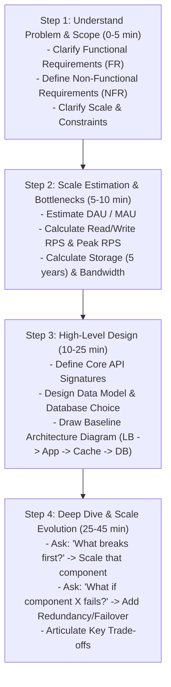

# 11 — System Design Interview Framework & Execution Playbook

## 1. What is it?
The System Design Interview Framework is a structured, repeatable methodology to navigate a 45-to-60-minute technical interview. It transitions an ambiguous problem (e.g., "Design Twitter") into a concrete, scalable, and resilient architecture through proactive communication, requirements scoping, scale estimation, and explicit trade-off justifications.

---

## 2. Why does it matter?
Most candidates fail system design interviews not because of lack of knowledge, but due to **poor process and unstructured rambling**:
- Jumping directly into drawing boxes without clarifying requirements.
- Over-engineering with 15 microservices for a system with 100 requests/day.
- Running out of time before addressing bottlenecks and failure scenarios.
- Treating the interview as an exam rather than a collaborative technical discussion.

---

## 3. The 45-Minute SP L3 Time Allocation

```mermaid
gantt
    title 45-Minute System Design Interview Time Budget
    dateFormat  m
    axisFormat %M min
    section Interview Phases
    Phase 1: Clarify & Requirements (FR / NFR) :0, 5m
    Phase 2: Scale & Resource Estimation      :5, 5m
    Phase 3: APIs & Data Model                :10, 8m
    Phase 4: High-Level Baseline Architecture  :18, 10m
    Phase 5: Deep Dive, Bottlenecks & Scale   :28, 12m
    Phase 6: Wrap-up, Failures & Trade-offs   :40, 5m
```

---

## 4. The 4-Step Core Interview Framework



---

## 5. The 8-Step "Design From Scratch" Action Playbook

When the interviewer gives you a prompt, execute these 8 steps conversationally:

### Step 1 — Clarify Scope & Requirements (5 mins)
*Say to interviewer*: *"Before jumping into design, I'd like to clarify the core requirements and constraints."*
- **Functional Requirements (FR)**: Focus on the top 2–3 core features only (e.g., for URL shortener: 1. Shorten long URL, 2. Redirect short URL to long URL).
- **Non-Functional Requirements (NFR)**:
  - Availability target (e.g., $99.99\%$).
  - Latency targets (e.g., Read latency $< 20\text{ms}$, Write latency $< 100\text{ms}$).
  - Consistency model (e.g., Strong consistency vs Eventual consistency).
  - Read-to-Write ratio (e.g., $100:1$ read-heavy).

### Step 2 — Practical Scale Estimation (5 mins)
*Say to interviewer*: *"Let's establish high-level numbers to understand if this system is write-heavy, read-heavy, or storage-constrained."*
- **Daily Active Users (DAU)**: Assume 10M or 100M.
- **RPS Calculation Rule of Thumb**:
  $$\text{RPS} = \frac{\text{Total Requests per Day}}{100,000 \text{ seconds (approx 86,400s)}}$$
- **Peak RPS**: $\text{Peak RPS} = \text{Average RPS} \times 2\text{ to }3$.
- **Storage for 5 Years**: $\text{Daily Writes} \times \text{Average Payload Size} \times 365 \times 5$.
- **Bandwidth**: $\text{RPS} \times \text{Payload Size}$.

### Step 3 — Define Core APIs (3 mins)
*Say to interviewer*: *"Let's define the primary RESTful contract between clients and our system."*
- Explicitly state HTTP Method, Endpoint, Headers, Request Body, and Response Payload.
- Mention status codes (`200 OK`, `201 Created`, `302 Found`, `400 Bad Request`, `409 Conflict`).

### Step 4 — Data Model & Storage Choice (5 mins)
*Say to interviewer*: *"Now I will design our data model and justify our database paradigm."*
- Define entity fields, primary keys, foreign keys, and indexes.
- **Justify SQL vs NoSQL**:
  - *"I'm choosing PostgreSQL because we need ACID transactions and relational integrity."* OR
  - *"I'm choosing Cassandra/DynamoDB because our workload is write-heavy, unstructured, and requires linear horizontal sharding."*

### Step 5 — Baseline High-Level Architecture (7 mins)
*Say to interviewer*: *"Let's assemble the baseline architecture for normal traffic."*
- Draw: **Client $\to$ DNS $\to$ Load Balancer $\to$ Stateless App Servers $\to$ Database**.
- Add **Cache (Redis)** and **CDN** if read-heavy.
- Add **Message Queue (Kafka)** if write-heavy.
- Walk through the numbered step-by-step request flow.

### Step 6 — Scale the Architecture (10 mins)
*Ask yourself aloud*: *"What is the first component that will break under $10\times$ traffic?"*
- If DB read CPU spikes $\to$ Add Redis Cache (Cache-Aside) + Database Read Replicas.
- If DB write IOPS saturate $\to$ Add Kafka buffer, Shard DB with Consistent Hashing.
- If App servers hit CPU limits $\to$ Horizontal Auto-scaling behind L7 Load Balancer.

### Step 7 — Reliability & Failure Scenarios (5 mins)
*Ask yourself aloud*: *"What happens if a critical component crashes right now?"*
- *What if the primary DB dies?* $\to$ Multi-AZ automated failover promotes read replica.
- *What if Redis crashes?* $\to$ Redis Sentinel / Cluster failover + fallback with rate limiters to protect the database.
- *What if a downstream service slows down?* $\to$ Circuit breaker prevents cascading thread exhaustion.

### Step 8 — Explicit Trade-offs & Wrap-Up (5 mins)
*Say to interviewer*: *"To summarize our architecture, here are the key trade-offs we made..."*
- Explain what you gained vs what you sacrificed (e.g., chosen eventual consistency in exchange for $99.99\%$ availability).

---

## 6. Reusable 12-Point System Design Template

Use this mental checklist during any design discussion:
```text
1. Requirements (Functional & Non-Functional)
2. Scale & Resource Estimation (RPS, Storage, Bandwidth)
3. API Contracts (REST / gRPC signatures)
4. Data Model & Schema Design
5. Database Selection & Justification (SQL vs NoSQL)
6. High-Level Baseline Architecture (Component diagram)
7. Core Request & Data Flows (Read flow & Write flow)
8. Caching Strategy (Where, What, Invalidation, TTL)
9. Asynchronous Processing & Queues
10. Horizontal Scaling Strategy (Sharding, Consistent Hashing)
11. Fault Tolerance & Failure Recovery (SPOFs, Failover, Circuit Breakers)
12. Key Architectural Trade-offs & Bottlenecks
```

---

## 7. How to Drive the Conversation (Conversational Phrasing)

| Scenario | What to Say |
|---|---|
| **Starting the problem** | *"I understand we are designing system X. Before drawing components, I'd like to spend 3-4 minutes clarifying requirements and scale. Does that sound good?"* |
| **Making an assumption** | *"I'm going to assume we have 50 million Daily Active Users with a 100:1 read-to-write ratio. Please let me know if you'd like me to calibrate for a different scale."* |
| **Choosing a technology** | *"I'm selecting Redis here specifically for the Cache-Aside pattern on user profiles because read traffic is 95% of total load and profiles change infrequently."* |
| **Handling an interviewer interruption** | *"That's a great point regarding the write spike. Let me introduce a message queue between the ingest API and workers to buffer that burst safely."* |
| **Checking in with the interviewer** | *"We have covered the high-level architecture and data flow. Would you like me to dive deeper into the database sharding strategy or explore the caching failure modes next?"* |

---

## 8. What NOT to Say in an Interview 🚫
- ❌ *Don't say*: "This problem is very easy, I'll just draw the microservices diagram right away." (Skipping requirements and scale estimation shows immaturity).
- ❌ *Don't say*: "I will use MongoDB because I like it." (Always justify with technical characteristics: schema flexibility, horizontal write scale, document queries).
- ❌ *Don't stay silent for 2 minutes*: Always narrate your thought process aloud. Interviewers evaluate how you think, not just the final diagram.
- ❌ *Don't be defensive when challenged*: If the interviewer points out a flaw, acknowledge it gracefully: *"Good catch. Let's analyze how that component fails and add a circuit breaker to mitigate it."*

---

## 9. Quick Revision Summary
- **First 5 mins**: Clarify FR (2-3 features) + NFR (Availability, Latency) + Scale (RPS, Storage).
- **Next 15 mins**: API $\to$ Data Model $\to$ Baseline Diagram (Client $\to$ LB $\to$ App $\to$ Cache $\to$ DB).
- **Next 15 mins**: Scale bottlenecks (Replicas, Sharding, Kafka) $\to$ Solve failure scenarios (SPOF, Failover).
- **Final 5 mins**: Summarize trade-offs and confirm requirements are met.
- **Rule of Thumb**: Collaborate continuously; ask *"Would you like me to dive deeper into X or Y?"* at natural milestones.
