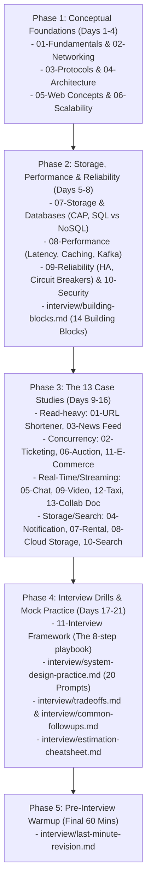

# Infosys Specialist Programmer (SP) L3 — System Design Interview Handbook

Welcome to the comprehensive **System Design Interview Notes Repository**, tailored specifically for the **Infosys Specialist Programmer (SP) L3** technical interview.

This repository is optimized for **interview readiness, practical decision-making, reusable patterns, and conversational trade-off articulation**, rather than generic academic textbook theory.

---

## 🗺️ Repository Structure & Quick Links

```text
system-design-notes/
├── 00-system-design-roadmap.md                   # Preparation roadmap & L3 syllabus map
├── 01-system-design-fundamentals.md              # Scalability, Availability, Reliability, Fault Tolerance
├── 02-networking.md                              # DNS, L4/L7 Load Balancers, Proxies, API Gateways, CDN
├── 03-protocols.md                               # TCP vs UDP, HTTP/1.1-2-3, WebSockets, SSE, REST, gRPC
├── 04-architecture-patterns.md                   # Monolith vs Microservices, Event-Driven, Saga, CQRS
├── 05-web-concepts.md                            # Stateless sessions, Redis session store, JWT, CORS
├── 06-scalability.md                             # Horizontal scaling, DB scaling, Sharding, 1K->10M roadmap
├── 07-storage-and-databases.md                   # CAP, SQL vs NoSQL, B-Trees vs LSM, Indexing, S3 Storage
├── 08-performance.md                             # Latency numbers, Caching patterns, Kafka vs Queues
├── 09-reliability.md                             # HA (99.99%), Failover, RPO/RTO, Circuit Breakers
├── 10-security.md                                # AuthN vs AuthZ, OAuth2/JWT, TLS 1.3, VPC subnets, WAF
├── 11-system-design-interview-framework.md       # The 4-step framework & 8-step execution script
│
├── case-studies/                                 # 13 Complete Case Studies with Reusable Patterns
│   ├── 01-url-shortener.md                       # Base62 Key Gen Service, 100:1 read-heavy caching
│   ├── 02-ticketing-system.md                    # Hybrid concurrency lock, 10-min hold, waiting room
│   ├── 03-news-feed.md                           # Hybrid Push/Pull fanout, Redis ZSET timelines
│   ├── 04-notification-system.md                 # Multi-channel gateways, priority queues, deduplication
│   ├── 05-chat-application.md                    # WebSockets, presence heartbeats, Cassandra time-series
│   ├── 06-auction-platform.md                    # Atomic Redis Lua bidding, anti-sniping dynamic timer
│   ├── 07-online-rental-platform.md              # PostGIS geospatial search, date range exclusion locks
│   ├── 08-cloud-storage-system.md                # 4MB Chunking, SHA-256 deduplication, direct S3 upload
│   ├── 09-video-sharing-platform.md              # Adaptive Bitrate (HLS), GPU DAG transcode, CDN caching
│   ├── 10-search-engine.md                       # Inverted Index, URL frontier politeness, Bloom filter
│   ├── 11-ecommerce-platform.md                  # Inventory concurrency, Distributed Saga, Idempotency
│   ├── 12-taxi-hailing-application.md            # Uber H3 Hexagonal indexing, 125k GPS writes/s, surge
│   └── 13-collaborative-document-editor.md       # Operational Transformation (OT), S3 snapshotting
│
├── interview/                                    # Dedicated Interview Toolkits & Practice
│   ├── building-blocks.md                        # The 14 Core Architectural Components Mental Toolbox
│   ├── system-design-practice.md                 # 20 Mock Interview Prompts (Easy, Medium, L3)
│   ├── system-design-questions.md                # Question Bank (Beginner, Intermediate, L3)
│   ├── tradeoffs.md                              # Comparative Trade-off Matrices & Decision Tables
│   ├── common-followups.md                       # Emergency Scenarios (Redis crash, DB outage, Spikes)
│   ├── estimation-cheatsheet.md                  # Mental-Math RPS, Storage & Bandwidth Formulas
│   └── last-minute-revision.md                   # 30–60 Minute Pre-Interview High-Yield Revision Sheet
│
└── README.md                                     # Master Navigation & Study Guide (This File)
```

---

## 🎯 The Depth Hierarchy (How to Study)

Throughout every file in this repository, topics are clearly classified into 3 depth tiers:

- 🟢 **Level 1 — MUST KNOW**: Core concepts you must explain immediately and conversationally (e.g., Horizontal scaling, Load balancing, Cache-aside, Read replicas, Stateless servers).
- 🟡 **Level 2 — SHOULD KNOW**: Nuanced mechanisms and failure modes tested in follow-ups (e.g., Consistent hashing, Cache stampede mitigations, Database sharding strategies, Distributed locks with TTL).
- 🟣 **Level 3 — AWARENESS**: Advanced patterns where you only need to understand the **purpose and high-level trade-off** without deriving complex mathematical internals (e.g., Saga pattern, CQRS, Event Sourcing, CRDTs, LSM-trees, PACELC).

---

## 📖 Recommended Study Path for Infosys SP L3



---

## 🔥 Top Highest-Priority Topics for SP L3

If you have limited time, focus intensely on these high-frequency topics:

1. **[06. Scalability & Evolution Roadmap](06-scalability.md)**: Master the $1K \to 100K \to 10M$ architecture evolution.
2. **[07. Storage & Databases](07-storage-and-databases.md)**: Master the CAP Theorem, SQL vs NoSQL justification, and Indexing strategies.
3. **[08. Performance & Caching](08-performance.md)**: Master Cache-Aside, Cache Stampede/Penetration mitigations, and Kafka vs RabbitMQ.
4. **[interview/building-blocks.md](interview/building-blocks.md)**: Master the 14 core components (where they sit, trade-offs, and failure modes).
5. **[interview/tradeoffs.md](interview/tradeoffs.md)**: Master comparative decision matrices (SQL vs NoSQL, Sharding vs Replicas, Sync vs Async).
6. **[interview/common-followups.md](interview/common-followups.md)**: Master emergency answers (Redis crash, DB outage, 10x traffic spike, idempotency).

---

## 🛠️ How to Use the Case Studies

Every case study in `case-studies/` is structured with **20 standard sections** including:
- Concrete **Scale Calculations** (Mental-math RPS, 5-year storage, bandwidth).
- **Mermaid Architecture Diagrams** showing exact component data flow.
- Detailed **Database Choice & Caching Strategy** justifications.
- **Reliability & Failure Scenarios** (what breaks first and how to fix it).
- **2-Minute Interview Verbal Scripts** (how to speak aloud in the interview).
- **Reusable Pattern Extraction Matrices** (extracting underlying design patterns like H3 Hexagons, KGS, Hybrid Fanout, and Saga workflows).

---

## ⏱️ How to Revise Before Your Interview (30–60 Min Countdown)

1. Open **[interview/last-minute-revision.md](interview/last-minute-revision.md)** and review:
   - The 4-step interview timing budget.
   - Latency numbers (RAM $100\text{ns}$ vs SSD $50\ \mu\text{s}$ vs WAN $100\text{ms}$).
   - The 13 Case Study quick-hits table.
   - Top 10 "What NOT to Say" red flags.
2. Review **[interview/estimation-cheatsheet.md](interview/estimation-cheatsheet.md)** to keep $100,000\text{s/day}$ and powers-of-two fresh in your mind.
3. Review **[interview/common-followups.md](interview/common-followups.md)** for emergency failure responses.

Good luck with your **Infosys Specialist Programmer L3 interview**!
